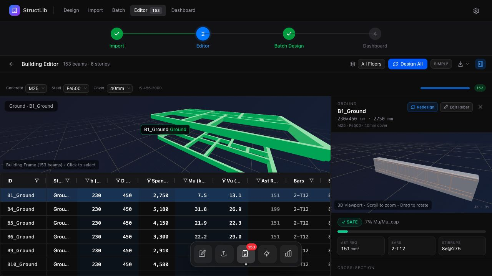
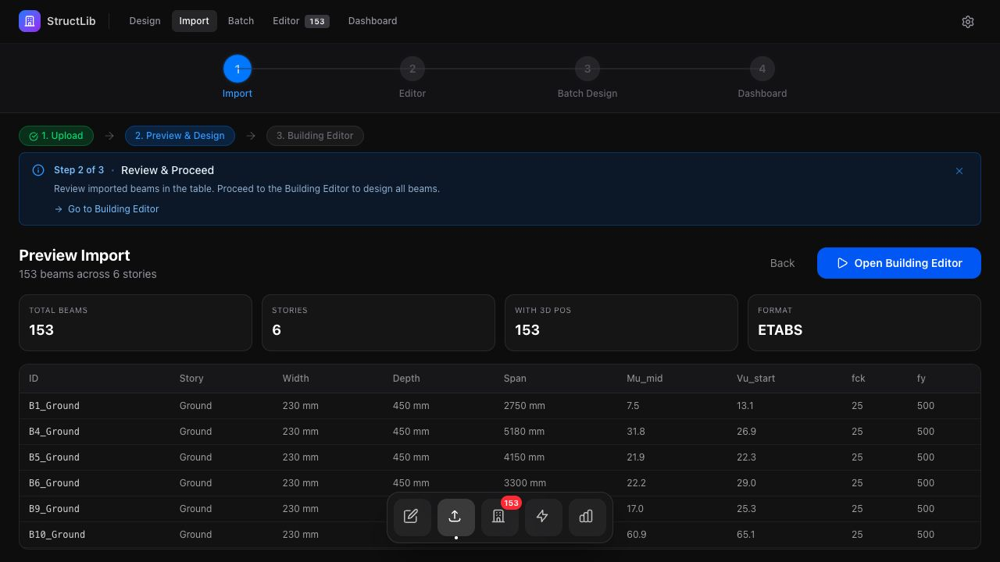
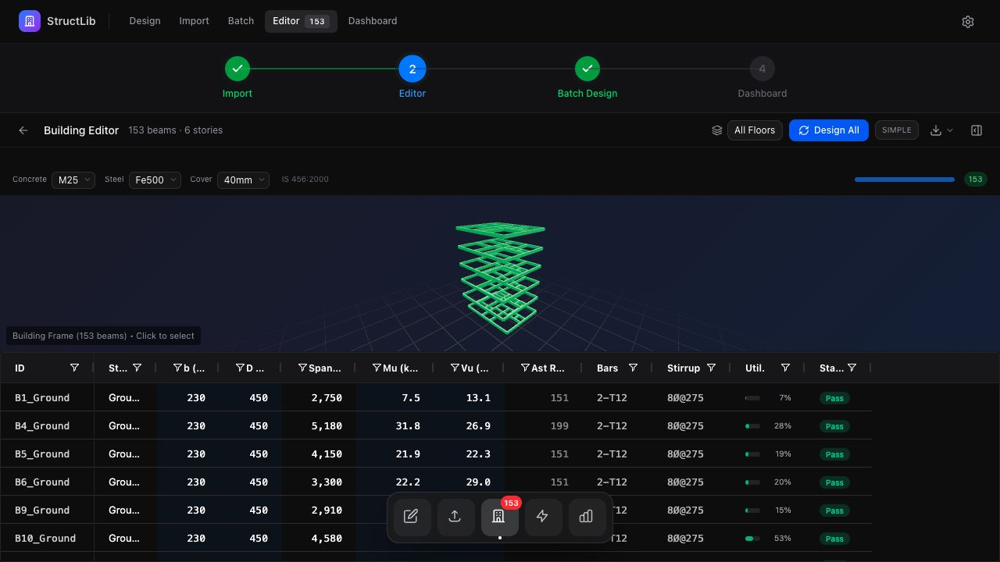
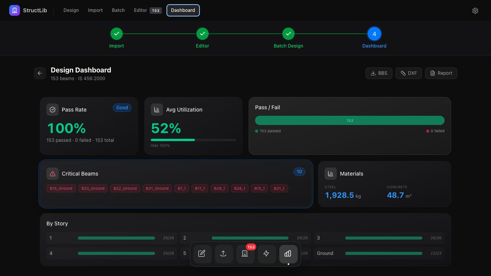

<a id="readme-top"></a>

<div align="center">


# StructLib

**IS 456 reinforced-concrete design, from calculation to reviewable output.**

An open-source Python library and visual workbench for bounded supported beam,
torsion, column, slab, wall, staircase, deep-beam, flat-slab, and footing
workflows under IS 456:2000.

[](https://pypi.org/project/structural-lib-is456/)
[](https://github.com/Pravin-surawase/structural_engineering_lib/releases/tag/v0.24.0)
[](https://github.com/Pravin-surawase/structural_engineering_lib/actions/workflows/fast-checks.yml)
[](https://www.python.org/downloads/)
[](LICENSE)

[Quick start](#quick-start) · [Product tour](docs/getting-started/product-tour.md) · [Documentation](docs/README.md) · [API reference](docs/reference/api.md) · [Contributing](CONTRIBUTING.md)

</div>



> [!IMPORTANT]
> **v0.24.0 is a normal software release of the audited supported scope.** Support is case-qualified,
> not a claim of complete IS 456 coverage or professional design approval.
> Outputs require independent review by a qualified structural engineer before
> engineering or construction use. Broader library development and the one
> cumulative practicing-engineer review remain in progress. The exact release is
> available from [PyPI](https://pypi.org/project/structural-lib-is456/0.24.0/)
> and [GitHub Releases](https://github.com/Pravin-surawase/structural_engineering_lib/releases/tag/v0.24.0);
> the [current-release page](docs/getting-started/release-status.md) links its
> append-only artifact and verification evidence.

## One workflow, four useful surfaces

StructLib connects calculation code to the work engineers and developers need
around it: importing analysis data, running repeatable designs, inspecting the
result, and producing usable deliverables.

| Surface | Best for | What it provides |
|---|---|---|
| **Python package** | Engineering scripts and notebooks | Typed functions, explicit units, structured results |
| **CLI** | Repeatable jobs and automation | Design → detail → BBS → DXF → report pipelines |
| **FastAPI** | Application integration | REST, WebSocket, and streaming workflows |
| **React workbench** | Visual review | CSV import, batch design, 3D inspection, dashboard, exports |

### From model data to reviewable deliverables

1. **Import** beam data from ETABS, SAFE, STAAD, or a generic CSV.
2. **Design** individual members or a complete batch through the same Python core.
3. **Review** geometry, reinforcement, governing utilization, and clause-linked checks.
4. **Export** BBS, DXF, HTML/PDF reports, summaries, and project quantities.

## See the real application

These are unedited captures from the bundled 153-beam, six-story visualization
and member-batch fixture running against the local FastAPI backend. The fixture
does not claim whole-building load generation, analysis, load-path
reconciliation, or professional approval.

<table>
  <tr>
    <td width="50%">
      <br>
      <strong>Import with context.</strong> Confirm member count, stories,
      dimensions, actions, materials, and 3D positions before design.
    </td>
    <td width="50%">
      <br>
      <strong>Review the building visually.</strong> Filter by floor, select
      members in 3D, and compare results in an engineering table.
    </td>
  </tr>
  <tr>
    <td colspan="2">
      <br>
      <strong>Understand the batch.</strong> See pass/fail status, utilization,
      critical members, material quantities, story summaries, and export actions.
    </td>
  </tr>
</table>

[Open the full product tour →](docs/getting-started/product-tour.md)

## Quick start

### Install the Python package

```bash
python3 -m pip install "structural-lib-is456===0.24.0"
```

The package is installed as `structural-lib-is456` and imported as
`structural_lib`.

`0.24.0` is the current normal release, so ordinary package resolution selects
it. Pin the exact version for reproducible work. This
normal software release does not claim that broader library development or the
deferred cumulative practicing-engineer review is complete. See the [release
status and policy](docs/getting-started/release-status.md) before selecting a build.

```python
from structural_lib.design.is456 import beam

request = beam.load(
    {
        "identity": {"member_id": "B1", "story": "GF", "case_id": "ULS-1"},
        "section": {
            "span_mm": 5000.0,
            "b_mm": 300.0,
            "D_mm": 500.0,
            "d_mm": 442.0,
        },
        "materials": {"fck_nmm2": 25.0, "fy_nmm2": 500.0},
        "actions": {"mu_knm": 150.0, "vu_kn": 80.0, "tu_knm": 0.0},
        "calculation_basis": {"d_dash_mm": 58.0, "asv_mm2": 100.0},
        "source_provenance": "analysis-envelope:ULS-1",
    }
)
result = beam.design(request)

print(result.engineering_status)
print(result.to_dict())
```

Parameter names carry their units—`b_mm`, `mu_knm`, `fck_nmm2`—so the API
boundary stays explicit.

Use the [13 family recipes](docs/cookbook/python/family-facades.md) for every
advertised construction journey, including exact enums, evidence fields,
structured errors, and valid `PASS`/`FAIL`/`HOLD` handling.

Optional capabilities:

```bash
pip install "structural-lib-is456[dxf]"        # DXF export
pip install "structural-lib-is456[report,pdf]" # HTML/PDF reports
pip install "structural-lib-is456[render]"     # DXF rendering
```

### Run the full workbench

```bash
git clone https://github.com/Pravin-surawase/structural_engineering_lib.git
cd structural_engineering_lib

python3.11 -m venv .venv
source .venv/bin/activate
pip install -r requirements.txt
pip install -e Python/

cd react_app && npm install && cd ..
./run.sh dev
```

Then open:

- React workbench: <http://localhost:5173>
- Interactive API docs: <http://localhost:8000/docs>

Choose **Explore**, load the bundled sample building, and open the Building
Editor. See the [product tour](docs/getting-started/product-tour.md) for the
complete path.

### Run a CLI pipeline

The sample uses the strict CLI v1 input contract: every member supplies its
identity, materials, actions, detailing dimensions, and either effective depth
or a complete derivation basis. A blocked row prevents calculation of the
whole file; diagnostics use stderr and result JSON remains machine-readable.

```bash
python3 -m structural_lib design Python/examples/sample_beam_design.csv -o results.json
python3 -m structural_lib detail results.json -o detailing.json
python3 -m structural_lib bbs results.json -o schedule.csv
python3 -m structural_lib dxf results.json -o drawings.dxf
python3 -m structural_lib report results.json --format=html -o report/
```

For the bounded one-storey gravity workflow, start from the maintained open-hall
example and review its explicit assumptions before changing it. The generated
request contains no hidden engineering defaults.

```bash
python3 -m structural_lib gravity-v1 example > gravity-request.json
python3 -m structural_lib gravity-v1 gravity-request.json > gravity-result.json
```

The same request is available from Python with
`structural_lib.get_gravity_workflow_example_request_v1()` and through the
Building Gravity review page's **Load maintained example** action.

## Supported scope

The project deliberately states its boundaries instead of hiding them behind a
single “IS 456 compliant” label.

| Element | Supported-case focus | Important boundary |
|---|---|---|
| **Beams** | Rectangular flexure and shear in the primary combined route; bounded torsion, flanged, doubly reinforced, detailing, and serviceability utilities | Torsion is not added automatically to the primary combined route |
| **Columns** | Rectangular/square sections, symmetric two-face interaction, directional slenderness, minimum eccentricity, and bounded detailing checks | Circular/helical utilities do not constitute complete circular-column design |
| **Isolated footings** | Concentric square/rectangular sizing, flexure, one-way shear, punching shear, bearing, and dowel transfer | Eccentric and combined-footing systems are outside the current supported route |
| **Solid slabs** | Simply supported and coefficient-method continuous one-way strips; common oriented two-way beam/wall-supported panels with built-in bounded coefficient lookup/interpolation, strips, corner torsion, detailing, span/depth and ordinary one-way shear checks | Direct deflection, irregular/concentrated-load panels, automatic shear reinforcement, flat slabs and column-supported punching remain outside the supported route |

The auditable scope, source identities, unsafe cases, limitations, and release
evidence are collected in the
[IS 456 evidence crosswalk](docs/verification/is456-library-first-evidence.md).

## Capabilities

- **Design and detailing:** supported beam, column, isolated-footing, and slab utilities
- **Batch processing:** lossless, accounted ETABS/SAFE/STAAD/Generic import into the strict beam project command
- **Visual review:** interactive React Three Fiber building and reinforcement views
- **Engineering outputs:** BBS CSV, DXF drawings, HTML/PDF reports, summaries, and BOQ
- **Integration:** declared Python, command-line, HTTP, WebSocket, and SSE surfaces
- **Traceability:** structured issues, explicit units, clause references, source identities, and bounded evidence

## Architecture

```text
React 19 + R3F  ── HTTP / WS / SSE ──▶  FastAPI  ──▶  structural_lib
react_app/                                fastapi_app/     Python/structural_lib/
```

The Python code follows a strict dependency direction:

```text
Core types  →  IS 456 pure math  →  Services  →  UI / I/O
```

| Layer | Location | Responsibility |
|---|---|---|
| Core types | `Python/structural_lib/core/` | Shared types and constants; no IS 456 math |
| IS 456 code | `Python/structural_lib/codes/is456/` | Pure calculations with explicit units and no I/O |
| Services | `Python/structural_lib/services/` | Orchestration, adapters, pipelines, and exports |
| UI / I/O | `react_app/`, `fastapi_app/` | Human and application interfaces |

## Quality and transparency

- CI covers Python 3.11 and 3.12 across Linux, Windows, and macOS.
- Golden vectors, contract checks, unsafe-case tests, artifact verification,
  protected-content gates, and an SBOM support the normal release evidence.
- Public APIs and outputs use explicit engineering units.
- Known exclusions are documented alongside supported cases.
- Passing software checks are evidence of implementation behavior, not a
  substitute for professional verification.

Start with the [verification index](docs/verification/README.md),
[engineering-use checklist](docs/legal/verification-checklist.md), and
[engineering disclaimer](LICENSE_ENGINEERING.md).

## Documentation

| Goal | Start here |
|---|---|
| Evaluate the project visually | [Product tour](docs/getting-started/product-tour.md) |
| Use the Python package | [Python quick start](docs/getting-started/python-quickstart.md) |
| Integrate the platform | [Developer platform guide](docs/developers/platform-guide.md) |
| Look up an API | [Python API reference](docs/reference/api.md) |
| Understand the architecture | [Project overview](docs/architecture/project-overview.md) |
| Verify supported evidence | [Evidence crosswalk](docs/verification/is456-library-first-evidence.md) |
| Find all documentation | [Documentation hub](docs/README.md) |

## Community

Questions, bug reports, feature proposals, and contributions are welcome.

- [Ask a question](https://github.com/Pravin-surawase/structural_engineering_lib/issues/new?template=support.yml)
- [Report a bug](https://github.com/Pravin-surawase/structural_engineering_lib/issues/new?template=bug_report.yml)
- [Request a feature](https://github.com/Pravin-surawase/structural_engineering_lib/issues/new?template=feature_request.yml)
- [Report a vulnerability privately](SECURITY.md)
- [Read the contribution guide](CONTRIBUTING.md)
- [Review the code of conduct](CODE_OF_CONDUCT.md)

If this project supports your research, cite it using [CITATION.cff](CITATION.cff).

## License and engineering use

The software is available under the [MIT License](LICENSE). The additional
[engineering-use notice](LICENSE_ENGINEERING.md) explains the responsibilities
that remain with the qualified engineer and project authority.

Primary references include IS 456:2000, SP:16, and IS 13920:2016. Standards
text is not redistributed by this repository.

<p align="right">(<a href="#readme-top">back to top</a>)</p>
