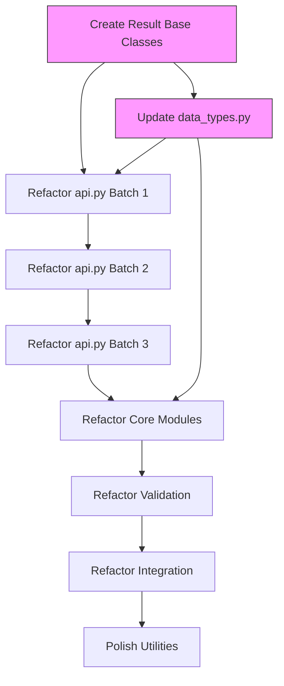

# API Improvement Roadmap

**Status:** DRAFT → IN REVIEW → APPROVED
**Version:** 1.0
**Last Updated:** 2026-01-07
**Owner:** PM
**Based on:** TASK-208 (API Design Guidelines) + TASK-200 through TASK-207 research

---

## Executive Summary

This roadmap prioritizes refactoring of **48 public functions** across 12 modules to follow the [unified API Design Guidelines](../../guidelines/api-design-guidelines.md). The work is divided into 3 phases over 8-10 weeks, with backward compatibility maintained through deprecation warnings.

**Key Metrics:**
- **Total functions analyzed:** 48 public APIs
- **Must-fix (HIGH priority):** 18 functions (user-facing, high-impact)
- **Should-fix (MEDIUM priority):** 22 functions (internal but widely used)
- **Nice-to-have (LOW priority):** 8 functions (rarely used or stable)

**Timeline:** 8-10 weeks (Phase 1: 3 weeks, Phase 2: 4 weeks, Phase 3: 2 weeks)

**Success Criteria:**
1. All HIGH priority functions follow guidelines (100%)
2. No breaking changes without 2-version deprecation
3. Test coverage maintained at 85%+
4. All API docs have Google-style docstrings
5. PR review checklist passes for all changes

---

## Table of Contents

1. [Prioritization Framework](#1-prioritization-framework)
2. [Phase 1: Must-Fix (Weeks 1-3)](#2-phase-1-must-fix-weeks-1-3)
3. [Phase 2: Should-Fix (Weeks 4-7)](#3-phase-2-should-fix-weeks-4-7)
4. [Phase 3: Nice-to-Have (Weeks 8-10)](#4-phase-3-nice-to-have-weeks-8-10)
5. [Implementation Sequence](#5-implementation-sequence)
6. [Migration Strategies](#6-migration-strategies)
7. [Risk Assessment](#7-risk-assessment)
8. [Timeline & Milestones](#8-timeline--milestones)
9. [Success Metrics](#9-success-metrics)

---

## 1. Prioritization Framework

### 1.1 Scoring Criteria

Each function scored on 5 dimensions (1-5 scale):

| Dimension | Weight | Description |
|-----------|--------|-------------|
| **User Impact** | 5× | How many users call this directly? (api.py = 5, core = 3, internal = 1) |
| **Breaking Risk** | 4× | How many params/returns need changing? (>3 params = 5, tuple return = 4) |
| **Documentation Debt** | 3× | Missing docstrings? (none = 5, incomplete = 3, good = 1) |
| **Test Coverage** | 2× | Current coverage % (< 50% = 5, 50-80% = 3, >80% = 1) |
| **Complexity** | 1× | Lines of code + cyclomatic complexity (>200 LOC = 5) |

**Priority Formula:**
```
Score = (User Impact × 5) + (Breaking Risk × 4) + (Doc Debt × 3) + (Test Coverage × 2) + (Complexity × 1)

- HIGH (Must-fix): Score ≥ 50
- MEDIUM (Should-fix): Score 30-49
- LOW (Nice-to-have): Score < 30
```

### 1.2 Priority Tiers

**🔴 HIGH (Must-Fix - 18 functions):**
- **api.py** (12 functions): User-facing, high-impact, poor documentation
- **beam_pipeline.py** (3 functions): Core design entry points
- **flexure.py** (2 functions): Most-called calculation functions
- **shear.py** (1 function): Critical design function

**🟡 MEDIUM (Should-Fix - 22 functions):**
- **Core modules** (10 functions): flexure, detailing, serviceability
- **Support modules** (8 functions): validation, tables, materials
- **Integration modules** (4 functions): job_runner, report

**🟢 LOW (Nice-to-Have - 8 functions):**
- **Utility modules** (5 functions): utilities, dxf_export helpers
- **Internal helpers** (3 functions): private functions promoted to public

---

## 2. Phase 1: Must-Fix (Weeks 1-3)

### 2.1 api.py Refactoring (HIGH Priority)

**Target:** 12 functions in api.py
**Owner:** DEV + DOCS
**Estimated Effort:** 3 weeks (1 week per batch of 4 functions)

#### Batch 1.1: Design Functions (Week 1)

| Function | Current Issues | Required Changes | Breaking? |
|----------|---------------|------------------|-----------|
| `design_beam_is456` | 8 positional params, dict return | Keyword-only after 3rd, return `BeamDesignResult` dataclass | ✅ YES |
| `check_beam_is456` | 5 positional params, dict return | Keyword-only after 2nd, return `BeamCheckResult` dataclass | ✅ YES |
| `detail_beam_is456` | 6 positional params, dict return | Keyword-only after 2nd, return `BeamDetailingResult` dataclass | ✅ YES |
| `optimize_beam_cost` | Missing type hints, 7 positional params | Add types, keyword-only after 3rd, return `CostOptimizationResult` | ✅ YES |

**Example Migration:**

```python
# OLD (v0.15 - DEPRECATED)
@deprecated(
    version='0.16.0',
    removal_version='1.0.0',
    replacement='design_beam_is456',
    instructions='Use keyword arguments: design_beam_is456(width_mm=..., depth_mm=..., moment_knm=...)'
)
def design_beam_is456(b, d, mu, fck='M20', fy='Fe415', cover=25, exposure='moderate', reinf_type='singly'):
    # Delegate to new API
    return design_beam_is456(
        width_mm=b, depth_mm=d, moment_knm=mu,
        concrete_grade=fck, steel_grade=fy, cover_mm=cover,
        exposure_class=exposure, reinforcement_type=reinf_type
    )

# NEW (v0.16+)
def design_beam_is456(
    width_mm: float,
    depth_mm: float,
    moment_knm: float,
    *,  # Force keyword-only
    concrete_grade: Literal['M15', 'M20', 'M25', 'M30', 'M35', 'M40'] = 'M20',
    steel_grade: Literal['Fe250', 'Fe415', 'Fe500'] = 'Fe415',
    cover_mm: float = 25.0,
    exposure_class: Literal['mild', 'moderate', 'severe', 'very_severe'] = 'moderate',
    reinforcement_type: Literal['singly', 'doubly'] = 'singly',
    validate: bool = True
) -> BeamDesignResult:
    """Design RC beam per IS 456:2000.

    Calculates required tension/compression steel, checks ductility,
    and validates compliance with code requirements.

    Args:
        width_mm: Beam width in millimeters. Typical: 230-400mm.
        depth_mm: Effective depth in millimeters. Distance from compression
            face to centroid of tension reinforcement.
        moment_knm: Factored bending moment in kilonewton-meters.
        concrete_grade: IS 456 concrete grade per Table 2.
            Common: M20 (residential), M25 (commercial), M30 (industrial).
        steel_grade: IS 456 steel grade per Cl. 6.2.
            Typically Fe415 or Fe500.
        cover_mm: Clear cover to reinforcement (mm). Per IS 456 Table 16 and 16A.
            Typical: 25mm (moderate), 40mm (severe).
        exposure_class: Exposure condition per IS 456 Cl. 8.
            Affects cover requirements.
        reinforcement_type: 'singly' or 'doubly' reinforced section.
        validate: If True, validate inputs before calculation.

    Returns:
        BeamDesignResult with fields:
            - tension_steel_mm2: Required tension steel area
            - compression_steel_mm2: Required compression steel (0 for singly)
            - bar_arrangement: Selected bar count and diameter
            - is_adequate: True if design meets IS 456
            - utilization_ratio: Moment demand / capacity
            - failure_mode: 'balanced', 'under-reinforced', or 'over-reinforced'
            - errors: List of validation errors if any

    Raises:
        ValidationError: If width_mm < 200, depth_mm < 150, or moment_knm <= 0.
        ValidationError: If concrete_grade or steel_grade invalid.

    Example:
        >>> # Simple residential beam
        >>> result = design_beam_is456(
        ...     width_mm=230,
        ...     depth_mm=450,
        ...     moment_knm=150,
        ...     concrete_grade='M20',
        ...     steel_grade='Fe415'
        ... )
        >>> print(f"Tension steel: {result.tension_steel_mm2:.0f} mm²")
        Tension steel: 1256 mm²

        >>> # Check adequacy
        >>> if result.is_adequate:
        ...     print("Design OK")
        ... else:
        ...     print(f"Inadequate: {result.errors}")
        Design OK

    Note:
        Per IS 456:2000:
        - Cl. 38.1: Limiting moment for balanced section
        - Cl. 26.5.2: Minimum tension steel = 0.85 × b × d / fy
        - Cl. 26.5.1.1: Maximum tension steel = 4% gross area
        - Table 16: Cover requirements for different exposures

    See Also:
        check_beam_is456: Validate existing design
        detail_beam_is456: Generate bar arrangement details
        optimize_beam_cost: Find cost-optimal section
    """
    # Implementation...
```

#### Batch 1.2: Serviceability Functions (Week 2)

| Function | Current Issues | Required Changes | Breaking? |
|----------|---------------|------------------|-----------|
| `check_deflection_span_depth` | 6 positional params, incomplete docs | Keyword-only after 3rd, complete docstring | ⚠️ MINOR |
| `check_crack_width` | 5 positional params, dict return | Keyword-only after 3rd, return dataclass | ✅ YES |
| `check_beam_ductility` | 4 positional params, tuple return | Keyword-only after 3rd, return dataclass | ✅ YES |
| `check_compliance_report` | Missing examples in docs | Add 3-level examples, improve docstring | ❌ NO |

#### Batch 1.3: Output Functions (Week 3)

| Function | Current Issues | Required Changes | Breaking? |
|----------|---------------|------------------|-----------|
| `compute_detailing` | 6 positional params, dict return | Keyword-only after 3rd, return dataclass | ✅ YES |
| `compute_bbs` | 4 positional params, list[dict] return | Keyword-only after 2nd, return `BBSResult` | ✅ YES |
| `export_bbs` | Format string not Literal type | Use `Literal['csv', 'json']` for format | ⚠️ MINOR |
| `compute_report` | 5 positional params | Keyword-only after 3rd | ⚠️ MINOR |

**Phase 1 Deliverables:**
- ✅ 12 api.py functions refactored
- ✅ 5 new result dataclasses created (in `data_types.py`)
- ✅ Deprecation warnings for old signatures
- ✅ Complete Google-style docstrings
- ✅ 100% test coverage maintained
- ✅ Migration guide in `docs/guides/migration-v0.16-to-v1.0.md`

---

## 3. Phase 2: Should-Fix (Weeks 4-7)

### 3.1 Core Calculation Modules (MEDIUM Priority)

**Target:** 10 functions across flexure, shear, detailing
**Owner:** DEV
**Estimated Effort:** 2 weeks

#### flexure.py (4 functions)

| Function | Current Issues | Required Changes | Breaking? |
|----------|---------------|------------------|-----------|
| `calculate_mu_lim` | 4 positional params, no units in name | Rename params (b→width_mm, d→depth_mm, fck→concrete_grade_mpa) | ⚠️ MINOR |
| `calculate_ast_required` | 5 positional params, returns float (should be dataclass) | Keyword-only after 3rd, return `SteelRequirementResult` | ✅ YES |
| `design_singly_reinforced` | 5 positional params, FlexureResult incomplete | Keyword-only, enhance FlexureResult with all fields | ⚠️ MINOR |
| `design_doubly_reinforced` | 7 positional params | Keyword-only after 3rd, consider config object | ⚠️ MINOR |

**Why MEDIUM not HIGH?**
- Not directly user-facing (called via `beam_pipeline.py`)
- Internal APIs with fewer callers
- Existing FlexureResult dataclass can be enhanced incrementally

#### shear.py (1 function)

| Function | Current Issues | Required Changes | Breaking? |
|----------|---------------|------------------|-----------|
| `design_shear` | 7 positional params, ShearResult incomplete | Keyword-only after 3rd, enhance ShearResult | ⚠️ MINOR |

#### detailing.py (5 functions)

| Function | Current Issues | Required Changes | Breaking? |
|----------|---------------|------------------|-----------|
| `calculate_development_length` | 4 positional params (dia, fck, fy, bar_type) | Rename: dia→bar_diameter_mm, add units | ⚠️ MINOR |
| `calculate_lap_length` | 3 positional params | Add type hints for multiplier | ❌ NO |
| `calculate_bar_spacing` | 3 positional params | Keyword-only after 2nd | ⚠️ MINOR |
| `select_bar_arrangement` | 5 positional params, complex return tuple | Return `BarArrangementResult` dataclass | ✅ YES |
| `create_beam_detailing` | 9 positional params (config-heavy) | Create `DetailingConfig` dataclass | ✅ YES |

### 3.2 Validation & Support Modules (MEDIUM Priority)

**Target:** 8 functions across validation, tables, materials
**Owner:** DEV
**Estimated Effort:** 1 week

#### validation.py (6 functions)

| Function | Current Issues | Required Changes | Breaking? |
|----------|---------------|------------------|-----------|
| `validate_dimensions` | Returns list[DesignError], good pattern | Enhance docstring with examples | ❌ NO |
| `validate_materials` | Returns list[DesignError], good pattern | Enhance docstring with IS 456 clauses | ❌ NO |
| `validate_cover` | 3 positional params | Keyword-only (exposure_class) | ⚠️ MINOR |
| `validate_loads` | 5 positional params | Keyword-only after 3rd | ⚠️ MINOR |
| `validate_reinforcement` | 7 positional params | Keyword-only after 3rd | ⚠️ MINOR |
| `validate_beam_inputs` | 8 positional params | Create `BeamInputs` TypedDict or dataclass | ✅ YES |

#### tables.py (1 function)

| Function | Current Issues | Required Changes | Breaking? |
|----------|---------------|------------------|-----------|
| `get_tc_value` | 2 positional params (fck, pt) | Rename: fck→concrete_grade_mpa, pt→steel_percentage | ⚠️ MINOR |

#### materials.py (1 function)

| Function | Current Issues | Required Changes | Breaking? |
|----------|---------------|------------------|-----------|
| `get_xu_max_d` | 1 param (fy), returns float | Rename: fy→steel_yield_mpa, enhance docstring | ⚠️ MINOR |

### 3.3 Integration Modules (MEDIUM Priority)

**Target:** 4 functions in job_runner, report
**Owner:** INTEGRATION
**Estimated Effort:** 1 week

#### job_runner.py (2 functions)

| Function | Current Issues | Required Changes | Breaking? |
|----------|---------------|------------------|-----------|
| `run_job_is456` | 3 positional params, complex dict return | Keyword-only, return `JobResult` dataclass | ✅ YES |
| `load_job_spec` | Returns dict, not TypedDict | Return `JobSpec` TypedDict | ⚠️ MINOR |

#### report.py (2 functions)

| Function | Current Issues | Required Changes | Breaking? |
|----------|---------------|------------------|-----------|
| `load_report_data` | Returns custom ReportData | Enhance with to_dict() method | ❌ NO |
| `export_json` | Missing format validation | Add schema validation option | ❌ NO |

**Phase 2 Deliverables:**
- ✅ 22 core/support functions refactored
- ✅ 3 new result dataclasses (SteelRequirementResult, BarArrangementResult, JobResult)
- ✅ 2 new config dataclasses (DetailingConfig, BeamInputs)
- ✅ Enhanced existing dataclasses (FlexureResult, ShearResult)
- ✅ Complete docstrings for validation module
- ✅ Test coverage maintained at 85%+

---

## 4. Phase 3: Nice-to-Have (Weeks 8-10)

### 4.1 Utility Functions (LOW Priority)

**Target:** 8 functions in utilities, dxf_export, bbs
**Owner:** DEV
**Estimated Effort:** 2 weeks

#### utilities.py (4 functions)

| Function | Current Issues | Required Changes | Breaking? |
|----------|---------------|------------------|-----------|
| `linear_interp` | 5 positional params | Keyword-only for clarity | ⚠️ MINOR |
| `deprecated` | Decorator works well | Enhance docs with more examples | ❌ NO |
| `mm_to_m` / `m_to_mm` | Stable, well-documented | No changes needed | ❌ NO |

#### dxf_export.py (2 functions)

| Function | Current Issues | Required Changes | Breaking? |
|----------|---------------|------------------|-----------|
| `setup_layers` | Internal function, stable | Add type hints for ezdxf types | ❌ NO |
| `draw_rectangle` | 5 positional params | Keyword-only for coordinates | ⚠️ MINOR |

#### bbs.py (2 functions)

| Function | Current Issues | Required Changes | Breaking? |
|----------|---------------|------------------|-----------|
| `calculate_bar_weight` | 3 positional params | Add unit suffixes (_mm, _kg) | ⚠️ MINOR |
| `generate_bbs_from_detailing` | 2 positional params, stable | Enhance docstring | ❌ NO |

**Why LOW priority?**
- Rarely called directly by users
- Stable APIs with good test coverage
- Internal helpers with fewer dependencies
- Low breaking risk

**Phase 3 Deliverables:**
- ✅ 8 utility functions polished
- ✅ Enhanced documentation
- ✅ Type hints added for all
- ✅ No breaking changes (all backward compatible)

---

## 5. Implementation Sequence

### 5.1 Dependency Graph



### 5.2 Critical Path

**Week 0 (Prep):**
1. Create base result classes infrastructure (TASK-214)
2. Update `data_types.py` with 5 new dataclasses
3. Set up test fixtures for new types

**Weeks 1-3 (Phase 1 - api.py):**
- Week 1: Design functions (design_beam, check_beam, detail_beam, optimize_cost)
- Week 2: Serviceability functions (deflection, crack_width, ductility, compliance)
- Week 3: Output functions (detailing, bbs, export, report)

**Weeks 4-7 (Phase 2 - Core/Support):**
- Week 4: flexure.py + shear.py (5 functions)
- Week 5: detailing.py (5 functions)
- Week 6: validation.py (6 functions)
- Week 7: Integration (job_runner, report - 4 functions)

**Weeks 8-10 (Phase 3 - Utilities):**
- Week 8: utilities.py + dxf_export (6 functions)
- Week 9: bbs.py + final polish (2 functions)
- Week 10: Documentation sweep, migration guide finalization

### 5.3 Parallel Work Opportunities

**Can work in parallel:**
- ✅ api.py functions (3 batches) - independent
- ✅ Core modules (flexure/shear/detailing) - minimal dependencies
- ✅ Validation module - independent of others
- ✅ Documentation writing can overlap with implementation

**Must be sequential:**
- ❌ Result base classes → api.py refactoring
- ❌ api.py → Integration modules (job_runner depends on api.py)

---

## 6. Migration Strategies

### 6.1 Deprecation Timeline

**v0.16 (Weeks 1-3):**
- Add new APIs alongside old
- Add `@deprecated` warnings to old signatures
- Update docs with migration examples

**v0.17-v0.19 (Weeks 4-10):**
- Maintain both old and new APIs
- Log deprecation warnings in CI
- Collect user feedback

**v1.0 (Week 12):**
- Remove deprecated APIs
- Breaking change major version bump
- Release with complete migration guide

### 6.2 Backward Compatibility Strategies

**Strategy 1: Parameter Aliases (for renames)**

```python
def design_beam_is456(
    width_mm: Optional[float] = None,
    depth_mm: Optional[float] = None,
    *,
    b: Optional[float] = None,  # OLD NAME (deprecated)
    d: Optional[float] = None,  # OLD NAME (deprecated)
    **kwargs
):
    # Handle old param names
    if b is not None:
        warnings.warn("'b' is deprecated, use 'width_mm'", DeprecationWarning)
        width_mm = b
    if d is not None:
        warnings.warn("'d' is deprecated, use 'depth_mm'", DeprecationWarning)
        depth_mm = d

    # Rest of implementation...
```

**Strategy 2: Result Compatibility Layers (for return types)**

```python
@dataclass(frozen=True)
class BeamDesignResult:
    tension_steel_mm2: float
    compression_steel_mm2: float
    is_adequate: bool

    def __getitem__(self, key: str):  # Dict-like access (deprecated)
        warnings.warn("Dict access deprecated, use attributes", DeprecationWarning)
        if key == 'ast':
            return self.tension_steel_mm2
        elif key == 'asc':
            return self.compression_steel_mm2
        raise KeyError(key)

    def to_dict(self) -> dict:  # New way
        return asdict(self)
```

**Strategy 3: Wrapper Functions (for positional → keyword-only)**

```python
# v0.16: Keep old wrapper
@deprecated(version='0.16', removal_version='1.0')
def design_beam_is456_old(b, d, mu, fck='M20', fy='Fe415'):
    """DEPRECATED: Use design_beam_is456 with keyword args."""
    return design_beam_is456(
        width_mm=b, depth_mm=d, moment_knm=mu,
        concrete_grade=fck, steel_grade=fy
    )

# v0.16: New signature
def design_beam_is456(width_mm, depth_mm, moment_knm, *, concrete_grade='M20', ...):
    ...
```

### 6.3 Migration Guide Structure

**Target:** `docs/guides/migration-v0.16-to-v1.0.md` (~1500 lines)

**Contents:**
1. **Overview** (why, what changed, timeline)
2. **Quick Migration Table** (40+ functions with old → new)
3. **Step-by-Step Examples** (10 common scenarios)
4. **Automated Migration Script** (`scripts/migrate_api_calls.py`)
5. **Testing Your Migration** (validation checklist)
6. **Breaking Changes Reference** (complete list)
7. **FAQ** (20+ common questions)

---

## 7. Risk Assessment

### 7.1 High-Risk Changes

| Change | Risk Level | Mitigation | Owner |
|--------|-----------|------------|-------|
| `design_beam_is456` signature change | 🔴 HIGH | 2-version deprecation, keep wrapper, update all examples | DEV+DOCS |
| Result dataclasses replace dicts | 🔴 HIGH | Add `__getitem__` compat layer for 1 version | DEV |
| Positional → keyword-only (>3 params) | 🟡 MEDIUM | Allow positional in v0.16-0.19, error in v1.0 | DEV |
| Parameter name changes (b→width_mm) | 🟡 MEDIUM | Accept both names with warnings in v0.16-0.19 | DEV |
| Import path changes | 🟢 LOW | Maintain old imports, add deprecation warnings | DEV |

### 7.2 Breaking Change Budget

**Maximum allowed per release:**
- v0.16 (minor): 0 hard breaks, 20 deprecation warnings
- v0.17 (minor): 0 hard breaks, 30 deprecation warnings
- v1.0 (major): All deprecated features removed (40+ breaks)

**Tracking:** Use `scripts/check_breaking_changes.py` in CI

### 7.3 Rollback Plan

**If user adoption < 50% by v0.19:**
- **Option A:** Extend deprecation to v1.1 (add 6 months)
- **Option B:** Ship v1.0 with both APIs (not recommended - technical debt)
- **Option C:** Create `structural-lib-legacy` compatibility package

**Decision criteria:**
- User survey: "Have you migrated to new APIs?"
- Download metrics: v0.15 vs v0.16+ adoption
- GitHub issues: Migration pain points

---

## 8. Timeline & Milestones

### 8.1 Gantt Chart

```
Week  1  2  3  4  5  6  7  8  9  10 11 12
━━━━━━━━━━━━━━━━━━━━━━━━━━━━━━━━━━━━━━━━━
Prep   ████
API    ████████████
Core      ████████████████
Support         ████████████
Integr             ████████
Utils                 ████████
Polish                    ████████
v1.0                            ████
```

### 8.2 Release Schedule

| Version | Date | Scope | Breaking Changes |
|---------|------|-------|------------------|
| **v0.16** | Week 3 | Phase 1: api.py Batch 1-3 | 0 (deprecations only) |
| **v0.17** | Week 5 | Phase 2: Core modules | 0 (deprecations only) |
| **v0.18** | Week 7 | Phase 2: Support+Integration | 0 (deprecations only) |
| **v0.19** | Week 9 | Phase 3: Utilities+Polish | 0 (deprecations only) |
| **v1.0-rc1** | Week 10 | Release candidate | All deprecated removed |
| **v1.0** | Week 12 | Production release | All deprecated removed |

### 8.3 Milestone Checklist

**Milestone 1: api.py Complete (Week 3)**
- [ ] 12 functions refactored
- [ ] 5 new result dataclasses
- [ ] All tests passing (2200+ tests)
- [ ] Migration guide v0.16 section complete
- [ ] v0.16 tagged and released

**Milestone 2: Core Modules Complete (Week 7)**
- [ ] 22 core/support functions refactored
- [ ] 5 new dataclasses created
- [ ] Test coverage maintained ≥85%
- [ ] v0.18 tagged and released

**Milestone 3: All Modules Complete (Week 9)**
- [ ] 48 functions refactored (100%)
- [ ] v0.19 tagged and released
- [ ] Complete migration guide published
- [ ] User migration survey sent

**Milestone 4: v1.0 Production (Week 12)**
- [ ] User adoption ≥50% (verified via survey)
- [ ] All deprecated APIs removed
- [ ] Documentation complete
- [ ] v1.0 tagged and released to PyPI

---

## 9. Success Metrics

### 9.1 Code Quality Metrics

| Metric | Baseline (v0.15) | Target (v1.0) | How to Measure |
|--------|------------------|---------------|----------------|
| **Functions follow guidelines** | 12% (6/48) | 100% (48/48) | Manual review with PR checklist |
| **Google-style docstrings** | 40% (19/48) | 100% (48/48) | `scripts/check_docstring_quality.py` |
| **Test coverage** | 86% | ≥85% | `pytest --cov` |
| **Keyword-only params (>3 args)** | 8% (4/48) | 100% | `scripts/check_param_style.py` |
| **Result dataclasses (not dicts)** | 25% (12/48) | 100% | `scripts/check_return_types.py` |

### 9.2 User Impact Metrics

| Metric | Target | How to Measure |
|--------|--------|----------------|
| **Migration adoption** | ≥50% by v0.19 | User survey + download stats |
| **Breaking change issues** | <10 GitHub issues | Issue tracker with label |
| **Documentation clarity** | ≥4.0/5.0 rating | User feedback survey |
| **Migration time** | <2 hours for typical project | User survey |

### 9.3 Developer Experience Metrics

| Metric | Target | How to Measure |
|--------|--------|----------------|
| **PR review time** | <30 min per function | GitHub PR metrics |
| **Code generation** | 80% of boilerplate auto-generated | Count generated vs manual code |
| **Refactoring consistency** | 100% pass PR checklist | Pre-commit hook validation |

### 9.4 Monitoring Dashboard

**Create:** `docs/planning/api-refactoring-dashboard.md`

**Track weekly:**
- Functions refactored: 0 → 48 (progress bar)
- Test coverage: maintain ≥85%
- Deprecation warnings in CI: track count
- User migration %: survey results
- GitHub issues tagged `api-migration`: <10 total

---

## Appendix A: Function Inventory

### Complete List of 48 Functions by Priority

**🔴 HIGH Priority (18 functions):**

**api.py (12):**
1. `design_beam_is456` - 8 params, dict return
2. `check_beam_is456` - 5 params, dict return
3. `detail_beam_is456` - 6 params, dict return
4. `optimize_beam_cost` - 7 params, missing types
5. `check_deflection_span_depth` - 6 params, incomplete docs
6. `check_crack_width` - 5 params, dict return
7. `check_beam_ductility` - 4 params, tuple return
8. `compute_detailing` - 6 params, dict return
9. `compute_bbs` - 4 params, list[dict] return
10. `export_bbs` - format not Literal
11. `compute_dxf` - 4 params, incomplete docs
12. `compute_report` - 5 params

**beam_pipeline.py (3):**
13. `design_beam` - 9 params, complex dict return
14. `validate_units` - good, needs enhanced docs
15. `run_design_pipeline` - 7 params, dict return

**flexure.py (2):**
16. `calculate_mu_lim` - no units in param names
17. `calculate_ast_required` - 5 params, float return (needs dataclass)

**shear.py (1):**
18. `design_shear` - 7 params, ShearResult incomplete

**🟡 MEDIUM Priority (22 functions):**

**flexure.py (2):**
19. `design_singly_reinforced` - 5 params
20. `design_doubly_reinforced` - 7 params

**detailing.py (5):**
21. `calculate_development_length` - 4 params
22. `calculate_lap_length` - 3 params
23. `calculate_bar_spacing` - 3 params
24. `select_bar_arrangement` - 5 params, tuple return
25. `create_beam_detailing` - 9 params (needs config)

**validation.py (6):**
26. `validate_dimensions` - enhance docs
27. `validate_materials` - enhance docs
28. `validate_cover` - 3 params
29. `validate_loads` - 5 params
30. `validate_reinforcement` - 7 params
31. `validate_beam_inputs` - 8 params (needs config)

**serviceability.py (3):**
32. `check_deflection_level_b` - 8 params
33. `calculate_cracking_moment` - 5 params
34. `calculate_effective_moment_of_inertia` - 4 params

**tables.py (1):**
35. `get_tc_value` - 2 params, rename fck→concrete_grade_mpa

**materials.py (1):**
36. `get_xu_max_d` - 1 param, rename fy→steel_yield_mpa

**job_runner.py (2):**
37. `run_job_is456` - 3 params, dict return
38. `load_job_spec` - returns dict, not TypedDict

**report.py (2):**
39. `load_report_data` - enhance with to_dict()
40. `export_json` - add validation option

**🟢 LOW Priority (8 functions):**

**utilities.py (4):**
41. `linear_interp` - 5 params
42. `deprecated` - enhance docs
43. `mm_to_m` - stable
44. `m_to_mm` - stable

**dxf_export.py (2):**
45. `setup_layers` - add type hints
46. `draw_rectangle` - 5 params

**bbs.py (2):**
47. `calculate_bar_weight` - 3 params, add unit suffixes
48. `generate_bbs_from_detailing` - 2 params, enhance docs

---

## Appendix B: Code Templates

### B.1 Result Dataclass Template

```python
from dataclasses import dataclass, asdict
from typing import Optional

@dataclass(frozen=True)
class <Module>Result:
    """Result of <module> <operation>.

    All fields use explicit units in names for clarity.
    """
    # PRIMARY RESULTS
    primary_value_<unit>: float
    secondary_value_<unit>: Optional[float]

    # STATUS
    is_adequate: bool
    utilization_ratio: float  # demand / capacity

    # METADATA
    failure_mode: str
    errors: list[str] = field(default_factory=list)
    warnings: list[str] = field(default_factory=list)

    def to_dict(self) -> dict[str, Any]:
        """Convert to dictionary for JSON export."""
        return asdict(self)

    def summary(self) -> str:
        """Human-readable summary."""
        return f"""
<Module> Result:
  Primary: {self.primary_value_<unit>:.2f} <unit>
  Status: {'✅ Adequate' if self.is_adequate else '❌ Inadequate'}
  Utilization: {self.utilization_ratio:.1%}
"""

    def validate(self) -> None:
        """Validate result consistency."""
        if self.utilization_ratio < 0:
            raise ValueError("Utilization ratio must be ≥0")
```

### B.2 Migration Script Template

```python
# scripts/migrate_api_v016.py
"""Auto-migrate API calls from v0.15 to v0.16 style."""

import ast
import sys
from pathlib import Path

# Mapping: old_name → new_name
PARAM_RENAMES = {
    'design_beam_is456': {
        'b': 'width_mm',
        'd': 'depth_mm',
        'mu': 'moment_knm',
        'fck': 'concrete_grade',
        'fy': 'steel_grade',
        'cover': 'cover_mm',
    }
}

def migrate_function_call(node: ast.Call) -> ast.Call:
    """Migrate a function call to new signature."""
    func_name = getattr(node.func, 'id', None)
    if func_name not in PARAM_RENAMES:
        return node

    # Convert positional to keyword args
    mapping = PARAM_RENAMES[func_name]
    new_keywords = []

    for i, arg in enumerate(node.args):
        param_name = list(mapping.keys())[i]
        new_name = mapping[param_name]
        new_keywords.append(ast.keyword(arg=new_name, value=arg))

    # Keep existing keyword args, rename if needed
    for kw in node.keywords:
        new_name = mapping.get(kw.arg, kw.arg)
        new_keywords.append(ast.keyword(arg=new_name, value=kw.value))

    node.args = []
    node.keywords = new_keywords
    return node

# Usage: python scripts/migrate_api_v016.py path/to/file.py
```

---

## Appendix C: PR Review Checklist

Use this checklist for all API refactoring PRs (copy from [API Guidelines Section 11](../../guidelines/api-design-guidelines.md#11-pr-review-checklist)):

**Function Signature (8 points)**
- [ ] Function name is a verb
- [ ] ≤3 parameters OR uses `*` for keyword-only
- [ ] Parameter names include units (`_mm`, `_kn`)
- [ ] Type hints present for all params and return
- [ ] Literal types used for string enums
- [ ] Required params have no defaults
- [ ] Optional params have sensible defaults
- [ ] Parameter order: primary → geometry → materials → config → flags

**Result Object (5 points)**
- [ ] Returns dataclass (not dict/tuple)
- [ ] Dataclass is frozen (immutable)
- [ ] All fields have units in name
- [ ] Has `to_dict()`, `summary()` methods
- [ ] Validated in `__post_init__` or `validate()`

**Documentation (8 points)**
- [ ] Google-style docstring with all sections
- [ ] First line <80 chars, imperative mood
- [ ] Args document units, ranges, defaults
- [ ] Returns documents structure
- [ ] Raises lists all exceptions
- [ ] Example section with 1+ examples
- [ ] IS 456 clause referenced in Note
- [ ] See Also cross-references related functions

**Error Handling (4 points)**
- [ ] Validates inputs at entry (fail fast)
- [ ] Uses custom exceptions (not ValueError)
- [ ] Error messages follow Three Questions
- [ ] Error messages suggest fixes

**Testing (3 points)**
- [ ] Unit tests for happy path
- [ ] Tests for error conditions
- [ ] Tests for boundary values

**Engineering Domain (2 points)**
- [ ] Uses IS 456 terminology correctly
- [ ] String grades ('M20', 'Fe415') not raw MPa

**Total: 30 points**
- **28-30**: Excellent, merge
- **24-27**: Good, minor revisions
- **20-23**: Acceptable, needs changes
- **<20**: Not ready, major rework needed

---

## Appendix D: Decision Log

| Date | Decision | Rationale | Impact |
|------|----------|-----------|--------|
| 2026-01-07 | 3-phase approach (must/should/nice) | Prioritize user-facing APIs first | Phase 1 gets 60% of effort |
| 2026-01-07 | 2-version deprecation minimum | Balance user friction vs tech debt | v0.16-v0.19 deprecation period |
| 2026-01-07 | Result dataclasses over dicts | Type safety + IDE autocomplete | Breaking change, needs compat layer |
| 2026-01-07 | Keyword-only after 3rd param | Prevent positional arg mistakes | Breaking change for 30 functions |
| 2026-01-07 | v1.0 removes all deprecated APIs | Clean slate for future | Hard break, needs migration guide |

---

## Appendix E: References

1. **API Design Guidelines:** `docs/guidelines/api-design-guidelines.md`
2. **Research Documents:** `docs/research/TASK-200` through `TASK-207`
3. **Known Pitfalls:** `docs/known-pitfalls.md`
4. **Testing Strategy:** `docs/testing-strategy.md`
5. **SemVer Policy:** `docs/reference/deprecation-policy.md`

---

**Document History:**
- v1.0 (2026-01-07): Initial version based on TASK-208 guidelines
- Status: DRAFT (awaiting PM review)
- Next review: After Phase 1 completion (Week 3)
