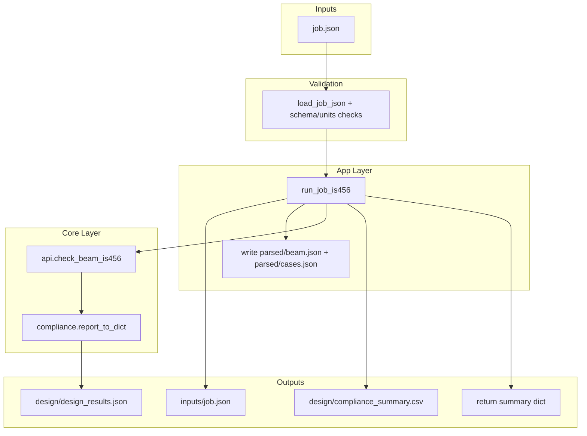

# Pipeline Data Flow Diagrams

Focused pipeline diagrams for the two most complex execution paths.
For layer and module overview, see:
- [visual-architecture.md](visual-architecture.md)
- [deep-project-map.md](deep-project-map.md)

---

## 1) Job Runner (job.json -> outputs)



Notes:
- `run_job` dispatches to `run_job_is456` based on `job['code']`.
- Units are validated at the boundary, then canonical units are used downstream.
- Output folders: `inputs/`, `parsed/`, `design/`, `deliverables/`, `logs/`.

---

## 2) Smart Designer (design -> insights dashboard)

```mermaid
flowchart TB
  subgraph Inputs
    Design[BeamDesignOutput]
    Span[span_mm]
    Mu[mu_knm]
    Vu[vu_kn]
    Weights[weights (optional)]
    CostProfile[cost_profile (optional)]
  end

  subgraph Orchestrator
    Analyze[SmartDesigner.analyze]
    Validate[validate design result]
  end

  subgraph CostOpt[Cost Optimization]
    CostRun[cost_optimization.optimize_beam_cost]
    CostOut[CostAnalysis]
  end

  subgraph Suggestions[Design Suggestions]
    SugRun[design_suggestions.suggest_improvements]
    SugOut[DesignSuggestions]
  end

  subgraph Sensitivity[Sensitivity]
    SensRun[sensitivity.sensitivity_analysis]
    SensOut[SensitivityInsights]
    DesignCallback[api.design_beam_is456 callback]
  end

  subgraph Constructability[Constructability]
    ConsRun[heuristic scoring]
    ConsOut[ConstructabilityInsights]
  end

  subgraph Aggregate
    Scores[score + summary + metadata]
    Dashboard[DashboardReport]
  end

  subgraph Outputs
    JSONOut[to_json / to_dict]
    TextOut[summary_text]
  end

  Design --> Validate --> Analyze
  Span --> Analyze
  Mu --> Analyze
  Vu --> Analyze
  Weights --> Analyze
  CostProfile --> Analyze

  Analyze --> CostRun --> CostOut
  Analyze --> SugRun --> SugOut
  Analyze --> SensRun --> SensOut
  SensRun --> DesignCallback
  Analyze --> ConsRun --> ConsOut

  CostOut --> Scores
  SugOut --> Scores
  SensOut --> Scores
  ConsOut --> Scores
  Scores --> Dashboard
  Dashboard --> JSONOut
  Dashboard --> TextOut
```

Notes:
- Each analysis can be toggled by `include_cost`, `include_suggestions`,
  `include_sensitivity`, and `include_constructability`.
- Sensitivity runs multiple designs through `api.design_beam_is456` with
  parameter perturbations, then ranks critical parameters.
