# Visual Architecture Diagrams

**Type:** Architecture
**Audience:** All Agents
**Status:** Approved
**Importance:** High
**Version:** 1.0.0
**Created:** 2025-12-22
**Last Updated:** 2026-01-13

---

Quick diagrams for layers, module groupings, and data flow. For detailed narrative, see:
- [deep-project-map.md](deep-project-map.md)
- [project-overview.md](project-overview.md)
- [data-flow-diagrams.md](data-flow-diagrams.md)

---

## 1) Layer Architecture (Python + VBA)

```mermaid
flowchart TB
  subgraph UIIO[UI / I-O Layer]
    ExcelUI[Excel UI + VBA Macros]
    CLI[Python CLI / Batch Scripts]
    ETABS[ETABS CSV / JSON Inputs]
  end

  subgraph APP[App / Orchestration Layer]
    VBAApp[VBA App Layer (M11_AppLayer)]
    BeamPipeline[Python beam_pipeline / job_runner]
    ExcelBridge[excel_integration / excel_bridge]
  end

  subgraph CORE[Core Calculation Layer]
    Flexure[flexure]
    Shear[shear]
    Ductile[ductile]
    Detailing[detailing]
    Tables[tables + materials]
  end

  ETABS --> ExcelBridge
  ExcelBridge --> BeamPipeline
  ExcelUI --> VBAApp
  CLI --> BeamPipeline

  VBAApp --> Flexure
  VBAApp --> Shear
  VBAApp --> Ductile
  VBAApp --> Detailing

  BeamPipeline --> Flexure
  BeamPipeline --> Shear
  BeamPipeline --> Ductile
  BeamPipeline --> Detailing

  Flexure --> Tables
  Shear --> Tables
```

---

## 2) Module Groups (Logical Dependencies)

```mermaid
flowchart LR
  subgraph CORE[Core Calc]
    flexure
    shear
    ductile
    tables
    materials
    serviceability
  end

  subgraph TYPES[Types + Validation]
    types
    data_types
    errors
    validation
    constants
    utilities
  end

  subgraph APP[App / Orchestration]
    beam_pipeline
    compliance
    optimization
    rebar_optimizer
    detailing
  end

  subgraph IO[IO + Reporting]
    api
    job_runner
    job_cli
    excel_integration
    excel_bridge
    report
    report_svg
    dxf_export
    bbs
  end

  subgraph INSIGHTS[Insights]
    intelligence
    insights_types[insights.*]
  end

  IO --> APP
  APP --> CORE
  CORE --> TYPES
  INSIGHTS --> CORE
```



---

## 3) Data Flow (Excel + Python)

```mermaid
flowchart TB
  subgraph ExcelFlow[Excel / VBA Flow]
    X1[ETABS CSV / Manual Input]
    X2[BEAM_INPUT]
    X3[App Layer Loop]
    X4[Core Calc (Flexure/Shear/Ductile)]
    X5[BEAM_DESIGN]
    X6[Detailing + DXF Export]

    X1 --> X2 --> X3 --> X4 --> X5 --> X6
  end

  subgraph PythonFlow[Python Flow]
    P1[Job JSON / CLI Inputs]
    P2[Validation + Normalization]
    P3[beam_pipeline / job_runner]
    P4[Core Calc (Flexure/Shear/Ductile)]
    P5[Results + Report]
    P6[DXF / BBS (optional)]

    P1 --> P2 --> P3 --> P4 --> P5 --> P6
  end
```
