# IS 456 Compliance Automation: How the Library Checks Your Beam Designs

**Blog Post | Technical Tutorial + Real-World Impact**

**Word Count:** 1,300+
**Target Audience:** Structural engineers, code compliance professionals, researchers
**Reading Time:** 6-8 minutes
**Published:** [Date]

---

## Introduction

Picture this: It's 6 PM on a Friday. You have a deadline Monday morning. You've just finished analyzing 200 beams in ETABS. Now comes the "fun" part: opening Excel, copying forces row by row, and manually checking if each beam meets IS 456 requirements.

*   *"Did I check the shear spacing for the 450mm beams?"*
*   *"Wait, did I update the crack width limit for the coastal zone beams?"*
*   *"Did I remember to check Annex G for ductility?"*

Manual compliance checking isn't just boring—it's dangerous. A single missed check can lead to a safety violation or, more commonly, an over-conservative (expensive) design because you didn't have time to optimize.

In this post, we'll show you how to automate this entire process. We'll replace 20 hours of manual Excel work with a Python script that runs in 20 seconds.

---

## The IS 456 Compliance Challenge

The Indian Standard (IS 456:2000) is a web of interconnected rules. Checking a single beam isn't just one calculation; it's a traversal of a logic tree.

### The Complexity Map

Here is what "checking compliance" actually looks like:

```mermaid
graph TD
    Start[Input Design] --> Mat[Check Materials Cl 6-8];
    Mat --> Flex[Flexure Check Cl 26.4];
    Mat --> Shear[Shear Check Cl 26.4/40];

    Flex -->|Pass| Det[Detailing Cl 26.5];
    Flex -->|Fail| Redesign[❌ FAIL];

    Shear -->|Pass| Det;
    Shear -->|Fail| Redesign;

    Det --> Duct[Ductility Annex G];
    Duct --> Serv[Serviceability];

    Serv --> Defl[Deflection Cl 23.2];
    Serv --> Crack[Crack Width Cl 39];

    Defl -->|Pass| Success[✅ COMPLIANT];
    Crack -->|Pass| Success;
```



**The Manual Reality:**
*   **Step 1:** Look up concrete shear strength ($ \tau_c $) in Table 19. (Hope you read the right row for M25).
*   **Step 2:** Calculate modification factors for deflection. (Hope you interpolated the graph correctly).
*   **Step 3:** Check ductility ratio. (Often skipped because it's "too complex" to calc by hand).

**Total time:** 15-20 minutes per beam.
**Error rate:** High.

---

## Solution: Automated Compliance Module

The library provides a single, unified interface: `check_compliance()`. It acts as a digital code auditor that never gets tired and never forgets a clause.

### What It Looks Like

```python
from structural_lib.api import design_beam_is456
from structural_lib.compliance import check_compliance

# 1. Design a beam (or load from ETABS)
design = design_beam_is456(
    b_mm=300, D_mm=550, d_mm=500,
    fck_nmm2=25, fy_nmm2=500,
    mu_knm=120, vu_kn=80,
    cover_mm=40
)

# 2. Run the Audit
compliance = check_compliance(
    design=design,
    span_mm=5000,
    exposure_rating="moderate" # e.g., Bangalore/Pune
)

# 3. Get the Verdict
print(compliance.summary())
```

### The Output (Your Digital Report)

The output isn't just "Pass/Fail". It's a detailed report card similar to what a senior engineer would write.

```text
╔═══════════════════════════════════════════════════════╗
║    IS 456 COMPLIANCE REPORT                          ║
║    Design: 300×550 beam, 4T20, 8mm stirrups @ 250mm ║
╚═══════════════════════════════════════════════════════╝

STRENGTH LIMIT STATE
═══════════════════════════════════════════════════════
✅ FLEXURE (Cl. 26.4)   | Margin: 21%  | Capacity: 145 kNm > 120 kNm
✅ SHEAR (Cl. 40.1)     | Margin: 19%  | Capacity: 95 kN > 80 kN
✅ DUCTILITY (Annex G)  | Status: PASS | Mu/Mu' = 0.83 < 1.0

SERVICEABILITY LIMIT STATE
═══════════════════════════════════════════════════════
✅ DEFLECTION (Cl 23.2) | Status: PASS | L/d = 9.1 < 20.0
✅ CRACK WIDTH (Cl 39)  | Status: PASS | 0.18 mm < 0.30 mm

DETAILING (The "Small" Stuff)
═══════════════════════════════════════════════════════
✅ Min Steel (Cl 26.5)  | Provided: 1256 mm² > Min: 255 mm²
✅ Spacing (Cl 26.3)    | Status: PASS (150 mm)
✅ Cover (Cl 26.4)      | Status: PASS (40 mm)

OVERALL VERDICT: ✅ COMPLIANT
```

---

## How It Works: The "Exposure" Context

One of the trickiest parts of IS 456 is that rules change based on environmental exposure (Mild, Moderate, Severe).

*   **Mild:** Cover 20mm, Crack width 0.3mm.
*   **Severe:** Cover 45mm, Crack width 0.25mm.
*   **Very Severe:** Cover 50mm, Crack width 0.2mm.

Our module handles this context automatically.

```python
# If you change the context, the rules adapt
compliance_coastal = check_compliance(
    design=design,
    exposure_rating="severe" # Coastal area
)

if compliance_coastal.overall_status == "FAIL":
    print("❌ Design failed in Coastal Zone!")
    print(f"Reason: {compliance_coastal.failure_reason}")
    # Output: "FAIL: Crack width (0.28mm) exceeds limit (0.25mm) for Severe exposure"
```

---

## Real-World Example: 3 Beams, 1 Second

Let's simulate a real project. We have three beams: a corridor beam, a cantilever, and a main span.

```python
beams = [
    {"name": "B1-Corridor", "span": 4000, "mu": 80, "vu": 60, "exposure": "moderate"},
    {"name": "B2-Cantilever", "span": 2500, "mu": 65, "vu": 45, "exposure": "severe"},
    {"name": "B3-MainSpan", "span": 6000, "mu": 200, "vu": 120, "exposure": "moderate"},
]

print(f"{'BEAM':<15} | {'STATUS':<10} | {'NOTES'}")
print("-" * 50)

for b in beams:
    # ... (design code hidden for brevity) ...
    res = check_compliance(...)

    status = "✅ PASS" if res.is_compliant else "❌ FAIL"
    note = res.failures[0]['reason'] if not res.is_compliant else "OK"

    print(f"{b['name']:<15} | {status:<10} | {note}")
```

**Output:**

```text
BEAM            | STATUS     | NOTES
--------------------------------------------------
B1-Corridor     | ✅ PASS    | OK
B2-Cantilever   | ✅ PASS    | OK
B3-MainSpan     | ❌ FAIL    | Shear capacity exceeded (Cl. 40)
```

**Insight:** In less than a second, we identified that **B3** is the problem area. We didn't waste time checking B1 or B2 manually. We can now focus our energy on fixing B3 (maybe increasing the depth or stirrups).

---

## Performance: 31 Hours Saved

Let's look at the numbers for a 100-beam project:

| Method | Time per Beam | Total Time | Error Probability |
| :--- | :--- | :--- | :--- |
| **Manual Excel** | 20 mins | **33 Hours** | High (Fatigue) |
| **Automated** | 0.1 seconds | **10 Seconds** | Zero (Deterministic) |

**ROI:** The script pays for itself in the first usage.

---

## Conclusion

Automation isn't about replacing engineers. It's about replacing the *boring* parts of engineering.

By automating compliance checks, you:
1.  **Sleep better:** Knowing you didn't miss a hidden clause.
2.  **Work faster:** Delivering reports in minutes, not days.
3.  **Design better:** Having time to optimize B3 instead of just checking B1.

**Next Steps:**
*   👉 **Tutorial:** [Read the compliance API reference](../reference/api.md)
*   👉 **Code:** `from structural_lib.compliance import check_compliance`

---

**Metadata:**
- **Tags:** #Automation #IS456 #StructuralEngineering #Python
