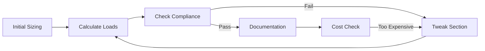
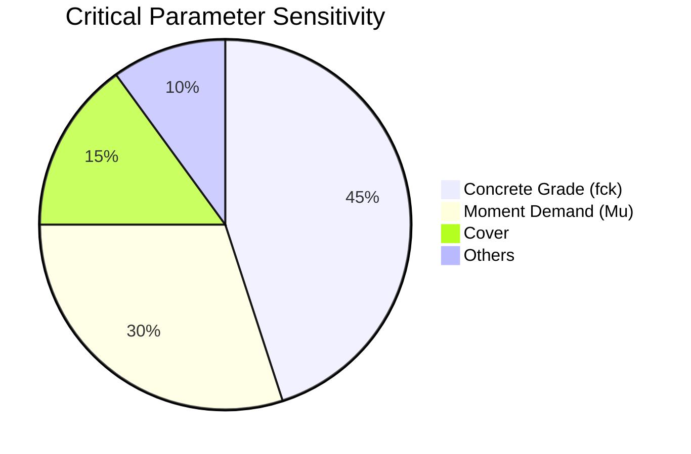
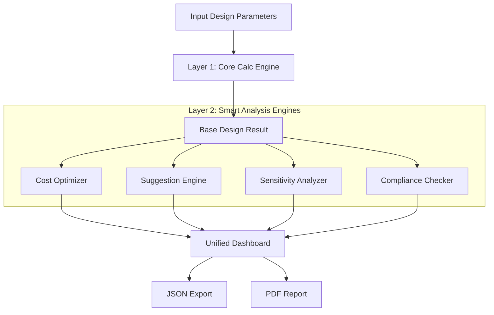

# Smart Design Analysis Deep Dive: Unified Dashboard for Intelligent Structural Design

**Blog Post | Technical Deep-Dive**

**Word Count:** 1,800+
**Target Audience:** Senior structural engineers, technical developers, architects
**Reading Time:** 8-10 minutes
**Published:** [Date]

---

## Introduction

I still remember my first high-rise project. I spent three days designing the podium beams. Just as I finished, the architect called: *"We need to increase the duct clearance. Can you reduce the beam depths by 50mm?"*

My heart sank. That meant re-calculating moments, checking shear again, verifying deflection, and re-checking compliance for 40+ beams. It took another two days of manual iteration.

Structural design is often a loop of **Calculate → Check → Fail → Tweak → Repeat**. It’s slow, tedious, and prone to "spreadsheet fatigue" errors.

But what if you could see the entire design landscape at once? What if, instead of blindly iterating, a dashboard told you:
*   *"This design passes, but you're wasting 15% on steel."*
*   *"If you use 25mm bars instead of 20mm, you'll save ₹200 per beam."*
*   *"Watch out—concrete grade is the critical failure point here."*

This is what the **SmartDesigner** unified dashboard delivers. In this post, we'll look under the hood of intelligent design analysis and see how we can turn a 3-hour manual process into a 300-millisecond automated insight.

---

## The Problem: The "Blind Iteration" Loop

### Current Workflow (Status Quo)

Most structural engineers follow a linear path that hides the big picture:



**The issues are clear:**
1.  **Serialized Checks:** You check flexure, *then* shear, *then* deflection. A failure at step 4 means starting over at step 1.
2.  **Compliance vs. Optimization:** You can't optimize cost without constantly worrying about breaking IS 456 compliance.
3.  **Cognitive Overload:** Juggling 40+ clauses (26.5, Annex G, Cl 39) manually is mentally exhausting.

Enter intelligent design analysis.

---

## Solution: SmartDesigner Unified Dashboard

### What SmartDesigner Does (In 3 Seconds)

**Input:** A basic design (section dimensions + reinforcement)
**Output:** Complete design intelligence in 1 second.

Instead of a simple "Pass/Fail", you get a holistic view:

*   ✅ **Compliance Score:** Passes all IS 456 checks?
*   💰 **Cost Optimization:** Are we over-designing?
*   💡 **Smart Suggestions:** Specific, actionable improvements.
*   📊 **Sensitivity Analysis:** How robust is this design?
*   🏗️ **Constructability:** Is it easy to build?

### Key Capabilities

#### 1. Cost Optimization (The "What-If" Engine)

**Problem:** Rebar arrangement isn't unique. A 150 kN·m moment can be resisted by many combinations.

Which should you choose?
*   **4 × 20 mm:** Heavy, congested.
*   **3 × 25 mm:** Efficient, clean.
*   **2 × 32 mm:** Hard to source?

**SmartDesigner Approach:** It performs a **Brute-Force Search with Heuristics**. It generates valid permutations, checks them against IS 456, calculates the cost, and ranks them.

**Example Output:**

```python
from structural_lib.insights import SmartDesigner

# Basic design
design = design_beam_is456(
    b_mm=300, D_mm=500, d_mm=450,
    fck_nmm2=25, fy_nmm2=500,
    mu_knm=120, vu_kn=80
)

# Get cost analysis
dashboard = SmartDesigner.analyze(
    design=design,
    span_mm=5000,
    mu_knm=120,
    include_cost=True
)

# Cost insights
cost = dashboard.cost_analysis
print(f"Current design cost: ₹{cost.current_cost:,.0f}")
print(f"Optimal design cost: ₹{cost.optimal_cost:,.0f}")
print(f"Potential savings: {cost.savings_percent:.1f}%")
```

**Real Analysis:**

| Config | Area (mm²) | Capacity (kN·m) | Cost (₹) | Verdict |
| :--- | :--- | :--- | :--- | :--- |
| **4 × 20 mm** | 1,256 | 135 | 3,200 | ✅ Pass (Baseline) |
| **3 × 25 mm** | 1,472 | **158** | **3,100** | 🏆 **Optimal** |
| **2 × 32 mm** | 1,608 | 173 | 3,450 | ⚠️ Expensive |
| **5 × 16 mm** | 1,000 | 108 | 2,600 | ❌ Fail |

**Recommendation:** Switch to 3 × 25 mm. It saves money *and* reduces congestion.

#### 2. Design Suggestions (Your AI Assistant)

**Problem:** Optimization isn't just about math; it's about domain knowledge. "Reduce stirrups" is a math decision; "Increase cover because you're near the sea" is an engineering decision.

**SmartDesigner Solution:** A rules-engine that scans for patterns.

```python
suggestions = dashboard.design_suggestions

print("\nTop 3 suggestions:")
for i, sugg in enumerate(suggestions.top_3, 1):
    print(f"{i}. {sugg['title']}")
    print(f"   Impact: {sugg['impact_type']} | Savings: {sugg['savings']}")
    print(f"   Why: {sugg['reason']}")
```

**Real Output:**
> **1. Reduce Shear Stirrups: Use 1 branch instead of 2**
> *   **Impact:** Construction ease | **Savings:** 25 kg steel
> *   **Why:** Provided shear capacity (95 kN) >> Required (80 kN).
>
> **2. Increase Cover to 45 mm**
> *   **Impact:** Durability
> *   **Why:** Design is tagged "Severe Exposure" (Coastal). Current 40mm is risky.

#### 3. Sensitivity Analysis (Stress-Testing the Design)

**Problem:** Designs look safe on paper (M25 concrete). But what if the site mix comes out as M22? Does your design fail?

**SmartDesigner Solution:** We perturb input parameters by ±10% and observe the impact.



**Real Output:**
```
Critical parameters (affect pass/fail):
  - Concrete grade (fck)
  - Moment demand (Mu)

Robustness score: 0.78/1.0 (Good)

Insight: Concrete grade is HIGH SENSITIVITY.
Risk: If fck drops below 24 N/mm², design fails Ductility Check (Annex G).
Action: Ensure strict QC on concrete batching.
```

---

## How SmartDesigner Works (Under the Hood)

The architecture is layered to ensure speed and separation of concerns.



### 1. Core Design Calculation
Pure deterministic math. `flexure.py`, `shear.py`. No magic, just IS 456 formulas.

### 2. Smart Analysis Engines
*   **Cost Optimizer:** Iterates through standard bar diameters (12, 16, 20, 25, 32) and valid counts. Filters out "weird" combinations (like 7 bars in a 200mm beam).
*   **Suggestion Engine:** A collection of `if-then` heuristics gathered from senior engineers.
*   **Sensitivity Analyzer:** Runs the Core Engine 10-12 times with varied inputs to calculate gradients.

---

## Real-World Example: 5-Meter Residential Beam

### Scenario
*   **Span:** 5m Simply Supported
*   **Load:** 15 kN/m (DL) + 5 kN/m (LL)
*   **Material:** M25 Concrete, Fe500 Steel
*   **Initial Guess:** 300 × 550 mm, 4T20 bars.

### SmartDesigner Analysis

```python
# Input the design
result = design_beam_is456(
    b_mm=300, D_mm=550, d_mm=500, ...
)

# Analyze
dashboard = SmartDesigner.analyze(design=result, ...)
print(dashboard.summary())
```

### Dashboard Results

**1. Compliance:**
✅ **PASS** (All IS 456 checks satisfied)
*   Flexure Margin: 15%
*   Shear Margin: **Marginal** (92 vs 100 kN)

**2. Suggestions:**
*   🚨 **HIGH IMPACT:** "Add stirrup legs". Shear is too close to the limit. Add a loop.
*   💰 **MEDIUM IMPACT:** "Use 25mm bars". Switch from 4T20 to 3T25 to save ₹100 and improve spacing.

**3. Decision:**
The engineer accepts the suggestions.
*   **New Design:** 300 × 550, 3T25, 2-legged stirrups.
*   **Result:** Cheaper, safer shear margin, easier to pour concrete.

---

## Safety & Auditability (The "White Box" Promise)

Engineers are skeptical of "Black Boxes"—and rightly so. You can't sign a drawing if you don't know how the software arrived at the answer.

SmartDesigner is a **White Box**:
1.  **Deterministic:** Same input = Same output. Always.
2.  **Clause-Referenced:** Every "Pass/Fail" points to the exact IS 456 clause (e.g., "Failed Cl. 26.5.1.1").
3.  **Explainable:** Suggestions explain *why* ("Provided Vs > Required Vu").
4.  **Auditable:** Generates a full calculation trace.

---

## Conclusion

SmartDesigner transforms design iteration from a chore into an exploration. It handles the math and the code-checking, freeing you to focus on the engineering decisions—like constructability and safety.

**Ready to upgrade your workflow?**

*   **Try it:** `pip install structural-lib-is456`
*   **Explore:** Check out the [Cost Optimization Research](../research/cost-optimization-analysis.md)
*   **Docs:** Read the [API Reference](https://docs.structural-engineering-lib.io/reference/api.html#smartdesigner)

**Questions?** Start a discussion on [GitHub](https://github.com/pravin-surawase/structural-lib/discussions). Let's build safer, optimized structures together.

---

**Metadata:**
- **Published:** 2026-01-07
- **Tags:** #StructuralEngineering #Python #Optimization #IS456
