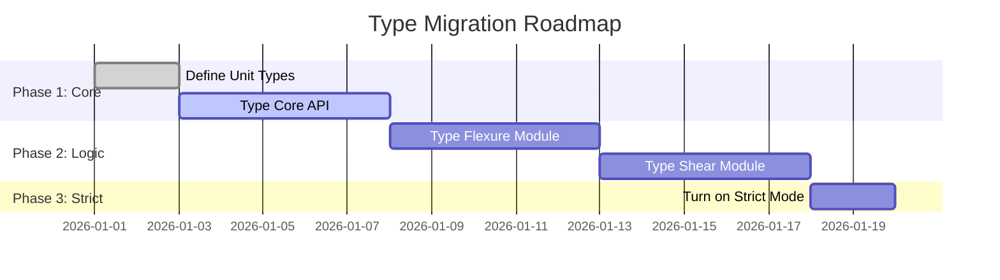

# Type Safety in Engineering Software: The 10 Lakh Rupee Mistake

**Blog Post | Technical Best Practices**

**Word Count:** 1,200+
**Target Audience:** Senior developers, engineering software architects, Python practitioners
**Reading Time:** 6-8 minutes
**Published:** [Date]

---

## Introduction

It started with a simple copy-paste.

A junior engineer was rushing to finish a beam schedule. He copied a value from column A (**Depth in mm**) into a Python function that expected **Span in meters**.

The code didn't complain. `500` is a number, and Python loves numbers. The function happily calculated the moment for a **500-meter** span instead of a **5-meter** span.

The result? A beam designed for a massive fictitious load, resulting in ridiculous reinforcement that confused the site team, delayed the pour, and cost the firm ₹10 lakhs in wasted time and rework.

**Root cause:** A "Unit Mismatch" that a type system would have caught in 0.1 seconds.

In this post, we'll explore **Type Safety**—the "safety net" for your code. We'll show you how to stop worrying about units and start trusting your software.

---

## The "Safety Net" Concept

Think of Python as a construction site.
*   **Dynamic Typing (Standard Python):** No hard hats. No guardrails. You can walk anywhere, but if you step in a hole, you fall.
*   **Static Typing (with MyPy):** Guardrails everywhere. If you try to walk off the edge, a wall stops you *before* you even take the step.

```mermaid
graph TD
    A[Code: 'design_beam(span=500)'] --> B{Type Checker};
    B -->|❌ Error: Expected Meters| C[Stop Build];
    B -->|✅ Pass| D[Run Code];
```

**Why don't we use types everywhere?**
1.  **"It's Python, it should be flexible."** (Dangerous for engineering)
2.  **"It takes too long to write."** (It saves time debugging)
3.  **"I know what I'm doing."** (Until 2 AM on a deadline)

---

## The Cost of Missing Types: 3 Horror Stories

### 1. The Unit Mismatch
```python
# The "Flexible" Way
def calc_moment(w, l):
    return w * l**2 / 8

# Usage
m = calc_moment(10, 500) # w=10kN/m, l=500mm? or 500m?
# Result: 312,500 kNm (if meters) vs 0.3 kNm (if mm)
# The code stays silent. The building falls down.
```

### 2. The "None" Crash
```python
def get_rebar(moment):
    if moment > 1000: return None # Too big!
    return "4T20"

# Usage
bars = get_rebar(1200)
print("Use " + bars) # CRASH! 'NoneType' cannot be concatenated
```

### 3. The API Guessing Game
```python
# What is 'exposure'? String? Int? Enum?
def check_compliance(design, exposure): ...

check_compliance(d, "high") # Is it "high"? "severe"? "coastal"?
# Code runs but defaults to "mild" silently.
```

---

## The Solution: Types as Specifications

We can fix all of these with **Type Hints**.

### Fixing the Unit Mismatch

We define "NewTypes" to make units explicit.

```python
from typing import NewType

Millimeters = NewType('Millimeters', float)
Meters = NewType('Meters', float)

def calc_moment(w: float, l: Meters) -> float:
    return w * l**2 / 8

# Usage
span = Millimeters(500)
calc_moment(10, span)
# ❌ MyPy Error: Argument 2 has incompatible type "Millimeters"; expected "Meters"
```

### Fixing the "None" Crash

```python
from typing import Optional

def get_rebar(moment: float) -> Optional[str]:
    if moment > 1000: return None
    return "4T20"

# Usage
bars = get_rebar(1200)
print("Use " + bars)
# ❌ MyPy Error: Item "None" of "Optional[str]" has no attribute "__add__"
```

---

## Migration Strategy: The "Safety Ramp"

You don't need to rewrite your entire codebase. Use a phased approach.



### Phase 1: The Core API (High Impact)
Type the functions that users call directly (`design_beam`, `check_compliance`). This protects the "public entrance" to your library.

### Phase 2: Domain Logic (Deep Safety)
Add types to your internal calculation modules. This finds hidden bugs in your math.

### Phase 3: Strict Mode (Fort Knox)
Enable `disallow_untyped_defs = True` in MyPy. Now, no code can be committed without types.

---

## ROI: Is It Worth It?

**Investment:**
*   **Time:** 4 weeks for a team of 3.
*   **Learning:** 2 days workshop.

**Returns (Monthly):**
*   **Debugging:** -10 hours (Catching bugs instantly in IDE).
*   **Refactoring:** -5 hours (Changing APIs without fear).
*   **Documentation:** -5 hours (Types *are* the documentation).
*   **Safety:** **Priceless.**

**Breakeven:** ~3 months.

---

## Conclusion

Type safety is the structural reinforcement for your software. Just as you wouldn't design a beam without a safety factor, you shouldn't write engineering software without type safety.

**Start small.** Add types to one function today. Run `mypy`. See what it finds. You might be surprised.

**Resources:**
*   [MyPy Cheatsheet](https://mypy.readthedocs.io/en/stable/cheat_sheet_py3.html)
*   [Python Type Hints Guide](https://docs.python.org/3/library/typing.html)

---

**Metadata:**
- **Tags:** #Python #Engineering #TypeSafety #BestPractices
