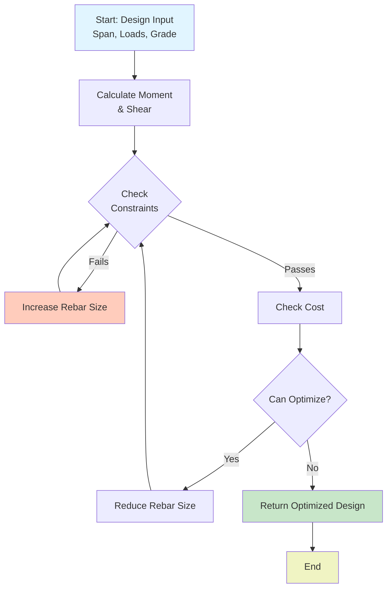

# Blog Writing Guidelines for Structural Engineering Library

**Style Guide & Technical Writing Standards**

**Version:** 1.0
**Last Updated:** 2026-01-07
**Audience:** Content creators, technical writers, guest contributors

---

## Quick Reference

### Tone & Voice (TL;DR)

| Audience | Tone | Example |
|----------|------|---------|
| **Engineers** | Professional, practical, specific | "IS 456 Cl. 26.5 requires..." |
| **Developers** | Technical, code-focused, architectural | "Our API design follows the builder pattern..." |
| **Academics** | Research-grounded, methodical, detailed | "Our approach extends Timoshenko's theory by..." |
| **All** | Clear, jargon-explained, helpful | Assume readers are smart but busy |

### Structure Template

```
1. Introduction (Attention + Value)
2. Problem/Context (Why should I care?)
3. Solution/Explanation (Here's how/why)
4. Code/Example (Show me)
5. Results/Takeaway (So what?)
6. Next Steps (Where do I go from here?)
```

### Quick Checklist Before Publishing

- [ ] Headline is clear, specific, benefit-focused
- [ ] Opening paragraph answers: What + Why + How (briefly)
- [ ] Code examples are tested and run without errors
- [ ] Key terms defined on first use
- [ ] Conclusion reinforces main learning
- [ ] Related resources linked (at least 3)
- [ ] No typos or grammatical errors
- [ ] Read aloud once (catches awkward phrasing)

---

## Part 1: Writing Fundamentals

### Headline Writing

**Formula: [Benefit/Problem] [Topic]: [Specific Outcome/Angle]**

✅ **Good Headlines:**
- "Reduce Design Time by 40%: Automating IS 456 Compliance"
- "Understanding Rebar Optimization: Algorithm Deep-Dive"
- "From Manual to Automated: One Firm's Digital Transformation"
- "Type Safety in Python: Preventing Unit Errors in Structural Code"

❌ **Poor Headlines:**
- "Blog Post About Design" (too vague)
- "Technical Deep-Dive" (no hook)
- "Information" (meaningless)
- "Part 1" (no context)

**Headlines by Post Type:**

| Type | Formula | Example |
|------|---------|---------|
| **Tutorial** | "[Action] [Topic]: [Outcome]" | "Design Your First Beam: Step-by-Step Guide" |
| **Deep-Dive** | "[Concept]: Deep Dive / How It Works" | "Rebar Optimization: Algorithm Deep Dive" |
| **Case Study** | "Case Study: [Company] [Challenge] → [Result]" | "Case Study: 30-Story Building Cost Reduced by 30%" |
| **Insight** | "[Trend/Question] in [Domain]: [Answer]" | "The State of Structural Engineering Software in 2026" |

**Headline Quality Checklist:**
- [ ] Benefit or question (makes reader want to know)
- [ ] Specific and concrete (not vague)
- [ ] 60 characters or less (for SEO titles)
- [ ] Numbers/power words when possible ("how to," "guide," "5 ways," etc.)
- [ ] Avoids clickbait (promises value you deliver)

### Opening Paragraphs

**Goal:** Hook the reader and promise value in 2-3 sentences

**Structure:**
1. **Hook:** Open with question, problem, or stat
2. **Context:** Who should read this? Why now?
3. **Promise:** What will the reader learn/achieve?

✅ **Example (Good):**
> "Manual IS 456 compliance checking takes your team 20+ hours per project—and error-prone. In this guide, we'll show you how to automate compliance checks and reduce that time to under 1 hour. You'll learn to build custom validators that catch issues your team might miss."

❌ **Example (Poor):**
> "This blog post is about compliance checking. We'll discuss how to check compliance. Compliance is important."

**Type-Specific Opening Approaches:**

**Tutorial Opening:**
- "By the end of this post, you'll be able to [concrete outcome]."
- "Most engineers spend [X hours] on [task]. We'll show you how to do it in [Y minutes]."

**Deep-Dive Opening:**
- "You've probably heard about [concept] but weren't sure how it actually works."
- "Here's what most people get wrong about [concept]..."

**Case Study Opening:**
- "When [Company] faced [problem], they had [two approaches]. Here's what happened when they chose [solution]..."

**Insight Opening:**
- "Trends in [industry] suggest [observation]. What does this mean for [audience]?"

### Sentence Structure & Clarity

**General Rules:**

1. **Favor Short Sentences** (15-20 words average)
   - ❌ Too long: "While considering the various aspects of structural design that might be relevant in the context of IS 456 compliance checking, it becomes increasingly important to understand how modern computational tools can assist engineers in ensuring adherence to regulatory standards."
   - ✅ Better: "IS 456 compliance is complex. Modern tools help. Our library automates the checking process."

2. **Use Active Voice** (90%+ of sentences)
   - ❌ Passive: "The optimization was performed by the algorithm."
   - ✅ Active: "The algorithm optimizes the design."

3. **One Idea Per Sentence**
   - ❌ Too many ideas: "Because the standard is old and the rules are complex and many firms struggle with compliance, we built automation."
   - ✅ Clearer: "The standard is 20+ years old. Rules are complex. Many firms struggle. We built automation."

4. **Specific Over Vague**
   - ❌ Vague: "This approach is pretty fast and saves time."
   - ✅ Specific: "This approach takes 2 seconds per beam (vs. 3 minutes manually)—saving 1.5 hours per 30-beam project."

**Common Patterns to Avoid:**

| Problem | Example | Fix |
|---------|---------|-----|
| **Overuse of "very"** | "This is very important" | "This prevents costly rebar errors" |
| **Weak verbs** | "The code performs optimization" | "The code optimizes rebar placement" |
| **Hedge words** | "arguably," "perhaps," "may" (unless noting uncertainty) | Remove unless genuinely uncertain |
| **Jargon without explanation** | "Using interpolation for LUT lookups" | "Using a lookup table (faster than calculating each time)" |
| **Passive constructions** | "It is recommended that..." | "We recommend..." |

### Defining Technical Terms

**Rule: Define once on first use, then use freely.**

✅ **Good Definition:**
> "**Ductility** (the ability to bend without breaking) is crucial in seismic design. In IS 456, Clause 39 specifies minimum ductility ratios."

❌ **Poor (too vague):**
> "Ductility requirements must be met."

❌ **Poor (too wordy):**
> "Ductility, which is a property of materials that describes their ability to undergo significant plastic deformation without rupturing..."

**Definition Template:**
- **[Term]** ([clear, concise explanation]) [why it matters].

**Tier System for Different Audiences:**

| Term | For Engineers | For Developers | For Academics |
|------|---------------|----------------|---------------|
| **Beam** | "A horizontal structural member supporting loads" | "A structural element defined by length, cross-section, and material properties" | "A 1D element modeled using Euler-Bernoulli theory" |
| **Shear Reinforcement** | "Steel bars placed at an angle to prevent shear failure" | "Additional rebar calculated by the `shear.py` module" | "Truss-analogy inspired transverse reinforcement" |

---

## Part 2: Code Examples

### Code Example Quality Standards

**Before Publishing Any Code Example:**

1. **Test It**
   - Run the code exactly as written
   - Verify it produces expected output
   - Test on Python 3.8+ (minimum supported version)

2. **Make It Minimal**
   - Remove unrelated code
   - Simplify variable names if needed for clarity
   - Show just enough to illustrate the concept

3. **Add Comments**
   - Comments explain **why**, not what
   - Avoid "foo = foo + 1  # increment foo"
   - Explain design decisions and gotchas

4. **Provide Context**
   - Show imports needed
   - Explain what the output should be
   - Show expected output if possible

### Code Example Templates

**Template 1: Simple Usage Example**

```python
from structural_lib import BeamDesigner, Load

# Create a simply supported beam
beam = BeamDesigner(
    span=5000,          # 5-meter span (mm)
    grade="M20",        # Concrete grade
    steel_grade="Fe500" # Steel grade (IS 456)
)

# Add loads: Uniform Dead Load + Live Load
beam.add_load(Load(magnitude=10, load_type="dead"))  # kN/m
beam.add_load(Load(magnitude=5, load_type="live"))   # kN/m

# Design the beam
result = beam.design()
print(f"Main Rebar: {result.main_rebar}")
# Output: Main Rebar: 4 × 20 mm
```

**Template 2: Before/After Comparison**

```python
# ❌ BEFORE: Manual calculation
# Moment at mid-span: M = wL²/8
# Live load: 5 kN/m, Span: 5000 mm
moment_kn_m = (5 * 5000**2 / 1000000) / 8
# M = 15.625 kN·m (manual, error-prone)

# ✅ AFTER: Using the library
from structural_lib import BeamDesigner, Load

beam = BeamDesigner(span=5000, grade="M20")
beam.add_load(Load(magnitude=5, load_type="live"))
result = beam.analyze()
print(f"Maximum Moment: {result.max_moment} kN·m")
# Output: Maximum Moment: 15.625 kN·m (automated, no errors)
```

**Template 3: Progressive Complexity**

```python
# STEP 1: Simple case
from structural_lib import BeamDesigner
beam = BeamDesigner(span=5000, grade="M20")
result = beam.design()

# STEP 2: Add loads
beam.add_load(10, load_type="dead")  # 10 kN/m
result = beam.design()

# STEP 3: Consider multiple load cases
beam.add_load(5, load_type="live")   # 5 kN/m
result = beam.design()

# STEP 4: Check specific criteria
print(f"Passes IS 456 Cl. 26.5: {result.is_compliant}")
```

### Code Block Formatting

**Language-Specific Syntax Highlighting:**

```python
# Python examples use python block
from structural_lib import BeamDesigner

def analyze_beam(span, loads):
    """Analyze beam with given spans and loads."""
    beam = BeamDesigner(span)
    for load in loads:
        beam.add_load(load)
    return beam.design()
```

```json
{
  "beam": {
    "span": 5000,
    "grade": "M20",
    "loads": [10, 5]
  }
}
```

```bash
# Bash/CLI examples use bash block
$ pip install structural-engineering-lib
$ python -c "from structural_lib import BeamDesigner; print('Installed!')"
```

**Code Block Best Practices:**
- Always specify language (python, bash, json, etc.)
- Line length: 80 characters max (readable on mobile)
- Whitespace: Use 4 spaces (Python standard)
- Comments: Use # for Python, -- for SQL, // for pseudocode

### Showing Output

**Always show expected output:**

```python
beam = BeamDesigner(span=5000, grade="M20")
result = beam.design()
print(result)
```

```
BeamDesignResult(
    main_rebar='4 × 20 mm',
    shear_rebar='8 mm @ 150 mm',
    cover=40,
    is_compliant=True,
    moment_capacity=32.5  # kN·m
)
```

**Or show step-by-step output:**

```python
# First load case: Dead load
beam.add_load(Load(10, "dead"))
result = beam.design()
print(f"Rebar needed: {result.main_rebar}")
# Output: Rebar needed: 4 × 16 mm

# Adding live load (updates design)
beam.add_load(Load(5, "live"))
result = beam.design()
print(f"Rebar needed: {result.main_rebar}")
# Output: Rebar needed: 4 × 20 mm  (increased)
```

### Linking to Code Examples

**Always provide full code:**

1. **Inline in post:** For short examples (< 50 lines)
2. **GitHub Gist:** For complete working examples
3. **Repository examples/:** For ongoing examples
4. **Jupyter Notebook:** For tutorial sequences

**Example linking pattern:**

> "Here's the complete code (also [available on GitHub](link)):"

```python
# Code block here
```

---

## Part 3: Visuals & Diagrams

### When to Use Visuals

| Content | Visual Type | Recommended |
|---------|-------------|-------------|
| **Algorithm workflow** | Flowchart (Mermaid) | ✅ Highly |
| **System architecture** | Architecture diagram | ✅ Highly |
| **Before/after comparison** | Side-by-side screenshots | ✅ Highly |
| **Performance benchmark** | Bar/line chart | ✅ For numbers |
| **Long process explanation** | Step-by-step diagram | ✅ Moderately |
| **Simple concept** | Icon or simple sketch | ✅ Moderately |
| **Data relationships** | Table | ✅ For structured data |
| **Timeline** | Gantt chart or timeline | ✅ For sequences |

### Flowchart Standards (Mermaid)

**Example: Rebar Optimization Flow**



**Mermaid Best Practices:**
- Keep paths clear and logical
- Use descriptive node labels
- Color-code results (green = success, red = fail)
- Include start/end nodes
- Limit depth to 4-5 levels

### Architecture Diagram Standards

**Example: Library Architecture**

```
┌─────────────────────────────────────────────┐
│          User Interface Layer               │
│  (CLI, Excel, Jupyter, Web Dashboard)      │
└────────────────────┬────────────────────────┘
                     │
┌────────────────────▼────────────────────────┐
│       Application Layer (API)               │
│  BeamDesigner, Optimizer, Compliance       │
└────────────────────┬────────────────────────┘
                     │
┌────────────────────▼────────────────────────┐
│        Core Calculation Layer               │
│  flexure.py, shear.py, detailing.py        │
└────────────────────┬────────────────────────┘
                     │
┌────────────────────▼────────────────────────┐
│        Data & Utilities Layer               │
│  tables.py, materials.py, constants.py     │
└─────────────────────────────────────────────┘
```

**Architecture Diagram Best Practices:**
- Show clear layer boundaries
- Label data flow direction (arrows)
- Limit to 4-5 layers
- Use consistent box sizes/styling

### Screenshot Standards

**When taking screenshots:**

1. **Use high resolution** (2x for retina displays)
2. **Annotate key points** (arrows, circles, numbers)
3. **Remove sensitive data** (paths, API keys, user info)
4. **Use consistent fonts** (monospace for code, sans-serif for UI)
5. **Add captions** explaining what's shown
6. **Optimize file size** (use PNG for diagrams, WebP for photos)

**Screenshot Example:**

> **Figure 3:** Design output showing optimized rebar (highlighted in blue) and IS 456 compliance check results (green checkmark).

### Alt Text Standards

**Rule: Describe image content AND context**

❌ **Poor:** "diagram.png"
✅ **Good:** "Flowchart showing rebar optimization process: start with input loads → calculate moment → check constraints → optimize size → return design"

**Alt Text Template:**
"[Type of image] showing [main content]: [key elements/flow] → [result/endpoint]"

---

## Part 4: Structure & Organization

### Post Structure by Type

**TUTORIAL POST STRUCTURE** (800-1500 words)

```
1. Headline (hook + benefit)
2. Opening (2-3 sentences: problem + what you'll learn)
3. Prerequisites (knowledge, tools, setup)
4. Why This Matters (context, use cases)
5. Step 1: [Action] (explanation + code + output)
6. Step 2: [Action] (build on step 1)
7. Step 3: [Action] (final step to complete goal)
8. Common Issues Q&A (2-3 likely questions)
9. Full Code Example (complete, runnable version)
10. Next Steps (related tutorials, advanced topics)
11. Conclusion (reinforce learning, call-to-action)
```

**DEEP-DIVE POST STRUCTURE** (1500-2500 words)

```
1. Headline (introduce concept clearly)
2. Introduction
   - What is [concept]? (1-2 sentences)
   - Why does it matter? (context, impact)
   - What you'll learn (overview)
3. Theoretical Foundation
   - Mathematical basis (equations, if relevant)
   - Conceptual explanation (in plain English)
   - Visual representation (diagram/flowchart)
4. How It Works in Practice
   - Step-by-step algorithm walkthrough
   - Real-world example (from the library)
   - Performance characteristics
5. Implementation Details
   - Code walkthrough (relevant sections)
   - Design decisions (why this approach?)
   - Trade-offs made (speed vs. accuracy, etc.)
6. Performance Analysis
   - Benchmark results (with actual numbers)
   - Scalability characteristics
   - Optimization tips
7. Common Pitfalls
   - Mistake 1: [description] → Fix: [solution]
   - Mistake 2: [description] → Fix: [solution]
8. Further Reading
   - Academic papers
   - Related blog posts
   - Official documentation
9. Conclusion & Key Takeaways
   - Recap main learning
   - When to use this approach
   - Related topics
```

**CASE STUDY POST STRUCTURE** (1500-2000 words)

```
1. Headline (problem/company/result)
2. Executive Summary (situation → challenge → solution → results)
3. Background
   - About the company/project
   - Initial situation (problems, constraints)
   - Motivation for change
4. The Challenge
   - Specific problems faced
   - Impact quantified (time, cost, quality lost)
   - Why previous approaches failed
5. The Solution
   - How was the library used?
   - Step-by-step implementation
   - Customizations made
6. Technical Details
   - Architecture/workflow diagram
   - Key code or configuration examples
   - Integration points
7. Results & Impact
   - Metrics: Time saved, costs reduced, quality improved
   - Before vs. After comparison (with numbers)
   - Team feedback/testimonials
   - Unexpected benefits
8. Lessons Learned
   - What went well (best practices)
   - Challenges encountered (and how they solved them)
   - Advice for others
9. Conclusion
   - Key takeaway (1-liner)
   - Scalability to other projects
   - Link to resources
```

**INSIGHT/TREND POST STRUCTURE** (800-1200 words)

```
1. Headline (question or trend)
2. Opening (stat, observation, or question)
3. Context & Background (why this matters, current state)
4. Analysis Point 1 (evidence, examples, numbers)
5. Analysis Point 2 (different angle or source)
6. Implications (so what? what does this mean?)
7. Actionable Insights (what should [audience] do?)
8. Counter-Arguments (acknowledge the other side)
9. Prediction/Future (where is this headed?)
10. Conclusion (tie it together)
11. Your Take (invite discussion/feedback)
```

### Transitions & Flow

**Good transitions guide readers through your logic:**

❌ **Poor (abrupt jump):**
> "Rebar optimization is important. Here's how cost reduction works."

✅ **Good (smooth flow):**
> "Rebar optimization is important for cost reduction. Our optimization algorithm works by considering multiple constraints—here's how cost reduction fits into that process."

**Common Transition Patterns:**

| Situation | Transition |
|-----------|-----------|
| **Adding detail** | "Here's what that means in practice..." |
| **New topic** | "Now let's explore..." |
| **Back to main** | "This brings us back to..." |
| **Counter-point** | "However..." / "On the other hand..." |
| **Concluding** | "In summary..." / "The key takeaway..." |

### Paragraph Length

**Rule: Vary paragraph length, avoid dense blocks**

- **Opening paragraphs:** 2-3 sentences (hook)
- **Explanation paragraphs:** 3-4 sentences (digestible chunks)
- **Evidence paragraphs:** 4-5 sentences (supporting detail)
- **Maximum:** Never more than 5-6 sentences without a break

**Example of good variety:**

> Short hook. This matters because [reason].
>
> Longer explanation goes here with more context about why this specific point is important to understand. Additional detail supports the concept.
>
> Short conclusion.

---

## Part 5: SEO & Meta Information

### Meta Description (150-160 characters)

**Pattern:** [Problem] → [Solution] | [Benefit]

✅ **Good examples:**
- "Learn to automate IS 456 compliance checking and save 20+ hours per project. Step-by-step guide using structural_lib Python library."
- "Understanding how our rebar optimization algorithm works, from algorithm walkthrough to real-world performance benchmarks."

❌ **Poor examples:**
- "Blog post about structural design"
- "Read this interesting article about engineering"

### Tags & Categories

**Platform-Specific Tags:**

**Dev.to Tags (max 4):**
- `#python` (if code-heavy)
- `#engineering` (always relevant)
- `#tutorial` or `#beginners` (for tutorials)
- `#opensource` (if about the library)
- Topic tags: `#structuraldesign`, `#is456`, etc.

**Medium Tags (max 5):**
- `Python` (if relevant)
- `Software Engineering`
- `Structural Engineering`
- `Data Science` (if analysis)
- Topic-specific

**LinkedIn Tags:**
- `#StructuralEngineering`
- `#PythonProgramming`
- `#SoftwareDevelopment`
- `#OpenSource`

### Internal Linking

**Strategy: Link 3-5 related posts per article**

**Best Practices:**
1. **Anchor text is descriptive:** "our API design guide" (not "click here")
2. **Links appear naturally** in context (not forced list at end)
3. **Mix to different types:** Some tutorials, some deep-dives
4. **Related posts section:** At the end (organized by topic)

**Example internal linking:**

> "This connects to our earlier discussion of type safety (see 'Type Safety in Python: Preventing Unit Errors'). For a deeper dive into performance optimization, check out 'Performance Engineering for Structural Calculations.'"

---

## Part 6: Common Mistakes & Fixes

### Language Mistakes

| Issue | Example | Fix |
|-------|---------|-----|
| **Unclear pronoun** | "The beam and column were designed. It was strong." | "The beam and column were designed. The beam was strong." |
| **Inconsistent terminology** | "We use rebar/reinforcement/steel bars interchangeably" | "Define once, use consistently throughout" |
| **Vague reference** | "This is important." (What is?) | "Type safety is important because..." |
| **Comma splice** | "The test passed, it verified correctness." | "The test passed, and it verified correctness." / "The test passed, verifying correctness." |

### Technical Mistakes

| Issue | Example | Fix |
|-------|---------|-----|
| **Untested code** | Copy code from docs without running | Test every code example exactly as written |
| **Wrong output** | Code shown doesn't produce the output claimed | Actually run the code and show real output |
| **Missing imports** | Code assumes `BeamDesigner` is imported | Show `from structural_lib import BeamDesigner` |
| **Outdated API** | Example uses old function signature | Test against current library version |

### Organization Mistakes

| Issue | Symptom | Fix |
|-------|---------|-----|
| **Missing intro** | Reader doesn't know what post is about | Start with clear problem/goal statement |
| **Burying the lead** | Key point is 1000 words in | Highlight key idea in opening 2-3 sentences |
| **No structure** | Wall of text, hard to scan | Use headers, short paragraphs, lists |
| **Abrupt ending** | Post just stops | Include conclusion that reinforces learning + next steps |

### Writing Mistakes

| Issue | Example | Fix |
|-------|---------|-----|
| **Over-explaining obvious** | "Let me explain what Python is..." (for dev audience) | Skip basics for your specific audience |
| **Jargon soup** | "We leveraged paradigmatic approaches to optimize KPIs" | Use concrete, simple language |
| **Too many qualifiers** | "It's arguably perhaps somewhat important" | Commit: "It's important" or explain uncertainty |
| **Passive voice overuse** | "It should be considered that..." | "Consider that..." or "You should..." |

---

## Part 7: Publishing Checklist

**Before hitting publish, verify ALL items:**

### Content Quality
- [ ] Headline is clear, specific, benefit-focused
- [ ] Opening 2-3 sentences answer: What + Why + For Whom
- [ ] Concept defined on first use (no unexplained jargon)
- [ ] Main ideas supported by examples or evidence
- [ ] Code examples tested and produce correct output
- [ ] Conclusion reinforces learning or calls to action
- [ ] Post length appropriate for type (tutorial 800-1500, deep-dive 1500-2500, etc.)

### Structure & Organization
- [ ] Headers divide post into 4-7 logical sections
- [ ] Paragraphs are 2-6 sentences (good variety)
- [ ] Transitions smooth between sections
- [ ] Related posts linked (3-5 internal links)
- [ ] Visual aids included (diagrams, screenshots, code blocks)

### Technical Accuracy
- [ ] All code examples tested on Python 3.8+
- [ ] Output examples are real (not fake)
- [ ] Library version referenced (if specific)
- [ ] API calls match current documentation
- [ ] No deprecation warnings in code examples
- [ ] All links to external resources work

### Grammar & Style
- [ ] No typos or spelling errors (spell-check + read-aloud)
- [ ] Consistent terminology throughout
- [ ] Subject-verb agreement correct
- [ ] Active voice in 90%+ of sentences
- [ ] Sentence length varies (not all short, not all long)
- [ ] No unnecessary qualifiers ("very," "really," "arguably")

### SEO & Metadata
- [ ] Title is 60 characters or less
- [ ] Meta description is 150-160 characters
- [ ] Main keyword appears in title and first paragraph
- [ ] Tags are relevant and consistent (3-5 per platform)
- [ ] Image alt text is descriptive
- [ ] Internal links use descriptive anchor text

### Platform-Specific
- [ ] **Blog:** Canonical URL set, featured image selected
- [ ] **Dev.to:** Tags added, code syntax highlighted correctly
- [ ] **Medium:** Pulled from original blog or formatted properly
- [ ] **LinkedIn:** Compelling excerpt + link to full post

### Accessibility
- [ ] All images have descriptive alt text
- [ ] Color-coding explained (not just visual)
- [ ] Diagrams are understandable without color
- [ ] Code blocks have language specified
- [ ] Links are descriptive (not "click here")

---

## Style Reference Quick Reference

### Formatting Guide

| Element | Format | Example |
|---------|--------|---------|
| **Code/Commands** | Monospace | `beam.design()` |
| **File paths** | Monospace | `Python/structural_lib/flexure.py` |
| **Standards** | All caps | "IS 456 Clause 26.5" |
| **Emphasis** | *Italics* | "This is *important* for safety" |
| **Strong** | **Bold** | "**Never** skip IS 456 compliance" |
| **Literal values** | Monospace | "Set `grade="M20"` for concrete grade" |
| **UI buttons** | **Bold** | "Click **Save Design** button" |
| **Keyboard keys** | kbd | Press `Ctrl + S` |

### Numbers & Measurement Rules

**Format consistently:**
- **Units:** Use standard abbreviations: `mm`, `m`, `kN`, `N/mm²`, `kN·m`
- **Ranges:** "5-10 mm" or "5 to 10 mm" (consistent throughout)
- **Hundreds:** 5,000 mm (not 5000 mm for readability)
- **Decimals:** 15.6 (not 15.60 unless significant)
- **Percentages:** 30% (not 30 % with space)
- **Times:** 2-3 hours (not 2-3 hrs or 2-3 h)

### Abbreviations & Acronyms

**Define on first use, then abbreviate:**
- ❌ "The DSL makes code more readable" (undefined)
- ✅ "The Domain Specific Language (DSL) makes code more readable. Our DSL..."

**Common abbreviations (no definition needed):**
- API, URL, SQL, JSON, CSV, HTML, PDF
- IS 456, ACI 318, Eurocode

---

## Review & Feedback Process

### Self-Review Steps

1. **Read for clarity** (first pass)
   - Do opening 2 sentences answer what + why?
   - Can someone unfamiliar with the topic follow it?

2. **Read aloud** (second pass)
   - Does it sound natural?
   - Catch awkward phrasing, repetition

3. **Check structure** (third pass)
   - Does each section lead to the next?
   - Could any section be clearer?

4. **Test code** (fourth pass)
   - Run every code example
   - Verify output shown is real

5. **Final polish** (fifth pass)
   - Check spelling, grammar, formatting
   - Verify links work
   - Confirm metadata is filled in

### Peer Review Questions (If Available)

Ask reviewers:
1. "What's the main takeaway?" (reveals clarity)
2. "Was there anything confusing?" (reveals gaps)
3. "Did the code examples work for you?" (reveals technical issues)
4. "Would you recommend this post to a colleague? Why/why not?" (overall assessment)

---

## Conclusion

**Effective blog posts follow structure, maintain clarity, and deliver on their promise.**

Key principles:
- ✅ **Clear headlines** that promise value
- ✅ **Strong openings** that hook the reader
- ✅ **Well-organized structure** that guides readers
- ✅ **Tested code** that actually works
- ✅ **Relevant visuals** that clarify complex ideas
- ✅ **Smooth transitions** that connect ideas
- ✅ **Strong conclusions** that reinforce learning

**Result:** Readers finish your posts with practical knowledge they can apply immediately.

---

**Guidelines Version:** 1.0
**Last Updated:** 2026-01-07
**Feedback/Improvements:** Suggestions welcome via GitHub Issues
