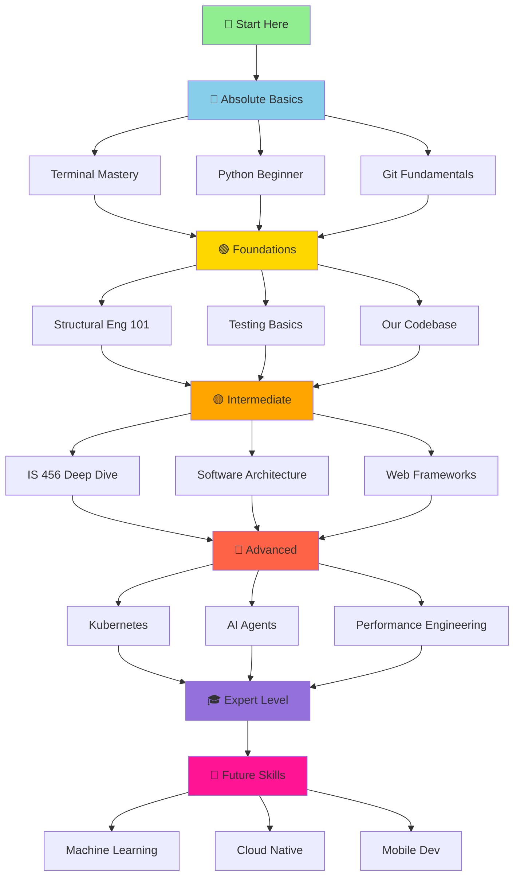

# Background Agent 5 Tasks (EDUCATOR) - COMPREHENSIVE CURRICULUM

**Agent Role:** EDUCATOR / LEARNING SPECIALIST
**Primary Focus:** Create complete beginner-to-expert learning curriculum with extensive visuals, examples, and progressive knowledge building
**Status:** Active
**Last Updated:** 2026-01-08

---

## Mission Statement

Create the **most comprehensive structural engineering software development learning resource** covering:
- **Absolute Basics** → Terminal, text editors, basic programming
- **Intermediate Skills** → Our codebase, IS 456, software patterns
- **Advanced Topics** → Architecture, DevOps, Kubernetes, AI agents
- **Future Skills** → What will make this project world-class

**Key Principles:**
1. **Progressive Learning** - Build on previous knowledge step-by-step
2. **Visual-First** - Every concept has 3+ diagrams/visuals
3. **Example-Driven** - Real code from our project + industry examples
4. **Easy Language** - No jargon without explanation, use analogies
5. **Practical Focus** - What we did, what we're doing, what we'll do
6. **Future-Oriented** - Not just current project, but best practices for scaling

---

## Learning Materials Location

```
learning-materials/   ← Added to .gitignore (personal, not tracked)
```

**Why Not in Git:**
- ✅ Personal learning journey (not project code)
- ✅ No clutter in repo
- ✅ Freedom to experiment, take messy notes
- ✅ Faster iteration (no commits needed)
- ✅ Privacy (mistakes, questions, progress tracking)

**Backup Strategy:**
- Cloud sync (iCloud, Dropbox, Google Drive)
- Or manual backup to external drive

---

## Git Strategy & Phase Closeout (MANDATORY)

**Principle:** Learning materials stay **local only**. The repo only tracks **planning summaries**.

### What Agent 5 SHOULD do
1. **Write all curriculum content** only inside `learning-materials/` (git-ignored).
2. **After each phase** (e.g., Phase 1, Week 1, Week 2 plan), send MAIN a short handoff:
   - What was completed
   - Files created/updated (paths)
   - What is still planned
3. **Update this file** with a brief Phase Status note (1-2 paragraphs).

### What Agent 5 SHOULD NOT do
- ❌ Do **not** commit `learning-materials/` (it is git-ignored).
- ❌ Do **not** push to remote.
- ❌ Do **not** edit core code or tracked docs outside planning notes.

### If a commit is required
Only commit **planning summaries** (e.g., this file) and let MAIN merge:
```bash
git checkout -b agent5/2026-01-08-phase-1-summary
git add docs/planning/agent-5-tasks-comprehensive.md
git commit -m "docs: agent 5 phase 1 curriculum summary"
```
Then stop and hand off to MAIN (no push).

### Phase Closeout Checklist (Agent 5)
- [ ] All new learning content saved in `learning-materials/`
- [ ] Phase summary sent to MAIN
- [ ] This file updated with Phase Status note
- [ ] No tracked files modified beyond planning docs

---

## Complete Curriculum Structure (150+ Modules)

```
learning-materials/
│
├── 📖 00-START-HERE/
│   ├── README.md                          # Your complete learning roadmap
│   ├── visual-learning-map.md             # Mermaid/ASCII diagram of journey
│   ├── progress-tracker.md                # Checkboxes, notes, completion dates
│   ├── study-schedule-template.md         # Suggested weekly schedules
│   └── how-to-learn-effectively.md        # Learning strategies, spaced repetition
│
├── 🔰 01-ABSOLUTE-BASICS/ (Week 1-2: 25-30 hours)
│   │
│   ├── 01-computer-basics/
│   │   ├── operating-systems-explained.md      # What's an OS? macOS/Windows/Linux
│   │   ├── file-systems-101.md                 # Folders, paths, extensions
│   │   ├── what-is-terminal.md                 # Command line vs GUI
│   │   └── keyboard-shortcuts.md               # Productivity basics
│   │
│   ├── 02-terminal-mastery/
│   │   ├── terminal-basics.md                  # cd, ls, mkdir, rm, cp, mv
│   │   ├── terminal-navigation.md              # Absolute vs relative paths
│   │   ├── text-manipulation.md                # cat, head, tail, grep, find
│   │   ├── pipes-and-redirects.md              # | > >> <
│   │   ├── bash-scripting-intro.md             # .sh files, chmod +x
│   │   └── exercises-terminal.md               # 20 hands-on challenges
│   │
│   ├── 03-text-editors/
│   │   ├── vscode-setup.md                     # Install, extensions, settings
│   │   ├── vscode-shortcuts.md                 # 50 essential shortcuts
│   │   ├── markdown-basics.md                  # Write docs in .md files
│   │   ├── vim-basics-optional.md              # :q! to escape vim :)
│   │   └── code-formatting.md                  # Auto-format, linters
│   │
│   ├── 04-python-absolute-beginner/
│   │   ├── why-python.md                       # Why Python for engineering?
│   │   ├── python-installation.md              # python, pip, venv
│   │   ├── your-first-program.md               # print("Hello World")
│   │   ├── variables-and-types.md              # int, float, str, bool
│   │   ├── operators.md                        # +, -, *, /, //, %, **
│   │   ├── strings-deep-dive.md                # f-strings, slicing, methods
│   │   ├── lists-and-tuples.md                 # [], (), indexing, slicing
│   │   ├── dictionaries.md                     # {}, keys, values, items()
│   │   ├── control-flow.md                     # if/elif/else, while, for
│   │   ├── functions.md                        # def, parameters, return
│   │   ├── imports-and-modules.md              # import, from, __name__
│   │   └── exercises-python-basics.md          # 30 beginner exercises
│   │
│   └── 05-debugging-basics/
│       ├── reading-error-messages.md           # Traceback, line numbers
│       ├── print-debugging.md                  # Strategic print() placement
│       ├── common-beginner-mistakes.md         # Indentation, quotes, etc.
│       └── asking-good-questions.md            # How to get help (Stack Overflow)
│
├── 🟢 02-FOUNDATIONS/ (Week 3-6: 50-60 hours)
│   │
│   ├── 06-git-fundamentals/
│   │   ├── version-control-explained.md        # Time machine analogy
│   │   ├── git-mental-model.md                 # Working dir, staging, commits, remote
│   │   ├── git-init-clone.md                   # Starting a repo
│   │   ├── git-add-commit.md                   # Staging and committing
│   │   ├── git-status-log-diff.md              # Inspecting changes
│   │   ├── git-branches.md                     # Parallel universes analogy
│   │   ├── git-merge-rebase.md                 # Combining branches
│   │   ├── git-conflicts.md                    # Resolving merge conflicts
│   │   ├── git-undo-mistakes.md                # reset, revert, checkout
│   │   ├── git-best-practices.md               # Commit messages, when to commit
│   │   └── exercises-git.md                    # 15 git challenges
│   │
│   ├── 07-github-collaboration/
│   │   ├── git-vs-github.md                    # Local vs remote
│   │   ├── ssh-keys-setup.md                   # Authentication
│   │   ├── push-pull-fetch.md                  # Syncing with remote
│   │   ├── pull-requests.md                    # Code review workflow
│   │   ├── issues-and-projects.md              # Tracking work
│   │   ├── github-actions-intro.md             # CI/CD basics
│   │   ├── markdown-on-github.md               # READMEs, docs
│   │   └── open-source-etiquette.md            # How to contribute
│   │
│   ├── 08-python-intermediate/
│   │   ├── classes-and-objects.md              # OOP basics
│   │   ├── inheritance.md                      # Extending classes
│   │   ├── dataclasses.md                      # Modern Python data structures
│   │   ├── type-hints.md                       # Static typing in Python
│   │   ├── error-handling.md                   # try/except/finally
│   │   ├── file-io.md                          # Reading/writing files
│   │   ├── json-csv.md                         # Data formats
│   │   ├── list-comprehensions.md              # Pythonic iteration
│   │   ├── decorators-intro.md                 # @property, @staticmethod
│   │   ├── generators.md                       # yield, iterators
│   │   ├── context-managers.md                 # with statements
│   │   └── exercises-python-intermediate.md    # 25 challenges
│   │
│   ├── 09-testing-fundamentals/
│   │   ├── why-testing.md                      # Catch bugs before users
│   │   ├── test-driven-development.md          # Red-Green-Refactor
│   │   ├── pytest-basics.md                    # Writing tests
│   │   ├── assertions.md                       # assert, pytest.raises
│   │   ├── fixtures.md                         # Setup/teardown
│   │   ├── parametrize.md                      # Test multiple inputs
│   │   ├── mocking.md                          # Isolating tests
│   │   ├── coverage.md                         # Measuring test coverage
│   │   └── exercises-testing.md                # Write tests for 10 functions
│   │
│   ├── 10-structural-engineering-fundamentals/
│   │   ├── what-is-structural-engineering.md   # Big picture: buildings, bridges
│   │   ├── loads-and-forces.md                 # Dead, live, seismic, wind
│   │   ├── structural-members.md               # Beams, columns, slabs, walls
│   │   ├── materials.md                        # Concrete, steel, timber
│   │   ├── stress-and-strain.md                # Hooke's law, elastic vs plastic
│   │   ├── bending-moment-shear.md             # Internal forces in beams
│   │   ├── design-philosophy.md                # Limit state design, safety factors
│   │   └── building-codes-overview.md          # IS 456, ACI, Eurocode
│   │
│   ├── 11-concrete-design-basics/
│   │   ├── concrete-properties.md              # fck, Young's modulus, Poisson
│   │   ├── rebar-explained.md                  # Why steel in concrete?
│   │   ├── reinforced-concrete-behavior.md     # Concrete=compression, steel=tension
│   │   ├── flexural-theory.md                  # Neutral axis, lever arm
│   │   ├── shear-theory.md                     # Diagonal cracks, stirrups
│   │   ├── bond-and-anchorage.md               # Development length
│   │   ├── ductility.md                        # Under-reinforced vs over-reinforced
│   │   └── design-charts-tables.md             # SP-16 charts
│   │
│   └── 12-is-456-introduction/
│       ├── is-456-overview.md                  # Structure of the code
│       ├── limit-state-method.md               # LSM vs working stress method
│       ├── key-clauses-index.md                # Quick reference to important clauses
│       ├── notation-and-symbols.md             # fck, fy, Ast, Mu, Vu
│       ├── material-properties.md              # Grade of concrete/steel
│       ├── loading-standards.md                # IS 875 (loads)
│       └── design-process-overview.md          # Load → Analyze → Design → Detail
│
├── 🟡 03-INTERMEDIATE/ (Week 7-12: 80-100 hours)
│   │
│   ├── 13-our-codebase-architecture/
│   │   ├── project-structure.md                # Python/, docs/, tests/, scripts/
│   │   ├── module-breakdown.md                 # structural_lib/, insights/
│   │   ├── dependency-graph.md                 # What imports what (visual)
│   │   ├── design-patterns-used.md             # Factory, builder, strategy
│   │   ├── api-design-philosophy.md            # Why we made certain choices
│   │   ├── data-flow.md                        # Input → Processing → Output
│   │   └── code-walkthrough-beam-design.md     # End-to-end example
│   │
│   ├── 14-api-deep-dive/
│   │   ├── api-evolution-story.md              # v0.1 → v0.15 (TASK-200 series)
│   │   ├── before-after-refactoring.md         # Old API vs new API
│   │   ├── design_beam-explained.md            # Core function walkthrough
│   │   ├── quick_precheck-explained.md         # Fast validation
│   │   ├── smart_analyze_design-explained.md   # SmartDesigner dashboard
│   │   ├── dataclass-usage.md                  # BeamDesign, BeamResults
│   │   ├── error-handling-strategy.md          # Exceptions vs return codes
│   │   └── api-best-practices.md               # Consistency, naming, docs
│   │
│   ├── 15-is-456-clause-by-clause/
│   │   ├── clause-23-spans.md                  # Effective span
│   │   ├── clause-26-5-steel-limits.md         # Min/max reinforcement
│   │   ├── annex-g-flexure.md                  # Moment of resistance
│   │   ├── clause-40-shear.md                  # Shear strength
│   │   ├── clause-26-detailing.md              # Spacing, cover, anchorage
│   │   ├── clause-25-crack-control.md          # Crack width limits
│   │   ├── clause-38-deflection.md             # Span/depth ratios
│   │   └── compliance-automation.md            # How our library checks these
│   │
│   ├── 16-advanced-python/
│   │   ├── decorators-deep-dive.md             # Custom decorators
│   │   ├── metaclasses.md                      # Classes that create classes
│   │   ├── async-await.md                      # Asynchronous programming
│   │   ├── multiprocessing.md                  # Parallel processing
│   │   ├── profiling.md                        # Finding bottlenecks (cProfile)
│   │   ├── optimization.md                     # NumPy, Cython, numba
│   │   ├── packaging.md                        # setup.py, pyproject.toml
│   │   └── advanced-type-hints.md              # Generics, Protocol, TypeVar
│   │
│   ├── 17-software-architecture-patterns/
│   │   ├── clean-architecture.md               # Layers: domain, app, infra
│   │   ├── hexagonal-architecture.md           # Ports and adapters
│   │   ├── dependency-injection.md             # Inversion of control
│   │   ├── solid-principles.md                 # SRP, OCP, LSP, ISP, DIP
│   │   ├── repository-pattern.md               # Data access abstraction
│   │   ├── factory-pattern.md                  # Object creation
│   │   ├── strategy-pattern.md                 # Interchangeable algorithms
│   │   ├── observer-pattern.md                 # Event-driven design
│   │   └── our-architecture-decisions.md       # Why we chose what we did
│   │
│   ├── 18-testing-strategies/
│   │   ├── unit-tests.md                       # Test individual functions
│   │   ├── integration-tests.md                # Test modules together
│   │   ├── contract-tests.md                   # API contract guarantees
│   │   ├── property-based-testing.md           # Hypothesis library
│   │   ├── regression-tests.md                 # Prevent old bugs
│   │   ├── benchmarks.md                       # Performance testing (pytest-benchmark)
│   │   ├── visual-regression.md                # UI testing
│   │   └── our-test-suite.md                   # How we test this project
│   │
│   ├── 19-web-frameworks/
│   │   ├── http-basics.md                      # Requests, responses, status codes
│   │   ├── rest-api-design.md                  # GET, POST, PUT, DELETE
│   │   ├── streamlit-basics.md                 # Interactive dashboards
│   │   ├── streamlit-our-ui.md                 # Our SmartDesigner UI (TASK-273)
│   │   ├── flask-intro.md                      # Lightweight web framework
│   │   ├── fastapi-intro.md                    # Modern async API framework
│   │   ├── authentication.md                   # JWT, OAuth, sessions
│   │   └── deployment.md                       # Hosting web apps
│   │
│   ├── 20-databases/
│   │   ├── sql-basics.md                       # SELECT, INSERT, UPDATE, DELETE
│   │   ├── database-design.md                  # Normalization, relationships
│   │   ├── sqlite.md                           # Embedded database
│   │   ├── postgresql.md                       # Production database
│   │   ├── orms.md                             # SQLAlchemy, Django ORM
│   │   ├── our-clause-database.md              # IS 456 clause DB (TASK-272)
│   │   └── migrations.md                       # Schema versioning
│   │
│   └── 21-frontend-basics/
│       ├── html-css-basics.md                  # Structure and styling
│       ├── javascript-intro.md                 # Basic interactivity
│       ├── react-intro.md                      # Modern UI framework
│       ├── component-libraries.md              # Material-UI, Ant Design
│       └── future-frontend.md                  # Potential React UI for v1.0+
│
├── 🔴 04-ADVANCED/ (Week 13-24: 120-150 hours)
│   │
│   ├── 22-system-design/
│   │   ├── scalability-principles.md           # Vertical vs horizontal scaling
│   │   ├── load-balancing.md                   # Distributing requests
│   │   ├── caching-strategies.md               # Redis, memcached
│   │   ├── database-sharding.md                # Partitioning data
│   │   ├── microservices.md                    # vs monolith
│   │   ├── event-driven-architecture.md        # Message queues (RabbitMQ, Kafka)
│   │   ├── api-gateway.md                      # Single entry point
│   │   └── cap-theorem.md                      # Consistency, Availability, Partition tolerance
│   │
│   ├── 23-devops-fundamentals/
│   │   ├── what-is-devops.md                   # Culture, automation, measurement
│   │   ├── ci-cd-explained.md                  # Continuous Integration/Deployment
│   │   ├── github-actions-deep-dive.md         # Our workflows
│   │   ├── docker-basics.md                    # Containerization
│   │   ├── docker-compose.md                   # Multi-container apps
│   │   ├── dockerfile-best-practices.md        # Layer caching, multi-stage builds
│   │   ├── container-registries.md             # Docker Hub, GitHub Container Registry
│   │   └── infrastructure-as-code.md           # Terraform, Ansible
│   │
│   ├── 24-kubernetes/
│   │   ├── why-kubernetes.md                   # Orchestration at scale
│   │   ├── kubernetes-architecture.md          # Control plane, nodes, pods
│   │   ├── pods-services-deployments.md        # Core resources
│   │   ├── configmaps-secrets.md               # Configuration management
│   │   ├── persistent-volumes.md               # Stateful apps
│   │   ├── ingress.md                          # Load balancing
│   │   ├── helm.md                             # Package manager for K8s
│   │   └── our-deployment-plan.md              # v1.0+ production deployment
│   │
│   ├── 25-ai-agents-collaboration/
│   │   ├── what-are-ai-coding-agents.md        # Claude, Copilot, ChatGPT
│   │   ├── mcp-protocol.md                     # Model Context Protocol
│   │   ├── background-agents-explained.md      # Multi-agent collaboration
│   │   ├── our-5-agent-system.md               # RESEARCHER, HYGIENE, TESTER, DEV, EDUCATOR
│   │   ├── agent-coordination-patterns.md      # File boundaries, handoffs
│   │   ├── prompt-engineering.md               # How to communicate with AI
│   │   ├── ai-assisted-development.md          # Best practices
│   │   └── future-ai-enhancements.md           # ML in structural design
│   │
│   ├── 26-security/
│   │   ├── owasp-top-10.md                     # Common vulnerabilities
│   │   ├── input-validation.md                 # SQL injection, XSS
│   │   ├── authentication-security.md          # Password hashing, 2FA
│   │   ├── encryption.md                       # TLS, at-rest encryption
│   │   ├── dependency-scanning.md              # pip-audit, Dependabot
│   │   ├── code-scanning.md                    # Bandit, CodeQL
│   │   ├── secrets-management.md               # Never commit passwords!
│   │   └── our-security-workflow.md            # TASK-274 implementation
│   │
│   ├── 27-performance-engineering/
│   │   ├── profiling-python.md                 # cProfile, py-spy
│   │   ├── optimization-techniques.md          # Algorithmic improvements
│   │   ├── caching.md                          # functools.lru_cache
│   │   ├── vectorization.md                    # NumPy operations
│   │   ├── lazy-evaluation.md                  # Don't compute until needed
│   │   ├── database-optimization.md            # Indexes, query optimization
│   │   ├── benchmarking.md                     # Measuring performance
│   │   └── our-performance-work.md             # Optimization history
│   │
│   ├── 28-observability/
│   │   ├── logging.md                          # Python logging module
│   │   ├── structured-logging.md               # JSON logs
│   │   ├── metrics.md                          # Prometheus, Grafana
│   │   ├── tracing.md                          # Distributed tracing (Jaeger)
│   │   ├── error-tracking.md                   # Sentry
│   │   ├── alerting.md                         # PagerDuty, Slack
│   │   └── dashboards.md                       # Monitoring dashboards
│   │
│   ├── 29-professional-engineering-software/
│   │   ├── pe-licensing.md                     # Professional Engineer certification
│   │   ├── liability-and-disclaimers.md        # Legal protection
│   │   ├── code-compliance.md                  # Meeting regulatory requirements
│   │   ├── verification-validation.md          # V&V in engineering software
│   │   ├── documentation-requirements.md       # What PE-sealed software needs
│   │   ├── audit-trails.md                     # Calculation transparency
│   │   └── our-legal-framework.md              # LICENSE_ENGINEERING.md (TASK-275)
│   │
│   └── 30-advanced-structural-engineering/
│       ├── columns.md                          # Axial + bending
│       ├── slabs.md                            # One-way, two-way
│       ├── foundations.md                      # Footings, piles
│       ├── seismic-design.md                   # Earthquake resistance
│       ├── wind-design.md                      # Wind loads
│       ├── advanced-analysis.md                # FEA, nonlinear analysis
│       ├── ductile-detailing.md                # Seismic detailing
│       └── future-library-features.md          # v0.18+ roadmap
│
├── 🎯 05-PRACTICAL-DEEP-DIVES/ (Ongoing reference)
│   │
│   ├── 31-project-history/
│   │   ├── complete-timeline.md                # v0.1 → v0.17 journey
│   │   ├── major-milestones.md                 # Key achievements
│   │   ├── lessons-learned.md                  # What went well, what didn't
│   │   └── future-roadmap.md                   # v0.18 → v1.0 vision
│   │
│   ├── 32-release-walkthroughs/
│   │   ├── v0.1-initial-implementation.md      # First working version
│   │   ├── v0.7-v0.12-evolution.md             # Early iterations
│   │   ├── v0.15-api-improvement.md            # TASK-200 series (major refactor)
│   │   ├── v0.16-test-stabilization.md         # TASK-270-271 (test fixes)
│   │   └── v0.17-professional-requirements.md  # TASK-272-275 (clause DB, UI, security, legal)
│   │
│   ├── 33-feature-deep-dives/
│   │   ├── smart-designer.md                   # Unified dashboard
│   │   ├── quick-precheck.md                   # Fast validation
│   │   ├── cost-optimizer.md                   # Rebar cost minimization
│   │   ├── compliance-checker.md               # Automated IS 456 checks
│   │   ├── sensitivity-analysis.md             # Parameter variation
│   │   └── future-features-wishlist.md         # Ideas for v1.0+
│   │
│   ├── 34-how-we-built-this/
│   │   ├── api-refactoring-story.md            # TASK-200 to TASK-250 journey
│   │   ├── hygiene-sweep-story.md              # TASK-280 cleanup
│   │   ├── agent-collaboration-story.md        # Setting up 5 agents
│   │   ├── ci-cd-setup-story.md                # GitHub Actions
│   │   └── documentation-evolution.md          # Docs over time
│   │
│   └── 35-case-studies/
│       ├── 4m-beam-example.md                  # Complete design walkthrough
│       ├── continuous-beam-example.md          # Multi-span beam
│       ├── optimization-case-study.md          # Cost reduction example
│       ├── compliance-failure-case.md          # What to do when checks fail
│       └── real-world-scenarios.md             # Industry examples
│
├── 💪 06-EXERCISES-CHALLENGES/ (Practice makes perfect!)
│   │
│   ├── 36-terminal-challenges/
│   │   ├── 20-terminal-exercises.md            # File manipulation, pipes, grep
│   │   └── terminal-scavenger-hunt.md          # Find hidden files!
│   │
│   ├── 37-git-challenges/
│   │   ├── 15-git-exercises.md                 # Branching, merging, conflicts
│   │   ├── git-panic-recovery.md               # "Oh no, I messed up!" scenarios
│   │   └── collaborative-git-simulation.md     # Multi-person workflow
│   │
│   ├── 38-python-challenges/
│   │   ├── 50-python-exercises.md              # Basics to advanced
│   │   ├── leetcode-for-engineers.md           # Algorithm practice
│   │   └── refactoring-challenges.md           # Improve bad code
│   │
│   ├── 39-structural-problems/
│   │   ├── 10-beam-design-problems.md          # Hand calc + our library
│   │   ├── 5-code-interpretation-problems.md   # IS 456 clause application
│   │   └── design-competitions.md              # Optimize for cost/safety
│   │
│   ├── 40-code-reading-challenges/
│   │   ├── understand-beam-design-py.md        # Read beam_design.py, explain
│   │   ├── understand-rebar-optimizer.md       # How does optimization work?
│   │   └── trace-execution.md                  # Follow code flow
│   │
│   └── 41-mini-projects/
│       ├── build-slab-designer.md              # Extend library to slabs
│       ├── create-excel-exporter.md            # Export results to Excel
│       ├── add-plotting.md                     # Matplotlib diagrams
│       ├── build-cli-tool.md                   # Command-line interface
│       └── contribute-to-project.md            # Make your first PR!
│
├── 📚 07-REFERENCE/ (Quick lookup)
│   │
│   ├── 42-glossary/
│   │   ├── a-z-terms.md                        # Complete terminology (500+ terms)
│   │   ├── python-glossary.md                  # Python-specific
│   │   ├── git-glossary.md                     # Git-specific
│   │   ├── structural-glossary.md              # Engineering terms
│   │   └── devops-glossary.md                  # Cloud/container terms
│   │
│   ├── 43-cheatsheets/
│   │   ├── terminal-cheatsheet.md              # Common commands
│   │   ├── git-cheatsheet.md                   # Git commands
│   │   ├── python-cheatsheet.md                # Python syntax
│   │   ├── pytest-cheatsheet.md                # Testing commands
│   │   ├── docker-cheatsheet.md                # Container commands
│   │   ├── kubectl-cheatsheet.md               # Kubernetes commands
│   │   └── is-456-cheatsheet.md                # Key clauses quick ref
│   │
│   ├── 44-code-snippets/
│   │   ├── python-snippets.md                  # Copy-paste examples
│   │   ├── git-workflows.md                    # Common workflows
│   │   ├── testing-snippets.md                 # Test templates
│   │   └── streamlit-snippets.md               # UI components
│   │
│   └── 45-external-resources/
│       ├── python-resources.md                 # Books, courses, websites
│       ├── structural-resources.md             # IS 456, design guides
│       ├── devops-resources.md                 # Docker, K8s tutorials
│       └── youtube-channels.md                 # Best learning channels
│
├── 🎨 08-VISUALS-LIBRARY/ (All diagrams organized by type)
│   │
│   ├── 46-flowcharts/
│   │   ├── git-workflow.md                     # Git command flows
│   │   ├── design-process.md                   # Beam design steps
│   │   ├── ci-cd-pipeline.md                   # Build → Test → Deploy
│   │   └── decision-trees.md                   # "Which tool to use?"
│   │
│   ├── 47-architecture-diagrams/
│   │   ├── project-structure.md                # Module relationships
│   │   ├── clean-architecture.md               # Layers diagram
│   │   ├── microservices.md                    # Service topology
│   │   └── kubernetes-architecture.md          # K8s components
│   │
│   ├── 48-sequence-diagrams/
│   │   ├── api-call-flow.md                    # Request → Response
│   │   ├── database-interaction.md             # Query flow
│   │   └── authentication-flow.md              # Login sequence
│   │
│   ├── 49-concept-maps/
│   │   ├── python-ecosystem.md                 # Libraries, tools
│   │   ├── structural-engineering.md           # Concept relationships
│   │   └── devops-landscape.md                 # Tools landscape
│   │
│   ├── 50-comparison-tables/
│   │   ├── git-commands.md                     # Command comparison
│   │   ├── testing-frameworks.md               # pytest vs unittest
│   │   ├── databases.md                        # SQL vs NoSQL
│   │   └── deployment-options.md               # Cloud providers
│   │
│   ├── 51-infographics/
│   │   ├── learning-roadmap.md                 # Visual journey
│   │   ├── git-branching-models.md             # Gitflow, trunk-based
│   │   └── owasp-top-10.md                     # Security vulnerabilities
│   │
│   └── 52-ascii-art/
│       ├── terminal-concepts.md                # File tree, pipes
│       ├── git-graphs.md                       # Branch/merge visuals
│       └── beam-diagrams.md                    # Structural diagrams
│
└── 🚀 09-FUTURE-SKILLS/ (Make this project world-class)
    │
    ├── 53-scalability/
    │   ├── handling-1000-users.md              # Concurrent requests
    │   ├── database-optimization.md            # Query performance
    │   ├── caching-strategies.md               # Redis integration
    │   └── horizontal-scaling.md               # Multiple servers
    │
    ├── 54-ml-integration/
    │   ├── machine-learning-basics.md          # Supervised, unsupervised
    │   ├── design-optimization-ml.md           # Neural networks for optimization
    │   ├── failure-prediction.md               # Anomaly detection
    │   └── future-ai-features.md               # Vision for v2.0
    │
    ├── 55-cloud-native/
    │   ├── aws-basics.md                       # EC2, S3, RDS
    │   ├── gcp-basics.md                       # Compute Engine, Cloud SQL
    │   ├── azure-basics.md                     # VMs, Blob storage
    │   ├── serverless.md                       # Lambda, Cloud Functions
    │   └── multi-cloud.md                      # Cloud-agnostic architecture
    │
    ├── 56-advanced-frontend/
    │   ├── react-deep-dive.md                  # Hooks, context, Redux
    │   ├── typescript.md                       # Type-safe JavaScript
    │   ├── nextjs.md                           # Full-stack React
    │   └── our-future-ui.md                    # v1.0 web app vision
    │
    ├── 57-mobile-development/
    │   ├── react-native.md                     # Cross-platform mobile
    │   ├── flutter.md                          # Google's framework
    │   └── mobile-app-vision.md                # Field engineer app
    │
    └── 58-emerging-tech/
        ├── graphql.md                          # Modern API query language
        ├── webassembly.md                      # Near-native web performance
        ├── edge-computing.md                   # Cloudflare Workers
        └── future-trends.md                    # What's next in 5 years?
```

---

## Visual Strategy (Research-Backed)

### Core Principle: "Show, Don't Just Tell"

**Research Foundation:**
- Visual Cognition Theory: Humans process images 60,000x faster than text (3M Corporation, 2001)
- Dual Coding Theory: Information encoded both verbally and visually has better retention (Paivio, 1971)
- Cognitive Load Theory: Well-designed visuals reduce cognitive burden (Sweller, 1988)

### Every Module Must Have (Minimum):

1. **📊 Overview Diagram** - Big picture context (where does this fit?)
2. **🔄 Process Flowchart** - Step-by-step visual flow
3. **💡 Concept Map** - Relationships between ideas
4. **📝 Annotated Code Example** - Visual highlighting of key parts
5. **✅ Before/After Comparison** - Visual improvement (if applicable)

### Diagram Types and When to Use

| Diagram Type | Use When | Tools | Example |
|--------------|----------|-------|---------|
| **Flowchart** | Showing process flow, decision trees | Mermaid, ASCII art | Git workflow, design process |
| **Sequence Diagram** | Showing time-based interactions | Mermaid, PlantUML | API call flow, authentication |
| **Architecture Diagram** | Showing system structure | Draw.io, Excalidraw | Module relationships, clean architecture |
| **Concept Map** | Showing relationships between ideas | MindMeister, XMind | Python ecosystem, IS 456 concepts |
| **Class Diagram** | Showing OOP structure | Mermaid, PlantUML | Dataclass relationships |
| **State Diagram** | Showing state transitions | Mermaid | Git states (modified, staged, committed) |
| **Gantt Chart** | Showing timelines | Mermaid | Project timeline, learning schedule |
| **Entity-Relationship** | Showing database schema | dbdiagram.io | Clause database structure |
| **Infographic** | Summarizing complex info | Canva, Figma | OWASP top 10, learning roadmap |
| **ASCII Art** | Lightweight in-markdown visuals | Hand-drawn | File trees, simple diagrams |
| **Comparison Table** | Comparing options | Markdown tables | Git vs GitHub, pytest vs unittest |
| **Annotated Screenshot** | Showing UI/terminal | Snagit, macOS tools | VSCode setup, terminal commands |
| **Comic Strip** | Making concepts fun | xkcd-style | "Git explained with humor" |

### Visual Design Principles

**1. Progressive Disclosure**
```
Simple diagram first:
┌──────┐     ┌──────┐
│ User │────>│ API  │
└──────┘     └──────┘

Then add detail:
┌──────┐  HTTP  ┌──────┐  SQL  ┌──────┐
│ User │──────>│ API  │──────>│  DB  │
└──────┘        └──────┘        └──────┘

Finally, complete:
┌──────┐  HTTP  ┌──────┐  SQL  ┌──────┐
│ User │──────>│ API  │──────>│  DB  │
└──────┘  POST  └──────┘ INSERT └──────┘
           JSON    ↓             ↓
                 Validate    Transaction
                   ↓             ↓
                 Process     Commit
```

**2. Color Coding (using emoji/symbols)**
```
🟢 Beginner-friendly
🟡 Intermediate (requires prerequisites)
🔴 Advanced (significant background needed)
⚠️ Caution/Warning
✅ Correct way
❌ Wrong way
💡 Pro tip
🎯 Key concept
📌 Important note
```

**3. Consistent Visual Language**
- Boxes with rounded corners = processes
- Boxes with sharp corners = data
- Arrows = flow/relationships
- Dotted lines = optional/conditional
- Bold = emphasis
- `Code` = literal code/commands

### Example: Multi-Modal Explanation Template

**For Every Major Concept:**

```markdown
## [Concept Name]

### 🎯 Key Idea (1 sentence)
[Single sentence summary]

### 🌉 Analogy (Make it relatable)
[Compare to something familiar - cooking, building, sports, etc.]

### 📊 Visual Overview
[Diagram showing big picture]

### 📝 Simple Explanation (Easy language)
[2-3 paragraphs, no jargon]

### 💡 Real Example (From our project)
[Concrete example with code]

### 🔄 Step-by-Step Process
[Flowchart or numbered steps with visuals]

### ✅ Before/After (If applicable)
[Show improvement - old way vs new way]

### 💪 Try It Yourself (Hands-on)
[Practical exercise with expected output]

### 🐛 Common Mistakes
[What to avoid, with examples]

### 🎓 Going Deeper (Optional)
[Links to advanced topics]

### 📚 Further Reading
[Resources for more info]
```

### Tools for Creating Visuals

**Recommended Stack:**

1. **Mermaid** (Markdown-native diagrams)
   ```mermaid
   graph LR
   A[Start] --> B{Decision}
   B -->|Yes| C[Do Thing]
   B -->|No| D[Do Other Thing]
   ```

2. **ASCII Art** (Lightweight, always works)
   ```
   ┌─────────────┐
   │  Terminal   │
   │ (bash/zsh)  │
   └─────────────┘
         ↓
   ┌─────────────┐
   │   Python    │
   │  Interpreter│
   └─────────────┘
   ```

3. **Excalidraw** (Hand-drawn style, engaging)
   - Free, web-based
   - Export to PNG/SVG
   - Friendly, approachable look

4. **Draw.io** (Professional diagrams)
   - Free, open-source
   - Extensive shape libraries
   - Export to many formats

5. **PlantUML** (Text-to-diagram)
   - Great for sequence diagrams
   - Version-controllable (text-based)

6. **dbdiagram.io** (Database diagrams)
   - Simple DSL for ER diagrams

### Visual Learning Path Examples

**Example 1: Git Mental Model**

```
Your Computer                               GitHub (Remote)
┌─────────────────────────────────────┐    ┌─────────────────┐
│                                     │    │                 │
│  Working Directory                  │    │   Repository    │
│  ┌─────────────┐                    │    │  ┌───────────┐  │
│  │ file.py     │                    │    │  │ file.py   │  │
│  │ (modified)  │                    │    │  │ (saved)   │  │
│  └─────────────┘                    │    │  └───────────┘  │
│         │ git add                    │    │        ↑        │
│         ↓                            │    │        │        │
│  Staging Area                        │    │        │        │
│  ┌─────────────┐                    │    │        │        │
│  │ file.py     │                    │    │        │        │
│  │ (staged)    │                    │    │        │        │
│  └─────────────┘                    │    │        │        │
│         │ git commit                 │    │        │        │
│         ↓                            │    │        │        │
│  Local Repository                    │    │        │        │
│  ┌─────────────┐                    │    │        │        │
│  │ file.py     │                    │    │        │        │
│  │ (committed) │ ─────git push──────┼────┘        │        │
│  └─────────────┘                    │              │        │
│                                     │              │        │
│  ┌─────────────┐                    │              │        │
│  │ file.py     │ ◄────git pull──────┼──────────────┘        │
│  │ (updated)   │                    │                       │
│  └─────────────┘                    │                       │
└─────────────────────────────────────┘    └─────────────────┘

Legend:
─── Flow of code
◄── Download from remote
──► Upload to remote
```

**Example 2: Learning Path Flowchart**



**Example 3: Beam Design Process (Visual + Structural)**

```
IS 456 Beam Design Process

INPUT PARAMETERS
┌────────────────────────────────────────────────┐
│ Span (L) = 4000 mm                             │
│ Width (b) = 230 mm                             │
│ Effective depth (d) = 400 mm                   │
│ Total depth (D) = 450 mm                       │
│ Concrete grade (fck) = 20 N/mm²                │
│ Steel grade (fy) = 415 N/mm²                   │
│ Factored moment (Mu) = 80 kNm                  │
└────────────────────────────────────────────────┘
         │
         │ Step 1: Check minimum dimensions (Cl. 23.2)
         ↓
┌────────────────────────────────────────────────┐
│ ✅ b ≥ 230 mm? YES                             │
│ ✅ D/b ≤ 4? YES (450/230 = 1.96 < 4)           │
└────────────────────────────────────────────────┘
         │
         │ Step 2: Calculate required steel (Annex G)
         ↓
┌────────────────────────────────────────────────┐
│ Mu,lim = 0.138 × fck × b × d²                  │
│ Mu,lim = 0.138 × 20 × 230 × 400²               │
│ Mu,lim = 101.47 kNm                            │
│                                                │
│ 🎯 Mu < Mu,lim → Under-reinforced (GOOD!)     │
└────────────────────────────────────────────────┘
         │
         │ Step 3: Find steel area (Ast)
         ↓
┌────────────────────────────────────────────────┐
│ Ast = Mu / (0.87 × fy × lever arm)            │
│ Ast ≈ 524 mm²                                  │
└────────────────────────────────────────────────┘
         │
         │ Step 4: Check steel limits (Cl. 26.5.1.1)
         ↓
┌────────────────────────────────────────────────┐
│ Min: 0.85 b d / fy = 0.85×230×400/415 = 189mm²│
│ Max: 0.04 b D = 0.04×230×450 = 4140 mm²       │
│                                                │
│ ✅ 189 < 524 < 4140 → COMPLIANT                │
└────────────────────────────────────────────────┘
         │
         │ Step 5: Select bars
         ↓
┌────────────────────────────────────────────────┐
│ Try 3-16mm bars:                               │
│ Area = 3 × 201 = 603 mm² ✅                    │
│                                                │
│ Spacing check:                                 │
│ Clear spacing = (230 - 2×25 - 3×16) / 2        │
│ Clear spacing = 67 mm > max(bar dia, 25mm) ✅  │
└────────────────────────────────────────────────┘
         │
         ↓
┌────────────────────────────────────────────────┐
│         FINAL DESIGN                           │
│ ━━━━━━━━━━━━━━━━━━━━━━━━━━━━━━━━━━━━━━━━━━━  │
│ Section: 230 × 450 mm                          │
│ Main steel: 3-16mm (603 mm²)                   │
│ Cost: ₹87.45 (our optimizer result)            │
│                                                │
│     ┌─────────────────────────────┐            │
│     │        230 mm               │            │
│     │   ┌─────────────────┐       │            │
│  ┌──┼───┤  Concrete       │       │            │
│  │  │   │  fck=20 N/mm²   │       │ 450 mm     │
│  │  │   │                 │       │            │
│  │  │   │                 │       │            │
│  │  │   │   ⚫   ⚫   ⚫    │       │ ← 3-16mm   │
│  └──┼───┤                 │       │            │
│     │   └─────────────────┘       │            │
│     └─────────────────────────────┘            │
└────────────────────────────────────────────────┘
```

---

## Writing Guidelines (Easy Language)

### Core Principles

1. **Explain Like I'm 10 Years Old**
   - Use simple words
   - Short sentences (< 20 words ideal)
   - Active voice ("Git tracks changes" not "Changes are tracked by Git")
   - Second person ("You will learn" not "The reader will learn")

2. **Analogies Are Your Best Friend**
   - Compare to everyday things (cooking, sports, building, driving)
   - Make abstract concrete ("Variables are like labeled boxes")
   - Cultural references OK (movies, games - keep it universal)

3. **Examples Before Theory**
   - Show code FIRST, explain WHY second
   - "Here's what it does" → "Here's how it works" → "Here's why we use it"

4. **Chunking**
   - One concept per section
   - Frequent headings (every 3-4 paragraphs max)
   - Lists > paragraphs when possible
   - White space is your friend

5. **Engagement**
   - Ask rhetorical questions ("Why do we need version control?")
   - Use "you" and "we" (personal, inclusive)
   - Encouraging tone ("Great job!", "You've got this!")
   - Celebrate progress ("Congrats! You just learned...")

### Bad vs Good Examples

**❌ BAD (Technical, dry):**
```markdown
## Git Branches

Git utilizes directed acyclic graphs (DAGs) to represent commit history.
A branch is a pointer to a specific commit node in this graph. The HEAD
reference indicates the currently checked-out branch. Branching operations
are O(1) as they only require creating a new pointer.
```

**✅ GOOD (Simple, engaging):**
```markdown
## Git Branches: Your Code's Parallel Universes 🌌

### The Problem

Imagine you're writing a book. You have the main story, but you want to try
a different ending without messing up the original. What do you do?

You could:
1. Make a copy of the whole book ❌ (wasteful)
2. Keep both versions in your head ❌ (confusing)
3. Use Git branches! ✅ (perfect!)

### What's a Branch?

A branch is like creating an alternate timeline for your code. Your original
code stays safe on the **main branch**, while you experiment on a
**feature branch**.

Think of it like this:
```
main branch:    A ─── B ─── C ─── F
                       \         /
feature branch:         D ─── E
                       (try new idea!)
```

If you like your experiment (commits D and E), you merge it back (commit F).
If you don't like it, just delete the feature branch. The main branch was
never touched!

### Why This Is Amazing

✅ Experiment without fear (won't break main code)
✅ Work on multiple features at once (different branches)
✅ Collaborate easily (each person gets their own branch)
✅ Always have a working version (main stays stable)

### Try It! (5 minutes)

```bash
# Create a new branch called "my-experiment"
git branch my-experiment

# Switch to that branch
git switch my-experiment

# Make some changes, then commit
git add .
git commit -m "trying something new"

# Switch back to main (your experiment is safely stored!)
git switch main
```

**What just happened?** You created a parallel universe for your code! 🎉

Next up: How to merge branches →
```

---

## Writing Style Per Audience Level

### 🟢 Beginner (Absolute basics)
- **Tone:** Patient, encouraging, hand-holding
- **Vocabulary:** Simple words only, define ALL terms
- **Examples:** Everyday analogies (cooking, sports)
- **Length:** Short sections (100-200 words), frequent breaks
- **Visuals:** Many (3-5 per concept)

**Example:**
```markdown
### What's a Variable?

A variable is like a labeled box. You put something inside (a number, text, etc.)
and give the box a name so you can find it later.

```python
age = 25  # Box labeled "age" contains the number 25
name = "Pravin"  # Box labeled "name" contains the text "Pravin"
```

That's it! Variables store stuff. Easy! 🎉
```

### 🟡 Intermediate (Has basics)
- **Tone:** Conversational, collaborative
- **Vocabulary:** Technical terms OK if explained first time
- **Examples:** Real project code, industry practices
- **Length:** Medium sections (300-500 words)
- **Visuals:** 2-3 per concept, more detailed

**Example:**
```markdown
### Type Hints in Python

You already know variables can hold different types (int, str, bool). But Python
doesn't FORCE you to declare types. This flexibility is great... until you
accidentally pass a string to a function expecting a number!

Type hints solve this:

```python
def calculate_moment(load_kn: float, span_m: float) -> float:
    """Calculate bending moment.

    Args:
        load_kn: Load in kilonewtons (float)
        span_m: Span in meters (float)

    Returns:
        Moment in kNm (float)
    """
    return (load_kn * span_m) / 8
```

Now your editor (VSCode) can warn you if you pass the wrong type! Run `mypy`
to check types automatically.

**Why this matters in engineering:** Prevents unit mismatches (mixing mm and m).
```

### 🔴 Advanced (Expert level)
- **Tone:** Technical, precise, assume knowledge
- **Vocabulary:** Industry standard terms, minimal explanation
- **Examples:** Complex scenarios, performance considerations
- **Length:** Longer sections (500-1000 words), deep dives
- **Visuals:** 1-2 per concept, high-detail diagrams

**Example:**
```markdown
### Advanced Type Hints: Generics and Protocols

For complex type relationships, use `TypeVar` and `Protocol`:

```python
from typing import Protocol, TypeVar, Generic

T = TypeVar('T', bound='Comparable')

class Comparable(Protocol):
    def __lt__(self, other: 'Comparable') -> bool: ...

def find_min(items: list[T]) -> T:
    """Type-safe minimum finding for any comparable type."""
    return min(items)
```

This ensures compile-time safety for generic algorithms without runtime overhead.
Mypy performs structural subtyping to verify protocol compliance.

**Performance note:** Type hints have ZERO runtime cost (annotations stored in
`__annotations__` but not evaluated).
```

---

## Priority Task List for Agent 5

### Phase 1: Foundation (Week 1-2)

**LEARN-001: Master Learning Roadmap** (8-10 hours)
- Create `00-START-HERE/README.md` with complete visual roadmap
- Mermaid diagram of 150+ module learning journey
- Progress tracker with checkboxes
- Study schedule templates (2h/day, 4h/day, intensive)
- How to learn effectively (spaced repetition, active recall)

**LEARN-002: Terminal & Command Line** (10-12 hours)
- Complete terminal mastery (01-ABSOLUTE-BASICS/02-terminal-mastery/)
- 6 modules covering basics to bash scripting
- 20 hands-on exercises
- 10+ ASCII art diagrams
- Focus: Make terminal less scary!

**LEARN-003: Git Fundamentals** (12-15 hours)
- Complete Git education (02-FOUNDATIONS/06-git-fundamentals/)
- 10 modules covering mental model to conflict resolution
- 15 git challenges with answer keys
- Visual git flow diagrams (working dir → staging → commit → remote)
- Real examples from our project

### Phase 2: Intermediate (Week 3-6)

**LEARN-004: Python Complete** (20-25 hours)
- Beginner Python (01-ABSOLUTE-BASICS/04-python-absolute-beginner/)
- Intermediate Python (02-FOUNDATIONS/08-python-intermediate/)
- 50+ exercises with solutions
- Real engineering examples (beam calculations)

**LEARN-005: Our Codebase Deep Dive** (15-20 hours)
- Architecture walkthrough (03-INTERMEDIATE/13-our-codebase-architecture/)
- API deep dive (03-INTERMEDIATE/14-api-deep-dive/)
- Step-by-step code walkthroughs
- Module dependency graphs

**LEARN-006: IS 456 Complete Education** (25-30 hours)
- Basics (02-FOUNDATIONS/11-concrete-design-basics/)
- IS 456 intro (02-FOUNDATIONS/12-is-456-introduction/)
- Clause-by-clause (03-INTERMEDIATE/15-is-456-clause-by-clause/)
- Diagrams for every concept (flexure, shear, detailing)

### Phase 3: Advanced (Week 7-12)

**LEARN-007: Software Architecture** (20-25 hours)
- Patterns (03-INTERMEDIATE/17-software-architecture-patterns/)
- Clean architecture, SOLID, design patterns
- Our architectural decisions explained

**LEARN-008: DevOps & Kubernetes** (25-30 hours)
- DevOps (04-ADVANCED/23-devops-fundamentals/)
- Kubernetes (04-ADVANCED/24-kubernetes/)
- Docker, CI/CD, deployment

**LEARN-009: AI Agents & Collaboration** (15-20 hours)
- AI agents (04-ADVANCED/25-ai-agents-collaboration/)
- MCP protocol
- Our 5-agent system explained

### Phase 4: Future Skills (Week 13-20)

**LEARN-010: System Design & Scalability** (20-25 hours)
- System design (04-ADVANCED/22-system-design/)
- Scalability (09-FUTURE-SKILLS/53-scalability/)
- Prepare for v1.0 production

**LEARN-011: ML Integration** (15-20 hours)
- ML basics (09-FUTURE-SKILLS/54-ml-integration/)
- Design optimization with ML
- Future AI enhancements

**LEARN-012: Cloud Native** (20-25 hours)
- AWS, GCP, Azure basics
- Serverless architectures
- Multi-cloud strategies

### Ongoing: Practical & Reference

**LEARN-013: Project History** (10-15 hours)
- Complete timeline v0.1 → v0.17
- Release walkthroughs
- Feature deep dives
- How we built this

**LEARN-014: Exercises & Challenges** (Continuous)
- 100+ exercises across all topics
- Mini projects
- Code reading challenges

**LEARN-015: Reference Materials** (Continuous)
- 500+ term glossary
- Command cheatsheets
- Code snippet library
- External resource curation

---

## Quality Standards

### Every Module Must Have:

1. **Clear Learning Objectives** (What you'll learn)
2. **Prerequisites** (What to study first)
3. **Time Estimate** (How long it takes)
4. **Multiple Visuals** (3+ diagrams minimum)
5. **Real Examples** (From our project or industry)
6. **Hands-On Exercise** (Practice task)
7. **Common Mistakes** (What to avoid)
8. **Next Steps** (Where to go next)

### Minimum Content Standards:

- **Beginner modules:** 500-800 lines, 5+ visuals
- **Intermediate modules:** 800-1200 lines, 4+ visuals
- **Advanced modules:** 1000-2000 lines, 3+ visuals
- **Reference modules:** 300-500 lines, 2+ visuals

### Visual Quality:

- Every concept explained with diagram
- Use multiple diagram types (flowchart + concept map + code annotation)
- Progressive disclosure (simple first, details later)
- Consistent visual language

### Language Quality:

- Flesch reading ease > 60 (8th grade level)
- Active voice > 80%
- Sentence length < 20 words average
- No unexplained jargon

---

## Success Metrics

### Coverage Metrics:
- ✅ 150+ modules covering absolute basics to expert
- ✅ 300+ visual diagrams
- ✅ 100+ exercises with answer keys
- ✅ 500+ term glossary
- ✅ 50+ real project examples

### Learning Effectiveness:
- ✅ Clear progression (beginner → intermediate → advanced)
- ✅ Each module builds on previous
- ✅ No prerequisites skipped
- ✅ Hands-on practice at every level

### Engagement:
- ✅ Fun, encouraging tone
- ✅ Relatable analogies
- ✅ Visual-first approach
- ✅ Celebrate progress

---

## Agent 5 Workflow

**Weekly Cycle:**

1. **Monday:** Pick next priority module
2. **Tuesday-Thursday:** Create content (write + visuals)
3. **Friday:** Review, refine, add exercises
4. **Weekend:** Catch-up or bonus modules

**Per Module:**

1. Research topic thoroughly (read 3-5 sources)
2. Create visual outline (concept map first)
3. Write first draft (focus on clarity)
4. Add diagrams (minimum 3 per module)
5. Create exercises (2-3 hands-on tasks)
6. Add common mistakes section
7. Review for easy language (Flesch score > 60)
8. Final polish

**Commit Locally:**
- Commit after each module complete
- Handoff to MAIN every 2-3 modules
- MAIN reviews (optional - personal learning)
- No push needed (learning materials in .gitignore)

---

## Future Enhancements

1. **Interactive Elements** (v2.0)
   - Embedded code playgrounds (Jupyter notebooks)
   - Interactive quizzes
   - Progress tracking app

2. **Video Walkthroughs** (v2.0)
   - Screen recordings of key concepts
   - Whiteboard explanations
   - Animated diagrams

3. **Community Edition** (v3.0)
   - Anonymized, generalized version
   - Share on GitHub as separate repo
   - Help other engineers learn

---

**Version:** 2.0 (Comprehensive Research-Backed Curriculum)
**Created:** 2026-01-08
**Agent:** EDUCATOR / LEARNING SPECIALIST (Agent 5)
**Status:** Ready to create world-class learning system! 🚀
