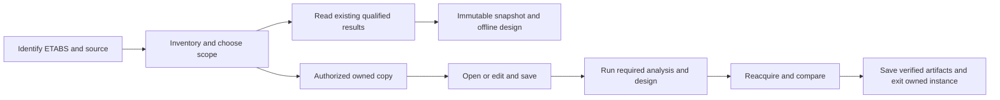

# ETABS workflow: capture, design, reanalyse and compare

## Owner decision: assume and continue during demo and review — 2026-09-10

**Unknown input → record an assumed value → continue.** The owner clarified
that the purpose of Assumptions is to keep the entire demo/review moving.
Engineer review and edits are optional later actions, not prerequisites for
continuation. Do not ask a question, open a blocking input dialog, require
Accept Inputs, or halt the overall review because a value is unknown.

This decision supersedes the earlier proposal to ask for unresolved inputs or
wait for complete engineering readiness during demo/review. It applies to all
sixteen data groups below, including missing material/support/scenario data.
The data register still defines what calculations need; the assumption resolver
supplies provisional inputs and records their basis without blocking the UI.
The [acceptance packet](../../verification/beam-assume-and-continue-acceptance.json)
binds this policy refinement. Runtime implementation remains pending: the
existing sheet reader and baseline mapper still have the earlier restrictions.

### Default continuation behavior

| Situation | Automatic demo/review action |
|---|---|
| A value is unknown or blank | Reuse a saved explicit override or assumption; otherwise use the versioned preset/field fallback. Write the effective value, unit, scope, reason and origin to Assumptions, then calculate the supported preview. No question or approval gate. |
| A required value has no existing preset entry | Apply the registered fallback for that field/profile and persist its rule identity. The implementation must cover every declared demo input; a missed rule uses the named complete example scenario for the affected preview and records the substitution. It must not interrupt the overall review. |
| ETABS source data is missing, such as supports, strengths or service demands | Preserve the missing source record and create separate, explicitly assumed scenario inputs for the preview. Record which members/results depend on them. Any synthetic loads/results keep their example identity; they are never labelled as extracted ETABS results. |
| A user entry is invalid, or two candidate assumptions conflict | Keep the user's entered text and alternatives in the ledger; continue using the last valid saved value or the deterministic preset fallback. Show the chosen value and reason inline. Do not silently overwrite the engineer's entry or ask them to resolve it now. |
| A known requirement or member is outside the available calculation profile | Retain the requirement and known source actions. Record the unavailable check, evaluate other supported work, and continue through the other members and report stages. An illustrative replacement calculation has its own scenario identity; it does not become a pass for the original member. |
| A getter or calculation cannot complete | Record the failed operation and continue with available data, a named preview fallback, or an unavailable-result entry. The review/report still completes. A disconnected or failed ETABS operation cannot be recorded as a successful live analysis or save. |
| An engineer changes an assumption | Persist the edit, replace inherited values in the effective request, and schedule dependent preview updates automatically at a safe boundary. Keep explicit member overrides visible. No repeated acceptance prompt for the already-authorized demo basis. |

Assumptions is the visible ledger and editable shared-value surface. Each entry
retains the field key, value/unit, project/member scope, original source value
or missing marker, assumption reason, preset/rule identity, revision, dependent
outputs and review state. Auto-created member-specific assumptions must also be
visible from this surface, not hidden in C# constructors or only in a log file.
Saved values survive reopen and repeated runs; the engineer can change them at
any time. The detailed Design Inputs view consumes this same resolved basis.

Display a compact assumed-value indicator and provisional result status.
Review-pending is informational: it must not prevent tables, previews, candidate
history, available quantities or demo reports from being generated. Where an
output cannot be calculated, retain its row with the actual reason and continue
the remaining work. Do not turn an unsupported leaf into an invented pass,
erase known nonzero actions, or describe an example schedule as the existing
building's issued reinforcement. Assumed values are useful precisely because
their origin remains visible to the reviewing engineer.

Keep calculation validity and workflow progress separate. A demo may finish
with assumed inputs, pending checks, failed candidates and illustrative results.
That is a completed review run, not a claim that every member is design-complete.
Raw ETABS evidence, saved models and real approval records keep their identity;
the provisional overlay does not mutate them. This policy adds no new modal
approval step for ordinary demo work.

### Required implementation proof

- Start with every supplemental input missing and finish the demo/review with
  zero input questions, zero acceptance dialogs and an explicit value or named
  example fallback for every input consumed by a preview.
- Remove supports/material mappings/SLS data in turn; persist the assumptions,
  calculate supported provisional outputs and complete the member/report loop.
  Actual captured records and example/scenario records must remain distinct.
- Include an unsupported member, an unavailable fire check and one failed
  calculation; all requested members still appear in the final review. The
  remaining work continues and no unexecuted check is labelled passed.
- Enter invalid values and conflicting scoped values; preserve those entries,
  show the deterministic effective fallback and continue without a prompt.
- Edit cover, grade, bars and rates after the first run; inspect actual typed
  request values and updated dependent outputs, not merely revision hashes.
- Reopen and repeat across two model identities: reuse saved project settings,
  retain edits, and regenerate source-specific assumptions for the new model.

## Data requirements and editable assumptions — 2026-09-10

The owner requires reusable demo inputs that remain visible and editable in
Excel. Read ETABS facts automatically, retain project choices once, and resolve
unknowns through the assume-and-continue policy above during demo/review. This is the
data contract for the existing C0a/C0b/C0c and later C1/D/E/F work; it does not
qualify additional engineering profiles.

**Audit conclusion:** the current Assumptions sheet exists, but it is not the
complete calculation-input owner. Its revision invalidates baseline results;
the baseline request obtains numerical inputs from a separate Design Inputs
sheet. A common input resolver and consistent defaults are still required.
This audit changes documentation only, against source commit `e0277504`.
It does not change the installed add-in or any workbook/model.

### What the current workbook actually uses

| Surface | Current behavior | Consequence / required work |
|---|---|---|
| Assumptions, B6:B25 | Twenty values loaded from the embedded [demo preset](demo-beam-preset.json): design basis B6:B14, detailing/search preferences B15:B21, currency/rates B22:B25. Values are explicit cells; formulas in input cells are rejected. Existing sheets are read, not reset. | These are reusable workbook values, but presence on this sheet does not prove consumption by a design, cost or optimization operation. |
| Assumptions edits | Change the normalized input hash/origin. Sheet-change handling cancels the attached baseline task and marks results historical; command-time checks also compare the accepted assumption revision. | Staleness is detected. There is no automatic transfer of changed cover, strengths or bar choices into the baseline request and no automatic recalculation. |
| Design Inputs | Holds project identity/evidence, per-material strengths/modulus, per-member context, case roles and a catalogue. Accept Inputs freezes this request; Design consumes it. | Editing and accepting these values affects the next design. A cover change only in Assumptions can be reaccepted while the old Design Inputs cover remains the calculation value. |
| Duplicate catalogue defaults | `BaselineInputSheet.Create` seeds longitudinal diameters `12,16,20`, links `8,10`, spacings `250,200,150,100`, counts `2,3,4,6`, layers `1,2`, stock `6000,12000`, and a 1,000-candidate limit directly in C#. The preset instead offers longitudinal diameters `12,16,20,25,32` and stock `12000`. | Both catalogues are visible after sheet creation, but they have separate seed authorities. Consolidate editable preferences in one versioned preset/resolver; do not scatter defaults in constructors or formulas. |
| Restricted choices | Assumptions accepts only the preset value for code, seismic basis, exposure, uniform-section policy and currency. | The current sheet is not an unrestricted settings interface. Future dropdowns must list qualified choices and explain unsupported ones. |
| Missing mappings | Material strengths, steel modulus, physical spans/supports, lateral restraint, fire decisions and ULS/total-SLS/sustained-SLS roles are required through Design Inputs. Snapshot material data contains elastic properties/density, not concrete/rebar design strengths. | Acquire or resolve these facts once at their proper scope. Do not infer strengths from names or copy demo materials over an imported model. |
| Preset-only future settings | Section-size options and rates are not inputs to the baseline-design request. Automation limits exist in JSON but are not among the twenty Assumptions rows. | A field is not operational until its maintained consumer, validation and update behavior are implemented. |
| Fire mismatch | The preset contains 60 minutes. The current baseline mapper admits only an explicit, evidenced `NotRequired` fire decision with no duration; required fire design is unsupported. | Preserve the 60-minute requirement, record the unavailable fire check, and continue supported provisional work and reports. C0b/C0c must separate that review progress from complete engineering qualification. |

The source owners are [OfflineAssumptions](../../../CSharp/src/StructuralEngineering.ExcelDna/OfflineAssumptions.cs),
[BaselineInputSheet](../../../CSharp/src/StructuralEngineering.ExcelDna/BaselineInputSheet.cs),
[BaselineDesignCommands](../../../CSharp/src/StructuralEngineering.ExcelDna/BaselineDesignCommands.cs),
[BaselineWorkbookStore](../../../CSharp/src/StructuralEngineering.ExcelDna/BaselineWorkbookStore.cs)
and [BaselineInputMapper](../../../CSharp/src/StructuralEngineering.Beam/BaselineInputMapper.cs).
The [audit receipt](../../verification/beam-data-requirements-audit.json) binds
source hashes and distinguishes observations from planned behavior.

### Complete data register by downstream use

E = acquired ETABS evidence; U = accepted user/project input or labelled demo
preset; D = derived by a qualified library operation. “Required” is conditional
on the selected operation/profile. Broad model context does not authorize
column, wall, slab, foundation or whole-building design.

| ID / data group | Information to retain | Owner and use | Current boundary / missing work |
|---|---|---|---|
| DATA-01 Identity and acquisition | Project/model ID, saved-file hash/path, runtime/API identity, units and conversions, model/analysis/result revisions, lock/case status, capture time, selected scope, table/getter schema, provenance, row accounting and diagnostics. | E; U selects the model and project. Needed for every operation and replay. | Overview/source identity and bounded snapshots exist. Native-unit detailed geometry and dependency-scoped readiness remain C0a. A file hash alone does not establish an unchanged in-memory model. |
| DATA-02 Structural inventory | Story IDs/elevations, joint coordinates, frame IDs/labels/orientation, object-to-analysis-element mapping, sections/material assignments, columns/walls/slabs, openings, diaphragm/constraint and support/link connections. Retain beams, braces and modeling aids separately. | E; D validates roles and connectivity for 3D, load paths and impact assessment. | Detailed frame/point context and source adjacency exist. Surface/support topology and modeling-aid interpretation are incomplete; overview counts are not geometry. |
| DATA-03 Physical beam geometry | Width/depth/shape and transitions, slab/flange thickness and effective-flange basis when applicable, I/J direction, local axes/physical faces, insertion/end offsets, rigid zones, releases/partial fixity, object and property modifiers, meshing, point restraints/springs, neighboring support dimensions, lateral restraint positions, support faces/centres, span/continuous-line/group IDs and anchorage space. | E + D; U supplies unresolved physical/construction evidence. Needed for design, detailing, quantities and alternatives. | Snapshot retains qualified section/axis/modifier/offset/release data; source adjacency does not resolve physical supports. Current baseline requires a narrow horizontal rectangular simply-supported profile with zero source offsets. |
| DATA-04 Materials and existing reinforcement | Base/effective material IDs and property modifiers; concrete strength, longitudinal/link yield grades, steel/concrete elastic properties, density, applicable time-dependent properties; reinforcement assignments, section-specific design overwrites and actual issued bars if available. | E for model values; U supplies accepted design mapping and missing schedule evidence. D resolves effective values. | Snapshot provides E, Poisson ratio and density. Strength mappings remain supplemental; full effective-strength/overwrite and issued-rebar intake is not complete. ETABS required steel area is not an actual bar schedule. |
| DATA-05 Applied loads and analysis basis | Load patterns/types/self-weight factors; point, distributed, temperature, imposed displacement and surface loads with directions/locations; load transfer basis; case types, nested combination factors/dependencies and status. For applicable profiles retain P-delta/nonlinear/staged settings, mass sources, diaphragm constraints, modal/spectrum/time-history functions, scaling, damping, directions and steps. | E; U declares required design scenarios. Needed to establish loading completeness, compare a local solver and reanalyse changed models. | Bounded cases/combinations are retained; a complete applied-load/dependency graph and broader dynamic routes remain C0a/C0c. Force rows cannot reconstruct missing applied loads. |
| DATA-06 Demand coverage | P, V2, V3, T, M2, M3 together with member/element, object/element station, discontinuity side, case/combo, step and action basis. Preserve signed same-row demands separately from component envelopes. Retain required ULS, total SLS and sustained SLS roles, selected versus required coverage, load discontinuities and governing design stations. | E; U accepts scenario roles; D determines governing demands under qualified semantics. Needed for strength, crack and service checks. | Complete bounded frame rows exist for qualified selections. Baseline rejects nonzero P/V3/M2/T and non-static-concurrent actions. Required station/case completeness must be established, not inferred from a large row count or a combo name. |
| DATA-07 Design requirements | Code/edition and qualified profile, seismic system/detailing requirements, exposure/environment, harmful cracking classification, nominal cover by relevant face, fire requirement/duration, aggregate size, serviceability method and project limits, design life where relevant, acceptance/evidence references. | U, with ETABS settings as comparison evidence. Needed before affected engineering checks. | Partial demo and member context inputs exist. Required checks remain kernel-owned; project settings cannot silently disable them. Fire/seismic/profile expansion remains separate qualification work. |
| DATA-08 Serviceability extensions | Total and sustained service actions, actual bars and effective depths; for calculated deflection, compatible stiffness/boundaries, short/long-term components, creep/shrinkage basis, loading age/duration, finishes/partition installation stage, restraint and environmental inputs required by the chosen method, allowed total/after-finish displacement and crack limit basis. | E + U + D. Request only what the chosen serviceability method needs. | Current baseline performs span/depth screening and bounded service crack checks; it does not calculate beam displacement. Lower-level serviceability contracts are not proof of full Excel integration. ETABS displacement alone is not complete long-term RC serviceability evidence. |
| DATA-09 Reinforcement and constructability | Available diameters/grades, counts and layers by face, link diameters/legs/spacings/zones, stock lengths, allowed hooks/bends/radii, anchorage, laps/couplers and splice exclusions, curtailment, side-face bars when required, support/joint space, cover/clear spacing, congestion and continuity constraints. Actual selected bars retain coordinates, centroids, start/end stations and paths. | U preferences; E/D geometry and demands; D produces and rechecks actual arrangements. Needed for complete design, BBS and quantities. | Bounded catalogue/arrangements and pure detailing operations exist. Wider continuous/seismic/special-section arrangements and their connected workflow remain C0c/F. |
| DATA-10 Architectural and grouping constraints | Fixed/excluded members and dimensions, allowed width-depth pairs/increments, headroom, alignment, slab/column/wall interfaces, prohibited changes, span/line/repeated-beam grouping, common-size policy and exceptions. | U + D, bound to source IDs. Needed before alternatives, not merely after ranking. | The preset includes search preferences; persistent scoped constraints and group resolution need a common application owner. A group candidate must satisfy every member. |
| DATA-11 BBS and quantities | Same-revision detailed bar paths/marks, shape convention, link-zone endpoint rules, laps/couplers, steel density, stock allocation, cutting kerf, reusable offcuts and waste basis. Net concrete segments and ownership of slab/support overlaps; measured formwork faces, exclusions/deductions and rounding/measurement policy. | U policies + E geometry + D schedules/quantities. | WP07 has typed operations/contracts. End-to-end baseline Excel quantities are not established by a baseline bar summary. Record unavailable values explicitly; avoid double-counting interfaces or waste. |
| DATA-12 Cost and optional objectives | Currency, dated/geographic rate source and revision, concrete/steel/formwork rates, scheduled versus purchased steel basis, included labour/plant/couplers, waste/overhead/tax treatment and excluded components. Carbon factors or congestion metrics require their own source/unit/basis when selected. | U; D quantities/cost/objective metrics. Needed only for selected comparisons/objectives. | Three illustrative rates exist in Assumptions; full measured-rate and optional-objective wiring remains future work. Missing rates must not block force review or a strength calculation. |
| DATA-13 ETABS design comparison | Active design code/preferences, per-member overwrites, selected design combinations, analysis versus design section, required reinforcement/check outputs, governing case/station, warnings, failures and result freshness. | E; D comparisons under compatible settings. | Overview reports available design state/code. Full design-result comparison is not captured by that overview and is not a prerequisite for the library's own supported force-based design. |
| DATA-14 Global and affected-member response | Required reactions/equilibrium, story forces/drifts/displacements, modal periods/mass participation, torsional/stability indicators and relevant column/wall/slab/joint/foundation demands or qualified external checks. Bind case/dependency scope and baseline/candidate revisions. | E + qualified domain owner; U acceptance criteria. Needed before accepting a coupled whole-model change. | These are broader acquisition/acceptance requirements. Beam checks alone cannot establish acceptable building behavior. Missing domain capability prevents automatic global acceptance. |
| DATA-15 Search and reanalysis control | Eligible scope, allowed change categories, objective/tie breakers, catalogue/domain revision, local/ETABS run/time budgets, stopping criteria, fixed-action versus coupled classification, original/best/candidate-copy identities, exact old/new assignments, readback, case execution, save outcome and recovery journal. | U run policy; E execution evidence; D deterministic search/history. | Pure candidate contracts and owned-copy harnesses exist. Production coupled/overnight orchestration remains C1/D/E. JSON automation examples are not an implemented Excel run policy. |
| DATA-16 Reports, comparisons and persistence | Source/input/profile/engine/result IDs, effective value origins, all mandatory check states, governing demand/capacity, selected actual bars, quantities and rates, baseline/previous/final comparison scope, exclusions, search completion and prepared/checked/approved status. Persist external snapshot/request/results and workbook references. | D + U report choices and real review actions. Needed for traceable outputs and reopen. | Offline references and baseline summary/details exist. Integrated BBS/cost/model/report delivery remains future work; demo or input acceptance is not professional approval. |

For member geometry, distinguish internal analysis meshing from physical
objects: CSI documents that automatic meshing leaves object definitions
unchanged. This supports retaining both identities rather than treating every
analysis element as a separate construction beam. See
[CSI frame meshing](https://docs.csiamerica.com/help-files/etabs/Menus/Assign/Frame/Frame_Auto_Mesh_Options.htm).

### Minimum inputs for the current baseline request

The existing [baseline contract](../../../CSharp/src/StructuralEngineering.Contracts/BaselineDesignContracts.cs)
requires the following in addition to an admitted, current force snapshot:

- Project ID/revision, origin and evidence reference, plus accepted calculation
  inputs. Professional approval remains separately recorded.
- Each source material's concrete strength, longitudinal and link yield
  strengths, and steel modulus. Map by material ID, not by display-name parsing.
- A catalogue revision, longitudinal/link diameters, link spacings, bar counts,
  layers, stock lengths and candidate bound.
- Each selected member's physical-span ID, support condition, support-face and
  centre stations, effective span, anchorage limits, cover, aggregate, exposure,
  cracking classification, ordinary-profile declaration, screening permission,
  horizontal/physical-top mapping and evidence revision. Also an explicit fire
  decision and ordered lateral-restraint positions with evidence.
- An explicit ULS/total-SLS/sustained-SLS role for every consumed selection, with
  complete required member stations. No derived “SLS = fraction of ULS” fallback.

Supplying these fields does not overcome the mapper's geometry, material,
action or fire restrictions. The retained 153-beam model and the second large
building remain development evidence with the earlier recorded gaps; this task
did not recapture either model. Current support and planned coverage stay distinct.

### One effective input basis, with reusable demo values

Use the existing preset as the single seed authority, extending its schema only
in an implementation packet. Keep engineering equations, normalized code data,
mandatory applicability limits and qualified numerical tolerances in the typed
kernel. User preferences are configuration; they are not substitutes for code
rules. Excel passes values to that kernel and displays results.

The planned resolver must provide these behaviors:

1. **Reuse:** initialize an identified demo/project once; save the selected
   preset revision and editable values with the workbook/project. Reopen and
   repeated commands preserve them. A deliberate reset previews/replaces only
   its requested settings; a newer application preset cannot reset user edits.
2. **Scope:** project defaults apply to inherited fields. Explicit overrides
   may be scoped to material, story/group, physical span or member. Precedence
   for configurable choices is member, physical-span/group, story/material
   rule, project value, then an allowed demo seed. Conflicting equally specific
   rules remain visible; continue the preview with the last valid saved value
   or deterministic preset fallback, not incidental row order. Show its source.
3. **Protect source facts:** ETABS dimensions, assignments, axes, forces and
   existing material properties retain their original values/provenance.
   Design material choices are separate explicit mappings; source conflicts
   remain in the review ledger while the provisional scenario continues.
   Proposed changes create candidate values, and any
   analysis-affecting change requires a new analysis before final acceptance.
4. **Explicit provisional replacements:** missing source forces, supports, load
   dependencies, strengths or result roles retain their missing source marker.
   Automatically supply an assumed value or named example-scenario basis for
   the preview and record it in Assumptions. Its outputs retain that basis;
   they cannot claim it was captured from the real model.
5. **Resolve before calculation:** Assumptions supplies shared settings;
   Design Inputs may remain the detailed effective-value/override view. It must
   not be a second independent default store. Inherited fields update with the
   project choice; explicit overrides remain visible and unchanged.
6. **Explain every field:** retain stable key, type, unit, scope/source ID,
   source and effective values, origin, preset/override revision, evidence,
   validation constraints, required-when predicate, consumer and dependent
   outputs. Missing, invalid, conflicting, unsupported and not applicable are
   different states. Blank is not zero or false. Invalid edits remain visible
   while the last valid value or recorded demo fallback keeps review moving.
7. **Freeze and invalidate:** each run consumes one immutable resolved basis.
   Edits make affected outputs historical and require recomputation before they
   can be current. Running work cancels or pauses at its safe boundary; settings
   never change halfway through an ETABS call. The planned demo resolver freezes
   its provisional basis internally and refreshes affected previews without a
   manual Accept Inputs step. That automatic runtime path still needs implementation.
8. **Dependency-aware reuse:** a rate edit recomputes cost/ranking/reports;
   cover, grade or bar changes recheck affected engineering/detailing/quantities;
   model geometry, stiffness, loads, releases or analysis-settings changes
   invalidate actions and require reanalysis. Reinforcement changes also need
   reanalysis when the model's stiffness/nonlinearity depends on reinforcement.

For example, changing project cover from 30 to 40 mm should change inherited
member cover to 40 mm, preserve a declared 45 mm member override, and invalidate
dependent bar-fit/effective-depth/check/quantity results. It must neither retain
30 mm invisibly nor change the saved ETABS model. This is planned acceptance,
not current behavior.

### Record readiness without pausing demo or review

The table describes the evidence needed to qualify the named operation. During
demo/review, automatically resolve unknown inputs and continue provisional work
under the policy above. Missing qualification produces a visible result state,
not a blocking question or a halt to the complete review run.

| Requested operation | Additional readiness needed |
|---|---|
| Inspect/connect/review forces | Source/runtime identity, admitted scope, units and complete compatible captured data. No cost or fabrication inputs. |
| Design a supported beam | Qualified geometry/material/action basis, required design settings and actual-bar catalogue. Missing fields identify the affected members; unsupported members should not trigger irrelevant forms. |
| Complete service/detail checks | The chosen method's service roles, restraint/anchorage/fire/seismic and actual-bar evidence. Missing required checks remain pending or unsupported under the qualified profile. |
| BBS and quantities | A current detailed member, measurement/interface and stock policies. |
| Compare cost | Comparable current quantities, rates and included/excluded scope for both baseline and candidate. |
| Generate alternatives | Accepted baseline basis, fixed constraints, allowed domain, objective and evaluation budget. |
| Apply/reanalyse a candidate | Owned copy and allowed setters, dependencies, readback, complete new analysis results, affected-domain/global checks and save evidence. |
| Run unattended / resume | Resolved settings, stop limits, exact model/run binding and qualified recovery behavior. Revalidate persisted state after restart. |
| Issue outputs | Matching current model/actions/details/checks/quantities and the required real review status. Demo labels cannot become approval by editing a cell. |

CSI's [design procedure](https://docs.csiamerica.com/help-files/etabs/Getting_Started/Concrete_Frame_Design_Procedure.htm)
requires analysis with final section sizes and subsequent design using those
forces. Its [locking guidance](https://docs.csiamerica.com/help-files/etabs/Menus/Analyze/Lock_Model.htm)
explains result deletion on unlocking and preserving an original before changes.
These support the source/candidate distinction; they do not qualify our installed
API mutation service.

### Next implementation and acceptance

Prioritize the shared preset/effective-input resolver and nonblocking review
orchestrator in C0a/C0b, using the owner decision above as their acceptance.
This includes automatic recording, provisional dispatch and update propagation.
Continue native-unit acquisition, effective
materials, physical supports and selected-load dependencies under C0a. C0b/C0c
then qualify check completeness and broader engineering profiles; C1/D/E/F wire
search, copied-model reanalysis, automation and integrated outputs to the same
basis. Do not make every future field a prerequisite for initial force review.

The resolver's implementation packet must prove:

- One preset produces consistent sheet values and typed requests; every exposed
  editable setting has a real consumer or an explicit future/unavailable label.
- Saved demo values survive reopen, recapture and preset/application upgrades.
  A different source model cannot inherit member-specific facts by ID collision.
- Shared cover/grade/catalogue edits reach the request; member overrides and
  unchanged ETABS facts remain explicit. Compare effective request values, not
  only revision hashes or stale banners.
- Rates trigger only their dependent outputs. Geometry/analysis changes require
  fresh actions; edits during work cannot attach a result from an old basis.
- Missing SLS, unresolved supports and unknown strengths use recorded provisional
  inputs without questions. Dynamic/envelope demands and required fire/seismic
  checks remain truthful about calculation support while the review continues.
- At least two distinct model contexts exercise material/member-specific
  settings, units and source rebinding. This is functional evidence, not the
  independent-model corpus or final PF9 performance certification.
- The data-availability report accounts for every requested member and every
  required input/check, with a source, effective value or precise unresolved
  reason. The final Excel/model integration is tested on the exact package.

## Bounded acquisition and Excel data flow — 2026-09-10

`ETABS-BOUNDED-ACQUISITION` implements the first efficiency packet. See its
[acceptance](../../verification/etabs-bounded-acquisition-acceptance.json) and
[evidence receipt](../../verification/etabs-bounded-acquisition-receipt.json).
The 100,000-row ceiling is our current capture/import admission envelope.
It is neither a beam count nor an Excel worksheet limit. A force row belongs
to one object/analysis element, station, output case or combination, and step.
One beam can therefore have many rows.

| Stage | Data retained | Worksheet behavior |
|---|---|---|
| Connect ETABS | Separate versioned overview: source identity, counts and analysis/design availability | No sheet created; no geometry or force read |
| Load model details | Existing source geometry in memory and external evidence, bound back to the overview's exact source | No sheet created; legacy direct geometry commands remain available |
| Get Forces / Open Snapshot | Complete admitted snapshot outside the workbook; decoded snapshot and indexes in .NET memory | Workbook stores a reference and state; import does not dump force rows into cells |
| Review Snapshot | All captured rows for the selected member in the review window | No sheet created; the existing viewer is not paged |
| Write member review | All captured action rows for one selected member | One Beam Review sheet, 13 columns and nine header rows plus that member's action rows |

The production force worker now uses `FrameForce(objectName, ObjectElm)` for
each exact requested beam. It no longer captures the `All` group and filters
afterward. It applies the caller's row budget before result reads using the
minimum complete selected-source scope, between object calls, and after each
complete object response. Rejection accepts no partial snapshot. The existing
group reader remains a comparison/qualification route with its original
schema and default envelope. Shared assignment tables and source geometry
still cover the connected model; this packet scopes **force calls**, not every
definition getter.

Limits remain 100,000 action rows, 1,000 requested members and the existing
64 MiB encoded snapshot budget. They are qualified operating limits, not
fundamental model capacities. ETABS returns a complete object's arrays before
our post-call check, so this is **not a hard vendor-memory bound**. Large time
histories, multiple portable batches, a workload pilot/planner and paged viewer
or report rendering remain separate work. No rows are silently discarded.

The new overview uses 33 registered getter calls, independent of frame count
for the measured profile. It omits full geometry, table catalogue/data,
per-frame and per-case selection loops, and forces. It preserves native units
as metadata and checks protected state before acceptance. The large-model
development check measured 2.060 s for 3,475 frames, 30,731 points and 28,221
areas, with all 16 analysis cases finished and 45 combinations. Its saved
file hash stayed unchanged. This is an overview measurement, not an
API-versus-UI comparison, solver timing or PF9 certification.

Native-unit geometry and broader load-case semantics are still the next C0a
work. The detailed route requires kN-m-C API units and qualified database
units; current force admission still rejects unqualified dynamic, automatic
or envelope selections. The overview can describe such models without
claiming they are accepted force or design inputs. This packet does not
qualify all 153 retained beams, combined actions or arbitrary future models.

## API lifecycle and efficiency — 2026-09-10

**Status:** checked API map and implementation sequence; lifecycle execution
remains to be qualified. The owner requested an API-first workflow from opening
ETABS through analysis and closing. This section extends C0a and the existing
D/E stages; it does not create another programme. See the
[acceptance](../../verification/etabs-api-lifecycle-map-acceptance.json) and
[static evidence receipt](../../verification/etabs-api-lifecycle-map-receipt.json).

The installed `ETABSv1.dll` file version `2.16.0.0` exposes 143 public interfaces
and 1,343 non-property method declarations. Discovery reads metadata without
creating a CSI object or calling ETABS. A method's presence, name or matching
registered signature is not proof that it works for a particular version,
model, load basis or permission mode. The full inventory leaves unreviewed
effects **unclassified**, including methods beginning with `Get`.

API control is the preferred route for repeatable operations and structured
data. [CSI documents model creation, execution and result exchange through its API](https://www.csiamerica.com/developer).
Our observed advantage is structured, source-bound acquisition; we have not
measured an API-versus-UI speed ratio. The second-model inventory took 5.484 s
and its separate twenty-frame definition pass 8.148 s. Neither time measures
force extraction, solver speed or final performance qualification.

### Operation map and current implementation

The signatures in the repeatable inventory are authoritative for this DLL.
Names below are navigation aids. **Production** means a maintained worker
route exists within its declared profile, not universal support. **Harness**
means an installed qualification/setup script exists, not a product command.
**Metadata** means the method exists but this task did not execute it.

| Stage | Installed API route | Current use and next qualification |
|---|---|---|
| Find and attach | OS process enumeration; `cHelper.GetObjectProcess(progID, processID)`; `GetVersion`, `GetModelFilename`, units and lock getters | Production exact-instance discovery. Bind PID, precise start time, executable/DLL identity and model. `GetObject` alone cannot express which of several instances the user intended. |
| Start a separate ETABS instance | `cHelper.CreateObject(executablePath)` then `cOAPI.ApplicationStart()` | Harness. Reuse the existing owned-copy startup pattern; prove ownership and successful startup before opening a file. Do not launch a new instance on every getter. |
| Open or create a model | `cFile.OpenFile(FileName)`; alternatively `InitializeNewModel(eUnits)` then `File.NewBlank()` | Harness. Open only the intended owned copy. Initialization/new-model operations replace model state; they are not attach prerequisites. Capture returned status, actual path and resulting state. |
| Inspect size and availability | Object `Count`, `Story.GetStories_2`, case/run status, concrete-design availability; optional inspection catalogue | Production overview now backs the normal Excel Connect button. Detailed geometry is explicit; the broader inspection/sample route remains available. |
| Read definitions and assignments | Frame/point/area, section/material, load pattern/case/combo getters; selected database tables | Production within existing profiles. Add source/topology facts through C0a, cache shared properties within an accepted capture and preserve explicit units/axes/stations. |
| Change candidate definitions | `FrameObj.SetSection`, other explicit setters; `SetTableForEditingArray` and `ApplyEditedTables` | Metadata for future product mutation. D owns validated requests, batch errors, exact readback, source preservation and new result identity. Generic table editing is not a bypass around typed validation. |
| Save the intended model | `cFile.Save(FileName)` | Harness. Use a new owned path and verify the resulting file. A newly created model needs a filename before analysis; preserve associated analysis files as a bound artifact set when required. |
| Choose cases and run analysis | `Analyze.GetRunCaseFlag`, `SetRunCaseFlag`, `RunAnalysis`, `GetCaseStatus` | Harness. Freeze the required case/dependency scope, invoke once, inspect required completion and analysis diagnostics, and bind fresh results. Do not rerun valid analysis merely to export results. |
| Run ETABS concrete design | `DesignConcrete.GetCode`, `SetCode`, `SetComboStrength`, `StartDesign`, `GetResultsAvailable`, beam summaries | Reads partly production; design execution is metadata here. D must qualify code/preferences/combination input and returned warnings. Analysis completion is not design completion, and ETABS reinforcement demand is not our actual bar layout. |
| Choose and extract results | `Results.Setup` selections/options; `FrameForce`, reactions, drifts and modal getters | Production force routes are profile-limited. Qualify exact object/group scope, required cases/combinations/steps, options and concurrent-versus-envelope meaning before broader use. |
| Read/export database tables | `GetAllFieldsInTable`, display/editing getters; `GetTableForDisplayCSVFile`; `cFile.ExportFile` | Selected table reads are production; file export is metadata. Select fields, table, group and load basis before extraction. A method beginning with `Get` can still write a file. |
| Refresh or hide a view | `View.RefreshView/RefreshWindow`, `cOAPI.Hide/Unhide`, tree-update suspension/resumption | Metadata. Presentation changes are optional and belong to owned operations. Qualify them only if measurements show rendering overhead; always restore owned presentation state after failure. |
| Disconnect or exit | Release owned COM references; separately `cOAPI.ApplicationExit(FileSave)` | Production readers disconnect; harnesses can exit their owned instance. Disconnect keeps an attached ETABS instance open. Explicit save/readback precedes an owned exit, with process-exit evidence. There is no `cFile.Close` in this DLL. |
| Cancel or recover | Existing worker cancellation, deadline, journal, lease and quiescence | Production request cancellation exists. No analysis-stop/progress method was found on installed `cAnalyze`. Show operation stage and elapsed time without inventing solver percentage; a blocked call must return/quiesce before reuse. Do not issue competing COM calls or infer solver termination from a cancelled worker request. |

Existing owners are
[`EtabsHostDiscovery`](../../../CSharp/src/StructuralEngineering.Etabs/EtabsHostDiscovery.cs),
[`inspection`](../../../CSharp/src/StructuralEngineering.Etabs/EtabsInspectionCapture.cs),
[`context capture`](../../../CSharp/src/StructuralEngineering.Etabs/EtabsContextCapture.cs),
[`force capture`](../../../CSharp/src/StructuralEngineering.Etabs/EtabsBulkCapture.cs),
[`owned-copy preflight`](../../../CSharp/packaging/excel/Invoke-EtabsForcePreflight.ps1),
[`owned analysis setup`](../../../CSharp/packaging/excel/Invoke-EtabsOwnedAnalysis.ps1)
and [`fixture creation`](../../../CSharp/packaging/excel/New-EtabsPerformanceFixture.ps1).
These scripts are reusable implementation evidence, not authority to load
them into the XLL or call their setters on the user's attached model.

CSI's older public [RunAnalysis contract](https://docs.csiamerica.com/help-files/etabs-api-2016/html/4b00dc5d-9b60-e088-1b39-d7f7687145fc.htm)
describes the saved-path prerequisite and automatic analysis-model creation;
its [ApplicationExit contract](https://docs.csiamerica.com/help-files/etabs-api-2016/html/248a55a5-ff6d-ac9d-868e-71d0c9335002.htm)
describes the save flag. Installed behavior still needs exact-version evidence.
Do not add a redundant `CreateAnalysisModel` before every `RunAnalysis`.

### Efficiency priorities and acceptance

1. **C0a: separate connection from acquisition.** The first packet above now
   implements a versioned overview and explicit detailed handoff. Show counts,
   result availability and supported capture choices first. Acquire detailed
   geometry when the user requests it. `EtabsContextCapture` currently reads
   frames and points three times and orientation/material assignments twice
   as part of its consistency checks. Preserve those checks in the retained
   route; introduce a separately versioned cheap connection route instead of
   removing freshness checks to make the old route faster. Acceptance: the
   lightweight route makes no `GetAllPoints`, per-frame loop or result read,
   and the existing detailed-context route retains its evidence.
2. **C0a: bound requested result scope and accepted volume.** The retained group route
   calls `FrameForce("All", group)` before enforcing 100,000 rows. That ceiling
   limits accepted output, not ETABS/COM allocation. Use the inventory, a small
   pilot and exact pre-existing groups or object batches to choose a route;
   restrict case/step options on an owned copy where authorized. Table getters
   expose field/group filters but no offset/limit paging. Even one object may
   have many history rows; a worker timeout or post-call ceiling is not a hard
   allocation bound. Admit only qualified workloads and report unsupported
   volume explicitly. Acceptance: requested object/case/step coverage reconciles
   exactly, cancellation preserves its lease, and unqualified large requests
   do not enter the `All` route. Measure rows, bytes, calls, wall time and memory.
3. **C0a/C1: reuse accepted data at the right scope.** Cache section/material
   definitions by stable IDs within one capture, then normalize and index an
   immutable snapshot once for offline design, comparison and Excel output.
   Reuse the existing C# worker and process lease; serialize COM calls through
   the existing STA owner. Offline calculations can run independently after
   acquisition. A saved-file hash alone cannot detect all unsaved live changes:
   retain pre/post guards and revalidate across operations. Mutation, units,
   selections, analysis, design or source changes invalidate dependent caches.
   Acceptance: shared definitions are read once per accepted acquisition scope
   except declared consistency checks, and stale results cannot be reused.
4. **D/E: promote harness operations into one owned lifecycle service.** Bind
   operation, instance, source/copy paths, effect authority, input/result
   identities, deadlines and artifacts in each request. Reuse the established
   lease, journal, cleanup and UI progress owners. Open, prepare, save, run,
   reacquire and verify through typed stages; keep baseline and last accepted
   candidate. Never blindly retry an uncertain save/setter/analysis call.
   Acceptance includes failed open, analysis error, missing design output,
   provider timeout, partial write, source drift and failed cleanup on a
   disposable owned fixture before broad building use.

The lightweight connection and exact-object acquisition boundary is now
implemented. Native-unit detailed context, selected-load semantics and a
measured force-batch planner remain within **C0a**. C0b/C0c still own
engineering support; lifecycle automation cannot make the 153 retained beams
or future models supported by itself. D/E then qualifies owned open/save/run/
design/exit. Keep focused correctness checks with those units and final PF9
performance certification at project end, as already agreed.

### UI fallback and export limits

Keep computer use for initial installation/licensing dialogs, unresolved
interactive errors and visual inspection where needed. Routine production
model operations should call the qualified API services and return structured
diagnostics instead of depending on window focus, screenshots and clicks.
Unsupported UI actions remain explicit; the method inventory is not a promise
of complete GUI parity or unattended operation in every failure state.

[CSI's 23.3 release information](https://www.csiamerica.com/products/etabs/enhancements/23-23.3.0)
advertises SQLite database-table export. However, this installed
`cFile.ExportFile` accepts `eFileTypeIO`, whose values are TextFile,
DBTablesExcel, DBTablesAccess, DBTablesText and DBTablesXML. No SQLite value or
dedicated SQLite method was found in the inspected interface surface. The
earlier extraction proposal's SQLite alternative therefore remains a separate
export investigation, not a qualified API route. Do not pass an invented enum
value; CSV/XML or an offline database built from accepted API data are distinct
routes with their own completeness checks.

## Model coverage and future issues — 2026-09-10

**Status:** active planning refinement, requested by the owner on 10 September.
**Audience:** developers and engineers defining and qualifying the beam product.
This section extends the core-first sequence below to independent building
models and foreseeable operating conditions. It owns the next C0a-C0c scope
definition and corpus qualification; the older acceptance documents retain
their exact historical meaning. PF0-PF11 remains the programme authority.
The planning task is bound by
[BEAM-MODEL-COVERAGE-PLAN](../../verification/beam-model-coverage-plan-acceptance.json).

The objective is dependable beam review and design across declared building
profiles, followed by practical alternatives and controlled reanalysis. The
153-beam building is one regression case, not the definition of the market or
the only acceptance model. No finite corpus proves support for every future
model. Publish the supported profiles and their evidence, plus precise reasons
and next steps for cases outside them.

### Evidence and scope boundaries

The retained building has nonzero axial force in every beam and only one
selected strength combination. The existing mapper rejects nonzero P/V3/M2/T,
non-simple support profiles, nonrectangular sections, offsets and other
unqualified domains. These are confirmed workflow restrictions, not evidence
that every listed variation occurs in that building. The existing positive
three-beam fixture establishes its narrow profile only. See the
[mapper](../../../CSharp/src/StructuralEngineering.Beam/BaselineInputMapper.cs),
[retained-reference test](../../../CSharp/tests/StructuralEngineering.Tests/BaselineRetainedReferenceTests.cs)
and [baseline acceptance](../../verification/wp11-baseline-design-acceptance.json).

In the matrix, **Observed** means a retained source/acceptance fact or an
inspected restriction; **Prospective** is an anticipated model variation or
failure to qualify, not a claim of a reproduced defect. Existing source,
identity, broker and host controls are reused. The
[automation requirements](automation/README.md) and
[PF11 blueprint](library-definition/pf11/README.md) supply the broader operation,
actual-bar, topology, assurance and delivery requirements.

Mainstream planned admission includes ordinary cast-in-place RC building beams
with declared materials and load basis, first rectangular and then eligible
flanged sections; simple, continuous and cantilever spans are separate
subprofiles. Axial, minor-axis and torsional actions require an applicable
source-backed method and actual reinforcement, not a tolerance chosen to make
a model pass. Which combinations of these features can be admitted together
must be frozen in C0c before implementation. Planned admission is not support.

Deep/transfer regimes outside ordinary-beam methods, prestressed, composite,
curved, hollow and other special systems require distinct method packets.
Seismic and fire requirements need their own complete applicability/check
profiles. Record these cases now; keep unsupported checks explicit until
qualified. Supporting columns, walls, slabs and foundations may provide beam
context; this plan does not activate their design or whole-building approval.

### Second-model observations and revised next work — 2026-09-10

The owner supplied a second open building, then saved it to a different folder
and ran analysis. `BEAM-SECOND-MODEL-INVENTORY` bound the newly saved source
through the exact process and performed read-only inventory and definition
sampling. The [acceptance](../../verification/beam-second-model-inventory-acceptance.json)
and [sanitized receipt](../../verification/beam-second-model-inventory-receipt.json)
bind the evidence. Raw filenames, source IDs, catalogs and model data remain
external. This is a development corpus entry, not a locked holdout or proof of
an independently authored source. It does not qualify any additional design.

| Observed fact | Consequence for the next packet |
|---|---|
| 25 stories, 3,475 frame objects, 30,731 point objects and 28,221 area objects; 13 distinct assigned frame-section names | C0a/BC-04/19 must distinguish object counts, analysis elements, physical beams and design-included members. The frame count is not an established count of designable RC beams. Acquire area/support context deliberately; do not interpret it as slab/wall design. |
| Present and database units are both enum 9 (N-mm-C) | BC-18 is now an observed second-model admission issue. Existing Connect requires present enum 6; the inspection preserves native values without changing units. Qualify explicit unit conversion at each source boundary instead of modifying the user's model or interpreting raw N/mm values as kN/m. |
| All 16 analysis cases report finished: 13 static-linear, one modal and two response-spectrum; all 16 and all 45 combinations are selected for API output | C0a/BC-08/09 must bind selected dependency graphs and distinguish ordinary, modal, spectrum and internal cases before force acquisition. All combinations returning a linear-add type does not make their underlying spectrum actions concurrent static vectors. Combination names alone cannot approve ULS/SLS roles. |
| Concrete design code is IS 456:2000; `GetResultsAvailable` is false | BC-08/12 must keep analysis completion and design-reference availability separate. This pass cannot compare ETABS reinforcement demands; never run design implicitly to fill that gap. |
| 1,005 catalogued tables, 159 reported nonempty, including beam-force, reaction, drift and modal families | Availability is useful for acquisition planning, but it does not prove complete rows, source compatibility or governing demands. No table data or force rows were retrieved in this packet. |
| Twenty sampled frames across twenty stories and nine sections all report Beam orientation; seven have end-release flags | BC-03/05 are now observed, not only prospective. Preserve local release DOFs and source restraint context; do not map every beam to one simple-span or fully fixed profile. Four section names and five stories remain outside this sample. |
| Three sampled frames use a dummy-labelled section whose mass/weight modifiers are zero; ordinary sampled sections have different torsion and bending modifiers | C0a/BC-04/06/07 must classify physical design members versus modeling aids with explicit source/project evidence. A name is a review trigger, not automatic exclusion. Preserve dummy members in source accounting and load-path context, and keep object and section modifiers separate. |
| The twenty sampled insertion-point records use cardinal point 8; explicit offsets are zero and no sampled endpoint has a point-restraint flag | BC-04/05 must qualify insertion/axis transforms and support-object geometry. Zero point restraints do not imply an unsupported or free beam; connected walls/slabs/frames may provide support. Do not infer support faces or fixity from endpoint restraints alone. |
| The table display-case getter returns CSI success with count 12 and 13 array entries, including a trailing null | BC-16/18 gains a concrete malformed-shape reproduction. Preserve the complete returned payload and mark that field unqualified. Do not silently trim, treat it as empty, equate it with Results.Setup selections or claim complete pre/post selection proof. Any padded-array interpretation needs its own qualified contract. |

The source API/backend restriction is therefore broader than solver analysis.
The first building still exposes combined-action and missing-service-input
limits. The second adds a native-unit mismatch, larger support context,
response-spectrum scope, releases, modeling aids and a returned-array shape
variation. No axial/minor-axis/torsional force values were measured for this
second model, and they must not be inferred from the first building.

Execute the next C0a work in this order:

1. Complete the source manifest, native-unit conversion and malformed-field
   handling, with precise complete/partial/unsupported states. Make workload
   admission occur before vendor bulk calls; the old `All` force route checks
   its row limit after retrieval and is unsuitable as an unmeasured first read.
2. Resolve support/mesh, effective material, insertion/release and member-role
   facts. Add targeted examples for the five unsampled stories, four unsampled
   sections, different support systems and any modeling-aid role. Preserve all
   source IDs and frozen denominators, including deferred objects.
3. Approve ULS/SLS roles and case/combo dependency/result semantics, then pilot
   forces on individual admitted objects. Results.Setup and table display
   selections are separate inputs. Keep table-selection qualification open
   while its malformed return remains unresolved.
4. Feed the source-qualified cases into C0b core-state separation and C0c
   combined-action/support/section methods. Regress both buildings plus the
   independent corpus/holdout programme below before claiming broader support.

The initial inventory took 5.484 s. The measured twenty-frame definition pass
took 8.148 s, with an observed worker peak of 67,178,496 bytes and an external
raw artifact of about 3.5 MB. The worker and ETABS completed cleanup; available
protected reads and exact model-file/process identity agreed. The malformed
table-selection field remains outside that equality proof. These single-run
development observations justify starting with twenty-frame **definition**
batches. They do not size force batches or qualify UI latency, whole-building
memory, throughput or PF9 p95 targets. Result-batch size remains unmeasured;
start its separately admitted pilot with one object and measure returned rows
and time before increasing scope. Keep final performance certification at
WP10-PERF-FINAL.

Delivery also reproduced a BC-18 build-host mismatch: automatic SDK patch
selection requested a different ILLink.Tasks dependency from the locked graph.
The repair requires the already-tested .NET SDK 10.0.400 exactly. Future SDK
updates must deliberately qualify their lock-file and artifact changes together;
an unchanged application source commit alone cannot establish runtime parity.

### Coverage matrix

Each row is a mandatory planning and acceptance obligation. C0a records source
facts; C0b defines independent core results; C0c qualifies engineering methods.
The packet table below owns their exit gates and the later C1/D/E/F/G sequence.

| ID | Model variation or issue | Evidence boundary | Owner | Required outcome before claiming support |
|---|---|---|---|---|
| BC-01 | Axial tension/compression with beam bending, including small nonzero actions | Observed: every retained beam has nonzero axial force; the mapper rejects it | C0b/C0c | Declare the interaction method, signs, material/section range and numerical-zero policy; independently verify combined-action capacities with actual bars. Preserve every original action. An unsupported interaction stays visible. |
| BC-02 | Minor-axis shear/bending, biaxial response and combined torsion | Observed mapper restriction; individual method availability does not qualify the whole design route | C0b/C0c | Freeze admissible concurrent P/V2/V3/T/M2/M3 combinations, both physical faces and link/perimeter reinforcement. Qualify synthesis and rechecks together; do not mix independent envelope maxima or merely remove the mapper guard. |
| BC-03 | Continuous, cantilever, internal/end and unequal spans; hogging and sagging | Observed simple-span restriction; occurrence in other buildings is prospective | C0a/C0c | Resolve physical support/span and connection meaning, then qualify each admitted restraint/continuity profile, anchorage and bar termination against independent examples. Support-object identity alone cannot establish fixity. |
| BC-04 | Several analysis elements per physical beam, automatic mesh, secondary beams, wall/slab supports and transfer interfaces | Prospective design-mapping cases; broad capture already retains analysis-element data | C0a/C0c | Account for every source object/element once, preserve load paths and source IDs, identify physical support faces and span groups, and expose unresolved topology. No nearest-coordinate guess or column/wall/slab design claim. |
| BC-05 | End/insertion offsets, rigid zones, releases, reversed I/J, rotated axes, sloping beams and support movement | Observed zero-offset/vertical-axis restrictions; other cases prospective | C0a/C0c | Define assignment transforms and station/face signs without changing captured forces. Qualify combined effects per subprofile; unsupported slopes, releases or imposed movements are explicit. Do not replace them with ideal simple supports. |
| BC-06 | Rectangular/T/L sections, depth/material limits, nonprismatic members and special beam systems | Observed rectangular/direct-assignment/depth restrictions | C0a/C0c | Publish section and material envelopes, flange effectiveness basis, region transitions and special-system exclusions. Cross-check capture, mapper, capacity and layout admission so one layer cannot advertise support rejected by another. |
| BC-07 | Effective material overrides, section changes, separate longitudinal/link grades, cover and project catalogues | Observed source-qualification need; mixed-property models prospective | C0a/C0b/C0c | Retain base and effective IDs, explicit strengths/units and accepted project provenance. Missing or contradictory values identify affected members; section-name parsing and demonstration defaults cannot supply strength. |
| BC-08 | Multiple ULS/SLS roles, gravity/lateral patterns, sustained loads, self-weight and selected combination dependencies | Observed retained snapshot has one strength combination and lacks SLS roles | C0a/C0b | Freeze the required load/case/combination graph for the selected profile. Prove required loading and selected-case completeness separately from returned-row completeness; unrelated unfinished cases do not block a qualified selected scope. Never invent SLS rows. |
| BC-09 | Linear combinations, response-spectrum/envelope output, time-history steps, nonlinear/P-delta and construction-stage states | Observed static-concurrent admission limit; broader result types prospective | C0a/C0c | Preserve result-basis and step/epoch semantics; define a qualified demand route for each admitted type. A component envelope is not a simultaneous force vector. Missing compatible provenance or method blocks that profile without relabelling results as static. |
| BC-10 | Support faces, point loads, section/rebar transitions and governing sections between reported stations | Prospective coverage risk; station metadata is not proof of demand completeness | C0a/C0c | State required design stations and the evidence that captures governing demand, including discontinuities and local extrema where relevant. Qualify sampling/interpolation assumptions or request more results; never infer completeness from row count alone. |
| BC-11 | Multilayer/congested bars, different top/bottom reinforcement, link zones, laps, curtailment, hooks and stock limits | Observed baseline arrangement envelope is narrow; richer layouts prospective | C0c/C1/F | Generate actual bar/link geometry and recheck effective depth, fit, strength and required detailing after each dependent change. Preserve no-feasible versus incomplete search. Quantities and later BBS use the same final arrangement/path identity. |
| BC-12 | Crack/deflection checks, long-term effects and missing service assumptions | Observed SLS dependency in the complete baseline workflow | C0b/C0c | Permit a separately labelled core result when its own inputs/checks are complete. Retain pending service checks and explicit method/input reasons; screening is not calculated displacement and core completion is not full design. |
| BC-13 | Ductile seismic beams, system/joint requirements, capacity shear and confinement | Prospective expanded-profile requirement; ordinary-beam acceptance does not cover it | C0a/C0c/D | Identify system, code and joint context; qualify the complete applicable strength/detailing chain before admission. Geometry-only seismic checks or ETABS analysis success cannot qualify seismic or global structural performance. |
| BC-14 | Exposure/durability, required fire resistance, lateral restraint and otherwise unavailable project criteria | Observed baseline requires explicit criteria and rejects required fire design | C0b/C0c | Separate unspecified, required, not-applicable and evaluated states with evidence. Qualify the method or retain the required-check hold; no general opt-out flag or silent use of the fixture's no-fire decision. |
| BC-15 | Local solver applicability versus real-building response | Observed planar solver scope; equivalence for another model is prospective | C0a/C0c/D | Use an explicitly qualified ETABS-only analysis route when local comparison is inapplicable. Compare only equivalent loads/restraints/stiffness/units/stations; investigate unexpected disagreement. Reanalyse structural-response changes in ETABS rather than reconstructing a building from output forces. |
| BC-16 | Wrong model/instance, stale results, changed selection/units/input, partial capture and reused snapshots | Existing WP10 identity/freshness controls; broader caller combinations prospective | C0a/C0b/E | Bind exact instance/model/result epoch and selected scope; validate pre/post state and complete accounting. Invalidate changed inputs/results, preserve legacy snapshot meaning, and keep offline historical validity distinct from current live-model validity. |
| BC-17 | Excel workbook switching, cancellation, offline reopen, stale exports and portability to another reviewer | Existing A/B host controls; expanded results and delivery prospective | C0b/F | Keep the initiating workbook, accepted-input/result identity and every selected member outcome. Reopen source-bound evidence without live ETABS; show missing external artifacts precisely. Reports/quantities reconcile to one current scope and cannot upgrade core-only results to issued full design. |
| BC-18 | ETABS/API, .NET/Excel bitness, units, code-data and snapshot/package version changes | Existing exact installed tuple; other tuples prospective | C0a/F/G | Declare a tested compatibility matrix, deterministic migration/unit conversions and old-profile replay. Unsupported runtime/schema/code-data combinations stop before calculation or host effects. Static API discovery does not qualify a new installed version. |
| BC-19 | Larger/mixed models, many cases/stations, slow getters and memory/cancellation limits | Observed 153/3,502 and 1,000/100,000 capture workloads; larger combined design workloads prospective | C0a/C1/E/G | Bound selected-scope work and retained data; report exact included/excluded/failed counts, cancellation and incomplete search without silent truncation. Reuse accepted capacity evidence; qualify new design workloads separately. PF9 speed/memory certification stays at project end. |
| BC-20 | Infeasible alternatives, section-group effects, copied-model readback/reanalysis failures and interrupted overnight runs | Prospective later integrated workflow; retained transaction controls are prerequisites | C1/D/E/F | Keep fixed-force section alternatives provisional, preserve baseline/best artifacts, verify owned-copy state and re-evaluate required affected members. Record budgets and failure stages; uncertain model state stops reuse/retry. Final saved model, forces, design and comparison artifacts must agree. |

### Bounded implementation and exit gates

This is a plan update, not a new implementation or installed-application run.
Before each packet starts, freeze its exact supported subprofiles, source and
caller owners, independent reference methods/tolerances, focused commands and
evidence rows. Route every matrix row it claims to close to that acceptance
file. Do not rewrite the accepted WP11 A/B profile to represent broader support;
use versioned contracts and migration/replay evidence for changed semantics.

| Packet | Concrete delivery | Exit gate |
|---|---|---|
| C0a — qualified source and topology | Extend the existing broker for required support/material/station facts; version source/topology contracts, selected-load dependency closure, unit/sign/offset mapping and source-accounting diagnostics. Produce the corpus manifest and a per-member restriction inventory. | Exact installed getter behavior, original-model preservation, cross-runtime snapshot replay where supported, and object/element/row reconciliation. Inventory all observable blockers per member without running unqualified calculations; unresolved facts remain separate from confirmed unsupported engineering. |
| C0b — independent core-review contract | Define source status, profile eligibility, core evaluation completeness, engineering verdict, required-check status and full-design readiness as independent fields. Reuse native calculations, actual-bar identity and Excel input/result persistence. | Supported members with complete core inputs reach evaluated pass/fail without needing unrelated SLS evidence. Applicable axial/other actions and strength-critical bar/detail inputs are never waived. Missing SLS remains pending; the existing full-design route and its fixture replay retain their meaning. |
| C0c — mainstream method qualification | Replace the generic mainstream label with named action/section/support/material subprofiles covering BC-01-BC-14. Select and qualify the needed combined-action methods, topology mapping, reinforcement synthesis and detailing; trace every old rejection to its new method or retained scope reason. | Independent calculations and real-model replay demonstrate the new profiles with concurrent forces and actual bars. All admitted feature combinations are covered, including meaningful overload/no-fit outcomes; simply deleting guards or raising zero tolerances is rejected. A retained unsupported class cannot count as completed implementation of that class. |
| C1 — practical alternatives | Compose qualified per-span/group checks with deterministic finite catalogue search and complete candidate identities. | Every ranked result states fixed-action assumptions, required-check completeness and search coverage. Core-only options are explicitly provisional and cannot become final design/BBS by ranking or cost savings. |
| D — copied-model verification | Freeze mutation scope, then apply/read back/reanalyse/reacquire/redesign an owned copy with required affected-member/global checks and baseline comparison. | Original unchanged; selected dimensions, saved model, fresh forces and result identities agree. Local solver comparison remains conditional. No automatic source-model mutation is introduced by this planning approval. |
| E — bounded operation | Manual and unattended stages share services, scope/budgets, journals, leases, progress/cancel and recovery states. | Actual host failure/interrupt scenarios retain baseline/best evidence, never replay an uncertain setter and account for every attempted candidate/member. |
| F — portable delivery | Bind workbook, source/request/result bundle, current quantities/report and supported package/runtime manifests. | Another qualified clean host can reopen and reproduce the declared result with hashes, units, limitations and missing-artifact behavior intact; report claims match check completeness. |
| G — cross-model qualification | Execute the frozen independent corpus, held-out models, scope/compatibility checks and final performance campaign. | Publish per-model and per-stratum support/results, unresolved limitations and exact evidence. Apply the unchanged project-end WP10-PERF-FINAL gates; no universal-support or professional-approval inference. |

Complete C0a-C0c evidence for the first admitted cohort before using it to
qualify C1. Later methods may be delivered as separately bounded extensions,
but cannot be claimed by an earlier profile. Keep focused checks with each
internal unit and one union at the C0c model-coverage milestone. That milestone
owns the next cumulative Python/full-repository correctness gate; later changed
runtime/application milestones retain their required installed and hosted
gates. Do not rerun completed capture implementation or deferred timing trials.

### Independent model corpus and measurable coverage

Freeze a manifest before tuning or qualification: at least five independently
authored building models from at least three sources/authors, including at
least two locked holdouts. Only one retained independent building is presently
evidenced. Additional models must be obtained and admitted; synthetic or edited
variants and the three-beam fixture supplement method checks but do not increase
the independent-model count. Missing corpus members leave broad qualification
pending; the manifest must not invent models, provenance or expected results.

Select by structural behavior rather than convenient file size. The manifest
must cover admitted combinations of simple/continuous/cantilever spans,
rectangular/eligible flanged sections, frame directions and meshing, material
overrides, offsets/releases, gravity/lateral load bases, torsion/axial/minor-axis
demands, reinforcement congestion and differing model sizes. A profile absent
from independent evidence remains unqualified even if aggregate targets pass.
Special/dynamic/seismic systems remain separate cohorts until their method
profiles are admitted. Add isolated source-backed benchmark cases for critical
feature intersections that the independent corpus does not exercise.

For each model record a safe ID, source/author and permission reference, file
and snapshot hashes, engine/runtime/code-data versions, declared profile,
counts, required load/case/step graph, source of project inputs, observed feature
strata, expected engineering reference and whether it is a development model
or holdout. Proprietary bytes remain external. Freeze membership and inclusion
rules before results; the retained 153-beam building stays unchanged in the
regression cohort. Capture genuinely required additional source/SLS facts under
their own new snapshot identity, without patching its historical force data.

Report these denominators and counts per model and per claimed feature stratum:

1. All requested beam objects, mapped physical members, analysis elements and
   returned/expected rows, with every exclusion, duplicate and missing item.
   Required object/row accounting is 100%; it measures completeness of records,
   not engineering support.
2. The **frozen target cohort** for the admitted profile, defined independently
   of mapper success. Split it into mapped, unsupported, missing-input, stale,
   evaluation-error and complete-core results. Do not shrink the denominator
   after seeing failures; inability to map a target beam remains in it.
3. The subset with independently verified complete core inputs, plus the count
   excluded for each missing input. Compute mapping rate over the full frozen
   target cohort and complete-core rate over this input-complete subset. If
   the subset is empty, the result is not assessable, never 100% or a pass.
   Missing-input counts and their fraction of the full cohort stay visible.
4. Within complete-core results, report engineering pass and engineering fail
   separately. A completed overload/capacity failure demonstrates an evaluated
   case; Unsupported, Needs Input, stale/error and unfinished search do not.
   Report full-design readiness separately, including every pending required
   serviceability/detailing/seismic/fire check.

The earlier 95% mapping and 90% complete-core numbers remain **proposed broad
readiness targets**, not authority to skip an accepted obligation. Freeze
thresholds, denominators, tolerances and any declared exclusions in G's
acceptance contract before the run. They apply per model and per claimed
stratum, never only to pooled totals. A promised supported subprofile must
evaluate 100% of its input-complete accepted regression cases without an
unsupported/error escape. A claim that all 153 are supported requires 153/153
to meet the declared evaluation contract after real required inputs exist;
recording 153 Unsupported rows is not support. No structural pass is promised.

Keep holdouts out of tuning. An unexpected holdout failure is a coverage issue:
record it, revise the affected method/contract and its focused evidence, and
obtain a fresh independent holdout for the affected generalization claim before
acceptance. Retain the failed model as a regression; do not silently substitute
an easier case. One model cannot validate a feature absent from its contents.

### New-model intake and future-issue handling

Every new model first receives the same source/profile diagnostic inventory,
including later observable blockers hidden behind the current first rejection.
Classify each finding as missing source/project input, unsupported method,
implementation defect, numerical/analysis disagreement, valid engineering fail,
or host/resource failure. An error message alone does not establish the cause.

For a material new issue, retain a sanitized reproducible case (external when
necessary), exact source/runtime/input IDs, expected and actual outcomes,
affected BC row and subprofile, confirmed root cause or unconfirmed status,
owner packet, proposed correction and acceptance evidence. Add a new BC row
only for a distinct behavior; link recurrence to the repository's existing
RR record rather than making parallel defect inventories. Model IDs and
frozen counts remain visible while a case is unresolved.

Resolve the cause at the source, mapper, method, orchestration or host owner.
Qualify the affected combinations and callers, then include the case in the
next named cumulative cohort. Do not mask a failure by loosening numerical
tolerances, deleting required checks, dropping members, assuming supports,
inventing loads or accepting a larger beam after an unexplained solver mismatch.
Unknowns cannot become full-design passes; known engineering failures may
enter the later qualified finite search while model/API uncertainty stops the affected live operation; the demo/review continues with recorded available or example data.

## Owner refinement and implementation start — 2026-09-08

A/B are complete within their original baseline scope (PRs
[#982](https://github.com/Pravin-surawase/structural_engineering_lib/pull/982)
and [#983](https://github.com/Pravin-surawase/structural_engineering_lib/pull/983)).
Prioritize dependable core strength/reinforcement review on ordinary models,
then practical alternatives, copied-model reanalysis, bounded repetition and
portable review delivery. Detailed crack/long-term deflection and other
input-intensive checks can follow with independent pending states. Missing
input is not non-applicability; full verification keeps its stricter meaning.
Run qualified simple checks when ready. Material, applicable actions and
actual bar geometry needed for strength remain core dependencies.

The retained building has 153 beam objects and 3,502 action rows; all 153 beams
hit the current baseline restriction on nonzero additional actions and cannot
complete that design profile. It differs from A/B's positive
three-beam/153-row fixture. One fixture or a component suite cannot prove broad
model usability. Address these source/coverage boundaries:

1. Supporting-section dimensions and wall/slab context.
2. Effective member material overrides.
3. Offset/assignment normalization before design.
4. Selected-case prerequisites instead of every unrelated case finishing.
5. Required loading completeness, separate from returned-row completeness.
6. Shape/material/depth limits across capture, mapping and layout owners.
7. A core-review contract independent of baseline SLS dependencies.
8. Declared runtime and unit compatibility.
9. Bounded selected-scope acquisition and accounted member exceptions.
10. Governing-section sampling evidence.
11. Portable workbook and external review evidence.

Start with [repeatable C0a API discovery](wp10-etabs-read-adapter.md#c0a-api-discovery-foundation--2026-09-08),
then broker-backed source-fact qualification/topology (C0a), independent core
review (C0b), required mainstream methods (C0c), practical search (C1),
copied-model verification (D), bounded execution (E), packages (F) and final
qualification (G). Reuse accepted A/B infrastructure.

Before broad-demo qualification, freeze at least five independent building
models from three sources/authors, including two holdouts. Proposed per-model
targets: 95% ordinary-target beam mapping without per-member reconstruction,
90% complete core outcomes after core inputs and 100% object/row accounting.
Only one retained independent real building is evidenced. These are unachieved
targets, not market statistics; synthetic/modified cases do not replace the
independent corpus.

Earlier API work includes exact getter matrices and bulk capture. The missed
opportunity was mapping capabilities against complete workflows and realistic
volumes earlier. Resolve the next contract's critical API questions, then
implement; learning every unrelated method is not a new delivery prerequisite.
This section controls revised sequencing; the earlier audit below preserves
historical component boundaries.

## Historical architecture audit

Date: 2026-09-05. Latest task: XLL-PRODUCT-ARCHITECTURE-AUDIT.
Status: source-reviewed architecture recommendation; automatic product integration
is not implemented. The owner requested a fair comparison of the original,
implemented and proposed workflows before further coding. The audit below
supersedes the recent RAM-only/reacquire-only recommendation and the older
workbook-resident snapshot plan. Use memory for active work, small Excel inputs/
outputs, and external replayable evidence. A general-purpose database remains optional.

## Direction and authority

The owner wants to acquire the required ETABS model data, interpret it in the
library, keep heavy data out of Excel, design and search for practical changes,
update sizes in ETABS, reanalyse and repeat, then compare savings. Small useful
tables may be written when requested, including the default Assumptions sheet
on first explicit setup. Retain the
[ribbon-first decision](excel-ui-review.md#owner-decision-ribbon-first-worksheets-on-demand):
loading the add-in creates no sheets; setup creates only Assumptions.

This refinement follows [PF8](library-definition/pf8/baseline.json),
[PF11](library-definition/pf11/baseline.json) and the
[WP10 read boundary](wp10-etabs-read-adapter.md). ETABS mutation remains WP11's
owned-copy transaction after the read/import path is qualified. This review
performs no live acquisition, setter, model copy or analysis and changes no
engineering code, approved design scope or original P0-P6 meaning.

## Whole-product audit and decisions — 2026-09-05

### Verdict and audit boundary

Keep the existing engineering and evidence foundation; add the missing
application services and a simpler public UI. Neither the old sample-workbook
layout nor a RAM-only overnight application is the recommended final product.
The original architecture already called for reusable in-memory sessions and
durable identities/evidence. Much of the new direction improves its presentation
and integration, rather than replacing its engineering architecture.

This audit inspected the source at `e4d1a940457d99635ea5e9806f5c5651f38cff69`,
the WP01-WP10-04 implementation record and retained acceptance receipts. Two
bounded read-only reviews covered the engineering chain and Excel session/UI;
the parent independently inspected the decisive source paths and performed the
verification below. It is an architecture/integration audit with existing
regression evidence, not a clause-by-clause recertification of every formula,
an installed acceptance of new commands, or approval of a building design.

| Approach | What was good | What is insufficient for the intended product | Decision |
|---|---|---|---|
| Original XLL architecture | Pure C# ownership, bounded solver, explicit commands, reusable memory and durable evidence | Many proposed controls; early single-process/runtime assumptions preceded installed work | Retain the principles; use current qualified runtime and later host boundary |
| Implemented WP01-WP08 | Explicit units, real reinforcement geometry, scoped checks, identities, complete-result aggregation and deterministic ranking | Operations require caller-supplied engineering inputs/evidence; they do not yet automate the whole design journey | Reuse; build orchestration instead of rewriting kernels |
| Implemented WP09 | Strict inputs, controlled writes, readback/rollback, freshness, save/reopen and installed evidence | Technical JSON tables, one-candidate evaluation and discarded ribbon feedback | Preserve engine guarantees and legacy compatibility; replace ordinary input/output presentation |
| Older WP10-05 proposal | Exact portable snapshot storage/replay and explicit import/mapping | Heavy chunked workbook tables are an awkward model/result store for repeated runs | Keep the snapshot contract; retire workbook-resident heavy storage as the new default |
| Recent UI and RAM proposal | Transparent assumptions, separate capture stages, physical-span decisions, fewer manual steps | Summary-only persistence cannot replay lost inputs; nine buttons do not supply the missing services; mandatory local-solver comparison is too broad | Retain the useful UI; use hybrid storage, capability-based controls and qualified solver applicability |

### What WP01-WP10-04 actually provides

The [implementation record](../../library/implementation-status.md) remains the
packet-by-packet source. Completion means its declared scope, not every future
workflow that may call it.

| Packet | Reusable implementation | Boundary relevant to this product |
|---|---|---|
| WP01 | Canonical contracts, actual bar geometry, flexural operations | Imported actions and reinforcement choices still need mapping/synthesis |
| WP02 | Actual-link shear/torsion checks with concurrent actions | Unsupported interaction components cannot be discarded to obtain a pass |
| WP03 | Action normalization, support-face/span topology validation, planar beam solver | Callers supply support/span semantics and applied loads; a source graph is not reconstructed automatically |
| WP04 | Explicit SLS screening/component aggregation/crack checks | Required strain, chronology, stiffness and displacement evidence must be obtained or calculated; forces alone are insufficient |
| WP05 | Detailing, anchorage/lap, seismic/fit operations within declared scope | Applicable inputs and actual arrangements must be produced and rechecked |
| WP06 | Validated project basis and complete-member evidence aggregation | `MemberDesignOperations.Design` consumes `LeafResults`; it does not run all leaf calculations or choose bars |
| WP07 | Bar paths, schedules, quantities, cost and calculation packages | Resolved actual paths and concrete/formwork ownership are inputs; required steel area is not a BBS |
| WP08 | Finite candidate generation/ranking and fixed/coupled result semantics | `OptimizeBeam` ranks supplied `Evaluations`; evaluator execution and common-section group search remain to be built |
| WP09 | Qualified standalone Excel functions/commands and controlled outputs | No connected-model session, public one-sheet mapper, new ribbon or unattended loop is accepted |
| WP10-01 | Portable request/snapshot, units, identities and row dispositions | A generic schema is not a qualified producer for every model/result type |
| WP10-02 | Exact-version getter matrix and retained one-member live capture | Not broad geometry capture, all-model results, or a launch/analysis service |
| WP10-03 | STA lease, deadline/fence, journal, postflight and durable artifact | Broker library is not a packaged production host; timeout completion does not imply COM quiescence |
| WP10-04 | Offline projection, conservation and Python/.NET replay | Accepted projector/normalizer is bounded to the declared horizontal-frame, kN_m_C, static-concurrent policy |

Decisive source paths:

- [MemberDesign.cs](../../../CSharp/src/StructuralEngineering.Beam/MemberDesign.cs):
  `Design`, `ExpectedLeaves`, `ValidEvidence` and depth-iteration validation.
- [OptimizationOperations.cs](../../../CSharp/src/StructuralEngineering.Optimization/OptimizationOperations.cs):
  `OptimizeBeam` builds a domain and supplies request evaluations to `Rank`.
- [BeamTopologyBuilder.cs](../../../CSharp/src/StructuralEngineering.Analysis/BeamTopologyBuilder.cs):
  `Define` requires supplied ordered supports, spans, regions and mappings.
- [PlanarBeamSolver.cs](../../../CSharp/src/StructuralEngineering.Analysis/PlanarBeamSolver.cs):
  solver inputs include actual applied loads, restraints and stiffness.
- [WorkbookInputReader.cs](../../../CSharp/src/StructuralEngineering.ExcelDna/WorkbookInputReader.cs)
  and [WorkbookCommandEngine.cs](../../../CSharp/src/StructuralEngineering.ExcelDna/WorkbookCommandEngine.cs):
  strict legacy tables and transactional/freshness behavior to preserve.
- [EtabsLiveGetterProbe.cs](../../../CSharp/src/StructuralEngineering.Etabs/EtabsLiveGetterProbe.cs),
  [EtabsCaptureProjector.cs](../../../CSharp/src/StructuralEngineering.Etabs/EtabsCaptureProjector.cs)
  and [AnalysisSnapshotNormalizer.cs](../../../CSharp/src/StructuralEngineering.Analysis/AnalysisSnapshotNormalizer.cs):
  explicit one-member and policy boundaries, not a generic full-model importer.

No numerical kernel defect was demonstrated by this audit. Two existing UI
limitations are confirmed: ribbon callbacks discard returned results, and blank
legacy setup seeds a sample. The new adapter must present command outcomes and
make sample creation explicitly DEMO; do not silently convert that sample into
a connected project's design basis. Those runtime changes belong to the first
UI implementation packet and are not claimed fixed by this document.

### Data decision: memory for work, files for replay, Excel for people

| Option | Strength | Cost / failure mode | Verdict |
|---|---|---|---|
| Everything in workbook tables | One portable workbook; useful for the existing small standalone workflow | Excel formatting/serialization and repeated heavy writes; opaque chunk tables; workbook save becomes a data checkpoint | Retain legacy support; reject as default connected-model storage |
| Everything only in RAM | Fast transient prototype and local filtering | Process loss loses exact trial inputs; summary rows cannot reconstruct forces or a baseline | Allow disposable development runs; insufficient for unattended acceptance |
| RAM plus immutable external snapshots/journals and compact workbook | Fast local work, inspectable history and replay using existing codecs | Must bind storage/project identity and support export/relocation | Recommended next implementation |
| Embedded SQLite project store | Transactions and indexed cross-run queries without a server | New dependency, schema migration and packaging/backup work | Reconsider when measured history/query needs justify it; not required to begin |

SQLite is a credible later application-file format, not a mandatory service or
current performance claim. Its own [usage guidance](https://www.sqlite.org/whentouse.html)
supports local application storage. Begin with maintained canonical JSON codecs
and immutable per-run files; avoid implementing a custom relational database.

The proposed storage contract is:

| Owner | Persisted / live content | Lifecycle |
|---|---|---|
| Workbook | Assumptions with units/origins, small model summary, document/project IDs, selected run reference and requested Results/reports | Ordinary Save; outputs identify historical or current basis |
| Session memory | Immutable model context, indexed required force rows, effective inputs, active designs and bounded candidate summaries | Reuse across selections; release on close; no workbook force/joint dump |
| Private local project working folder | Manifest, frozen input/profile/catalogue versions, acquisition journals/raw artifacts, validated snapshots, run/transaction records and detailed review evidence | Successful capture/trial checkpoints do not depend on final workbook Save |
| ETABS files | Preserved original/baseline, identified candidate copies, retained best/final copies | Owned-copy mutation only; uncertain copies cannot be treated as accepted parents |

Use a project-owned local folder, initially under the existing per-user evidence/
application-data convention; persist only its locator and identity in Excel.
An unsaved workbook may edit assumptions, but a durable run must have a resolved
project identity and writable storage. Moving/sending only the workbook is not
project transfer: provide an explicit portable export later and report missing
external artifacts honestly. Keep live journals local, with a single owning
writer; shared/network project collaboration is separate scope.

Retain each actual ETABS analysis snapshot used in a run, not a duplicate full
snapshot for every local bar/size candidate. Preserve baseline and verified
best/final inputs, all ETABS trial assignments/outcomes, candidate input deltas,
check reasons and governing evidence references. Reuse immutable artifacts by
content identity. Do not strip raw/provenance fields from the current canonical
snapshot to save space; a leaner runtime projection may reference that intact
artifact. Compression/partitioning requires byte-equivalent replay proof.

On reopen, restore assumptions and historical summaries. Validated saved
snapshots can support explicitly offline review/recalculation without ETABS;
they do not establish current live-model state. Reconnect/revalidate before new
live capture or mutation, reacquiring whenever coverage or freshness cannot be
proved. A crash does not resume setters automatically. This distinction retains
the old replay benefit without placing heavy snapshots in Excel.

Document identity, project identity, analysis identity and the initiating live
workbook object are separate. Save As/duplicate opening must resolve that binding
without transferring model-mutation ownership accidentally. A filename change
alone need not invalidate identical physics; ambiguous document/session binding
does block writes. Specify and qualify these cases before adding long commands.

### Acquisition and model understanding

Connect needs an additive model-context contract that can exist before analysis.
Do not weaken `analysis_snapshot/v1` to call a context-only or unlocked model a
complete force snapshot. Preserve source objects, analysis elements and derived
physical spans as separate identities. Geometry for beams/columns/joints and
relevant support objects is shared by design, group formation and a later 3D view.
Slab/wall presence may matter for support/loading context even when their design
is unsupported; absent context must remain an explicit scope limit.

Acquire the declared model context once per verified revision and the required
result domain once per analysis revision; then filter/index locally. Repeating
the one-member probe for every beam would repeat shared catalogs and pre/post
work and is not the broad-model implementation. Prefer qualified bulk getters/
tables plus deduplicated property reads. CSI documents
[GetAllFrames](https://docs.csiamerica.com/help-files/etabs-api-2015/html/9241fd9f-23d8-89c9-f4be-d6f7066a95a4.htm)
as a bulk interface in an older API; that is evidence to investigate, not proof
of the installed 23.3.1 signature, completeness or speed.

The retained one-member snapshot is 1,669,798 bytes with 13 force rows and shared
catalog/ledger data. Do not linearly extrapolate that size or its 410 calls to
1,000 members. Measure API, normalization, indexing, disk and Excel times
separately on PF9's 100-member/10,000-row and 1,000-member/100,000-row workloads.
Do not replace concurrent force rows with independently maximized components.

The source-to-topology service must classify real supports and derive faces,
spans and candidate construction groups from IDs, connectivity, axes, section
orientation, offsets, releases and member roles. Coordinate proximity alone is
insufficient. A 3D rendering is a projection of this shared model, not proof of
support conditions, actual load paths or design suitability.

### Application, host and solver decisions

Add a host-free application layer that maps a frozen source/project basis to
real requests, invokes the engineering operations, selects actual reinforcement,
rechecks affected leaves and creates current quantities/evaluations. Excel calls
this layer; it does not calculate structural formulas or ask users to populate
internal leaf-result JSON. The same layer must support standalone/offline use,
manual stages and the later Auto Run.

For live handoff, retain WP10's versioned file/message boundary and target a
packaged, bounded ETABS worker using the existing STA broker. Keep it a product
component with no permanent service or separate normal user UI. Qualify its
actual launch, lifetime, lease, progress, timeout/quiescence and cleanup before
shipping it. This updates the original single-product-process preference;
single XLL distribution and a worker executable are different packaging claims.
The pure engineering libraries remain usable without that worker.

All Excel object-model access/writes return to the initiating Excel thread.
Long computation and ETABS calls must not block that thread. Microsoft's
[Excel threading guidance](https://learn.microsoft.com/en-us/office/client-developer/excel/multithreading-and-memory-contention-in-excel)
explains the command/main-thread boundary. The broker's completion and quiescence
tasks are distinct: a timeout can return while cleanup still holds the lease.
Neither an overnight retry nor another workbook may ignore that state.

Solver comparison is conditional on a qualified equivalent local model. It is
not a universal extra pass required for every real ETABS beam. Acquire actual
loads, supports, modifiers and comparison criteria where the profile supports
them; source output forces cannot reconstruct those inputs. An explicitly
supported ETABS-only analysis route may continue when local comparison is not
applicable. An unexpected disagreement on a claimed equivalent model needs
diagnosis, not a larger beam or a widened tolerance.

Global ETABS analysis, required global/other-member checks and actual-bar beam
checks remain distinct. Neither the solver nor a green analysis status permits
the product to claim an entire building is safe. Final-size reanalysis and
redesign are required by CSI's
[concrete frame procedure](https://docs.csiamerica.com/help-files/etabs/Getting_Started/Concrete_Frame_Design_Procedure.htm).

### UI decision and implementation order

Keep Assumptions, Connect ETABS, Get Forces, Design, Optimise, Update & Recheck,
Auto Run and Compare Runs as the eventual routine actions. Keep Solver Check
available in the Optimise/diagnostics detail for applicable models rather than
requiring an extra manual step in every run. Show only implemented capabilities
in the shipping ribbon; the nine-button illustration remains a proposal.
Legacy commands stay usable without forcing their technical worksheet layout on
new users. A persistent status/reason is more valuable than another control.

| Increment | Concrete outcome and acceptance | Boundary |
|---|---|---|
| A — Reconcile WP10-05 contracts | Freeze session/project/document IDs, context versus force snapshot, typed input mapper, external-artifact lifecycle, output ownership and invalidation matrix | Retire the old chunk-table/reconstruct-in-workbook card; preserve current wire schemas and legacy behavior |
| B — Public input and offline review | One DEMO-labelled Assumptions sheet, explicit one-beam input/detail entry when needed, validated saved-snapshot review in memory, visible command outcomes and on-demand Results | No live ETABS or claim that imported forces alone constitute a complete design |
| C — Complete supported baseline design | One explicit supported beam basis drives actual bars/layers/links, all required leaf requests, consistent depth iteration and current detailed outputs | Use standalone/retained fixtures; unresolved SLS/detailing inputs remain blocked; no profile weakening to force a pass |
| D — Live handoff and model context | WP10-05B worker and separate Connect/Get Forces services; qualify exact target, progress/cleanup, required metadata and existing-result capture | Missing analysis initially returns Analysis needed; automatic preparation appears only after an owned-copy capability is qualified |
| E — Broad capture and read qualification | WP10-05C supports representative multiple members, context-to-span mapping and local filtering; WP10-06 passes installed Excel/ETABS and PF9 workloads | Multiple beam selections cause zero extra acquisition calls within the same complete current snapshot |
| F — Practical search | A span/group evaluator invokes the baseline design service, feeds WP08 ranking and shows complete/incomplete fixed-action alternatives | Qualified local Solver Check is optional by profile; all section changes remain provisional |
| G — One coupled change | Apply one proposal to a copy, read back, analyse, reacquire, redesign, check required effects and save matching evidence/model | Original unchanged; final dimensions equal analysed dimensions; unqualified effects prevent wider acceptance |
| H — Bounded unattended work | Same manual services, retained baseline/best, each ETABS trial recorded, no duplicate loops, stop budgets, safe pause and morning review after process loss | Qualify real application/modal/error behavior; no automatic replay of uncertain setters or global-optimum promise |

Owner sequencing update (2026-09-05): A/B is merged. Bring D's running-model
connection and context ahead of C so engineers can check actual model intake
first, then qualify existing-force handoff and E's broader capture before C.
The letters identify capabilities, not mandatory dependency order. The active
WP10-05B plan card owns the current bounded connection packet. Recheck this
whole-product goal and dependency order at each packet intake; change only the
affected canonical plans when evidence or owner priorities change.

These are implementation increments within the existing WP10/WP11 programme,
not a renumbering or a claim that one session can cross every installed gate.
The first coding packet should implement A/B with exact acceptance, not all
eight increments or all eventual ribbon callbacks at once. C supplies the missing
engineering orchestration; it is substantial work, not a UI rename.

### Verification performed and readiness conclusion

- Locked .NET restore and Release solution build passed with zero warnings/errors.
- Existing native WP01-WP10 tests: 121 passed. Existing Excel/workbook and WP10
  offline host tests: 58 passed. Environment-dependent live/configured tests were
  explicitly excluded; they are not counted as a new installed pass.
- The separately configured retained-artifact normalization test passed. The
  newly emitted snapshot replayed in Python with identical canonical bytes and
  SHA-256 `b0379473f0e195c4a8e947b89218e0af4e1294f80e72824bd731d7fa65af627c`:
  one member, 13 force rows and 110 accepted model/action records.
- Existing Python WP10 contract/conformance tests: 19 passed. Original raw and
  retained snapshot file hashes matched their WP10-04 receipt. No new tests were
  added and no live Excel or ETABS instance was operated.
- WP09's retained installed receipt records its 20-member/200-operation
  standalone acceptance. It remains evidence for that scope, not the proposed
  public mapper, connected session or overnight run. New performance, whole-model
  and installed workflow claims remain unqualified.

Proceed with the reconciled application/session and public-input packet. Reuse
the accepted kernels and receipts. The principal remaining work is orchestration,
source completeness, topology, live handoff and recovery; changing storage or
ribbon labels alone cannot complete the automation product.

## 1. Connect and preserve a baseline

An explicit ribbon command identifies the process, installed API, exact model,
saved-file relationship, model state, analysis availability and result selection.
An unsaved or changed open model cannot silently share its disk-file identity.
Resolve that relationship before binding a reconstructible baseline B0.

Preserve the original model and keep B0's source data, design basis, units,
case/combination definitions and quantity/rate basis in memory throughout the
run. Keep required acquisition/transaction evidence separately. Record
the parent accepted iteration separately: original-model and previous-iteration
comparisons have different meanings.

Keep the attached source getter-only: no unit/selection setters, unlock, analysis
or save. Any required selection/analysis preparation belongs to a separately
identified owned-copy operation. Broad acquisition cannot silently extend the
accepted getter matrix or change result selections on the attached source.

### Connect and Get Forces are separate actions

Connect attaches to a uniquely identified running model or opens a connection
dialog. With no suitable instance, the launch path starts installed ETABS and
lets the engineer choose a model using ETABS' own Open dialog. Finish this
interactive setup before an unattended run. Launch/open/API compatibility still
requires installed qualification; a launched process is not permission to mutate
an original model. Show source and active working-copy paths distinctly.

Connect reads model name/path, runtime, source/display units, stories, section/
material definitions, object classifications, joints, axes, offsets, releases and
connectivity needed for model understanding and physical spans. It does not read
force arrays or start analysis. Local 3D/context views use this same graph.

Get Forces verifies required case completion, result epoch/currentness, selected
combination dependency closure and data coverage. Locked state or a result file
alone does not establish current complete results. If results are usable, capture
them once. If missing/stale, the UI may continue automatically through a separate
owned-copy preparation/analysis capability within the bound run authority, then
acquire its results. Do not promote the attached source to owned mode or call
analysis/setters on it. The UI needs no extra technical ownership button.
Keep that effectful service separate from WP10's accepted read-only adapter.

## 2. Acquire once per source revision, then interpret locally

Capture broad model context and the complete result domain required by the
declared design profile. "All required data" is a bounded manifest, not every
possible output or time-history step. Do not omit required combinations for speed.

| Dataset | Interpretation and purpose |
|---|---|
| Catalogue | Stories, object/member IDs and classifications, section/material definitions, assignments and source units |
| Geometry/topology | Joints, coordinates, beams, columns and required slab/wall/support context; object/element mapping, local axes, offsets, insertion, releases, restraints and diaphragm/constraint context |
| Analysis basis | Loads, self-weight/mass assumptions, stiffness modifiers, cases/combinations and dependencies, relevant settings and result status |
| Results | Required members, stations, cases and steps; concurrent P, V2, V3, T, M2, M3 rows, plus required displacement/global-check evidence |
| Design basis | Verified strengths, exposure/cover, profiles, reinforcement and construction/rate inputs; distinguish imported facts, overrides and missing data |

Build one shared C# model with source-ID-based member/joint adjacency indexes.
Beam/floor selection and neighbour lookup use this model without returning to
ETABS. Keep unsupported objects as identified context; do not classify every
frame as a beam or every nearby endpoint as a support. Spans and support faces
need verified geometry/offsets and must be recomputed after relevant size changes.

Normalize once to the existing explicit kernel units; retain source units,
signs, axes/physical faces, row and case/step provenance. Display-unit changes do
not change physical quantities. Separate component maxima cannot be combined
into a fictitious simultaneous force vector. Missing required mappings prevent
completion of affected designs.

Prefer verified bulk API/table reads where the installed version supports the
required semantics; qualify equivalence to the accepted getter path first.
Deduplicate section/material reads. Keep COM acquisition serialized in the
existing STA broker; bounded parallelism is for pure library work. Pre/post
source checks reject mixed-revision captures. Preserve the current explicitly
evidence-derived revision semantics where ETABS supplies no native epoch.

## 3. Keep active data in memory and replay evidence outside Excel

| Location | Contents and behavior |
|---|---|
| C# memory | Model graph, source/current/baseline forces, active inputs and candidate calculations; reused within this session |
| Assumptions sheet | Small visible typed project inputs, source facts and named defaults, with units, origin and missing/override state |
| Requested outputs | Results, quantities or savings and small identity records; preserved by ordinary workbook Save |
| External working folder | Required acquisition journals/raw artifacts, validated per-analysis snapshots, frozen inputs and run/model-copy transaction records; no workbook force database |

Auto Run additionally persists a compact trial history after each state/trial:
source/copy and run/candidate identities, assumptions/profile/catalogue revisions,
changed assignments, stage and per-frame/check outcomes, quantities and stop
reasons. Store baseline assignments once and reconstruct trial assignments from
bound changes where useful. Retain the corresponding replayable analysis inputs
once per actual ETABS trial, not once per local candidate. Morning review must
not depend on a final Excel Save succeeding.

"Does not change" means unchanged within a verified revision. Materials,
sections, units and criteria are versioned too. The Assumptions sheet is an input
owner with typed validation; result summaries are projections. Design reads and
validates inputs in one action, with no separate Apply control. See the
[default policy](excel-ui-review.md#one-transparent-assumptions-sheet).

Closing Excel/workbook, unloading the add-in or a crash releases its heavy working
memory. Reopening restores assumptions and historical reports, with no active
ETABS connection. Validated external snapshots permit offline review and
recalculation; fresh live binding is required before live operations. Missing or
stale required data needs reacquisition. Saved cells never resume a coupled run.
Compare with the identified B0; restore its validated saved identity or establish
a new baseline explicitly, rather than calling the current candidate the original.

Use indexed arrays, shared property records and bounded candidate summaries.
Retain all required force rows in the supported workload; an envelope cannot
replace concurrent governing data. If the complete workload cannot fit, report
the supported limit instead of dropping rows. A durable partitioned project
store and automatic cross-session continuation can be added later behind this same model.

Share unchanged geometry/properties by verified content identity. After an
analysis change, old forces are stale even if member IDs are unchanged: refresh
the complete required result domain. Initial implementation compares the full
required model manifest; incremental acquisition needs a proven change detector.

Resolve input-sheet ownership, workbook/session binding, closure behavior and
memory limits before implementation. A general-purpose database is not a v1 gate;
the replay/history contract is a prerequisite to unattended acceptance.
No hidden data sheets are used. Preserve legacy WP09 workbooks and existing
portable snapshot/evidence contracts; qualify the new session lifecycle honestly.

## 4. Design the baseline and freeze a practical search

The [development preset](demo-beam-preset.json) supplies transparent example
inputs for demo models. It is not an approval of a connected real model. Keep
demo/source/override values distinct and include effective input origins in
every run. Demo reports stay labelled demo even if example checks pass.

Evaluate B0 using the same complete beam profile, detailing, quantity conventions
and rates as the candidates. During demo/review, automatically record assumed
inputs and continue provisional search; baseline failures remain visible.
Qualification of a final design still uses the declared evidence and checks.
Remediation differs from optimizing a feasible baseline.

Define eligible beams/groups, fixed dimensions/exclusions, section and bar
catalogues, hard checks, permitted changes, cost/objective basis, candidate and
ETABS-analysis counts, wall-time budget and stopping rule. Use existing owner
authorization within this explicit scope, without asking again for each ordinary
iteration. Assumed preview inputs keep their separate identity from source facts.

Favor a practical limited catalogue, repeated beam groups, continuity-compatible
bars, stock lengths and explicit construction constraints. Complete designs use
actual bars, spacing, anchorage, laps and stirrup zones. Rank feasible candidates
by the declared objective, including supported concrete, steel, formwork,
labor/waste components. Smallest section alone does not imply lowest cost.

Design is a dependency-driven sequence: validate basis and actions, design
flexure, choose longitudinal bars and layers, resolve actual effective depths,
design shear/torsion reinforcement, then complete serviceability, detailing,
anchorage/laps, continuity and applicable seismic/joint checks. Bar/link/layer
changes can alter effective depth or fit and must trigger affected rechecks.
Only a consistent complete arrangement produces qualified BBS/quantities.
The UI may show these stages one by one; it must not freeze an early flexural
pass while later detailing invalidates its geometry.

## 5. A fast library loop, followed by an ETABS loop

### Physical spans, feasible sizes and construction groups

Distinguish an analysis element, a physical span between verified supports and a
continuous beam line containing several spans. Grouping is derived from source
IDs, support faces, releases, offsets and member roles, not station spacing or
coordinate proximity alone. CSI's [frame meshing guidance](https://docs.csiamerica.com/help-files/etabs/Menus/Assign/Frame/Frame_Auto_Mesh_Options.htm)
confirms that internal analysis meshing does not change object definitions.

For ordinary prismatic beams, default to one width/depth pair throughout each
physical span. This is our construction policy, not a universal code mandate.
Continuity needs its own detailing checks; it does not force every adjacent span
to have identical dimensions. A continuous-line or repeated-beam group may use
a common section for constructability when all members permit it. Preserve fixed
sections, haunches, transfer/deep beams and other exceptions as explicit special
scope; do not flatten them automatically. Unresolved groups cannot be optimized.

Generate allowed `(width, overall depth)` pairs and actual bar arrangements.
Find each span's feasible candidate set across every required station/case/check,
then evaluate common pairs across every member of a proposed construction group.
Rank total group quantities/cost and practicality; if no common pair works,
report the exception rather than silently enlarging/splitting the group.
Independent minimum width and depth do not establish a feasible or optimal pair.
Station minima and capacity checks are screening aids, not finished span designs.

Keep mandatory strength/interaction, shear/torsion, serviceability/crack control,
bar fit/cover/spacing, anchorage/laps/curtailment, continuity and applicable seismic
or joint checks in the profile. Available actions, support geometry and actual
bars determine whether each check can complete. Do not expose routine switches
to disable required checks. All required leaves must pass before qualification.

### Local search and global reanalysis

**Local loop:** generate a deterministic candidate domain, perform cheap
applicability/geometry checks and evaluate complete member designs. Cache by full
effective-input/result identity. Reuse actions for bars/detailing changes only
when analysis assumptions remain unchanged, while reevaluating dependent checks.
Reinforcement-dependent stiffness or nonlinear-model changes need coupling review.

Size alternatives screened with existing actions remain provisional. Our native
beam-line solver supports bounded planar linear beam cases; it cannot supply
replacement whole-building forces or capture 3D redistribution. ETABS forces are
not a set of applied loads from which that solver reconstructs the building.
Qualified local models can help search order. Heuristic pruning means incomplete
search unless exclusions are proven valid for the final coupled problem.

Solver Check is a bounded local comparison, not a second whole-building solver.
First establish compatible topology, restraints, loads, stiffness/modifiers,
units, signs and stations against a reference ETABS case. Compare using qualified
criteria that are not tuned until a candidate passes. An unsupported local model
shows Not applicable and may use an explicitly allowed ETABS-only route. An
unexpected disagreement on a supposedly equivalent case requires investigation;
it blocks solver-led acceptance. Do not repair a mismatch by increasing sizes.

**ETABS loop:** combine compatible shortlisted changes into a model candidate
and evaluate their interaction together. Analyse selected model candidates, not
every bar option. Each iteration:

1. Bind its accepted parent snapshot and exact old/new assignments.
2. Preflight an owned candidate copy; preserve B0 and the last accepted copy.
3. Validate changes, apply declared setters and read back. Do not alter a shared
   section definition affecting undeclared members; assign distinct properties
   where needed.
4. Run required ETABS cases and dependencies; inspect successful completion.
   Relevant stiffness, mass, load or geometry changes invalidate old actions.
5. Capture a new complete required snapshot; recompute affected topology,
   beam checks, actual bars and quantities from the new actions.
6. Evaluate required global behavior and affected other-member/joint checks
   through their qualified owner. Missing column/wall/global capability prevents
   automatic whole-building acceptance. Checking neighbours alone is insufficient.
7. Accept a feasible, current candidate under the declared comparison policy;
   otherwise retain the previous best. A further proposed analysis change starts
   another iteration, not a final-design claim.

Maintain separate verdicts for analysis execution, force freshness/coverage,
local-solver comparison and engineering checks. ETABS completing analysis is not
a strength/detailing pass; execute required ETABS design/global checks where they
are part of the declared profile, plus the library's complete member checks.
An engineering failure may justify another section/bar candidate. A known failed
candidate can be rejected and search can continue from a verified parent; unknown
model/API state or a solver/data mismatch prevents acceptance of that live
candidate. Record the issue and continue the demo/review with available or
explicit example data; do not abort the entire review loop.

CSI's [concrete frame procedure](https://docs.csiamerica.com/help-files/etabs/Getting_Started/Concrete_Frame_Design_Procedure.htm)
requires final-size analysis followed by design using those actions. Its
[locking guidance](https://docs.csiamerica.com/help-files/etabs/Menus/Analyze/Lock_Model.htm)
explains that unlocking removes results and describes preserving the original
before changes. Future transaction API calls need installed-version qualification.

## 6. Stop with a verified result and recoverable state

### One orchestrator for manual and overnight work

Auto Run uses the same Get Forces, Design, Optimise, Solver Check and Update &
Recheck services as the manual buttons. Bind the model/copy, eligible spans,
assumptions, allowed changes, objective and limits once. The demo preset uses
8 hours, 20 ETABS analyses and 10,000 local evaluations, whichever limit is met
first. These are adjustable run-policy examples, not a runtime guarantee.
Do not expose low-level numerical tolerances or per-check bypasses.

Freeze input revisions for a run. Worksheet edits either apply to the next run or
pause at a safe boundary; they never change the active run halfway through an
analysis. Pause stops scheduling new operations after the current non-interruptible
call; Stop finalizes history and preserves the last verified state. Neither
control promises to abort an in-flight ETABS call instantly.

The supported overnight environment needs an awake host, available ETABS license,
completed model selection and no unresolved input/modal state. Missing runtime
capability is an explicit preflight outcome, not an overnight retry loop. No
Codex scheduled automation is created by this product-design decision.

Keep the best verified feasible model and previously evaluated candidate IDs.
Stop on completed finite search, no accepted improvement under the stopping rule,
a repeated candidate or an analysis/evaluation/time budget. Budget/cancellation
returns the best verified result with incomplete-search status. If none exists,
report no verified feasible result. Do not promise convergence or a global optimum.

Final acceptance binds assignments, analysis revision, forces, reinforcement,
checks, quantities and the saved model. Final sections must be those actually
analysed. When using ETABS design checks, also verify analysis/design section
agreement; agreement alone does not establish constructible detailing or all
library checks.

Deliver an identified optimized ETABS copy and matching design data. Bar details
that ETABS cannot represent remain in the authoritative project schedule, bound
to the same model/member revision; do not claim those were written into ETABS.

Within one session, validated state supports bounded unattended work. Later
mutation keeps durable transaction stages; it does not require a full v1 force
archive in Excel. After process loss, validate saved inputs, reacquire missing or
stale live data and reconcile model state; no automatic cross-session continuation
is claimed. An uncertain setter,
analysis or save is never blindly
replayed: record the last confirmed stage and isolate the uncertain copy. A hung
call, unresolved popup or changed model is recorded with a useful reason and
cannot establish live success. Missing facts receive recorded provisional
inputs; demo/review continues through available/example outputs and reports.
Ordinary demo iterations require no human click to resolve those unknowns;
unattended application behavior still needs implementation and qualification.

## 7. Compare savings on a common basis

Compare Runs provides a concise run table and on-demand per-frame details for
all trials, including rejected/incomplete ones. Each frame record includes:
source ID/label/story and physical span/group; old/proposed/verified dimensions;
longitudinal bars/layers and link zones; steel mass/concrete volume/formwork;
required check statuses with governing case/station, demand/capacity and reasons;
analysis/solver status; input/run identity and comparable cost/quantity changes.
Unavailable values are null with reasons, never zero or an invented pass.

Keep raw trial history separate from the best verified feasible shortlist. The
engineer can inspect why a cheaper trial failed, whether an unchanged frame became
governing, and which saved ETABS copy matches the selected report. Persist detailed
per-check summaries and governing evidence alongside compact history; render large
Excel reports on demand. Do not fill worksheets with thousands of rejected trials
during the search or claim a summary alone reconstructs the heavy source snapshot.

Show final-versus-B0 and final-versus-previous-accepted values separately. Use
matching member identities/scope, design requirements, rates, stock/waste rules
and concrete/formwork interface deductions. Include all changed quantities in
the reported scope, not only favorable member reductions.

Compare concrete volume, detailed steel mass, formwork area, supported cost and
section/bar standardization. Cost saving is comparable baseline cost minus final
cost; percentage requires a positive baseline and complete comparable inputs.
Show cost increases and missing components explicitly.

Required steel area from ETABS is not an issued bar schedule. Without baseline
actual bars/lengths, report same-method design-estimate savings using our detailing
on the original sizes, separately from issued-schedule savings. Beam-only
estimates do not establish whole-building or realized site savings.

## 8. Implement and qualify in useful increments

| Increment | Exit condition |
|---|---|
| WP10 session/context replan | Audit increments A/B: typed input/session/projection and external replay ownership; context/force contracts and required coverage fixed |
| Supported baseline design | Audit increment C: application service executes the required checks and synthesizes/rechecks actual bars, rather than accepting fabricated leaf results |
| WP10 import and scale | Audit increments D/E: multiple selections from one capture with zero extra ETABS calls; units/axes/coverage validated; offline replay and fresh live binding distinguished; memory measured |
| WP11 local search | Complete physical-span/group candidates from one snapshot; no setter; truthful provisional and incomplete-search states |
| WP11 one coupled change | One beam/group candidate applied to a copy, read back, reanalysed and redesigned; original unchanged and required effects evaluated |
| WP11 bounded repeated loop | Shared manual/Auto Run services, retained B0/best model, durable per-frame trial history, no duplicate cycles, safe pause/stop and final saved-model/results agreement |
| Integrated outputs | Comparable baseline/final quantities; requested sheets refresh without duplication; actual Excel/ETABS proof |

These are internal increments, not programme renumbering. Supported beams remain
the initial design scope; broad model context does not silently add column, slab,
wall or complete-building design capability.

Reuse snapshot codec/normalizer, getter matrix/STA broker, member/detailing/quantity
operations, candidate domain/ranking and freshness identities. Source owners are
the `StructuralEngineering.Analysis`, `.Etabs`, `.Optimization` and `.ExcelDna`
projects under `CSharp/src`. `OptimizationOperations.OptimizeBeam` builds/ranks a
domain from supplied evaluations; it does not itself orchestrate live ETABS.
WP10-01 through 04 and bounded WP09 installed acceptance are complete; the broad
importer, ribbon/project storage and coupled automatic loop remain future work.

Measure acquisition calls/bytes, normalization/indexing, persistence/reopen,
peak memory, candidate throughput, ETABS analysis count/time and optional Excel
writes separately against [PF9's budgets](library-definition/pf9/baseline.json).
Existing acquisition workloads are 100 members/10,000 rows and 1,000 members/
100,000 rows. Richer/larger domains need additional benchmarks. No speed target
permits skipping new forces or required checks.

No new scripts, skills or scheduled jobs are needed for this planning decision.
Affected implementation tests belong to the later packets; this review adds none.

## WP11 baseline execution — 2026-09-08

The owner requested implementation of the reviewed baseline-design plan, with
necessary plan/script/workflow corrections and evidence-driven replanning.
WP10 is functionally complete in PR #981. The current work is two milestones:
**A**, reusable complete supported baseline design; **B**, its installed Excel
Design workflow. Each has sequential internal units and one meaningful PR.
Later search, coupled reanalysis, overnight operation and reporting remain in
the preceding roadmap. The executable acceptance owner is
[wp11-baseline-design-acceptance.json](../../verification/wp11-baseline-design-acceptance.json).

Intake exposed three dependencies before engineering implementation:

1. The retained 153-beam building snapshot has nonzero axial force in every
   member and only one selected strength combination. The current native
   flexural profile excludes axial interaction. Keep this exact snapshot as
   unsupported/missing-input evidence; do not zero components or invent SLS
   rows to make it qualify. A small separately owned ETABS reference fixture
   will supply explicit compatible ULS/SLS cases and an independent engineering
   dossier. Only that fixture may be created/analysed for qualification; this
   does not introduce product model mutation or optimization.
2. Serviceability requires producers for reinforcement-dependent factors,
   service neutral axis/stress/strain or calculated components. Freeze the
   supported method and independent source examples before its implementation.
   Actual bars and current action identity must feed these producers. A
   screening result must remain labelled screening. Accepted engineering input
   is distinct from a precomputed pass or professional approval.
3. The existing lap/curtailment operation requires at least one actual detail.
   Full-length unspliced bars need an explicit verified assessment of paths,
   stock, coverage and anchorage. Preserve the existing missing-input contract;
   no dummy splice and no empty-list pass.

The first envelope is ordinary prismatic rectangular beams at captured fixed
dimensions, with verified physical spans/supports and the native operations'
actual supported action behavior. Every concurrent component, governing
case/station and physical face is retained. Missing or unsupported behavior
prevents member qualification. Required strength, SLS, detailing, fit and
seismic-applicability leaves are frozen before evaluation; real operation
results feed the existing member aggregator.

A1 binds the specimen, inputs, sources, checks and commands; A2 adds the mapper
and bounded actual-bar selection; A3 completes SLS/detailing/current-member
evidence and replay; A4 verifies mixed selected-beam batches and freezes all
intended content. B then exposes the same service through accepted project
inputs and the actual ribbon, with initiating-workbook ownership, progress,
cancellation, stale-result fencing and offline reopen. Heavy evidence remains
external and worksheets contain compact requested results.

The hosted workflow currently omits `StructuralEngineering.Tests` while
running `StructAutomate.Tests`. Add the portable native project alongside the
Windows project so A's engineering evidence actually runs on the PR. The
pinned runner uses Microsoft.Testing.Platform/xUnit; discover and execute its
supported nonzero selector rather than copying VSTest filter syntax.
Existing session supersession safely resolves an obsolete local-task timer;
no new delivery lifecycle is needed.

Run focused evidence while implementing; after content freeze use the existing
formatter, union of affected checks, one immutable audit/integrity and required
hosted cycle. One repair candidate is allowed; another rejection requires
replanning. B owns the next cumulative broad Python/full repository gate.
WP10-PERF-FINAL remains at project end with unchanged timing/memory targets.
Finish versioned task/recurrence/handoff records before the candidate; final
installed and hosted facts retain exact artifact/run/PR/merge identities.

### Development refinement R2

The owned ETABS fixture now supplies three real 300 × 500 mm beams at 4.0,
4.25 and 4.5 m, with separately analysed 12/8/5 kN/m strength/total-service/
sustained-service loads. The retained snapshot identity is
`9ced40204f6db621b4b22c7a8a755d1a77ec77c69aaf9a4d76dc12316a72bf84`.
Its 574,685-byte snapshot is a nonproprietary owned test fixture and is retained
with native tests so hosted CI executes the same path without ETABS installed.
Proprietary building data and protected standard pages remain external.

The qualified first profile is narrower than all ordinary beams: a direct
prismatic rectangle, horizontal vertical-local-2 simple span, explicit physical
supports, no offsets, ordinary seismic basis, no required project fire rating,
and accepted span/depth screening. It excludes deep beams, sections requiring
side-face reinforcement, and unsupported axial/minor/torsion demands beyond the
declared 1e-12 numeric-zero tolerance. Original concurrent values remain intact.
Exposure-dependent grade/cover and physical lateral-restraint checks are
required. A required fire rating is Unsupported; an unspecified fire basis or
restraint basis is Needs Input. Neither can be disabled by a caller leaf flag.

The catalogue uses equal, vertically aligned layers with at least two bars per
layer, fixed captured section size, full straight unspliced bars, and an actual
uniform closed-link zone. Full development at support faces is an additional
conservative condition. Figure 4 uses a documented conservative lower envelope;
crack calculations retain every service row and critical tension-surface point.
Where the tension-stiffening approximation predicts negative mean strain, the
explicit fully cracked elastic upper bound is used instead of an inferred
zero-crack result. Calculated displacement is not claimed.

A fixed supported arrangement is now qualified before exercising the catalogue
search. This exposed and repaired the C# final-depth multiset/set mismatch for
identical station calculations, matching the existing Python semantics while
retaining every scope qualification. A single validated snapshot index serves
each selected-beam batch. The latest development set passed 25 native baseline
tests; frozen-candidate, installed and hosted qualification still follow.

### Development refinement R3 and milestone A freeze

The final required-check review added explicit stirrup end anchorage. The
selected closed two-leg link now carries a 135-degree/6phi standard template
with actual tangent tails; rounded cage, bar/tail and section-space checks are
required. Bar inset and inner-layer spacing accommodate those hooks, and their
actual centroid changes feed strength and SLS calculations. This closes an
identified check gap before publication, without claiming a fabrication BBS.

The updated owned-fixture development run passed 29 tests with zero failures or
skips, including the external negative building reference. All three positive
beams selected two 12 mm bars per face and 8 mm links at 150 mm after three
evaluated candidates each, with actual d=441 mm. Earlier R2 layouts and counts
are historical development evidence. Independent development review found no
outcome-changing blocker. The native API and scope are documented in
[WP11 baseline design](../../library/reference/wp11-baseline-design.md).

Saved requests now bind the exact native module/runtime identity, so a rebuild
cannot leave an earlier design labelled current. Current WP10 entry points
are reconciled with merged PR #981. The retained fixture uses the existing WP10
compact transport (88,657 bytes) to meet the repository file-size gate, with
the same verified snapshot identity and all 153 rows. Milestone A is merged in
PR #982 at `cc61035d7d69d03877e37a453f0d503e2504d735`; its reusable native
service is not being redesigned by B.

Milestone B is the in-development installed Excel successor. It requires a
transparent Design Inputs sheet and explicit Accept Inputs action before Design.
The workbook holds compact requested results and references; immutable native
requests, actual bar/check results and their evidence remain external. An input
or snapshot edit fences prior results as stale. A selected batch may therefore
contain completed members and precise Needs Input members, but must account for
each selected member. Development smoke evidence does not replace the pending
signed installed acceptance, cumulative gate or B PR. Search, copied-model
reanalysis, overnight operation and reporting remain later increments.
