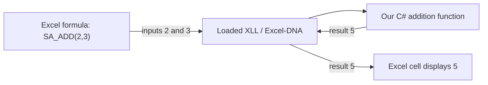

# Lesson 1 — Excel, C# and the XLL

3 September 2026. Stage: the shell-only Windows packet within original XLL P0. The aim is to understand what we will build and make one small observation in Excel. You do the exercise; the assistant helps explain the result.

The [original architecture](../../excel-dna-xll-product-architecture-decision.md) has now been compared with the Windows packet. The [current plan](../current-plan.md) preserves its phases. This lesson stays within the narrower shell scope; the broader architecture POC is not this exercise's completion gate.

## 1. The first thing we are building

We are starting with a small add-in that Excel can load. It will eventually show a StructAutomate Ribbon tab, open a diagnostic window and provide two simple worksheet functions: SA_HELLO and SA_ADD. This is the **shell**: the working container into which engineering calculations will later fit.

Think of setting up a workshop. Before checking a complicated component, we check the workbench, power connection and measuring instrument. Here we first prove that Excel can load our code, call it repeatedly and close cleanly. The numerical example stays simple so that a wrong result is easy to recognize.

The original task sets a Windows desktop Excel x64 add-in, Excel-DNA 1.9.0 and a .NET Framework 4.8 baseline. These are our task choices, not a claim that every Excel add-in needs the same architecture. [Original P0 task](../windows-p0-task.txt).

## 2. Five names you will see

| Term | Simple meaning in our project | Everyday comparison |
| --- | --- | --- |
| Workbook | The Excel document holding sheets, inputs and displayed results | A job notebook |
| C# | The language we use to write the product's instructions | The written procedure |
| Excel-DNA | The integration framework that exposes our .NET code to Excel | The connection between the workbench and instrument |
| XLL | The Excel add-in file that Excel loads | The packaged attachment fitted to the workbench |
| .NET runtime | The execution environment used by our C# code | The machinery that carries out the procedure |

Excel-DNA exposes .NET code through an XLL and can use compiled .NET libraries. An XLL and a workbook have different jobs: our workbook holds a job's data; our add-in supplies reusable functions and commands. See the [Excel-DNA introduction](https://excel-dna.net/docs/introduction/).

C# is a compiled language. The compiler processes source code and produces a binary assembly; the runtime executes the resulting program. We will learn the syntax gradually. You do not need to memorize every unfamiliar word before beginning. [Microsoft's C# overview](https://learn.microsoft.com/en-us/dotnet/csharp/tour-of-csharp/overview).

## 3. What happens when Excel calls our function?

Once SA_ADD has been implemented and registered, a worksheet formula such as =SA_ADD(2,3) will request our addition function. The following is the planned call path, not a claim that the function is installed now.



The code's job is simply to take two supplied numbers and return their sum. Excel-DNA supplies the integration; it does not independently check a future structural-engineering formula for correctness. Engineering validation remains our responsibility.

Consider this small C# reading example. It is not a complete add-in file or a command to run now:

```csharp
public static double SA_ADD(double number1, double number2)
{
    return number1 + number2;
}
```

- `SA_ADD` is the function's name.
- `number1` and `number2` are the inputs; the words are labels, not fixed values.
- `double` is a number type that can represent fractional values. Computer arithmetic has precision limits, which we will study when they matter.
- `return` sends the computed value back to the caller.
- The braces contain the function's body. We will explain `public` and `static` when we put the function inside its C# class.

For the small whole-number examples here, inputs 2 and 3 give 5; inputs 4 and 3 give 7. The same function can serve different cells because the values arrive as inputs. Registration, error handling and build settings belong to the later implementation lessons.

## 4. A function and a button do different jobs

A worksheet function computes a value. A Ribbon button starts a command when the user clicks it. For our P0, About and Diagnostics will be commands; SA_ADD will be a worksheet function.

**Pure function** means that the answer depends on its explicit inputs and it does not change outside state. Our demo functions must not read files, access Excel COM, contact a network or modify a model. Excel may recalculate formulas repeatedly, so a recalculation must not accidentally become a repeated external action. This is a requirement in our brief.

For a later engineering example, calculating a capacity from supplied values belongs in the calculation core. Changing an ETABS section belongs in an explicit reviewed command. A correct sum demonstrates the connection and simple computation; it says nothing about structural-code compliance.

## 5. Source, build and runtime are different

The `.cs` file contains the C# instructions. The `.csproj` file describes the project, including its target framework and package references. A build processes those instructions and settings. Excel-DNA can package the managed code into a single XLL for distribution. [ExcelDna.AddIn 1.9.0 package documentation](https://www.nuget.org/packages/ExcelDna.AddIn/1.9.0).

The developer's SDK supplies build tools; the runtime is what executes the program. Reference assemblies describe the APIs available for the chosen target. A machine may have a recent SDK while the project still targets an older supported framework. Our lessons will distinguish these instead of treating every version number as the same thing. [.NET Framework overview](https://learn.microsoft.com/en-us/dotnet/framework/get-started/overview), [reference assemblies](https://learn.microsoft.com/en-us/dotnet/framework/migration-guide/reference-assemblies).

One relevant documentation difference: the current [Excel-DNA getting-started tutorial](https://excel-dna.net/docs/getting-started/) uses a .NET 10 Windows target. Our preserved P0 specifies net48, with a conditional net8 comparison. We will adapt the tutorial's concepts to our agreed target rather than copy its target setting into this task. Packing an XLL does not remove every runtime or trust prerequisite.

For this project, x64 means the 64-bit add-in build intended for 64-bit Excel. The Excel process's architecture matters, so we check **Excel's** bitness directly. Knowing that Windows is 64-bit is not the same observation as reading Excel's bitness.

## 6. Your first exercise

Use a new blank workbook for this observation.

1. Open desktop Microsoft Excel and choose a blank workbook.
2. Open **File → Account → About Excel**. Record the Excel product/version/build line and whether it says **32-bit** or **64-bit**. If Account is absent, Microsoft's guidance also describes a Help route. The [Microsoft instructions](https://support.microsoft.com/en-us/office/lifecycle/lc-account/about-office-what-version-of-office-am-i-using) explain where to find the version and bitness.
3. Close the About dialog. Enter `2` in A1, `3` in B1 and `=A1+B1` in C1. Predict C1's result before pressing Enter, then observe it.
4. Change A1 to `4` and observe C1 again. The formula still has the same job, but one input changed. This is ordinary Excel arithmetic; it does not require our add-in. If C1 does not update, report what you see rather than changing workbook calculation settings yet.
5. Reply with the Excel version/build, bitness and the before/after C1 results. Copy the version text rather than the entire account page; product/account identifiers are unnecessary.

The expected arithmetic results are 5 and 7. Later, after we build and load the add-in, `=SA_ADD(A1,B1)` will illustrate the same input/output idea using our C# function. Today's exercise establishes where to check the installed Excel identity and how supplied inputs determine a displayed result. It does not establish that SA_ADD exists, that an XLL loads, or that P0 has passed.

The earlier saved preflight reported 64-bit Excel. Your observation is the current learning checkpoint; we will record what you actually see. If Excel reports 32-bit, tell me: it does not match the specified x64 baseline. If the formulas remain visible as text or show an unexpected result, copy exactly what appears so we can explain it.

## 7. What follows

After this observation, Lesson 2 explains the project folder, Git, preservation checks and build prerequisites. We will create the new project only after the original brief's checks pass. You will perform each small implementation step, and we will distinguish predicted output from observed evidence.

The current lesson and its completion status are recorded in the [learning record](README.md). The [research map](../research/README.md) stays available when a later design decision needs it.
