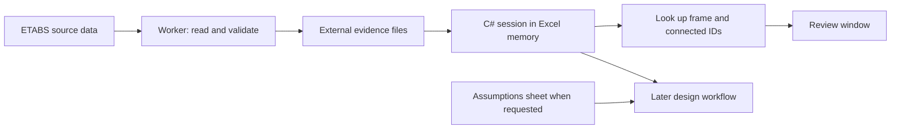
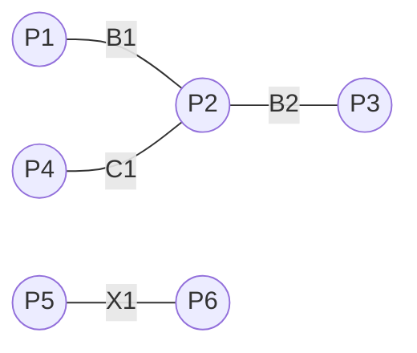

# Lesson 1 - Model data in memory with CSharp

**Type:** Guide
**Audience:** Engineers learning C#/.NET
**Status:** Active
**Importance:** High
**Created:** 2026-09-06
**Last Updated:** 2026-09-06
**Related Tasks:** WP10-05B-FORCES-PLAN
**Abstract:** Learn CSharp records, collections, LINQ and source-ID connectivity through the actual model session and a runnable invented-model lab.

---

## Your first useful result

By the end, you will find a beam, its endpoints and its neighbours **without querying ETABS again or writing a worksheet**. You will be able to read the real C# method that does this and make a small change yourself.

Allow 45–60 minutes. The core path is sections 1–6; then take a break or do the exercises. You only need basic variables, `if` and loops. We introduce the C# terms as they become useful. You do not need to understand structural design calculations yet.

[Course map](../README.md) · [Visual practice](practice.html) · [Next lesson](02-connect-workflow.md)

## 1. What are we building, and where does C# fit?

Our intended product is an Excel ribbon that connects to an ETABS model, understands its data, acquires forces, designs members, compares size candidates, checks supported candidates with our solver, and eventually reanalyses controlled ETABS copies. The engineer reviews assumptions, evidence and comparisons. Heavy model/result rows do not need to travel through worksheet cells just to be filtered.

Today, Connect captures **source geometry** and indexes it in memory. Full force acquisition through that journey, physical-span interpretation and complete automated design remain later work. This lesson teaches the foundation they need.



Think of the workbook as a project notebook and C# memory as the working desk. A dictionary on the desk lets us find a frame quickly. Saving the notebook does not automatically preserve everything on the desk.

| Word | Meaning here |
| --- | --- |
| C# | Language used to write the instructions |
| .NET runtime | Software that executes the compiled managed code |
| .NET SDK | Build/run tools, including the compiler; developers need this |
| `.cs` | A C# source file you can read and edit |
| `.csproj` | Which source files, dependencies and settings make one project |
| `.slnx` | A solution grouping our projects |
| `.dll` / `.exe` | Built assemblies/application output; source code must be built before changes run |
| `.xll` | The Excel add-in entry point that hosts our managed ribbon/functions |

The lesson is a console program: it prints text in a terminal. It references our real contracts and compiles the real `EtabsConnectionSession.cs` as a linked source file. It does **not** load the Excel-DNA host. C# records and methods can run without Excel because this particular session class has no Excel or ETABS calls.

## 2. Run before reading everything

In PowerShell, run these commands from this checkout. The first command deliberately sets the directory so there is no hidden starting-folder assumption.

```powershell
Set-Location C:\CodexWork\structural_engineering_lib\CSharp
dotnet --version
dotnet restore learning/ConnectionLessons/ConnectionLessons.csproj --locked-mode
dotnet run --project learning/ConnectionLessons -c Release --no-restore -- model B1
```

Use the SDK selected by [`global.json`](../../../../../CSharp/global.json): 10.0.400 with the configured patch roll-forward. `restore` resolves the recorded dependencies. `run` builds and runs the lesson. `-c Release` chooses a build configuration. `--no-restore` reuses that restore. Arguments after the final `--` go to **our program**: command `model`, frame ID `B1`.

No Excel or ETABS session is required. Building creates normal `bin`/`obj` outputs; the lesson itself does not read or write model/workbook files. Its source/process identifiers are invented, even though they fit the real contract shape.

Expected stock output:

```text
INVENTED MODEL | coordinates in mm | no live applications
Inventory: 4 frames, 6 points, 2 sections
Beams: B1, B2, X1
B1 endpoints: P1 -> P2
B1 neighbours: B2, C1
P2 incidence: B1, B2, C1
P2 and P5 share coordinates but not IDs; X1 is not connected to B1 by source ID.
Coverage: geometry and ID adjacency; no supports, physical spans, forces or design checks.
```

**First checkpoint:** find the output line that proves selection uses B1. Find the line that tells you this is not a completed design.

## 3. Meet our little model

All coordinates below are **global mm**. The sketch separates coincident points for readability; the table is the coordinate authority.



| Point ID | Xmm | Ymm | Zmm |
| --- | ---: | ---: | ---: |
| P1 | 0 | 0 | 3000 |
| P2 | 4000 | 0 | 3000 |
| P3 | 8000 | 0 | 3000 |
| P4 | 4000 | 0 | 0 |
| P5 | 4000 | 0 | 3000 |
| P6 | 4000 | 3000 | 3000 |

| Frame ID | Start → end IDs | Source orientation | Section ID |
| --- | --- | --- | --- |
| B1 | P1 → P2 | Beam | S-BEAM |
| B2 | P2 → P3 | Beam | S-BEAM |
| C1 | P4 → P2 | Column | S-COLUMN |
| X1 | P5 → P6 | Beam | S-BEAM |

**Predict:** Is X1 a neighbour of B1? Open [visual practice](practice.html), select B1, then X1. Reveal the explanation after making your prediction.

<details>
<summary>Answer: same location does not mean same source joint</summary>

B1 connects to P2; X1 connects to P5. The coordinates match but the IDs differ. The current index does not join these points. This could merit engineering review in a real model; silently merging them would change the source connectivity.

</details>

## 4. Read a record, one piece at a time

This is the actual point contract, from [`EtabsContextContracts.cs`](../../../../../CSharp/src/StructuralEngineering.Contracts/EtabsContextContracts.cs):

```csharp
public sealed record EtabsContextPoint(
    string SourcePointId, double Xmm, double Ymm, double Zmm);
```

Read it as: “Define a public point data type with one text ID and three numeric coordinates.”

| Syntax | How to read it |
| --- | --- |
| `public` | Other code may use this type |
| `sealed` | No derived type may inherit from it; this does not mean deeply immutable |
| `record` | A data-oriented type with generated properties, equality and useful printing |
| `string` | Text, such as `"P1"`; keep source IDs as text |
| `double` | Floating-point number; units come from the contract/name, not the numeric type |
| `(...)` here | Constructor parameters; positional record properties are generated from them |
| `;` | End of this declaration |

Create and read one:

```csharp
var point = new EtabsContextPoint("P1", 0, 0, 3000);
Console.WriteLine(point.Zmm); // Prints 3000.
```

`new` creates an instance. `var` asks the compiler to infer its type; `point` still has the fixed type `EtabsContextPoint`, not an unrestricted dynamic type. `.` accesses a member, such as the `Zmm` property. `//` starts a comment. `{ ... }` groups a method/class body in the larger files.

Our positional record is a **reference type** with generated value equality: separate point records with equal property values compare equal. These positional properties are init-only. A record containing a list or array does not automatically freeze that nested object. Use records to express data clearly; do not assume “record” means every value inside it is immutable. [Microsoft: records](https://learn.microsoft.com/en-us/dotnet/csharp/fundamentals/types/records).

In `SampleModel.cs`, the same construction is shortened:

```csharp
EtabsContextPoint[] points =
[
    new("P1", 0, 0, 3000),
    new("P2", 4000, 0, 3000)
];
```

`[]` after the type means array. The surrounding `[...]` creates the collection. Inside an explicitly typed array the compiler knows which type `new(...)` means. This is only a two-point illustration; the runnable fixture has all six points.

An `enum` is a named set of values. Compare orientation with `EtabsFrameDesignOrientation.Beam`, not by guessing that a name beginning with `B` must describe a beam. The fixture's X1 is deliberately a beam too.

## 5. Keep the inventory, add indexes, then select locally

Our session retains the full accepted geometry inventory and builds lookup structures over it. Selecting one frame does not discard all other frames.

| Structure | Example | Why it helps |
| --- | --- | --- |
| Array or list | All source frames | Iterate through the inventory |
| `Dictionary<string, EtabsContextFrame>` | `"B1"` → its frame record | Retrieve one exact ID without scanning every frame |
| `FramesAtPoint` | `"P2"` → `B1, B2, C1` | Discover endpoint neighbours |
| `IReadOnlyDictionary<...>` | The public `Frames` property | Expose lookup without dictionary-edit methods through this interface |

The words inside `<...>` are **type arguments**: key type, then value type for a dictionary. `IReadOnlyDictionary` does not make the entire object graph deeply immutable; the actual incidence values are arrays. Treat an accepted session as read-only rather than editing its exposed arrays.

The actual constructor builds the frame index like this:

```csharp
Frames = artifact.Inventory.Frames.ToDictionary(
    frame => frame.SourceFrameId,
    StringComparer.Ordinal);
```

`frame => frame.SourceFrameId` means “for each frame, use this property as the key.” This small function is called a **lambda**. `StringComparer.Ordinal` makes identifiers exact and case-sensitive. B1 and b1 are different keys.

The caller must supply an accepted artifact; the index constructor is not a substitute for artifact validation. Our fixture first calls `EtabsContextWorkerCodec.CreateArtifact(inventory)`, which checks the inventory's required shape and references. Invented identities passing this codec still do not prove any real ETABS read.

The lab filters all stored frames with **LINQ**, a set of C# collection-query methods:

```csharp
string[] beamIds = session.Frames.Values
    .Where(frame => frame.DesignOrientation == EtabsFrameDesignOrientation.Beam)
    .Select(frame => frame.SourceFrameId)
    .Order(StringComparer.Ordinal)
    .ToArray();
```

Read downwards: values → keep beams → take IDs → sort → materialize an array. `==` compares; `=` assigns. Most query stages describe work on an enumerable sequence; `ToArray()` enumerates and stores the resulting items. This is a query over memory, not an ETABS getter or database request. [Microsoft: LINQ operators](https://learn.microsoft.com/en-us/dotnet/csharp/linq/standard-query-operators/).

The filtering part written as a familiar loop:

```csharp
var beamIds = new List<string>();
foreach (var frame in session.Frames.Values)
{
    if (frame.DesignOrientation == EtabsFrameDesignOrientation.Beam)
        beamIds.Add(frame.SourceFrameId);
}
```

This loop version does not sort or convert to an array yet. `List<string>` can grow; `foreach` visits each value; `Add` appends it. LINQ packages those operations into a readable pipeline.

**Performance idea:** pay acquisition and index-building costs once per accepted capture, then reuse local lookups. Dictionary lookup is typically constant time; filtering all frames still visits all frames. This is not a timing benchmark, and “in memory” does not mean free or unlimited. Future force batches need their own case, station, unit and revision coverage.

## 6. How `Neighbours("B1")` works

Open the short real [`EtabsConnectionSession.cs`](../../../../../CSharp/src/StructuralEngineering.ExcelDna/EtabsConnectionSession.cs). Its constructor turns each frame into two `(Point, Frame)` pairs using `SelectMany`, groups the pairs by point using `GroupBy`, then builds `FramesAtPoint`.

For B1, its query goes through these stages:

| Stage | Result |
| --- | --- |
| Find `Frames["B1"]` | Endpoints P1 and P2 |
| Look up both endpoint lists | P1: B1; P2: B1, B2, C1 |
| `Concat` | B1, B1, B2, C1 |
| `Where(id => id != frameId)` | B2, C1 |
| `Distinct`, `Order`, `ToArray` | B2, C1, once each, sorted |

`!=` means “not equal.” The method returns an `IReadOnlyList<string>`: an ordered result of IDs. The record supplies data; the session class supplies this behaviour.

This tells us which frames share source endpoint IDs. It does **not** prove that C1 is an effective support, that B1 and B2 form one physical span, or that they must have the same size. Releases, offsets, support conditions, load paths and engineering grouping rules are not in this context. Collinearity alone cannot settle them. The longer-term design workflow needs those additional facts before assigning span-wide constraints.

We can draw source centreline geometry from the endpoints. We cannot infer section dimensions or concrete strength from the current section/material IDs. `DEMO-MATERIAL` carries no strength.

## 7. Your hands-on exercises

Make one change at a time, predict the result, run it and compare. Change only the lesson files for these exercises. Re-run `dotnet run` **without `--no-build` after editing** so the new code is compiled.

### A. Select a different frame — 3 minutes

```powershell
dotnet run --project learning/ConnectionLessons -c Release --no-restore -- model X1
dotnet run --project learning/ConnectionLessons -c Release --no-restore -- model b1
```

Predict neighbours before running. The second command intentionally returns exit code 1; in PowerShell, inspect `$LASTEXITCODE` immediately afterwards.

<details>
<summary>Answer</summary>

X1 has endpoints P5 → P6 and no source-ID neighbours. Lowercase b1 reports `Unknown exact frame ID 'b1'. Try B1, B2, C1 or X1.` This is an intentional lookup failure, not a broken compiler. The real product uses `TryGetValue` when accepting a user-supplied ID too.

</details>

### B. Show columns — 5 minutes

In [`Program.cs`](../../../../../CSharp/learning/ConnectionLessons/Program.cs), find `ShowModel`. Change its filter from `.Beam` to `.Column`; rename `beamIds` and the printed `Beams:` label to match. Predict and run the `model` command again.

<details>
<summary>Answer</summary>

The filtered list is `C1`. Other lines still describe the same complete inventory and selected B1. Filtering the displayed list did not delete the beams from the session. Restore those three edits when done; the printed stock output in this guide describes the original fixture.

</details>

### C. Add a local geometry measurement — 10 minutes

Inside `ShowModel`, **after** its successful `TryGetValue` guard, paste:

```csharp
var start = session.Points[frame.SourcePoint1Id];
var end = session.Points[frame.SourcePoint2Id];
double dx = end.Xmm - start.Xmm;
double dy = end.Ymm - start.Ymm;
double dz = end.Zmm - start.Zmm;
double chordLengthMm = Math.Sqrt(dx * dx + dy * dy + dz * dz);
Console.WriteLine($"Endpoint chord length: {chordLengthMm} mm");
```

`Math.Sqrt` takes a square root. `$"...{value}..."` inserts a value into a string. Run B1, C1 and X1. What does this number measure, and what does it leave out?

<details>
<summary>Answer</summary>

B1: 4000 mm. C1: 3000 mm. X1: 3000 mm. These are endpoint chord lengths, not clear design spans or bar cut lengths. No support-face widths, offsets, anchorage or bend geometry have been supplied. Coordinates are already mm; multiplying again by 1000 would introduce a unit error.

</details>

### D. Change connectivity on purpose — optional 10 minutes

In [`SampleModel.cs`](../../../../../CSharp/learning/ConnectionLessons/SampleModel.cs), change only X1's start ID from P5 to P2. Predict B1's neighbours and run `model B1`. Then undo that one edit.

<details>
<summary>Answer</summary>

B1 now has B2, C1 and X1 as neighbours. You changed topology without changing a coordinate. The stock self-check should fail while that edit remains because it intentionally expects the original disconnected X1. Do not “fix” that assertion just to make your experiment pass; restore the fixture after learning from it. This experiment is not permission to merge points in a real model automatically.

</details>

## 8. Debugging without guessing

| Symptom | First useful check |
| --- | --- |
| `dotnet` unavailable or SDK mismatch | Check `dotnet --info` against `CSharp/global.json`; SDK is required, runtime alone is insufficient |
| Project file cannot be found | Check `Get-Location`; the commands above start in `CSharp` |
| Missing restore assets | Run the exact locked restore command; do not delete lock files |
| Edited code appears unchanged | Omit `--no-build`; check that you edited the lesson project in this checkout |
| Unknown frame ID | Compare exact casing and `session.Frames.Keys` |
| Inventory validation rejects your edit | Check unique IDs, endpoint references, section references and finite coordinates |
| Different number/decimal formatting | Console number formatting follows local culture; the numeric unit is still explicit |

If using a debugger, put breakpoints at `SampleModel.Create`, the `TryGetValue` call in `ShowModel`, then `Neighbours`. Inspect `frame`, `FramesAtPoint["P2"]` and the returned IDs. Step over a line to see its result; step into a method to follow how it is produced. No debugger setup is required to complete the terminal exercises.

## 9. Finish with an explain-back

Without copying the page, explain: what is a record, why do we index by IDs, what does `Where` keep, and why is a neighbour not yet a physical span? Then run the stock check after restoring any fixture/filter experiments:

```powershell
dotnet run --project learning/ConnectionLessons -c Release --no-restore -- check
```

Expected: `PASS: stock model indexes + all 7 teaching scenarios.` The second line states that this is lesson verification, not installed acceptance or engineering design. Lesson 2 explains those seven scenarios. A passing check does not record you as having completed the exercises.

## Source map and what to read next

| File | Read now | Leave for later |
| --- | --- | --- |
| [SampleModel.cs](../../../../../CSharp/learning/ConnectionLessons/SampleModel.cs) | Points, frames, sections, creation order | Hash helper mechanics |
| [Program.cs](../../../../../CSharp/learning/ConnectionLessons/Program.cs) | `ShowModel` | Async entry point and workflow branch: Lesson 2 |
| [Context contracts](../../../../../CSharp/src/StructuralEngineering.Contracts/EtabsContextContracts.cs) | Point, frame, section, inventory records | Canonical JSON implementation |
| [Actual session](../../../../../CSharp/src/StructuralEngineering.ExcelDna/EtabsConnectionSession.cs) | Constructor and `Neighbours` | Nothing else: this file is deliberately small |
| [Lesson project](../../../../../CSharp/learning/ConnectionLessons/ConnectionLessons.csproj) | Contract reference and linked production session | It adds no Excel/ETABS runtime dependency |

Continue with [Lesson 2](02-connect-workflow.md): how does this accepted context arrive in the correct workbook while Excel remains usable?
