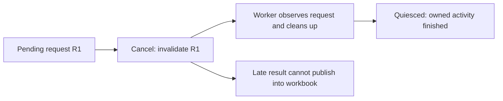

# Lesson 2 - Follow Connect ETABS from ribbon to result

**Type:** Guide
**Audience:** Engineers learning C#/.NET
**Status:** Active
**Importance:** High
**Created:** 2026-09-06
**Last Updated:** 2026-09-06
**Related Tasks:** WP10-05B-FORCES-PLAN
**Abstract:** Trace the real asynchronous Excel-worker-ETABS workflow and practise request ownership, late results and cancellation without installed applications.

---

## A click is the start of a conversation

By the end, you will trace **Connect ETABS from the ribbon to the correct workbook**, explain why the work continues in the background, and debug a late result without treating it as mysterious async behaviour.

Allow 45–60 minutes. Complete [Lesson 1](01-model-data.md) first. Read sections 1–6 for the core path, then try the experiments. No Excel or ETABS is needed for this lesson. Our workflow lab is an explicitly simplified simulator; the source map points to the real implementation.

[Course map](../README.md) · [Visual practice](practice.html)

## 1. Predict the problem

You click Connect in **workbook A**, then switch to **workbook B** while data is being read. Which workbook should receive the result?

Now make it harder: A closes and another workbook opens with the same name before the result arrives. Is matching the name sufficient?

Run the first scenario from PowerShell:

```powershell
Set-Location C:\CodexWork\structural_engineering_lib\CSharp
dotnet restore learning/ConnectionLessons/ConnectionLessons.csproj --locked-mode
dotnet run --project learning/ConnectionLessons -c Release --no-restore -- workflow switch
```

Expected stock output:

```text
SIMULATION: switch
  1. Start R1 for workbook A; button returns started.
  2. Completion is waiting; the caller can continue.
  3. User switches to B; R1 still belongs to A.
  4. Simulated worker finishes cleanup; only now deliver its reply.
  5. accepted into A
Final: active=B; A.context=True; B.context=False; cleanup=True
```

The result belongs to the operation's initiating workbook, even when another workbook is active. “Started” only means the request was launched. It is not success, a context or a design result.

## 2. Put each responsibility in its place

```mermaid
sequenceDiagram
    participant U as Engineer
    participant X as Excel main thread / ribbon
    participant C as Background client in Excel process
    participant W as Separate worker / STA broker
    participant E as Selected ETABS process
    U->>X: Connect in workbook A
    X->>X: Bind workbook entry + request ID
    X->>C: Start async connection
    X-->>U: Started; Excel remains usable
    C->>W: Verified worker + request.json
    W->>E: Exact-process read-only getters
    E-->>W: Source context + getter observations
    W->>W: Validate, journal, cleanup, quiesce
    W-->>C: Completed response + context evidence
    C->>C: Validate identity, hashes and completion
    C->>X: QueueAsMacro completion
    X->>X: Recheck A's entry + current request
    X-->>U: Store context for A; show review
```

This diagram is the successful path. A failure can report an early terminal status while worker cleanup continues. A cancelled or stale operation must not replace the workbook's context.

| Term | Concrete meaning |
| --- | --- |
| Process | An application instance with its own address space: Excel, our worker, ETABS |
| Thread | An execution path inside a process; Excel's main thread owns our Excel UI work |
| Task | A .NET object representing work/completion; it is not itself another process |
| `async` / `await` | Let a method suspend while an operation is incomplete, then continue |
| STA | Single-threaded apartment: the worker's broker provides the thread/COM context required for its ETABS calls |
| Broker | Our owner for serialized ETABS work, lease, deadline, cancellation and cleanup |
| COM | The Windows object interface used to talk to installed applications |
| JSON | Structured text carrying typed requests, responses and evidence between processes |

`await` does not automatically create a thread or process. The production command explicitly uses `Task.Run` to schedule background work. The client explicitly starts the worker executable. The worker uses its broker's STA for ETABS access. These are three separate decisions. [Microsoft: async scenarios](https://learn.microsoft.com/en-us/dotnet/csharp/asynchronous-programming/async-scenarios).

## 3. Follow the real code in six stops

Open each file and search for the named method rather than reading every file from top to bottom.

### Stop 1 — The ribbon names the action

[`StructAutomateRibbon.cs`](../../../../../CSharp/src/StructuralEngineering.ExcelDna/StructAutomateRibbon.cs) contains the Connect button's XML and this callback:

```csharp
public void OnConnectEtabs(IRibbonControl control) => OfflineCommands.ConnectEtabs();
```

`void` means the callback does not return a value. `IRibbonControl` is the button/control information. `=>` here is a short method body, not the collection lambda from Lesson 1; both use the same arrow syntax. The callback delegates work to the command owner.

In [`EtabsConnectionCommands.cs`](../../../../../CSharp/src/StructuralEngineering.ExcelDna/EtabsConnectionCommands.cs), `ConnectEtabs()` calls `ConnectEtabsProcess(0)`. Zero means offer available processes; it is not an ETABS process ID. No running process gives an actionable message; one is selected directly; several need a choice. **Current Connect attaches to a running ETABS instance; it does not launch ETABS or open a model dialog.** Those ideas from the product discussion are not implemented by this button yet.

An `[ExcelCommand(...)]` line above a method is an **attribute**: metadata registering it as a command. It is not a worksheet formula. `partial class OfflineCommands` means the same class's code is split across files.

### Stop 2 — Capture ownership before leaving the main thread

The command uses `Run(...)` to bind the workbook entry and capture its identity. It rejects a second pending connection for that workbook. It creates a request ID with `Guid.NewGuid()` and a cancellation source, records pending state and resolves the package/evidence locations.

Think of the request ID as a numbered claim ticket. The workbook entry is the actual customer record. We need both: a ticket can become obsolete, and a reopened workbook can have the same visible name but a different entry.

### Stop 3 — Start background work; return promptly

This is a **shortened teaching excerpt** from the command; error handling and cancellation checks are omitted here. Use the actual source for implementation:

```csharp
_ = Task.Run(async () =>
{
    var result = await EtabsConnectionClient.ConnectAsync(
        package, root, choice, requestId, token).ConfigureAwait(false);

    ExcelAsyncUtil.QueueAsMacro(() =>
        CompleteConnection(key, entry, requestId, result, null));
});
```

Read it in order:

1. `Task.Run` schedules the supplied function on the thread pool.
2. `async () => { ... }` is an asynchronous anonymous function with no arguments.
3. `await` waits logically for the client result while allowing the method to suspend.
4. `ConfigureAwait(false)` avoids requiring the captured synchronization context for that continuation. It does not move work into ETABS or make Excel calls safe.
5. `QueueAsMacro` asks Excel-DNA to execute completion later on Excel's main thread in a suitable macro context.
6. `_ =` deliberately discards the task value here. The real implementation catches errors, stores the exception for completion, and handles cancellation/unload; this excerpt alone is not a complete fire-and-forget recipe.

Do not replace the dispatch with a workbook write inside the background function. Excel UI work returns through its dispatcher. [Excel-DNA: asynchronous work and QueueAsMacro](https://excel-dna.net/docs/guides-advanced/performing-asynchronous-work/).

### Stop 4 — The client handles the process/file boundary

[`EtabsConnectionClient.cs`](../../../../../CSharp/src/StructuralEngineering.ExcelDna/EtabsConnectionClient.cs), `ConnectAsync`, has no Excel or CSI API calls. It binds the selected process to its PID, start time, executable path and executable hash; validates the packaged worker; creates an operation directory; and starts the worker hidden.

| External file | Job |
| --- | --- |
| `request.json` | Request identity, exact target, deadline and evidence destination |
| `context.json` | Captured geometry artifact and source/provenance identity |
| `response.json` | Final operation result, completion/cleanup state and artifact reference |
| `response.json.terminal` | Possible non-completed status before cleanup finishes |
| `request.json.cancel` | Cooperative cancellation signal to the worker |
| Referenced getter journal | Raw observation evidence; filename/hash are referenced by provenance |

The client validates returned request/target identity, artifact content identity, expected paths and raw-journal identity. Completed acceptance also requires the relevant cleanup, quiescence and successful worker exit. A matching hash establishes content identity; it does not establish structural correctness or prove a live model remains unchanged forever.

In the current client the request deadline is two minutes. That bounds the operation's decision path; it is not a promise that a blocked COM getter can always be interrupted or cleaned up within two minutes. Ownership remains with the operation until cleanup is resolved. The client does not kill ETABS or silently retry a failed read.

### Stop 5 — The worker owns ETABS access

[`Program.cs` in the worker](../../../../../CSharp/tools/StructAutomate.EtabsWorker/Program.cs) reads the request, observes cancellation, starts the broker and waits for its completion and quiescence. [`EtabsContextCapture.cs`](../../../../../CSharp/src/StructuralEngineering.Etabs/EtabsContextCapture.cs) owns this context getter profile.

The capture uses bulk `FrameObj.GetAllFrames` and `PointObj.GetAllPoints`, plus per-frame orientation and referenced-section material identity, with source/state checks. “Bulk” does not mean exactly one API call for the whole operation. The qualified source profile is ETABS 23.3.1 with present/database unit ID 6 (kN-m-C); coordinates are converted to mm once. This profile is defined by our checked implementation, not a claim of support for every ETABS version or unit setting.

The worker saves evidence externally. Worksheet cells are not the temporary storage for the heavy inventory. No analysis, force capture, material-strength inference or model change belongs to this Connect operation.

### Stop 6 — Accept into the initiating workbook

Back in `EtabsConnectionCommands.cs`, the first gate in `CompleteConnection` is real product code:

```csharp
if (!Entries.TryGetValue(key, out var current)
    || !ReferenceEquals(current, expectedEntry)
    || current.ConnectionRequestId != requestId)
    return;
```

| Expression | What it protects |
| --- | --- |
| `TryGetValue(..., out var current)` | Workbook entry still exists; `out` supplies the retrieved value |
| `!` | Negates true/false |
| `||` | Logical OR; later parts are skipped once an earlier part is true |
| `ReferenceEquals` | This is the same entry object, not merely the same visible workbook name |
| `ConnectionRequestId != requestId` | This result still belongs to the current operation |
| `return` | Leave without publishing a stale result |

The guard is checked again inside workbook-bound `Run(..., key)`. On a completed, accepted result the command creates the session from Lesson 1 and displays context. Selection then uses `ReviewContextFrame` and memory indexes with `etabs_reads = 0`.

Workbook close/unload invalidates requests and evicts session state. Reopening requires Connect again. Cancelling a new connection can leave a previous accepted context intact; it must not pretend that old data is a fresh capture.

## 4. Learn async using a predictable simulation

Open [`WorkflowSimulation.cs`](../../../../../CSharp/learning/ConnectionLessons/WorkflowSimulation.cs). It has no process, file, timer, COM or Excel calls. A `TaskCompletionSource` lets the lesson decide **exactly when a pretend worker result becomes available**:

```csharp
var worker = new TaskCompletionSource<WorkerReply>();
Task<string> pending = CompleteWhenReadyAsync(worker.Task, books, original, events);

// Change workbook state here while the completion method is awaiting worker.Task.

worker.SetResult(new WorkerReply("R1", accepted, CleanupCompleted: true));
string outcome = await pending;
```

`Task<string>` means the eventual result is text. `SetResult` completes the promise represented by `worker.Task`. Before that, `await worker` inside the completion method suspends it. There is no sleep or speed-dependent race. This example does not need a background thread to demonstrate asynchronous waiting. Its in-memory dictionaries are not a recipe for sharing mutable state across threads.

`bool` holds `true`/`false`. The fixture's mutable `WorkbookEntry` class has `{ get; set; }` properties because pending state changes. `string?` means the value may be null; null represents “no current request” here. The entry's object identity matters. `WorkerReply` is a record because it carries a result message.

The program's `async Task<int> Main(string[] args)` is the entry point: arguments in, eventual exit code out. `switch` chooses a command/scenario. `try`/`catch` converts a lesson error to a readable message and nonzero exit code. In production, exception handling must also preserve cleanup and request ownership; console printing alone is insufficient.

### Where the simulation stops

The simulator models entry/request guards after a reply. It does not execute the real client, broker, signatures, file validation or Excel dispatcher. It marks cleanup complete at a controlled teaching step; it does not test real cleanup. In production, cancellation can stop the callback before it is queued, and a malformed/mismatched worker reply is rejected by the client earlier. The simulator's `stale` scenario specifically models a late R1 after a newer R2 owns the entry, not malformed JSON.

## 5. Experiment, then explain the result

Use [visual practice](practice.html#workflow) to choose each scenario and advance one step at a time. Predict whether A or B will receive context before the final step. Run the C# counterpart:

```powershell
dotnet run --project learning/ConnectionLessons -c Release --no-restore -- workflow all
```

| Scenario | What changes while R1 waits? | Expected result |
| --- | --- | --- |
| `success` | Nothing | Accept into A |
| `switch` | Active workbook becomes B | Accept into A; B gets nothing |
| `close` | A's entry is evicted; B becomes active | Ignore: workbook closed |
| `reopen` | A gets a new entry object | Ignore: workbook entry replaced |
| `stale` | A's current request becomes R2 | Ignore: request no longer current |
| `cancel` | Pending request cleared; cleanup follows | Ignore: request no longer current |
| `reject` | Reply is not accepted | Reject; publish no context |

The stock fixture begins with no previous context. In the real product an older accepted context can survive a rejected/cancelled refresh. For a closed workbook, the console's `A.context=False` means there is no resident A entry/context; it does not mean the closed workbook has been modified.

### Exercise A — See suspension — 5 minutes

In `WorkflowSimulation.RunAsync`, immediately after `Task<string> pending = ...`, add:

```csharp
events.Add($"Before reply: completed={pending.IsCompleted}");
```

Immediately after `string outcome = await pending;`, add:

```csharp
events.Add($"After reply: completed={pending.IsCompleted}");
```

Run `workflow switch`. Predict both values before running.

<details>
<summary>Answer</summary>

Before: False. After: True. Calling an async method can return an incomplete task, allowing the caller to keep working. Awaiting the task later gets its eventual result. You did not need Excel, a thread-pool job or a new process for this experiment. Restore the two output edits when comparing against stock transcripts.

</details>

### Exercise B — Break one guard locally — 10 minutes

In the **lesson simulator only**, temporarily remove the two lines for the `ReferenceEquals` guard in `CompleteWhenReadyAsync`. In the `reopen` scenario, initialize the replacement entry with `PendingRequestId = "R1"`. This deliberately creates a key/request collision in a new object. Run `workflow reopen`, then restore both edits.

<details>
<summary>Answer and why both edits matter</summary>

Without the entry-identity check, the fabricated replacement can receive the old result. Removing only that guard from the stock fixture would still fail the request check, because the new entry's pending ID is null. Combining the two teaching edits isolates what the identity guard contributes. Do not remove a production guard or “repair” self-check expectations to hide the experiment.

</details>

### Exercise C — Diagnose from evidence — 10 minutes

For each statement, name the first owner you would inspect:

1. Button returns `started`, but no context is published yet.
2. A valid old result arrives after A closed and reopened.
3. Selected frame looks wrong even though the context was accepted.
4. Cancel was clicked but the worker is still cleaning up.

<details>
<summary>Answers</summary>

1. Connection status/client response and worker evidence. `started` alone does not tell you success or failure; inspect pending state, diagnostics and cleanup.
2. `CompleteConnection`: workbook entry identity and request guards. Ignoring that result is correct.
3. `ReviewContextFrame`, exact frame ID, session indexes and captured artifact. Check source selection before blaming ETABS acquisition.
4. Client active-worker ownership, terminal/final response and broker quiescence. Cancellation is a request; it does not forcibly interrupt arbitrary COM work. Do not start repeated competing operations or kill ETABS to make a status disappear.

</details>

## 6. Cancellation is an ownership problem too

A `CancellationTokenSource` signals intent; the operation must observe its token and cooperate. Cancellation alone does not mean resources have been released. [Microsoft: task cancellation](https://learn.microsoft.com/en-us/dotnet/standard/parallel-programming/task-cancellation).



The product's lease prevents another operation from claiming the same ETABS process while the previous operation still owns it. A result can be unavailable while cleanup is still in progress. This distinction matters for a future overnight runner: a retry must follow known ownership/state, not simply another button press after a delay.

## 7. A debugging route you can reuse

| Symptom | Where to look | Avoid assuming |
| --- | --- | --- |
| Connect says open ETABS first | Process choices in command/client | That Connect launches ETABS today |
| Multiple instances exist | Exact selected process identity | First visible window equals target |
| Worker fails to start/validate | Client, package manifest, process/file diagnostics | That the geometry algorithm failed |
| Response is rejected | Request ID/hash, target, paths, journal and response state | That “JSON exists” means accepted |
| Model details do not update after model edits | Capture time/source identity; acquire a new supported capture | That this session continuously synchronizes |
| Completion disappears after close/cancel | Request/entry guards and token state | That every ignored late result is a defect |

Useful breakpoints, in order: `OnConnectEtabs`, `ConnectEtabsProcess`, `ConnectAsync`, worker entry point, context capture, `CompleteConnection`, `ReviewContextFrame`. A debugger attached only to Excel does not automatically follow code inside the separate worker process. Start with console simulation and source reading; live debugging needs the installed acceptance procedure and exact process/package identity.

Avoid `.Wait()` or `.Result` on the Excel UI thread for this workflow: blocking it prevents normal UI work and can interfere with a completion that needs that thread. Use the established async/dispatch path.

## 8. Finish by tracing the whole journey

Explain, in your own words:

1. Which code owns the button, the worker process, ETABS calls and workbook updates?
2. Why does switching to B not send A's result to B?
3. How are task, thread and process different?
4. Why is `Cancelled` different from cleanup having finished?
5. Which data is in memory, which evidence is on disk, and what is absent from worksheets?
6. Why is a completed Connect still not a designed beam?

Run the stock check after undoing experiments:

```powershell
dotnet run --project learning/ConnectionLessons -c Release --no-restore -- check
```

Expected: `PASS: stock model indexes + all 7 teaching scenarios.` This verifies the teaching fixture and scenarios; installed Excel/ETABS acceptance has its own evidence. Your learning record should contain your own predictions, edits, output and explanations.

## Source map and the next coding packet

| Owner | Responsibility |
| --- | --- |
| [Ribbon](../../../../../CSharp/src/StructuralEngineering.ExcelDna/StructAutomateRibbon.cs) | Button → command |
| [Commands](../../../../../CSharp/src/StructuralEngineering.ExcelDna/EtabsConnectionCommands.cs) | Workbook request state, completion guard, context review |
| [Workbook command owner](../../../../../CSharp/src/StructuralEngineering.ExcelDna/OfflineCommands.cs) | Workbook identity, entry lifecycle and main-thread command wrapper |
| [Client](../../../../../CSharp/src/StructuralEngineering.ExcelDna/EtabsConnectionClient.cs) | Worker/process/file protocol and acceptance |
| [Worker](../../../../../CSharp/tools/StructAutomate.EtabsWorker/Program.cs) | Request → broker → completion/quiescence |
| [Capture](../../../../../CSharp/src/StructuralEngineering.Etabs/EtabsContextCapture.cs) | Qualified geometry getters and evidence |
| [Contracts](../../../../../CSharp/src/StructuralEngineering.Contracts/EtabsContextContracts.cs) | Typed messages, context validation and content identity |
| [Simulator](../../../../../CSharp/learning/ConnectionLessons/WorkflowSimulation.cs) | Teaching-only ownership scenarios |

The next implementation packet is the existing-force handoff, with explicit member/case/combination/station/unit/revision coverage, followed by the broader product sequence in the [workflow plan](../../etabs-design-workflow.md). The same separation remains useful: acquire required data, validate it, index it, select locally, design with declared assumptions, and retain evidence for comparisons. These two lessons prepare you to read, explain and debug that work; they do not claim that the later buttons or overnight automation are already complete.
