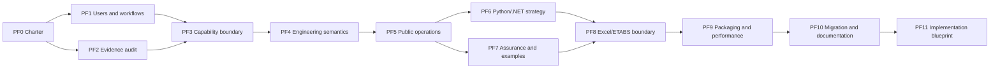

# Structural library definition programme

This is the required pre-implementation programme for the reusable structural-engineering libraries and the future Windows Excel/ETABS product. It is deliberately separate from the XLL implementation phases P0–P6. No new product implementation starts from this programme until PF0–PF11 have produced an approved implementation blueprint.

The programme is necessary because a language port would otherwise preserve earlier ambiguity: application-specific contracts in common code, inconsistent meanings for cover and optional values, incomplete construction quantities, weak separation between capacity and member approval, and Python/.NET schemas that look similar without sharing one engineering definition. The purpose of this work is to make those decisions once, explicitly, and carry them into both languages.

## Programme outcome

At the end of PF11, the project will have one reviewable definition of:

- who uses the libraries and the end-to-end workflows they must support;
- the reusable calculations, design checks, member services and application adapters;
- engineering quantities, units, signs, axes, identities, optional values and result meanings;
- professional public operations and idiomatic Python and .NET projections;
- the evidence needed to trust each calculation and complete member decision;
- Excel, ETABS, optimization, construction and reporting boundaries;
- packaging, dependencies, performance, compatibility and release expectations; and
- an ordered implementation blueprint with bounded work packages and acceptance evidence.

The programme does not treat the current Python package as automatically correct or the current C# solution as the normative API. Both are evidence. Useful code can be retained after its meaning and evidence pass the definition programme.

## Relationship to the other plans

Read the planning set in this order:

1. this definition programme and its machine-readable [programme](programme.json) and [decision register](decision-register.json);
2. the [automation catalogue](../automation/README.md), including the 26 operation needs, schemas, sources and examples;
3. the [C# foundation](../../../../CSharp/README.md), as executable evidence of current boundaries;
4. the [Python/.NET library research](../reusable-library-research.md), including peer-library patterns, ETABS semantics and previous mistakes;
5. the [requirements-first evidence](../requirements-first/README.md), including the three-project inventory and historical failure register; and
6. the original [XLL architecture decision](../../excel-dna-xll-product-architecture-decision.md), whose P0–P6 implementation meanings remain unchanged.

PF0–PF11 define what should be built. P0–P6 describe how the Windows product is later delivered. The separate six-phase beam programme continues to govern the breadth and technical maturity of beam capabilities. PF11 must reconcile all three before proposing implementation work.

## Working rules

1. **Requirements precede signatures.** A public operation exists only when a named user or workflow needs it and its engineering purpose is distinct.
2. **Meaning precedes language shape.** Semantic operations are defined once; Python and C# expose idiomatic projections without changing the engineering meaning.
3. **Applications depend on libraries.** Excel cells, workbook state, ETABS COM objects, file paths and UI state stay out of calculation contracts.
4. **Substantial services remain reusable.** Whole-member design, reinforcement resolution, BBS records, quantities and bounded optimization can be library services when they do not require a running application.
5. **Every effective input is visible.** Units, signs, code edition, selected policy, defaults and derived values are explicit in the request or returned effective-input record.
6. **Result meanings remain distinct.** Capacity, demand check, required reinforcement, selected reinforcement, whole-member completeness and engineering approval cannot be collapsed into one Boolean.
7. **Evidence travels with engineering outcomes.** Code rule/table/case provenance, applicability, example identity and execution basis are retained in structured results where they matter.
8. **Source permission is already settled.** The recorded permission for normalized IS-code content is accepted. Each public release still follows the repository's release authorization and evidence process.
9. **Planning evidence is not numerical validation.** Passing this programme proves that the work is specified and traceable. It does not prove a formula or application integration until the later implementation evidence passes.
10. **No silent omissions.** A required check that cannot be evaluated is reported as unevaluated with a reason; it cannot disappear from a whole-member conclusion.

## Phase map



PF1 and PF2 may gather evidence concurrently, but PF3 cannot close until both are complete. Later phases may return a decision to the phase that owns its missing evidence. They do not bypass that phase's exit conditions.

| Phase | Decides | Primary artefact |
| --- | --- | --- |
| PF0 | Purpose, users, authority and success | Product and library charter |
| PF1 | Real user journeys and information flow | Workflow catalogue |
| PF2 | What existing assets prove and where they fail | Evidence and asset audit |
| PF3 | Capability scope and reusable/application boundaries | Capability map |
| PF4 | Shared engineering vocabulary and semantics | Semantic model |
| PF5 | Professional operation contracts and signatures | Public operation catalogue |
| PF6 | Python/.NET parity, schemas and package ownership | Cross-language contract strategy |
| PF7 | Calculation assurance, examples and tolerances | Assurance matrix and conformance corpus plan |
| PF8 | Excel, ETABS, optimization and command boundaries | Application integration contracts |
| PF9 | Dependencies, packaging, deployment and performance | Runtime and non-functional specification |
| PF10 | Migration, compatibility, versioning and learning material | Adoption and documentation plan |
| PF11 | Complete order of implementation | Costed and gated implementation blueprint |

## Programme progress

PF0 is complete. Its [charter and exit review](pf0/README.md) resolve D01 with
five definition artefacts and measurable ownership. PF1 workflow discovery and
PF2 existing-asset audit are next and may proceed in parallel; PF3 waits for
both. The machine-readable programme now contains 59 deliverables across the 12
phases.

## PF0 — Product and library charter

**Purpose.** Establish why the library exists, who owns engineering and product decisions, and what success means before defining features.

**Work.** Name the primary users; define the standalone Excel beam-design workflow and the later ETABS automation loop; identify normal-library use outside Excel; state supported platforms and initial design-code scope; record decision owners; set measurable outcomes for correctness, usability, performance, interoperability and maintainability; define what PF0–PF11 may and may not decide.

**Outputs.** A one-page charter, user/owner map, success measures, programme glossary and scope-authority record.

**Exit conditions.** Each desired outcome has a measure and owner. The initial product workflow and reusable-library purpose are both stated. Application delivery and library capability are not treated as the same thing. No implementation deliverable appears in the charter.

## PF1 — Users, workflows and information flow

**Purpose.** Describe what people must accomplish, including inputs, decisions, corrections and deliverables, without assuming the current UI or API is correct.

**Work.** Walk through standalone beam design in Excel; Python script/notebook use; C# service use; ETABS extraction, checking, redesign, candidate comparison and reanalysis; detailing, bar paths, BBS, quantities, pricing, formwork measurement and reports; reviewer correction and reproducibility. For each journey, record the starting information, missing-information decisions, transformations, approval points, outputs and failure recovery.

**Outputs.** Workflow narratives and diagrams, actor/responsibility matrix, input/output inventory, application-boundary map and scenario set covering ordinary, continuous, redistributed, torsion-affected, seismic-detailing and serviceability-controlled beams.

**Exit conditions.** Every proposed capability is demanded by at least one workflow. Each workflow names the engineering information that ETABS cannot supply. Standalone use does not depend on ETABS. Excel recalculation does not make live ETABS calls. Construction outputs trace back to resolved reinforcement and declared fabrication policies.

## PF2 — Evidence and existing-asset audit

**Purpose.** Decide what can be trusted, corrected, reused or retired across the Python project, the C# foundation, StructProof and the sourcebook.

**Work.** Inventory public and de facto Python APIs, C# contracts, schemas, examples, source references, tests, issue/session evidence and external-library patterns. Trace recorded mistakes to their causes and prevention rules. Distinguish current behavior, historical repairs, declared limitations and unverified assumptions. Check ETABS installed/API evidence separately from live behavior. Record the provenance and edition of design-code data.

**Outputs.** Asset catalogue, public-surface map, source/provenance register, failure-prevention register, reusable-pattern register and evidence-strength classification.

**Exit conditions.** Every existing public operation has a disposition candidate: retain, correct, wrap for compatibility, replace or omit from the new common set. No function is ported only because it exists. Historical failures have prevention rules. Claims about current code are separated from proposals and live-application claims.

## PF3 — Capability scope and library boundaries

**Purpose.** Define the complete capability model and place each responsibility in a reusable module, an application adapter or a later extension.

**Work.** Decompose foundations, materials, sections, load/action data, analysis, flexure, shear, torsion, serviceability, anchorage, curtailment, laps, seismic detailing, bar placement, constructability, bar paths, BBS, quantities, pricing, formwork measurement, candidate generation, optimization, Excel, ETABS and report rendering. Map AO01–AO26 and the beam-programme requirements. Define dependencies between capabilities and supported beam/topology limits. Separate formwork quantity measurement from temporary-works design.

**Outputs.** Capability map, responsibility/dependency matrix, initial supported-profile definitions, application-boundary decisions and exclusions with a reason and later decision owner.

**Exit conditions.** All 26 automation needs and every target capability family are mapped. Reusable calculations contain no workbook, COM, process or file-rendering dependency. Whole-member design and fabrication data can run from ordinary Python or C# callers. Every excluded behavior is visible and cannot be mistaken for supported behavior.

## PF4 — Engineering semantic model

**Purpose.** Give both languages and all adapters the same physical and engineering meaning.

**Work.** Define quantities and dimensions; internal unit policy and conversion boundaries; signs, local/global axes and physical reinforcement faces; stations, spans, supports, clear faces and member topology; material and reinforcement identities; ULS/SLS action bases and duration; code edition/data revision; required, provided, selected and scheduled quantities; applicability; optional/absent/default/derived values; tolerance/rounding; source, normalized-input and execution identities.

**Outputs.** Quantity dictionary, unit/sign/axis convention, topology model, optional-value policy, effective-input model, result-state vocabulary, provenance/identity model and terminology crosswalk from legacy names.

**Exit conditions.** Ambiguous legacy terms such as `cover_mm` have one new physical meaning or an explicit compatibility translation. Zero, blank and absent are not interchangeable. A concurrent action vector is distinguishable from component envelopes and response results. SLS basis is independent of ULS basis. Equivalent Python and .NET values can be compared without guessing units or meanings.

## PF5 — Public operations and professional signatures

**Purpose.** Design a discoverable API that supports both small calculations and complete member workflows.

**Work.** Define API levels for value calculations, code checks, design/selection, whole-member services, analysis/search services and adapter commands. For every public operation specify its semantic ID, purpose, applicability, request fields, units, coordinate/sign basis, conditional and conflicting fields, optional-resolution policy, effective inputs, named outputs, diagnostics, engineering result states, provenance, examples, performance class and compatibility policy. Produce idiomatic Python and C# signature sketches only after the semantic contract is complete.

**Outputs.** Public operation catalogue, request/result schemas, naming rules, Python and C# signature projections, diagnostic catalogue and operation-to-workflow traceability.

**Exit conditions.** Every public operation has at least one valid example and one meaningful rejection or inapplicability example. Capacity, check, design and approval remain distinct. Small arithmetic operations stay small. Large traces and candidate tables are opt-in. The same semantic operation has equivalent effective inputs and outcomes in both languages.

## PF6 — Python/.NET parity and package strategy

**Purpose.** Decide how two native libraries remain aligned without forcing either language into an unnatural API.

**Work.** Select the maintained common capability set; identify language-specific conveniences; define ownership of semantic schemas, normalized design-code data, examples and conformance vectors; decide which artifacts are generated and which are handwritten; specify serialization/canonicalization where interchange requires it; map modules/namespaces; define package dependency direction and version compatibility.

**Outputs.** Common-capability matrix, Python package map, .NET assembly/namespace map, schema projection rules, interchange/version rules and drift-detection plan.

**Exit conditions.** “Parity” has a measurable definition per operation. Cross-language conformance does not assume identical internal implementations or spelling. Generated schemas cannot silently redefine handwritten domain logic. Vendor-specific details stay in adapter packages. Raw artifact, normalized engineering input and execution receipt have separate identities.

## PF7 — Engineering assurance and example strategy

**Purpose.** Define how each formula, lookup, interpolation, check, member result and combined decision will be shown to be correct.

**Work.** Build an assurance class for each operation; identify authoritative clauses/tables/figures and normalized data; define hand-worked examples, boundary and interpolation nodes, invariants, independent numerical or experimental oracles, Python/.NET conformance vectors, tolerances and review records. Define whole-member completeness rules and evidence for selected versus scheduled reinforcement. Separate expected engineering failure from software failure.

**Outputs.** Assurance matrix, example taxonomy, conformance-corpus specification, tolerance policy, source-data verification plan, whole-member aggregation rules and review-signoff record format.

**Exit conditions.** Every design-code operation has a source and assurance method. Every lookup/interpolation includes node, interior and limit cases. Required checks cannot disappear from an aggregate result. Cross-language agreement is treated as conformance, not independent proof. Example cases cover flexure, shear, torsion, serviceability, detailing, constructability and construction quantities.

## PF8 — Excel, ETABS and coupled-automation boundary

**Purpose.** Define safe application contracts around the reusable libraries and the full automation loop.

**Work.** Specify immutable analysis snapshots; ETABS process/model/case/result selection; return-code and array validation; units, axes, object/element stations and physical-face mapping; result action classification; stale-result invalidation; Excel UDF versus command behavior; worksheet error mapping; main-thread COM rules; import/recalculate/report commands; candidate application to a model copy; fixed-demand search versus stiffness-changing reanalysis; transaction receipts and rollback/recovery expectations.

**Outputs.** ETABS acquisition contract, vendor-neutral snapshot contract, Excel function/command catalogue, coupled optimization state machine, model-mutation transaction design, workbook error/diagnostic mapping and installed-application acceptance plan.

**Exit conditions.** A worksheet function can run from an immutable snapshot with no live COM call or workbook mutation. ETABS rows preserve complete source identity and action meaning. A component envelope cannot be used as a concurrent vector without an explicit justified treatment. Candidates that change global stiffness require new analysis evidence. Model changes target an identified copy and produce a transaction receipt.

## PF9 — Packaging, dependencies, deployment and performance

**Purpose.** Define the environments in which the libraries and XLL must install, load and perform predictably.

**Work.** Select supported Python and .NET runtimes; Excel bitness and Excel-DNA target; ETABS version/client compatibility; package names and optional dependency groups; deterministic build and schema generation; native/COM dependency isolation; logging/diagnostics; cold-load, recalculation, batch and optimization performance budgets; benchmark datasets; memory and cancellation expectations; signed artifact and update strategy.

**Outputs.** Runtime compatibility matrix, dependency policy, packaging layout, deployment/diagnostic specification, performance budgets, benchmark plan and artifact/release evidence plan.

**Exit conditions.** The pure libraries install without Excel or ETABS. Optional adapters fail with actionable diagnostics. Performance claims identify data size, environment and percentile/measurement method. Kernel, workbook and live-application benchmarks are distinct. The later XLL acceptance environment and release evidence are defined.

## PF10 — Migration, compatibility, versioning and documentation

**Purpose.** Let existing users move to the new design without carrying ambiguous behavior into the future.

**Work.** Give every old public Python and C# operation a final disposition; define compatibility translations and warnings; set semantic-versioning rules for code/data/schema changes; plan package and namespace adoption; define cookbook, API reference, engineering notes, migration guide and end-to-end examples; specify how source revisions and corrected examples propagate to both languages.

**Outputs.** API disposition ledger, compatibility/migration matrix, versioning policy, documentation architecture, example curriculum and release/adoption sequence.

**Exit conditions.** Every existing public caller has an identified path or a documented unsupported reason. Compatibility wrappers translate meanings rather than perpetuate ambiguity. Users can find a small calculation, a complete beam example, an Excel workflow and an ETABS workflow. Code-data revisions and software versions remain distinguishable.

## PF11 — Integrated review and implementation blueprint

**Purpose.** Combine the completed decisions into the only plan from which implementation is authorized to proceed.

**Work.** Review traceability from charter to workflow to capability to operation to assurance to application acceptance. Resolve cross-phase conflicts. Divide implementation into bounded vertical work packages with dependencies, expected files/packages, acceptance examples, performance evidence and later release gates. Estimate effort and identify the critical path. Reconcile work packages with the XLL P0–P6 meanings and the six-phase beam programme.

**Outputs.** Integrated architecture and API baseline, traceability report, ordered implementation backlog, dependency graph, effort/risk estimate, acceptance-evidence matrix and first implementation packet.

**Exit conditions.** Every implementation item traces to a defined operation and required evidence. No package boundary, public signature, effective-input rule or application transaction is left for accidental invention during coding. The first work packet is small enough for independent review and useful enough to exercise the architecture. Programme owners approve the blueprint before implementation begins.

## Required registers and evidence

The machine-readable [programme](programme.json) is the structural control for phase order, capability coverage and deliverables. The [decision register](decision-register.json) assigns every consequential decision to a resolution phase and names the evidence required to settle it. Run:

```powershell
./scripts/python_runtime.sh docs/planning/xll-product/library-definition/validate_programme.py
```

The validator checks structure and traceability only. It does not certify structural calculations.

Each phase review must include:

- inputs used and their dates or revisions;
- decisions made and their rationale;
- changed assumptions and downstream effects;
- deliverables with stable identifiers;
- evidence for every exit condition;
- decisions returned to an earlier phase and the required missing evidence; and
- the reviewer and decision owner.

## Definition of pre-implementation readiness

PF0–PF11 are complete only when all of the following are true:

- every target capability and AO01–AO26 maps to workflows, ownership, public operations and assurance;
- every public operation records purpose, applicability, inputs, units, optional rules, effective inputs, results, diagnostics, provenance, examples and compatibility;
- Python and .NET projections share semantic IDs and conformance vectors while remaining idiomatic;
- every engineering check has a source, applicability boundary, tolerance and independent assurance plan;
- Excel and ETABS adapters cannot introduce duplicate engineering formulas;
- action meaning, axes, stations, physical faces and stale-result rules are defined before ETABS results reach checks;
- resolved reinforcement drives constructability, bar paths, BBS, quantities and priced scope;
- migration dispositions cover the existing public surfaces;
- installation, performance and live-application acceptance environments are named; and
- PF11 supplies an ordered, estimated, reviewable implementation blueprint.

When these conditions are met, implementation can begin with controlled uncertainty. Until then, the current code remains valuable evidence and working software, but it cannot substitute for the missing library definition.

## Decision path at a glance

- **PF0–PF2 · D01–D03:** settle success, real workflows and the disposition of existing assets.
- **PF3–PF4 · D04–D09:** settle capability boundaries, supported profiles and the shared engineering semantic model.
- **PF5 · D10–D11:** settle API levels and the information required in every professional public operation.
- **PF6–PF7 · D12–D15:** settle cross-language alignment, schema/data ownership, assurance evidence and numerical comparison rules.
- **PF8–PF10 · D16–D22:** settle ETABS action meaning, Excel commands, reanalysis, runtimes, performance, migration and documentation.
- **PF11 · D23:** settle the implementation order from the completed evidence and dependency graph.
