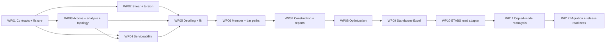

# PF11 — integrated implementation blueprint

PF11 is complete. [baseline.json](baseline.json) is the machine-readable
implementation authority produced from PF0-PF10. It traces every operation,
defines twelve bounded work packets, estimates effort/risk, states acceptance
evidence and fixes the first implementation packet.

## D23 decision

Implementation should proceed through twelve dependency-ordered packets grouped
into three milestone PRs with multiple commits:

1. **IMP-M1 — pure dual-language libraries:** contracts and flexure; shear and
   torsion; action/analysis/topology; serviceability; detailing/fit; complete
   member and bar paths; construction/reporting; candidate search.
2. **IMP-M2 — standalone Excel product:** one signed x64 XLL milestone with pure
   functions, versioned tables, explicit commands, rollback, sample workbook,
   installed lifecycle and performance evidence.
3. **IMP-M3 — ETABS and release readiness:** getter-only snapshot import,
   copied-model reanalysis transaction, migration, clean-host packaging,
   performance and release preflight.

This grouping follows the owner preference for fewer PRs while keeping each
internal commit reviewable. Each milestone runs its union of focused evidence
after content freezes and uses one hosted PR cycle.

## Dependency map

The working estimate is **109–164 engineer-days** for one experienced
implementer with focused review access. It includes implementation, focused
tests, engineering/application evidence and documentation, and excludes waiting
for external approval/licensing or publication operations. The high-risk areas
are flexure/data authority, serviceability, physical detailing/member
aggregation, Excel lifecycle and non-idempotent ETABS reanalysis.

## First packet

WP01 is the useful host-free flexure slice. It creates the
authored semantic/schema/code-data/conformance authorities, implements PF4
contracts in Python and .NET, and delivers bar area, mass, effective depth,
flexural capacity, reinforcement geometry and flexure checking. It covers both
bending signs, rectangular singly/doubly reinforced and eligible flanged
sections using actual bar coordinates.

The packet ends with independent E4 examples, Python/.NET E3 conformance,
canonical identity parity, current-call compatibility translations and normal
library quickstarts. Excel, ETABS, shear, torsion, serviceability, whole-member
design, search, construction outputs and publication remain later packets.

## Programme reconciliation

The original XLL P0-P6 meanings remain intact: runtime lifecycle, focused C#
kernel, read-only ETABS, solver/optimizer, workbook delivery, copied-model
transaction and commercial hardening map to WP01-WP12. PF9 updates the target
from an earlier net8/net48 comparison to the now supported/evidenced .NET 10
path; this does not turn the current XLL foundation into installed acceptance.

The six-phase beam/ETABS programme also remains intact. Pure operations can be
implemented and qualified from explicit inputs, but they do not close ETABS
acquisition, normalization, reconstruction, design, optimization or reanalysis
phases until the corresponding WP10/WP11 installed and source gates pass.
Standalone Excel can therefore be delivered first without pretending the
coupled ETABS programme is complete.

## Exit review

- Fifteen architecture invariants and seven authority paths are frozen.
- AO01-AO26 each trace through semantics, capabilities, workflows, parity,
  assurance, application, package, migration and one work packet.
- FO01-FO08 and WP01-WP12 all have owners in the backlog.
- Every work packet has concrete outputs, exclusions and required evidence.
- WP01 fixes exact scope, paths, commit sequence, acceptance and stop rules.

PF0-PF11 are definition-complete and WP01 is ready as the first implementation
packet. Release and professional approval remain separate decisions.
