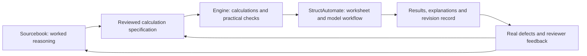

**Dated evidence summary.** Published from the 3 September research workspace. Local paths describe the original observations; they are not prerequisites for reading this copy or proof of the current checkout. Machine-only evidence remains outside this bundle.

# How strong is our underlying engineering work?

3 September 2026 — substantive source review of the structural library, StructProof, Sourcebook and the developing StructAutomate product. This answers the depth question; the separate [readiness audit](foundation-readiness.md) records versions, CI, legacy defects and deployment gaps.

**My judgment: we have a substantial engineering foundation that goes beyond a basic formula collection. It could become a major product strength. Its present depth is uneven, and its combined customer value is not yet demonstrated.** The strongest opportunity is the connection between calculations, actual reinforcement choices, worked references, explanations and revision history.

That judgment is about inspected implementations. It is not based on repository size, function counts, case counts or green CI badges. Nor is it a claim that the mathematics is unique in the market.

## 1. What “depth” means here

For this assessment, a basic formula collection accepts a few numbers and returns an answer. A deeper engineering system also handles:

1. **Different physical cases:** changing geometry, support conditions, load directions or material behaviour changes the calculation appropriately.
2. **Interactions:** a bar arrangement affects effective depth, spacing, anchorage and other checks, rather than only total steel area.
3. **Hard boundaries:** near a capacity limit, a change in the input gives the correct change in disposition; missing information stays visible.
4. **Independent evidence:** expected results come from a defensible reference or another method, with the independence described accurately.
5. **Engineering decisions:** it can explain why a proposal works, fails or needs more information, and compare meaningful alternatives.
6. **Continuity through revisions:** the result, explanation and report remain tied to the exact inputs and calculation used.

These are useful assessment criteria, not a universal industry scoring standard.

| Asset | Where the substance lies | My current judgment |
| --- | --- | --- |
| `structural_engineering_lib` | Actual mechanics, practical reinforcement checks, bounded analysis and candidate evaluation | **Substantial technical asset**, with supported and experimental areas that must remain distinct |
| StructProof | Explicit calculation contracts, proof steps, exclusions and numerical boundary handling | **Useful calculation and review architecture**, strongest in the inspected beam scope |
| Sourcebook | Worked arithmetic, rule explanations, boundary examples and separate replay | **Potentially important knowledge asset**, with useful regression depth and uneven curation |
| StructAutomate product | Bringing calculation, worksheet/model context, approval and evidence into an engineer's work | **Potential place where these assets produce customer value**; the complete connection is still being built |
| Older beam/column projects | Real office workflows, input fields, export ideas and automation lessons | **Useful experience and requirements**, with prototype calculations/control flow that need selective replacement |

## 2. Concrete evidence of depth in the structural library

### Actual reinforcement is treated as more than a steel-area number

The supplied-reinforcement code checks explicit bar layers, horizontal and vertical spacing, aggregate clearance, separation between opposing groups, effective depth and anchorage. It calculates the reinforcement centroid from the actual layer arrangement and compares it with the depth used in design. Missing support-width information can prevent an accepted anchorage outcome.

In simple terms: two arrangements can contain the same amount of steel while placing that steel differently. They may occupy different space and produce different effective depths. A function that only compares provided area with required area misses this interaction. The inspected code explicitly handles several parts of it. See [reinforcement evaluation](https://github.com/Pravin-surawase/structural_engineering_lib/blob/0589f7cbc81c40b2cac1499524844057c3ceacda/Python/structural_lib/services/beam_reinforcement.py#L352) and [depth/spacing tests](https://github.com/Pravin-surawase/structural_engineering_lib/blob/0589f7cbc81c40b2cac1499524844057c3ceacda/Python/tests/unit/test_beam_reinforcement.py#L99).

**Why it matters:** this supports checking an engineer's chosen reinforcement and explaining why a superficially adequate arrangement needs revision. That is useful engineering behaviour to carry into the product.

**Boundary:** the sampled route excludes bundled bars, general curtailment/lap positioning, joint congestion, construction sequencing and complete seismic capacity design. Those excluded interactions cannot be inferred from its bar-spacing checks.

### Geometry and material behaviour change the calculation route

The beam implementation contains separate singly reinforced, doubly reinforced and flanged-section logic. Doubly reinforced calculations derive compression-steel stress from strain compatibility. Flanged calculations distinguish whether the neutral axis is in the flange or web and include limiting-capacity branches. This is a more substantial implementation than applying one approximate lever arm to every section. See [doubly reinforced calculations](https://github.com/Pravin-surawase/structural_engineering_lib/blob/0589f7cbc81c40b2cac1499524844057c3ceacda/Python/structural_lib/codes/is456/beam/flexure.py#L474) and [flanged-section branches](https://github.com/Pravin-surawase/structural_engineering_lib/blob/0589f7cbc81c40b2cac1499524844057c3ceacda/Python/structural_lib/codes/is456/beam/flexure.py#L727).

The broader low-level function surface and the narrower supported public contract are different things. The presence of a low-level function does not establish that every public workflow supports that geometry, material range or combined loading.

### Some calculations are connected through detailing and schedules

An inspected integration case carries separate longitudinal/stirrup grades and effective-depth basis into a combined beam calculation, retains primary and opposite tension faces under torsion, then checks detailing and bar-bending schedule output. A companion test mirrors the primary tension face and checks that the resulting top/bottom bar roles follow it. See the [connected regression examples](https://github.com/Pravin-surawase/structural_engineering_lib/blob/0589f7cbc81c40b2cac1499524844057c3ceacda/Python/tests/integration/test_w3_reinforcement_root_causes.py#L60).

**Why it matters:** a correct strength number is insufficient if the schedule places the required reinforcement on the wrong face. These tests address consistency between engineering decisions and downstream output, not just isolated arithmetic.

These are authored software fixtures. They do not establish that the entire current ETABS building has been checked or that every detailing situation is covered.

### There is an implemented beam-line analysis solver

The beam-line module assembles beam stiffness matrices and solves the resulting equations. It handles bounded combinations, supports, releases, rigid offsets and load/station behaviour. Its numerical solve includes scaling and unstable-system checks. This is actual analysis code, rather than an API wrapper around ETABS. See [matrix assembly and solve](https://github.com/Pravin-surawase/structural_engineering_lib/blob/0589f7cbc81c40b2cac1499524844057c3ceacda/Python/structural_lib/services/beam_line.py#L120).

The selected tests compare reactions, moments and displacements with explicit closed-form solutions for simply supported, fixed and cantilever cases; other cases check continuity, releases and load-pattern behaviour. Comparing a matrix solver with separately expressed analytical equations is meaningful evidence of implementation correctness for those cases. See [closed-form tests](https://github.com/Pravin-surawase/structural_engineering_lib/blob/0589f7cbc81c40b2cac1499524844057c3ceacda/Python/tests/unit/test_beam_line.py#L148).

**Why it matters:** this can support controlled comparisons, understanding load redistribution and checking selected analysis assumptions. It is not a complete 3D building-analysis engine or established general ETABS equivalence. Its [calibration layer](https://github.com/Pravin-surawase/structural_engineering_lib/blob/0589f7cbc81c40b2cac1499524844057c3ceacda/Python/structural_lib/services/beam_line_calibration.py#L25) keeps that distinction explicit.

### Candidate comparison has useful engineering discipline, with a limited search model

The candidate evaluator reconstructs quantities and geometry from a proposed schedule: reinforcement centroids, clearances, steel mass, stirrup count, concrete volume, formwork and stated-rate cost. It uses the supplied-beam checker and requires evidence for additional mandatory checks. Missing mandatory information results in a hold. See [composition](https://github.com/Pravin-surawase/structural_engineering_lib/blob/0589f7cbc81c40b2cac1499524844057c3ceacda/Python/structural_lib/services/beam_candidate_evaluator.py#L380) and [feasibility evaluation](https://github.com/Pravin-surawase/structural_engineering_lib/blob/0589f7cbc81c40b2cac1499524844057c3ceacda/Python/structural_lib/services/beam_candidate_evaluator.py#L678).

Search then evaluates a supplied finite candidate list, ranks accepted candidates and calculates trade-offs among cost, steel mass and a congestion measure. It distinguishes complete enumeration from an exhausted budget. See [ranking and search](https://github.com/Pravin-surawase/structural_engineering_lib/blob/0589f7cbc81c40b2cac1499524844057c3ceacda/Python/structural_lib/services/beam_candidate_search.py#L350).

This is useful groundwork for answering “which permitted alternative is preferable under these assumptions?” Its current search is finite enumeration without pruning. The evaluator requires external supplemental evidence for torsion, serviceability and laps; its schedule/quantity basis has explicit limits, including full-span single layers and omitted lap/curtailment allowances. It is not an autonomous whole-building optimizer, a proof of the cheapest constructible building or a complete cost model.

The depth here comes from correctly connecting a candidate to checks and quantities. It does not require claiming a novel optimization algorithm.

### The substance extends beyond beams

The non-beam sample found several different engineering mechanisms, not repeated interfaces around the beam calculation:

| Area | Actual implemented engineering | Important limit |
| --- | --- | --- |
| Stable columns | Concrete/steel strain and stress, displaced-concrete subtraction, axial-load/moment envelopes and a connected minimum-eccentricity/uniaxial/biaxial workflow | The supported reinforcement idealization uses equal steel on two faces, rather than arbitrary perimeter bars |
| Experimental column P–M–M | Rotated strain planes, concrete fibres and individual bars with signed bending about two axes; a 45° analytical reference checks the numerical section response | Experimental rectangular short sections; not the accepted general public column route |
| Footing load transfer | Compares column and footing bearing, evaluates excess force, and checks dowel quantity and anchorage into both members | Explicit concentric-transfer and bearing-area assumptions; not a general connection design |
| Footing design/detailing | Rechecks one-way shear using the bars actually provided, rather than retaining only the earlier required-steel estimate | Still a bounded footing workflow; selected candidate search is not global optimization |
| IS 13920 confinement and joints | Competing confinement equations, actual geometry/spacing/area checks, and direction/topology-sensitive strong-column/weak-beam checks | Partial seismic checks; supplied joint capacities are not independently established by the joint equation, and complete joint acceptance is outside scope |

Sources: [column mechanics](https://github.com/Pravin-surawase/structural_engineering_lib/blob/0589f7cbc81c40b2cac1499524844057c3ceacda/Python/structural_lib/codes/is456/column/uniaxial.py#L190), [column workflow](https://github.com/Pravin-surawase/structural_engineering_lib/blob/0589f7cbc81c40b2cac1499524844057c3ceacda/Python/structural_lib/services/column_api.py#L1261), [P–M–M integration](https://github.com/Pravin-surawase/structural_engineering_lib/blob/0589f7cbc81c40b2cac1499524844057c3ceacda/Python/structural_lib/codes/is456/column/pmm.py#L233), [analytical P–M–M benchmark](https://github.com/Pravin-surawase/structural_engineering_lib/blob/0589f7cbc81c40b2cac1499524844057c3ceacda/docs/verification/column-pmm-benchmark.md#L26), [load transfer](https://github.com/Pravin-surawase/structural_engineering_lib/blob/0589f7cbc81c40b2cac1499524844057c3ceacda/Python/structural_lib/codes/is456/footing/load_transfer.py#L217), [provided-bar feedback](https://github.com/Pravin-surawase/structural_engineering_lib/blob/0589f7cbc81c40b2cac1499524844057c3ceacda/Python/structural_lib/services/footing_api.py#L836), [confinement](https://github.com/Pravin-surawase/structural_engineering_lib/blob/0589f7cbc81c40b2cac1499524844057c3ceacda/Python/structural_lib/codes/is13920/column.py#L239), [joint contract](https://github.com/Pravin-surawase/structural_engineering_lib/blob/0589f7cbc81c40b2cac1499524844057c3ceacda/Python/structural_lib/codes/is13920/joint.py#L214).

The footing feedback is particularly useful evidence of depth. An existing regression holds the earlier screening result while one supplied-bar arrangement fails the recalculated shear check and another passes. The software makes the actual provided arrangement govern the supported final check. That models the way one engineering choice changes another check. See the [numerical regression](https://github.com/Pravin-surawase/structural_engineering_lib/blob/0589f7cbc81c40b2cac1499524844057c3ceacda/Python/tests/test_footing_api.py#L185).

Established equations do not make this work trivial. Defining the physical inputs correctly, selecting the right branch, connecting checks and preserving useful failure evidence are substantial implementation tasks. Their presence supports a positive assessment of our foundation. The remaining limits determine where that foundation can responsibly be used.

## 3. Why Sourcebook and StructProof can matter as much as formulas

StructProof's inspected beam service ties a request to explicit schema/unit checks, a numerical kernel, calculation steps, issues, limitations and an input identity. That supports explanations such as: what calculation was performed, which inputs governed it, and why the route accepted or rejected the case. See [the service](https://github.com/Pravin-surawase/structproof/blob/280829fc4d8fc5186235c97042e029c3a83df7f6/src/structproof/design/service.py#L191) and [kernel](https://github.com/Pravin-surawase/structproof/blob/280829fc4d8fc5186235c97042e029c3a83df7f6/src/structproof/checks/rc_beam_is456.py#L231).

Sourcebook adds worked examples and a separately implemented beam replay. This can help us teach the calculation, reproduce a disputed result and compare a C# translation against another method. A separate replay is more useful than asking the same function to calculate its own expected answer. See [the replay implementation](https://github.com/Pravin-surawase/structural-engineering-design-examples-sourcebook/blob/0b8ffeefa93a5772e0a9e15a532cdef534e0686b/scripts/replay_beam_rectangular_flexure.py#L1).

However, the strength of a knowledge library depends on the quality and independence of its records, not just how many it contains. A hundred variations generated from one implementation can thoroughly test stability around that implementation's boundaries while providing only a few distinct engineering methods.

**Independence has several levels:** using another function name is weak; a separately written algorithm is stronger; a separately derived expected result is stronger still; independent engineering review adds a different kind of assurance. Passing one level does not automatically satisfy the others.

The deeper review found both substantial content and specific limits:

| Inspected content | What demonstrates depth | What it does not establish |
| --- | --- | --- |
| Sourcebook supplied-flexure ledger | 33 records: 29 numerical cases, two validation matrices and two unsupported-condition matrices; branches include compression reinforcement and flange/web transitions | These are not 33 independent design problems: 16 of the 29 numerical cases deliberately test equality or ±1 part per million, and another repeats a normal case with converted units |
| StructProof torsion geometry | Distinguishes longitudinal corner-bar centres from stirrup geometry; missing geometry blocks the check | Three credited pass/fail/equality examples can use the same physical scenario with only spacing changed; “57 credited Beam cases” is not 57 independent mechanisms or external reviews |
| Sourcebook serviceability | Cracked/gross section properties, effective inertia, creep/shrinkage and separate retained methods | Some newer methods have no exact sibling comparator; the record preserves a long-span disagreement rather than establishing universal agreement |
| Sourcebook column mechanics | Concrete strip integration, circular chord geometry, discrete bars and signed bending with unsymmetrical reinforcement | A separate replay using more strips retains the same physical assumptions; it is not an independent engineering interpretation |
| Sourcebook footing pressure | Signed biaxial corner pressures, explicit service/ultimate distinctions, action-origin/weight assumptions and zero-contact-pressure boundary | Partial contact/uplift redistribution and soil settlement are outside that pressure model |

Evidence: [flexure coverage](https://github.com/Pravin-surawase/structural-engineering-design-examples-sourcebook/blob/0b8ffeefa93a5772e0a9e15a532cdef534e0686b/sourcebook/routes/beam_rectangular_flexure/coverage_matrix.csv#L2), [torsion geometry tests](https://github.com/Pravin-surawase/structproof/blob/280829fc4d8fc5186235c97042e029c3a83df7f6/tests/test_beam_torsion_geometry.py#L74), [correlated torsion evidence](https://github.com/Pravin-surawase/structproof/blob/280829fc4d8fc5186235c97042e029c3a83df7f6/benchmarks/accepted/is456_beams/bmc_039_torsion_shear_edge_internal.json#L202), [serviceability implementation](https://github.com/Pravin-surawase/structural-engineering-design-examples-sourcebook/blob/0b8ffeefa93a5772e0a9e15a532cdef534e0686b/scripts/beam_calculations.py#L550), [preserved long-span discrepancy](https://github.com/Pravin-surawase/structural-engineering-design-examples-sourcebook/blob/0b8ffeefa93a5772e0a9e15a532cdef534e0686b/sourcebook/routes/beam_serviceability/comparisons.json#L229), [column integration](https://github.com/Pravin-surawase/structural-engineering-design-examples-sourcebook/blob/0b8ffeefa93a5772e0a9e15a532cdef534e0686b/scripts/column_v1_calculations.py#L434), [column replay](https://github.com/Pravin-surawase/structural-engineering-design-examples-sourcebook/blob/0b8ffeefa93a5772e0a9e15a532cdef534e0686b/scripts/replay_column_verification.py#L380), [footing coverage](https://github.com/Pravin-surawase/structural-engineering-design-examples-sourcebook/blob/0b8ffeefa93a5772e0a9e15a532cdef534e0686b/sourcebook/routes/footing_pressure/coverage_matrix.csv#L2).

Boundary variants are valuable. Testing just below, exactly at and just above a limit is how we discover wrong inequalities and branch selection. They should be counted as regression depth, while different physical problems should be counted as engineering breadth. Mixing those counts overstates how much independent knowledge the collection represents.

**A concrete curation defect needs attention before using generated explanations in product reports.** In BEAM-RFLEX-028, the narrative gives D=500, d=450, Fe500 and Ast≈1284.83, while the frozen inputs and calculation steps use D=700, d=630, Fe415 and Ast=3000. The text still lists flanged sections as unsupported although the case calculates a T-section. The generator copies an earlier record and updates only some fields, leaving old explanatory content behind. This establishes inconsistent explanation/input metadata, not a numerical error in the calculated result. See the [example](https://github.com/Pravin-surawase/structural-engineering-design-examples-sourcebook/blob/0b8ffeefa93a5772e0a9e15a532cdef534e0686b/sourcebook/routes/beam_rectangular_flexure/examples/BEAM-RFLEX-028.json#L28), [frozen case](https://github.com/Pravin-surawase/structural-engineering-design-examples-sourcebook/blob/0b8ffeefa93a5772e0a9e15a532cdef534e0686b/sourcebook/routes/beam_rectangular_flexure/cases.json#L1907) and [authoring code](https://github.com/Pravin-surawase/structural-engineering-design-examples-sourcebook/blob/0b8ffeefa93a5772e0a9e15a532cdef534e0686b/scripts/author_beam_rflex_extension_records.py#L96).

This matters particularly because clear explanations could become our strength. The source material already has useful mechanics; it needs stronger consistency checks and editorial review before those explanations can be trusted as teaching or customer-facing material.

## 4. Where the combination could become a product strength

This is the potential advantage: a change discovered in practice can improve the worked explanation, the calculation and the regression case together. A result can be explained and reproduced across product revisions.

For example, imagine an engineer changes the chosen beam bars. A valuable product would re-evaluate the arrangement, show which checks changed, retain the earlier decision and issue an updated scoped report. It would also know whether a section/model change requires fresh analysis. Our existing projects contain meaningful parts of this chain; the complete delivered chain is not yet proved.

After release, this connection can help answer customer questions, investigate errors and assess which calculations are affected by an amendment or implementation correction. During development, it can reduce repeated derivation and expose mistakes sooner. The actual saving in development or review time has not been measured.

## 5. What is useful but does not establish distinctiveness

- **Standard design equations:** implementing them correctly is necessary and valuable, but other products can implement them too.
- **Excel buttons and API wrappers:** they provide access; the value depends on what the complete task becomes easier to do.
- **Hashes and status records:** they can prove identity and detect changes. They cannot prove that the original engineering assumption was correct.
- **Large case inventories:** these may include parameter variations, invalid-input matrices and repeated methods. Their purpose must be counted honestly.
- **Sophisticated experimental algorithms:** they demonstrate technical substance while still needing scoped acceptance and integration.

The earlier market work already found calculations, reports and revision functions in competing products. This depth audit does not compare every competitor's internal algorithms, which are often not available to inspect. Therefore it supports **“substantial reusable engineering asset”**, not **“unique or superior to the market.”** The public library alone is also available for others to build on.

## 6. The most valuable improvement is better connected evidence

Before declaring the collection a major demonstrated product advantage, I would select a small set of genuinely different engineering problems and connect each one through:

**problem and assumptions → independently derived reference → implementation → actual reinforcement/checks → understandable explanation → revision example.**

Useful examples would exercise different physical mechanisms, such as a beam needing compression reinforcement, a flanged-section branch, torsion changing the opposite face, reinforcement that has enough area but does not fit, and a changed section that invalidates previous analysis. The selection must stay inside the explicitly chosen product scope; this is a proposed evaluation method, not an expansion of P0.

For each example, record whether the answer came from the same authoring code, a separate method or an independently reviewed calculation. Check the words, units and drawings alongside the numbers. A correct number with an incorrect explanation weakens the very product strength we want to build.

**The opportunity is real:** much of the hard groundwork already exists. Its strongest next development is a smaller, coherent and well-reviewed engineering chain, with demonstrated usefulness, rather than increasing the number of functions or example files.
