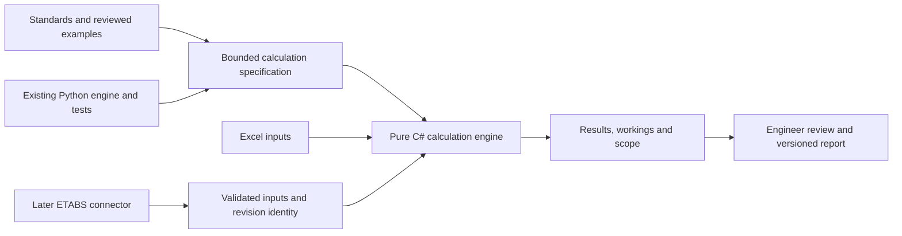

**Dated evidence summary.** Published from the 3 September research workspace. Local paths describe the original observations; they are not prerequisites for reading this copy or proof of the current checkout. Machine-only evidence remains outside this bundle.

# StructAutomate: are our foundations good enough?

For the user's clarified question about substantive engineering depth and distinctive product value, read the [engineering-depth assessment](engineering-depth.md). This document supplies the supporting readiness and repository evidence.

Assessment date: 3 September 2026. Basis: inspected local source, retained verification records, a narrow rerun of existing tests, and the subsequently requested live GitHub project review. Competitor research remains paused. Section 12 adds the GitHub findings and corrects the limits of the initial mirror-only view.

**Yes: the existing work is a useful foundation for developing a focused product. It is not yet evidence of a completed, validated or commercially competitive end-to-end product.** Keep the engineering knowledge, calculation contracts, reference cases, ETABS observations and recovery patterns. Select what the new C# product needs at each stage.

Think of building a vehicle: we have useful engine components, measuring equipment and some tested control mechanisms. We still have to assemble and prove the vehicle that the customer will drive. Good components reduce development work; they do not establish how the assembled product behaves.

## 1. What was actually assessed

This was a bounded source and evidence review, with two specialist reviewers covering the engineering library and reference projects, then the related GitHub repositories. It was not a full code audit, a new engineering certification, an installed application test or a fresh competitor survey.

| Asset | Exact local identity | Assessment boundary |
| --- | --- | --- |
| Older ETABS optimizer | `C:\CodexWork\StructAutomate.EtabsOptimizer`; branch `codex/p0-foundation-bootstrap`; commit `4e1f653f6224b8f1400de2129d8b0e8bde2d379a` | Actual contracts, worker, job/evidence handling, workbook publication tests and dependency boundaries inspected |
| Older library checkout | `C:\CodexWork\structural_engineering_lib`; commit `ef5ee05c785904e1a01c2d09cc65649edc8745ab` | Identified as an older August 18 checkout; not used as the current capability authority |
| Newer library checkout | `C:\CodexWork\structural_engineering_lib-main-evidence`; `main` at `827ea6786354481f8e2686bd31daee58ec2ae15c` | Selected beam contracts, math, tests, coverage and release evidence inspected; source-bound tests rerun here |
| Later ETABS evidence | Worktree `C:\CodexWork\worktrees\w3-installed-readonly-evidence`; commit `a491879255c63b95c27db51bd042367c996b9a4c` | Retained installed A1/C1 receipt inspected; ETABS was not opened or called in this audit |
| Three named project mirrors | `...\excel_addin_etabs_nightly\private_sources\projects\structautomate`, `structural_engineering_lib`, `structural_notebook` | These copies contain private-source material, not three complete application repositories |
| Intended new XLL | `C:\CodexWork\StructAutomate.Xll` | Directory does not yet exist; no completed P0 acceptance established |

The newer library's locally cached `origin/main` was `0589f7cbc81c40b2cac1499524844057c3ceacda`, three commits ahead of its checkout. It contains the later ETABS receipt and planning work. The subsequent live GitHub API check confirmed the same current `main` identity. No local fetch or checkout occurred. The reviewed beam/math paths were unchanged across those three commits.

The earlier architecture commit `ffd6a4f1` was not resolved in the inspected repositories or scoped mirror metadata. Its contents were not assumed. The supplied [Windows P0 task](../windows-p0-task.txt) remains the concrete shell instruction.

## 2. The practical verdict for each asset

| Asset | Value during development | Value after release | Current verdict |
| --- | --- | --- | --- |
| Python structural library | Calculation specification, explicit inputs/units, reusable regression cases and supported-scope definitions | Comparison reference, defect reproduction and controlled rule changes | Useful for the first bounded C# calculation; complete engineering coverage is not established |
| Optimizer's C# infrastructure | Examples for contracts, retries, recovery, result identity and workbook publication | Prevent repeated operations, identify outdated results and investigate interrupted work | Valuable patterns and selected components; production engineering commands are still held |
| ETABS acquisition work | Observed API signatures, exact table fields, identity and preservation checks | Compatibility regression cases when ETABS versions change | Real integration progress; fresh comparison results and a complete revision loop remain unproven |
| StructProof and actual GitHub Sourcebook | Additional beam contracts, proof records, worked arithmetic and separate replay | Reproduce defects, maintain explanations and compare a revised implementation | Real code found on GitHub; runtime/contracts differ from the C# product and independent engineering approval remains unestablished |
| Notebook mirror and private source catalog | Governing publications, derivations, amendment/source records and traceability structures | Explain why a rule changed and which outputs may be affected | Useful maintainer resources; the local mirror alone does not contain the complete application |
| Excel-DNA and shell brief | A defined Windows delivery route and a small, testable starting task | Packaging, diagnostics and compatibility discipline | Appropriate to prove through P0; the intended XLL has not yet been built |
| Existing market research | Helps select a narrow task and avoid weak feature claims | Guides later workflow comparisons and commercial decisions | Decision support; it does not prove demand, savings or a suitable selling price |

## 3. The engineering library contains real, reusable work

The current public beam API delegates to one canonical calculation service. Inputs carry geometry, materials, member identity, actions and calculation basis. Low-level code performs flexural equilibrium and reinforcement checks. This is implemented calculation logic, rather than only planning documents. See the public API ([local evidence, not bundled](../local-evidence-index.md)), canonical service ([local evidence, not bundled](../local-evidence-index.md)), stress-block solver ([local evidence, not bundled](../local-evidence-index.md)) and reinforcement checks ([local evidence, not bundled](../local-evidence-index.md)).

That single calculation owner is valuable. If the worksheet, report and another tool each contain their own formula, correcting a bug can leave one copy unchanged. One engine with several interfaces makes consistent corrections easier.

The current combined rectangular-beam contract has explicit limits, including concrete strengths of 15–40 and steel strengths of 250–500 N/mm². Effective depth needs a complete stated basis. Optional serviceability calculations also have limits; their existence does not establish complete deflection or installed reinforcement acceptance. These are inspected software-contract limits, not a proposed design for a real structure. See materials contract ([local evidence, not bundled](../local-evidence-index.md)) and reported limitations ([local evidence, not bundled](../local-evidence-index.md)).

Existing tests distinguish a completed calculation from an engineering pass, prevent a failed design from producing an accepted bar-bending schedule, and change the calculation identity when relevant input changes. These behaviours should survive translation to C#. An operation completing successfully must not turn a failed check into a passed design. See failure handling ([local evidence, not bundled](../local-evidence-index.md)) and input identity test ([local evidence, not bundled](../local-evidence-index.md)).

**How to reuse it:** write the first C# calculation specification from the selected rules, contracts and cases; implement that narrow calculation; compare results with the frozen Python reference and independently worked expected answers. Directly loading this Python package is not execution in pure C#. The P0 brief excludes Python, and P1 calls for one focused C# calculation.

Agreement between a Python calculation and a C# translation can reveal translation mistakes. It cannot independently detect an incorrect assumption copied into both. Also, a benchmark filename is not proof of benchmark coverage: the inspected `benchmark_vectors/sp16_reference.json` has an empty vector list. The separate golden-vector file ([local evidence, not bundled](../local-evidence-index.md)) is populated and its selected tests passed here.

Broader coverage remains bounded. For example, arbitrary-layout column P-M-M is experimental, IS 13920 wall/foundation provisions are unimplemented, and the loading/analysis scope is held in the capability record. A large library is not automatically a complete building-design product. See column limits ([local evidence, not bundled](../local-evidence-index.md)) and the Indian-code coverage ledger ([local evidence, not bundled](../local-evidence-index.md)).

## 4. Two different kinds of ETABS progress must stay separate

**The older optimizer currently has a held ETABS adapter and a disabled engineering worker command.** Its adapter contains a hold constant; `beam.design` deliberately returns a qualification hold, and worker health reports no enabled engineering capabilities. This is directly visible in adapter code ([local evidence, not bundled](../local-evidence-index.md)) and worker code ([local evidence, not bundled](../local-evidence-index.md)).

**The separate library campaign contains newer, useful installed ETABS evidence.** The saved September 2 receipt records ETABS 23.3.1.4563 and API assembly 2.16.0.0. Getter calls succeeded for 153 of 153 beams; 3,502 result items matched the SQLite table's row count. Exact schema fields and preservation checks were accepted. A separate bounded C1 action called concrete design to expose existing analysis-derived results in memory; that was not a fresh analysis epoch. See the retained installed receipt ([local evidence, not bundled](../local-evidence-index.md)).

These observations reduce uncertainty about obtaining and mapping data. Matching row counts does not establish numerical equivalence or correct engineering meaning. The receipt expressly holds comparisons because fresh analysis evidence and other result-context observations are missing. It also does not claim that the exact offline parser is already implemented. See result-epoch hold ([local evidence, not bundled](../local-evidence-index.md)).

A simple example explains the difference: a connector may correctly read 100 beam rows, yet those rows may belong to the calculation before a section was changed. Reading accurately and reading the right revision are separate requirements. Both matter before recommending a revised design.

## 5. The older optimizer is particularly useful for reliability

The inspected code and tests cover real software failure modes: repeated requests returning one job, recovery after interruption, altered evidence being rejected, and preventing results from being published into the wrong workbook or revision. The workbook tests simulate Excel through a test interface. They do not prove the corresponding behaviour in installed Excel. See job tests ([local evidence, not bundled](../local-evidence-index.md)), evidence tests ([local evidence, not bundled](../local-evidence-index.md)) and workbook tests ([local evidence, not bundled](../local-evidence-index.md)).

After release, these patterns can be as useful as the formulas. If an engineer switches workbooks while an operation runs, the result should remain attached to the original workbook and its inputs. If a write fails halfway through, the product should distinguish a recovered state from an incomplete one. Such behaviour can reduce support effort and prevent misleading outputs.

Reuse requires selection. The old project combines an Excel-DNA add-in, WebView2, a .NET host and a Python worker. Its net10 host code is not automatically a drop-in component for a net48 XLL. Shared contracts and algorithms may transfer after dependency review; host orchestration will need adaptation if later required. The current add-in project ([local evidence, not bundled](../local-evidence-index.md)) and architecture document ([local evidence, not bundled](../local-evidence-index.md)) describe the older arrangement.

The new P0 explicitly excludes that companion stack. Reusing a reliable idea does not require shipping every runtime that the earlier experiment used.

## 6. Background projects and dependencies need clear jobs

The inspected `structautomate`, `structural_engineering_lib` and `structural_notebook` mirror directories contain `private_sources` rather than complete Git repositories. The catalog has real Python/SQLite code for document hashes, editions, amendments, normalized values and review state. It can help maintain engineering provenance. It is not the structural calculation engine or a ready XLL module. See its schema implementation ([local evidence, not bundled](../local-evidence-index.md)).

Some retained instructions and seed paths are macOS-specific. Even the catalog's search path initializes a writable database; it should not be assumed safe as a read-only production reader without adaptation. The catalog was not run during this audit. Automated extraction candidates remain unreviewed; copied inventories in two folders are not two independent engineering references. See catalog instructions ([local evidence, not bundled](../local-evidence-index.md)) and source review boundary ([local evidence, not bundled](../local-evidence-index.md)).

| Component | Its useful job | Treatment for the new product |
| --- | --- | --- |
| C# and Excel-DNA | Calculation implementation and Excel integration | Keep the specified baseline; verify the actual packed XLL in P0 |
| Python structural library and Pydantic | Existing engine, typed contracts and comparison reference | Use as development/reference assets for the first C# calculation; do not add a Python runtime to P0 |
| C# contracts, JSON and evidence logic | Stable data exchange, result identity and recovery records | Reuse selected pieces when the relevant product stage needs them |
| WebView2, React, Three.js and separate host | Earlier interface, visualization and orchestration experiments | Retain as references; none is required by the current P0 brief |
| CSI API integration | Later model access and revision control | Keep outside the pure calculation engine; qualify exact supported operations and versions |
| Private PDFs, catalog and notebook material | Rule derivation, source tracking and maintenance | Maintain separately from customer distribution |

Pinned versions and lock files are useful because they make a build more reproducible. They do not prove that every dependency is secure, supported indefinitely or compatible with a new Excel/ETABS release. This audit did not run a vulnerability scan or refresh dependency support information online.

The library carries an MIT licence and records owner authorization for normalized IS-code material within its approved scope. That authorization is already recorded; this audit does not reopen it. Protected publication files and the private catalog have separate distribution boundaries. The old optimizer's commercial licence/distribution decision is still recorded as undecided. See the library licence ([local evidence, not bundled](../local-evidence-index.md)), permission record ([local evidence, not bundled](../local-evidence-index.md)) and optimizer decision ([local evidence, not bundled](../local-evidence-index.md)).

## 7. The most important maintenance issue: identify the exact calculation

The saved publication receipt records Beta 0.24.0 on August 28. Its release tag points to `e66de6efa3bb80d3ebc54e6151b1d6c29275c502`. It records 29 exact-wheel acceptance cases and explicitly withholds full-code, stable-API and engineering-approval claims. The current source contains subsequent beam changes, although its package metadata still says `0.24.0`. See the release receipt ([local evidence, not bundled](../local-evidence-index.md)).

The wheel cached by the optimizer was hashed again in this audit. Its SHA-256 matches that saved release receipt:

`7b5bc0b6ca6721897ae9ccce9860b6aaaa3c5647ded9fefd0945872ed354a093`

This confirms the identity of the local file. The subsequent GitHub check also matched the hosted release asset's published digest. It does not turn current-source tests into wheel tests or establish current PyPI installation behaviour.

**Required improvement:** every issued calculation should identify its input revision, supported calculation scope, code/amendment basis, implementation commit or content hash, distributed build and review state. A displayed version number alone is insufficient when development source and released artifacts differ.

For example, if a bug is reported six months after release, we should be able to answer: which inputs, which rule version and which calculation build produced this result? The existing evidence structures provide a useful starting point for that answer.

## 8. How the assets should fit together

This is a proposed separation of responsibilities, not a claim that the flow is already integrated. ETABS enters only at a later stage.

A pure calculation is like a calculator on a desk: the same complete inputs give the same result. It does not secretly open files, alter a model or depend on whichever workbook happens to be active. The interface supplies inputs; the engine calculates; later integration code handles external applications.

This separation makes the engineering easier to test, explains problems more clearly and allows the interface to change without rewriting the formula implementation.

## 9. Will these assets help us compete and control cost?

**They can improve execution and reliability. They do not yet establish a market advantage.** The existing competitor study already identified Excel automation, Indian RC workflows, revision handling, optimization and reporting in adjacent products. Combining these words into our feature list would not demonstrate superiority. This conclusion reuses the saved product blueprint ([local evidence, not bundled](../local-evidence-index.md)); no current competitor capability or price was rechecked here.

| Existing strength | Possible customer benefit | Evidence still needed |
| --- | --- | --- |
| Traceable calculation basis | Reviewer can understand and reproduce a result | A reviewer completes a real scoped review with fewer corrections or less effort |
| Input/result revision identity | Changed loads or dimensions do not leave apparently current old results | Changed-input and reimport demonstrations on the delivered product |
| Recovery and workbook ownership patterns | Interrupted operations are easier to diagnose and recover | Installed Excel and later ETABS failure/retry tests |
| Explicit scope and visible limitations | Engineer can tell what was checked and what remains outside scope | Understandable reports and usable scope messages in a pilot |
| Narrow native Excel workflow | Less repeated transfer and setup work | Same-task comparison against the office's current workflow, including reviewer time |

The public library is not an exclusive asset by itself. Product-specific validation, dependable integration, useful office templates, clear explanations and support quality could become harder-to-reproduce strengths through continued work. Customer evidence is still required.

The cost benefit of reuse is also conditional. A useful planning equation is:

**Net reuse benefit = avoided implementation effort − adaptation effort − new validation effort − ongoing maintenance effort.**

For our first calculation, reusing a reviewed rule and its reference cases is likely more practical than transferring a whole host/UI system. Carrying more runtimes increases the number of installation and compatibility combinations to support. Keeping maintainers' source tools outside the customer installation can reduce that burden.

No rupee estimate, percentage saving, release date or selling price is justified by this audit. Development cost, the customer's software/setup/review cost and any claimed construction savings are separate quantities. Record actual effort before pricing. The existing parked items B22–B23 cover customer demand and commercial economics; they remain parked.

## 10. The improvements that matter next

These are proposed development decisions for the user to implement when the instructional work resumes. They do not authorize a new implementation or resume external research.

| Priority | Improvement | Observable completion condition | Existing blueprint link |
| --- | --- | --- | --- |
| 1 — before P0 | Identify the product authority and preserve references | One product location and clear stage instructions; old optimizer, library and private sources remain identifiable | R01, R13 |
| 2 — P0 | Prove the actual native XLL shell | Packed x64 XLL, Ribbon, diagnostics and pure demo functions pass the supplied load/restart/unload checks | R01, R02 |
| 3 — before/during P1 | Freeze one beam calculation and its reference basis | Explicit inputs, units, supported provisions, limitations, independent expected answers and tolerances; scoped C# implementation matches | R02, R03, R06; B20 |
| 4 — P1/P2 | Bind results to inputs and implementation | A changed input makes the old result visibly outdated; report retains exact identities and workings | R05, R11 |
| 5 — P3/P4 | Reuse ETABS observations and recovery patterns selectively | Correct member/force mapping, fresh result context, then one approved copy change with read-back and reanalysis | R04, R09, R10; B21 |
| 6 — before release | Prove delivery and support | Reconcile the historical wheel-parity failure on the chosen artifact; establish supported host versions, reproducible build, applicable notices, signing/distribution plan and upgrade/recovery tests | R01, R13 |
| 7 — before commercial commitment | Demonstrate a useful recurring job | Measured total engineer-plus-reviewer effort, corrections, support cost and customer acceptance against the current workflow | R13; B22, B23 |

This assessment does not justify broadening P0, migrating every Python function, adding AI or restarting the competitor survey. The next lesson remains the P0 environment and shell components; the user writes the implementation and the instructor explains and reviews each step.

## 11. What was verified during this audit

| Check | Result | What it establishes |
| --- | --- | --- |
| Source-bound library interpreter diagnostic | `source_bound: true` | Imports came from the newer inspected checkout, even though its interpreter resolves through an existing shared environment |
| Existing beam golden test: five parameterized cases; canonical/compatibility parity; failed-design BBS rejection; relevant-input hash change | **8 passed** | These selected current-source numerical and result-handling regressions passed |
| Existing optimizer worker protocol/transport tests | **8 passed** | Health identity, disabled engineering command and malformed/bounded message handling behaved as tested |
| Existing C# job lifecycle, evidence and workbook publication tests | **31 passed** | Cached net10 test build passed selected software scenarios, including simulated workbook access |
| Existing dependency-boundary check | **PASS** | Inspected project/package/import relationships satisfy the repository's boundary script |
| Cached structural library wheel SHA-256 | **Matches retained publication receipt** | Exact local artifact identity confirmed |
| Git status after checks | **Clean in all four listed repositories/worktrees** | No tracked or untracked repository changes reported; audit artifacts are in the research workspace |

The C# tests were re-executed from the existing Release DLL, not freshly rebuilt. Its SHA-256 was `ac3192b33d0ba40d0b1698338969674eb458727a407686b1b1b9fdeaa9edf916`. Only three documentation files differ between the previously recorded accepted implementation `042a4da9ae90240eee3548f7c44bf29987219f6c` and current optimizer HEAD; that is useful context, but not independent proof that the cached DLL was built from that exact source.

Do not add the old status document's larger historical test totals to these results as fresh verification. Likewise, the retained 29-case wheel receipt and September 2 ETABS receipt were reviewed, not rerun. No numerical defect was demonstrated by these selected local checks. The separate GitHub review did identify defects in the older `beam_design` prototype, described below; those findings do not imply the newer library shares them.

The machine-readable audit record ([local evidence, not bundled](../local-evidence-index.md)) records commands and identities. The C# test receipt ([local evidence, not bundled](../local-evidence-index.md)) retains individual results.

## 12. What the live GitHub review adds

The repositories were read through the connected GitHub account and read-only API requests. No branches, commits, issues, releases or workflows were changed or triggered. Files from GitHub were inspected without executing them.

| GitHub repository | Audited revision | Recommended role |
| --- | --- | --- |
| `structural_engineering_lib` | `main` — `0589f7cbc81c40b2cac1499524844057c3ceacda` | Primary existing engineering/reference asset, with bounded supported capabilities |
| `structproof` | `main` — `280829fc4d8fc5186235c97042e029c3a83df7f6` | Additional calculation-contract, proof and validation patterns |
| `structural-engineering-design-examples-sourcebook` | `main` — `0b8ffeefa93a5772e0a9e15a532cdef534e0686b` | Worked examples, separate replay and explanation/reference material |
| `beam_design` | `main` — `b870b9fcd64e31ebed806b62f2f205b4548840a1` | Legacy workflow/UI/export lessons; sampled calculation/status logic needs replacement |
| `column_design_etabs_assistant` | `main` — `fe19815114dbb4be391d36e55fd03df670ab885c`; actual code on `master` — `bcabe596a9cb297c90de1ddcb7cab9a362fbfa86` | Legacy ETABS mappings and reinforcement-selection workflow; mutation/error handling needs redesign |

The locally inspected optimizer has no `origin` remote configured. No separate StructAutomate XLL repository appeared in the connected owner's returned repository list. This does not establish that unpublished work or a repository under another account does not exist.

### The newer library has real release and CI evidence, with a packaging gap to retain

Live `structural_engineering_lib/main` was [0589f7cb](https://github.com/Pravin-surawase/structural_engineering_lib/commit/0589f7cbc81c40b2cac1499524844057c3ceacda). GitHub's latest release was [v0.24.0](https://github.com/Pravin-surawase/structural_engineering_lib/releases/tag/v0.24.0); its wheel size/digest match the inspected local wheel. The [release workflow](https://github.com/Pravin-surawase/structural_engineering_lib/actions/runs/33150227524) succeeded at the recorded release commit. This strengthens the release-provenance finding beyond a local receipt.

The installed ETABS work in [PR #952](https://github.com/Pravin-surawase/structural_engineering_lib/pull/952) was merged. Its [nine reported checks](https://github.com/Pravin-surawase/structural_engineering_lib/actions/runs/33650321255) succeeded, including executed Python and Excel add-in test steps. However, the latter runs Node tests for `excel_addin` on Ubuntu; it is not installed Windows XLL validation. The later documentation-only PR's code jobs were skipped, so its green gate must not be described as a new full engineering test run. See the [workflow definition](https://github.com/Pravin-surawase/structural_engineering_lib/blob/0589f7cbc81c40b2cac1499524844057c3ceacda/.github/workflows/fast-checks.yml#L248) and [PR #954 run](https://github.com/Pravin-surawase/structural_engineering_lib/actions/runs/33663387911).

**A material release-evidence gap remains:** the latest listed [Weekly Verification run, August 31](https://github.com/Pravin-surawase/structural_engineering_lib/actions/runs/33351220763), failed its clean-wheel test job at source `27ec55ac`. The failed assertion compared exported calculation-review data with a frozen fixture; the log reported 1 failed, 4,779 passed, 52 skipped and 2 deselected. The full source Python/FastAPI/React job, locked-dependency audit and Docker health job succeeded; the optional cross-platform smoke job was skipped.

Later changes touched the relevant code/fixtures, so this historical failure does not prove current math is defective. No later successful weekly run was returned by the query. Before promoting a newer packaged library, reconcile that failure and obtain exact-artifact acceptance for the chosen source. The released August 28 wheel and its successful publication remain a separate evidence point. This is an actionable packaging/verification concern, not a reason to stop learning or P0.

### StructProof and Sourcebook are stronger assets than their local mirrors showed

At [StructProof's inspected August 31 head](https://github.com/Pravin-surawase/structproof/commit/280829fc4d8fc5186235c97042e029c3a83df7f6), there is a real beam service and calculation kernel. The service rejects empty requests, incompatible schemas and invalid units, then returns outputs, proofs, issues, limitations and input identity. Actual tests address numerical extremes, avoiding false passes and preserving programming errors as errors. Its [exact-head CI](https://github.com/Pravin-surawase/structproof/actions/runs/33368660151) succeeded on Ubuntu/Python 3.14. See the [service](https://github.com/Pravin-surawase/structproof/blob/280829fc4d8fc5186235c97042e029c3a83df7f6/src/structproof/design/service.py#L191) and [boundary tests](https://github.com/Pravin-surawase/structproof/blob/280829fc4d8fc5186235c97042e029c3a83df7f6/tests/test_design_service_boundary.py#L177).

That is valuable C# specification and regression material. It is not a ready C# dependency: [package metadata](https://github.com/Pravin-surawase/structproof/blob/280829fc4d8fc5186235c97042e029c3a83df7f6/pyproject.toml#L5) says Python ≥3.14, Pydantic, version 0.1.0 and pre-alpha. Optimization and design-diff modules shown in the architecture are still [docstring placeholders](https://github.com/Pravin-surawase/structproof/blob/280829fc4d8fc5186235c97042e029c3a83df7f6/src/structproof/optimize/__init__.py#L1). Their presence in a diagram should not count as completed features.

The actual [Sourcebook repository](https://github.com/Pravin-surawase/structural-engineering-design-examples-sourcebook/commit/0b8ffeefa93a5772e0a9e15a532cdef534e0686b), inspected at its August 29 head, contains worked arithmetic, validation tests and a separate beam replay. The sampled [replay](https://github.com/Pravin-surawase/structural-engineering-design-examples-sourcebook/blob/0b8ffeefa93a5772e0a9e15a532cdef534e0686b/scripts/replay_beam_rectangular_flexure.py#L1) uses a separate implementation rather than importing its authoring calculator. That can help explain and check the first C# calculation. Case inventories and software agreement still do not establish independent professional acceptance of every result. No workflow file or exact-head Actions run was found for Sourcebook; its local checks were not run here.

Three reconciliation tasks matter before using these as product references:

1. **Choose exact compatible snapshots.** StructProof [pins an earlier Sourcebook revision](https://github.com/Pravin-surawase/structproof/blob/280829fc4d8fc5186235c97042e029c3a83df7f6/README.md#L93), `84129477…`, rather than current Sourcebook `main`. Updating one side requires refreshing the comparison evidence.
2. **Map the input contract deliberately.** StructProof requires exact boundary unit strings; Sourcebook's replay accepts aliases and conversions. Two JSON payloads that look similar are not automatically interchangeable. The C# specification must define accepted units and normalization.
3. **Keep each project's queue separate from our XLL stages.** StructProof's README and its declared [current route map](https://github.com/Pravin-surawase/structproof/blob/280829fc4d8fc5186235c97042e029c3a83df7f6/docs/operations/current_route_map.md#L240) disagree about the next beam/column task. The library's separate six-phase ETABS programme has acquisition as its active phase. Neither queue supersedes the supplied product P0 shell → P1 C# calculation instruction.

The missing `ffd6a4f1` architecture commit also did not resolve on GitHub in StructProof, and its complete returned branch list had no `codex/xll-product-architecture-docs`. The inspected beam repository's branch list also lacked that branch. The new product's written authority should eventually name its actual repository/commit; the supplied P0 brief is sufficient for its present bounded scope.

### The old beam project has reusable workflow ideas and confirmed status defects

`beam_design/main` was [b870b9fc, December 3, 2025](https://github.com/Pravin-surawase/beam_design/commit/b870b9fcd64e31ebed806b62f2f205b4548840a1). It contains an Office.js task pane, Python API, workbook builder and DXF/export code. Named-table inputs, matching outputs by Beam ID and distinct drawing/schedule exports are useful workflow references.

Its sampled calculation implementation is a prototype. It assumes a simply supported UDL case and uses approximate tension-steel calculations. More decisively:

- **The deflection comparison contains an extra factor of 1,000:** the already dimensionless span/depth ratio is compared with `20 * 1000` rather than the code's stated basic ratio of `20`. A ratio above 20 can therefore be labelled OK by this implementation.
- **Torsion is returned as `OK` unconditionally:** the inspected route does not perform a torsion calculation. A missing check must become `Not evaluated` or `Unsupported` in the new product, not a passed result.

Both are visible in the [pinned API source](https://github.com/Pravin-surawase/beam_design/blob/b870b9fcd64e31ebed806b62f2f205b4548840a1/src/api_service.py#L255), inspected directly in this review. They were not discovered by running a real engineering case, and this audit did not fix them.

There is also a workbook/export mismatch: the [builder places the manager table at row 8 in zero-based indexing](https://github.com/Pravin-surawase/beam_design/blob/b870b9fcd64e31ebed806b62f2f205b4548840a1/src/excel_builder.py#L355), while the [export reader uses the default header row](https://github.com/Pravin-surawase/beam_design/blob/b870b9fcd64e31ebed806b62f2f205b4548840a1/src/cad_builder.py#L171). This predicts missing beam identities/sections for that generated template; an actual exported file was not tested here. The existing CAD test uses a different simplified input and checks file existence/size, so it does not establish that complete user journey.

**Reuse decision:** keep field inventories, command ideas and export workflow lessons. Use the newer bounded calculation specification and independent references for C# engineering. Do not carry these status rules forward unchanged.

### The column assistant's useful code is on a non-default branch

`column_design_etabs_assistant/main` at [fe198151](https://github.com/Pravin-surawase/column_design_etabs_assistant/tree/fe19815114dbb4be391d36e55fd03df670ab885c) contains only a licence file. Its `master` branch at [bcabe596](https://github.com/Pravin-surawase/column_design_etabs_assistant/tree/bcabe596a9cb297c90de1ddcb7cab9a362fbfa86), April 20, 2025, contains the actual 1,471-line VBA module. This is a useful example of why a default-branch-only review would have missed existing work.

The module reads ETABS column design summaries and chooses among standard bar diameters/even counts to minimize excess provided area. That is useful discrete selection logic against ETABS-required reinforcement. It is not an independently validated column P-M-M engine or evidence of minimum total construction cost. See [extraction](https://github.com/Pravin-surawase/column_design_etabs_assistant/blob/bcabe596a9cb297c90de1ddcb7cab9a362fbfa86/Column_Design_Module.bas#L288) and [bar selection](https://github.com/Pravin-surawase/column_design_etabs_assistant/blob/bcabe596a9cb297c90de1ddcb7cab9a362fbfa86/Column_Design_Module.bas#L523).

The inspected `Section_update` attaches to the active model, unlocks it, assigns sections from worksheet UIDs and tells the user to rerun analysis/design. It does not perform the planned copy/approval/read-back/reanalysis/recovery sequence. Earlier prechecks also allow continuation after some analysis/unit-setting failures. See [prechecks](https://github.com/Pravin-surawase/column_design_etabs_assistant/blob/bcabe596a9cb297c90de1ddcb7cab9a362fbfa86/Column_Design_Module.bas#L125) and [section update](https://github.com/Pravin-surawase/column_design_etabs_assistant/blob/bcabe596a9cb297c90de1ddcb7cab9a362fbfa86/Column_Design_Module.bas#L1255).

**Reuse decision:** preserve the engineering office workflow, mappings and candidate-selection requirements. Replace its error propagation and model-mutation sequence when the later controlled-update stage is implemented. No legacy macro was executed here.

**Decision:** retain the existing assets and proceed with the agreed small development stages. Our strongest foundation is the combination of implemented engineering, explicit scope, provenance and recovery discipline. The next value comes from proving that combination in one useful delivered workflow.
