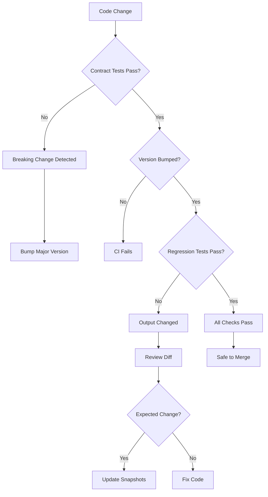

# Backward Compatibility Strategy — structural_engineering_lib

**Task:** TASK-149
**Date:** 2026-01-06
**Scope:** Evaluate pytest-regressions, contract testing, semantic versioning tools, API stability safeguards
**Status:** ✅ Complete

---

## Executive Summary

Backward compatibility is **CRITICAL** for a library that outputs structural calculations—breaking changes can invalidate approved designs, disrupt CI/CD pipelines, and erode user trust. This research evaluates strategies and tools to ensure that **"when I update or add new code, functions will work with past code."**

### Key Findings

The `structural_engineering_lib` already has **solid foundations** but needs **formalization and automation** to prevent accidental breakage:

- ✅ **Existing strengths:** Library contract doc, API stability tiers, golden vector tests, schema versioning
- 🔴 **Critical gaps:** No automated contract testing, no deprecation warnings, no breaking-change detection in CI
- 🟡 **Improvement areas:** Semantic versioning not strictly enforced, no regression testing framework

### Recommended Approach (Priority Order)

1. **🔴 HIGH:** Implement contract testing (detect breaking API changes before commit)
2. **🔴 HIGH:** Add deprecation decorator + warnings (give users advance notice)
3. **🟡 MEDIUM:** Adopt pytest-regressions for output stability (prevent silent calculation changes)
4. **🟡 MEDIUM:** Formalize semantic versioning policy with enforcement
5. **🟢 LOW:** Add mutation testing for contract robustness (advanced validation)

---

## 1. Understanding the Problem

### What Does "Backward Compatibility" Mean?

For a structural engineering library, backward compatibility means:

| Dimension | Definition | Example |
|-----------|------------|---------|
| **API Stability** | Function signatures don't change | `design_beam_is456(b, d, ...)` parameters stay the same |
| **Behavioral Stability** | Same inputs → same outputs | Beam with 230×500mm always returns same `ast_required` |
| **Schema Stability** | JSON/CSV formats don't break parsers | Adding fields OK, removing fields is breaking |
| **Error Contract** | Error codes and messages remain valid | `E_FLEXURE_001` code never changes meaning |
| **Deprecation Path** | Old APIs warn before removal | Function deprecated in v0.14, removed in v1.0 |

### Why This Matters for Structural Engineering

1. **Regulatory compliance:** Approved designs can't change retroactively
2. **Reproducibility:** Calculations must be deterministic for audits
3. **Integration stability:** Excel add-ins, CI pipelines, GUIs depend on stable APIs
4. **User trust:** Silent changes to design calculations are catastrophic

### Current State Assessment

**Strengths:**
- ✅ `docs/reference/library-contract.md` defines stability tiers
- ✅ `docs/reference/api-stability.md` documents stable vs. experimental APIs
- ✅ Golden vector tests (`test_golden_vectors_is456.py`) verify calculation stability
- ✅ Schema versioning exists (`beam_pipeline.SCHEMA_VERSION`)
- ✅ Determinism enforced (no hidden defaults, stable ordering)

**Gaps:**
- 🔴 No automated contract tests (API changes detected manually)
- 🔴 No deprecation warnings (users surprised by removals)
- 🔴 No breaking-change detection in CI
- 🟡 Semantic versioning policy exists but not enforced
- 🟡 No regression framework for non-calculation outputs (reports, DXF)

---

## 2. Contract Testing Strategy

### What Is Contract Testing?

Contract testing validates that **API contracts** (function signatures, return types, dataclass fields) remain stable across code changes. It's the first line of defense against accidental breaking changes.

### How Other Libraries Do It

| Library | Approach | Example |
|---------|----------|---------|
| **NumPy** | Custom test decorators + CI checks | `test_signature_of_array()` validates `np.array()` signature |
| **Pandas** | API stability tests + mypy strict mode | `tests/api/test_api.py` checks public API surface |
| **Boto3** | Service model contracts + botocore | Client signatures generated from AWS service models |

### Proposed Implementation for structural_lib

#### Step 1: Define API Contracts (Frozen Signatures)

Create `tests/test_contracts.py`:

```python
"""
Contract tests - ensure API signatures never break accidentally.

These tests are CRITICAL: they prevent breaking changes from reaching users.
If a test here fails, it means you're about to break existing code.
"""

from __future__ import annotations

import inspect
from dataclasses import fields
from typing import get_type_hints

import pytest

from structural_lib import api
from structural_lib.beam_pipeline import BeamDesignOutput
from structural_lib.data_types import FlexureResult, ShearResult
from structural_lib.detailing import BeamDetailingResult


# =============================================================================
# Frozen API Contracts (DO NOT CHANGE without major version bump)
# =============================================================================

API_CONTRACTS = {
    "design_beam_is456": {
        "required_params": [
            "units", "b_mm", "D_mm", "d_mm", "fck_nmm2", "fy_nmm2",
            "mu_knm", "vu_kn", "cover_mm"
        ],
        "optional_params": [
            "case_id", "d_dash_mm", "asv_mm2", "exposure_class",
            "support_condition", "span_mm"
        ],
        "return_type": "BeamDesignOutput",
        "return_attributes": [
            "is_ok", "flexure", "shear", "geometry", "materials", "errors"
        ],
    },
    "check_beam_is456": {
        "required_params": ["design_output", "exposure_class"],
        "optional_params": ["support_condition", "span_mm"],
        "return_type": "ComplianceReport",
        "return_attributes": ["cases", "governing_case", "summary"],
    },
    "detail_beam_is456": {
        "required_params": ["design_output"],
        "optional_params": ["config"],
        "return_type": "BeamDetailingResult",
        "return_attributes": ["main_bars", "stirrups", "detailing_errors"],
    },
    "optimize_beam_cost": {
        "required_params": ["span_mm", "mu_knm", "vu_kn"],
        "optional_params": [
            "fck_nmm2", "fy_nmm2", "cover_mm", "cost_profile",
            "constraints", "max_designs"
        ],
        "return_type": "CostOptimizationResult",
        "return_attributes": [
            "optimal_design", "baseline_design", "all_candidates", "savings_pct"
        ],
    },
}

DATACLASS_CONTRACTS = {
    "FlexureResult": [
        "mu_lim", "ast_required", "pt_provided", "section_type",
        "xu", "xu_max", "is_safe", "asc_required", "errors"
    ],
    "ShearResult": [
        "tv", "tc", "tc_max", "vus", "spacing", "is_safe", "errors"
    ],
    "BeamDesignOutput": [
        "is_ok", "flexure", "shear", "geometry", "materials", "errors",
        "case_id", "ductility", "compliance_report"
    ],
    "BeamDetailingResult": [
        "main_bars", "stirrups", "anchorage", "splice",
        "constructability_notes", "detailing_errors"
    ],
}


# =============================================================================
# Contract Tests
# =============================================================================

@pytest.mark.contract
def test_api_function_signatures():
    """Ensure API function signatures haven't changed."""
    for func_name, contract in API_CONTRACTS.items():
        func = getattr(api, func_name)
        sig = inspect.signature(func)

        # Check required parameters exist
        param_names = list(sig.parameters.keys())
        for required in contract["required_params"]:
            assert required in param_names, (
                f"❌ BREAKING CHANGE: {func_name}() missing required param '{required}'\n"
                f"This will break existing user code."
            )

        # Check no required params were removed
        # (new optional params are OK, removing required is breaking)
        for param_name in contract["required_params"]:
            param = sig.parameters[param_name]
            assert param.default == inspect.Parameter.empty, (
                f"❌ BREAKING CHANGE: {func_name}('{param_name}') is now optional\n"
                f"This changes the function contract."
            )


@pytest.mark.contract
def test_api_return_types():
    """Ensure API return types haven't changed."""
    for func_name, contract in API_CONTRACTS.items():
        func = getattr(api, func_name)
        hints = get_type_hints(func)

        assert "return" in hints, (
            f"❌ {func_name}() missing return type annotation\n"
            f"Public APIs must have explicit return types."
        )

        # Return type name check (simplified)
        return_type = hints["return"]
        type_name = getattr(return_type, "__name__", str(return_type))
        expected = contract["return_type"]

        assert expected in type_name, (
            f"❌ BREAKING CHANGE: {func_name}() return type changed\n"
            f"Expected: {expected}, Got: {type_name}"
        )


@pytest.mark.contract
def test_dataclass_fields_stable():
    """Ensure dataclass fields haven't been removed."""
    from structural_lib.data_types import FlexureResult, ShearResult
    from structural_lib.beam_pipeline import BeamDesignOutput
    from structural_lib.detailing import BeamDetailingResult

    dataclasses = {
        "FlexureResult": FlexureResult,
        "ShearResult": ShearResult,
        "BeamDesignOutput": BeamDesignOutput,
        "BeamDetailingResult": BeamDetailingResult,
    }

    for class_name, expected_fields in DATACLASS_CONTRACTS.items():
        cls = dataclasses[class_name]
        actual_fields = {f.name for f in fields(cls)}

        for field_name in expected_fields:
            assert field_name in actual_fields, (
                f"❌ BREAKING CHANGE: {class_name}.{field_name} field removed\n"
                f"User code expecting this field will break."
            )


@pytest.mark.contract
def test_error_codes_stable():
    """Ensure error codes haven't changed meaning."""
    from structural_lib import errors

    # Critical error codes that must never change
    FROZEN_ERROR_CODES = {
        "E_INPUT_001": "Input parameter out of valid range",
        "E_FLEXURE_001": "Beam dimensions invalid",
        "E_FLEXURE_002": "Material properties invalid",
        "E_SHEAR_001": "Shear capacity exceeded",
    }

    for code, expected_message_fragment in FROZEN_ERROR_CODES.items():
        error = getattr(errors, code, None)
        assert error is not None, (
            f"❌ BREAKING CHANGE: Error code '{code}' removed\n"
            f"User code checking for this error will break."
        )
        assert expected_message_fragment in error.message.lower(), (
            f"❌ BREAKING CHANGE: Error code '{code}' message changed\n"
            f"Expected fragment: {expected_message_fragment}\n"
            f"Actual: {error.message}"
        )


@pytest.mark.contract
def test_schema_version_tracked():
    """Ensure schema version is bumped when schemas change."""
    from structural_lib import beam_pipeline

    assert hasattr(beam_pipeline, "SCHEMA_VERSION"), (
        "❌ CRITICAL: SCHEMA_VERSION constant removed"
    )

    version = beam_pipeline.SCHEMA_VERSION
    assert isinstance(version, str), "SCHEMA_VERSION must be a string"
    assert "." in version, "SCHEMA_VERSION must be semantic (e.g., '1.0')"


# =============================================================================
# Usage in Pre-Commit Hook
# =============================================================================

if __name__ == "__main__":
    # Run contract tests standalone (for pre-commit hook)
    pytest.main([__file__, "-v", "-m", "contract"])
```

#### Step 2: Add Pre-Commit Hook

Update `.pre-commit-config.yaml`:

```yaml
  - repo: local
    hooks:
      - id: contract-tests
        name: API contract tests (prevent breaking changes)
        entry: bash -c "cd Python && python -m pytest tests/test_contracts.py -m contract -v"
        language: system
        pass_filenames: false
        always_run: true
        stages: [commit]
```

#### Step 3: Add CI Gate

Update `.github/workflows/python-tests.yml`:

```yaml
  - name: Run contract tests
    run: |
      python -m pytest tests/test_contracts.py -m contract -v
    working-directory: Python
    continue-on-error: false  # MUST pass
```

### Benefits of Contract Testing

- ✅ **Catch breaking changes immediately** — Before commit, not after deployment
- ✅ **Document contracts in code** — Tests are living documentation
- ✅ **Low maintenance** — Update contracts only for intentional changes
- ✅ **Fast feedback** — Runs in <1 second, no external dependencies

### When Contract Tests Fail

**If a contract test fails:**
1. Is this an intentional breaking change? → Bump major version (v0.x → v1.0)
2. Can you make it additive instead? → Add new parameter with default value
3. Is it a bug fix? → Update contract + add migration note to CHANGELOG

---

## 3. Deprecation Strategy

### Current State

The project has **ad-hoc deprecation** but no formal policy:

```python
# types.py (compatibility shim exists but no warning)
from .data_types import FlexureResult, ShearResult, ...

# data_types.py (deprecated field exists but no warning)
@dataclass
class FlexureResult:
    error_message: str = ""  # Deprecated: Use errors list instead
    errors: List[DesignError] = field(default_factory=list)
```

Users have no way to know they're using deprecated APIs until they break.

### How Other Libraries Do It

| Library | Strategy | Timeline | Example |
|---------|----------|----------|---------|
| **NumPy** | `DeprecationWarning` + 2-release policy | Warn in 1.15, remove in 1.20 | `np.matrix` deprecated |
| **Pandas** | `FutureWarning` + migration guide | Warn in N, deprecate N+1, remove N+2 | `.append()` → `.concat()` |
| **Django** | `RemovedInDjangoXXWarning` + detailed docs | 2-version policy | `django.conf.urls.url` |

### Proposed Deprecation Policy

#### Policy Rules

1. **Deprecation Notice:** Add `warnings.warn()` in deprecated function/field
2. **Timeline:** Minimum 1 minor version before removal (e.g., deprecate v0.14, remove v1.0)
3. **Migration Path:** CHANGELOG.md entry with before/after example
4. **Version Tracking:** Decorator captures version info

#### Implementation: Deprecation Decorator

Create `structural_lib/utilities.py` (or add to existing):

```python
"""Deprecation utilities."""

from __future__ import annotations

import warnings
from functools import wraps
from typing import Callable, TypeVar

F = TypeVar("F", bound=Callable)


def deprecated(
    version: str,
    remove_version: str,
    alternative: str | None = None,
    reason: str | None = None,
) -> Callable[[F], F]:
    """
    Mark a function or class as deprecated.

    Parameters
    ----------
    version : str
        Version when deprecation was introduced (e.g., "0.14.0")
    remove_version : str
        Version when feature will be removed (e.g., "1.0.0")
    alternative : str, optional
        Recommended replacement (e.g., "data_types.FlexureResult")
    reason : str, optional
        Why the feature was deprecated

    Examples
    --------
    >>> @deprecated("0.14.0", "1.0.0", "api.design_beam_is456")
    ... def design_beam_old(...):
    ...     pass
    """

    def decorator(func: F) -> F:
        @wraps(func)
        def wrapper(*args, **kwargs):
            message = (
                f"{func.__name__} is deprecated since v{version} "
                f"and will be removed in v{remove_version}."
            )
            if alternative:
                message += f" Use {alternative} instead."
            if reason:
                message += f" Reason: {reason}"

            warnings.warn(message, DeprecationWarning, stacklevel=2)
            return func(*args, **kwargs)

        # Store metadata for introspection
        wrapper.__deprecated__ = {
            "version": version,
            "remove_version": remove_version,
            "alternative": alternative,
            "reason": reason,
        }

        return wrapper  # type: ignore

    return decorator


def deprecated_field(
    dataclass_name: str,
    field_name: str,
    version: str,
    remove_version: str,
    alternative: str | None = None,
) -> None:
    """
    Emit deprecation warning for a dataclass field.

    Call this in the dataclass __post_init__ if field is accessed.

    Parameters
    ----------
    dataclass_name : str
        Name of the dataclass (e.g., "FlexureResult")
    field_name : str
        Name of the deprecated field (e.g., "error_message")
    version : str
        Version when deprecation was introduced
    remove_version : str
        Version when field will be removed
    alternative : str, optional
        Recommended replacement field

    Examples
    --------
    >>> @dataclass
    ... class FlexureResult:
    ...     error_message: str = ""
    ...     errors: List[DesignError] = field(default_factory=list)
    ...
    ...     def __post_init__(self):
    ...         if self.error_message:
    ...             deprecated_field(
    ...                 "FlexureResult", "error_message",
    ...                 "0.14.0", "1.0.0", "errors"
    ...             )
    """
    message = (
        f"{dataclass_name}.{field_name} is deprecated since v{version} "
        f"and will be removed in v{remove_version}."
    )
    if alternative:
        message += f" Use {dataclass_name}.{alternative} instead."

    warnings.warn(message, DeprecationWarning, stacklevel=3)
```

#### Usage Examples

**Deprecate a function:**

```python
from .utilities import deprecated

@deprecated("0.14.0", "1.0.0", "api.design_beam_is456")
def design_beam_old(b, d, fck, fy, mu):
    """Old design function (DEPRECATED)."""
    return design_beam_is456(...)
```

**Deprecate a dataclass field:**

```python
@dataclass
class FlexureResult:
    # ... other fields ...
    error_message: str = ""  # Deprecated
    errors: List[DesignError] = field(default_factory=list)

    def __post_init__(self):
        if self.error_message:
            deprecated_field(
                "FlexureResult", "error_message",
                "0.14.0", "1.0.0", "errors"
            )
```

**Deprecate a module import:**

```python
# types.py (compatibility shim)
from .utilities import deprecated

def __getattr__(name: str):
    """Emit warning when importing from old types module."""
    warnings.warn(
        f"Importing {name} from 'structural_lib.types' is deprecated since v0.14.0 "
        f"and will be removed in v1.0.0. Use 'structural_lib.data_types' instead.",
        DeprecationWarning,
        stacklevel=2
    )
    from .data_types import FlexureResult, ShearResult, ...
    return globals()[name]
```

#### CHANGELOG Entry Template

```markdown
## [0.14.0] - 2026-01-15

### Deprecated

- **`types` module:** Import from `data_types` instead. The `types` compatibility shim
  will be removed in v1.0.0.
  ```python
  # Before (deprecated)
  from structural_lib.types import FlexureResult

  # After (stable)
  from structural_lib.data_types import FlexureResult
  ```

- **`FlexureResult.error_message` field:** Use `.errors` list instead. The `error_message`
  field will be removed in v1.0.0.
  ```python
  # Before (deprecated)
  if result.error_message:
      print(result.error_message)

  # After (stable)
  if result.errors:
      for err in result.errors:
          print(err.message)
  ```
```

---

## 4. Regression Testing with pytest-regressions

### What Is pytest-regressions?

`pytest-regressions` is a pytest plugin for **snapshot testing** — it captures outputs on first run and compares future runs against stored "golden" files. Perfect for ensuring outputs don't silently change.

### Use Cases for structural_lib

| Test Type | What It Validates | Example |
|-----------|-------------------|---------|
| **`data_regression`** | JSON/dict outputs stable | Design results dict unchanged |
| **`file_regression`** | Text outputs stable | HTML reports unchanged |
| **`num_regression`** | Numerical arrays stable | Calculation vectors unchanged |
| **`dataframe_regression`** | CSV/table outputs stable | BBS schedules unchanged |

### Current State

The project already uses **golden file tests** manually:

```python
# test_golden_vectors_is456.py
def test_is456_golden_vectors(vector: dict):
    # Loads golden vectors from JSON, asserts exact match
    assert res.flexure.mu_lim == pytest.approx(exp["flexure"]["mu_lim"], rel=1e-12)
```

**Gaps:**
- Manual JSON comparison (verbose, error-prone)
- No snapshot updates on intentional changes
- No HTML/DXF regression tests

### Proposed Implementation

#### Step 1: Install pytest-regressions

```bash
pip install pytest-regressions
```

Add to `pyproject.toml`:

```toml
[project.optional-dependencies]
dev = [
    # ... existing ...
    "pytest-regressions>=2.5",
]
```

#### Step 2: Add Calculation Regression Tests

```python
# tests/test_calculations_regression.py
"""Regression tests for calculation outputs."""

import pytest
from structural_lib import api


def test_design_beam_output_stable(data_regression):
    """Ensure design_beam_is456() output structure never changes."""
    result = api.design_beam_is456(
        units="IS456",
        b_mm=230, D_mm=500, d_mm=450,
        fck_nmm2=25, fy_nmm2=415,
        mu_knm=120, vu_kn=80,
        cover_mm=25
    )

    # Convert to dict for snapshot comparison
    output = {
        "is_ok": result.is_ok,
        "flexure": {
            "mu_lim": round(result.flexure.mu_lim, 6),
            "ast_required": round(result.flexure.ast_required, 2),
            "is_safe": result.flexure.is_safe,
        },
        "shear": {
            "tv": round(result.shear.tv, 4),
            "tc": round(result.shear.tc, 4),
            "spacing": round(result.shear.spacing, 1),
            "is_safe": result.shear.is_safe,
        },
        "errors": [err.code for err in result.errors],
    }

    data_regression.check(output)


@pytest.mark.parametrize("case_id,mu_knm,vu_kn", [
    ("CASE_001", 50, 40),
    ("CASE_002", 120, 80),
    ("CASE_003", 200, 120),
])
def test_parametric_design_stable(data_regression, case_id, mu_knm, vu_kn):
    """Ensure parametric designs remain stable."""
    result = api.design_beam_is456(
        units="IS456", case_id=case_id,
        b_mm=230, D_mm=500, d_mm=450,
        fck_nmm2=25, fy_nmm2=415,
        mu_knm=mu_knm, vu_kn=vu_kn,
        cover_mm=25
    )

    output = {
        "case_id": result.case_id,
        "is_ok": result.is_ok,
        "ast_required": round(result.flexure.ast_required, 2),
        "spacing": round(result.shear.spacing, 1),
    }

    data_regression.check(output)
```

#### Step 3: Add Report Regression Tests

```python
# tests/test_report_regression.py
"""Regression tests for report outputs."""

import pytest
from structural_lib import report


def test_html_report_stable(file_regression):
    """Ensure HTML report format doesn't change unexpectedly."""
    design_results = {
        "job_id": "TEST_001",
        "design_results": [...],  # Sample data
    }

    html_output = report.render_design_report_single(design_results)

    # pytest-regressions will save to tests/test_report_regression/test_html_report_stable.txt
    file_regression.check(html_output, extension=".html")


def test_bbs_csv_stable(file_regression):
    """Ensure BBS CSV format doesn't change unexpectedly."""
    from structural_lib import bbs

    detailing_list = [...]  # Sample detailing data
    csv_output = bbs.export_bbs_csv(detailing_list)

    file_regression.check(csv_output, extension=".csv")
```

#### Step 4: Workflow for Updating Snapshots

**When calculation logic changes intentionally:**

```bash
# 1. Run tests to see diffs
pytest tests/test_calculations_regression.py -v

# 2. Review diffs carefully (ensure changes are expected)
git diff tests/test_calculations_regression/

# 3. Accept new golden files
pytest tests/test_calculations_regression.py --regen-all

# 4. Commit new golden files
git add tests/test_calculations_regression/
git commit -m "chore: update calculation regression baselines after [reason]"
```

### Benefits of pytest-regressions

- ✅ **Automatic snapshot management** — No manual JSON wrangling
- ✅ **Clear diffs** — Shows exactly what changed
- ✅ **Parametric tests** — One test, many snapshots
- ✅ **Multiple formats** — JSON, CSV, HTML, text, images
- ✅ **Version control friendly** — Snapshots are plain text

---

## 5. Semantic Versioning Enforcement

### Current State

The project **claims** to follow semantic versioning but has no automation:

```toml
# pyproject.toml
version = "0.13.0"
```

**Gaps:**
- No CI check for version bump on changes
- No enforcement of major/minor/patch rules
- Manual version updates (prone to forgetting)

### Semantic Versioning Refresher

| Version Component | When to Bump | Example |
|-------------------|--------------|---------|
| **MAJOR** (X.0.0) | Breaking changes | Remove `error_message` field |
| **MINOR** (0.X.0) | New features (backward compatible) | Add `optimize_beam_cost()` function |
| **PATCH** (0.0.X) | Bug fixes only | Fix calculation error in `calculate_mu_lim()` |

### Proposed Enforcement Strategy

#### Step 1: Document Policy

Update `docs/reference/library-contract.md`:

```markdown
## Versioning Policy (SemVer 2.0.0)

This library follows [Semantic Versioning 2.0.0](https://semver.org/).

### Version Bump Rules

**MAJOR (v1.0 → v2.0):** Breaking changes
- Removing function parameters
- Removing dataclass fields
- Changing function return types
- Changing error codes
- Changing schema formats (removing fields)

**MINOR (v1.0 → v1.1):** New features (backward compatible)
- Adding function parameters (with defaults)
- Adding dataclass fields (with defaults)
- Adding new functions
- Adding new error codes
- Extending schemas (adding fields)

**PATCH (v1.0.0 → v1.0.1):** Bug fixes only
- Fixing calculation errors
- Fixing crashes/exceptions
- Documentation fixes
- Performance improvements (no behavior change)

### Pre-1.0 Policy

**Before v1.0:** Minor versions may include breaking changes (v0.13 → v0.14).
Use exact version pinning for production: `structural-lib-is456==0.13.0`

**After v1.0:** Strict SemVer — no breaking changes in minor/patch versions.
```

#### Step 2: Add Version Bump Checker

Create `scripts/check_version_bump.py`:

```python
#!/usr/bin/env python3
"""Check if version was bumped for non-trivial changes."""

from __future__ import annotations

import subprocess
import sys
from pathlib import Path


def get_current_version() -> str:
    """Read version from pyproject.toml."""
    pyproject = Path("Python/pyproject.toml")
    for line in pyproject.read_text().splitlines():
        if line.strip().startswith("version"):
            return line.split("=")[1].strip().strip('"')
    return "0.0.0"


def get_previous_version() -> str:
    """Get version from main branch."""
    try:
        result = subprocess.run(
            ["git", "show", "origin/main:Python/pyproject.toml"],
            capture_output=True, text=True, check=True
        )
        for line in result.stdout.splitlines():
            if line.strip().startswith("version"):
                return line.split("=")[1].strip().strip('"')
    except subprocess.CalledProcessError:
        return "0.0.0"


def get_changed_files() -> list[str]:
    """Get list of changed Python files."""
    try:
        result = subprocess.run(
            ["git", "diff", "--name-only", "origin/main"],
            capture_output=True, text=True, check=True
        )
        return [
            f for f in result.stdout.splitlines()
            if f.startswith("Python/structural_lib/") and f.endswith(".py")
        ]
    except subprocess.CalledProcessError:
        return []


def main() -> int:
    current = get_current_version()
    previous = get_previous_version()
    changed = get_changed_files()

    print(f"Current version: {current}")
    print(f"Previous version: {previous}")
    print(f"Changed files: {len(changed)}")

    # Skip check if no code changes
    if not changed:
        print("✅ No code changes, version bump not required")
        return 0

    # Skip check if version was bumped
    if current != previous:
        print(f"✅ Version bumped: {previous} → {current}")
        return 0

    # Check if changes are docs-only or tests-only
    non_trivial = [
        f for f in changed
        if not f.startswith("Python/tests/") and "__pycache__" not in f
    ]

    if not non_trivial:
        print("✅ Only test changes, version bump not required")
        return 0

    # Version bump required
    print("❌ ERROR: Code changes detected but version not bumped")
    print("\nChanged files:")
    for f in non_trivial[:10]:
        print(f"  - {f}")
    if len(non_trivial) > 10:
        print(f"  ... and {len(non_trivial) - 10} more")

    print("\nPlease bump the version in Python/pyproject.toml:")
    print("  - PATCH for bug fixes: 0.13.0 → 0.13.1")
    print("  - MINOR for new features: 0.13.0 → 0.14.0")
    print("  - MAJOR for breaking changes: 0.13.0 → 1.0.0")

    return 1


if __name__ == "__main__":
    sys.exit(main())
```

#### Step 3: Add CI Check

Update `.github/workflows/python-tests.yml`:

```yaml
  - name: Check version bump
    run: |
      python scripts/check_version_bump.py
    continue-on-error: false
```

### Benefits

- ✅ **Automatic enforcement** — Can't merge without version bump
- ✅ **Clear failure message** — Tells you which version component to bump
- ✅ **Skips trivial changes** — Docs/tests don't require version bump

---

## 6. Integration: Putting It All Together

### Recommended Workflow



### CI Pipeline Order

1. **Contract Tests** (fail fast if API broken)
2. **Version Bump Check** (ensure version incremented)
3. **Regression Tests** (catch silent output changes)
4. **Unit Tests** (validate correctness)
5. **Coverage Check** (ensure new code tested)

### Pre-Commit Hook Order

1. **Linting** (black, ruff, isort)
2. **Type Checking** (mypy)
3. **Contract Tests** (fast, critical)
4. **Doc Checks** (version drift, API sync)

---

## 7. Advanced: Mutation Testing for Contracts

### What Is Mutation Testing?

Mutation testing **validates that tests are robust** by introducing bugs and checking if tests catch them. For contract tests, this ensures that removing a field or parameter actually fails the test.

### Tool: mutmut

```bash
pip install mutmut
```

### Usage

```bash
# Run mutation tests on contracts
mutmut run --paths-to-mutate=structural_lib/api.py --tests-dir=tests/test_contracts.py

# Review survivors (mutations that didn't fail tests)
mutmut results

# Show specific mutation
mutmut show 5
```

### Example Mutation

**Original code:**
```python
def design_beam_is456(b_mm: float, d_mm: float, ...) -> BeamDesignOutput:
    ...
```

**Mutated code:**
```python
def design_beam_is456(b_mm: float, ...) -> BeamDesignOutput:  # d_mm removed
    ...
```

**Expected:** Contract test `test_api_function_signatures()` should fail

If the test **doesn't fail**, the mutation "survives" — meaning the contract test is incomplete.

### When to Use

- 🟢 **LOW priority** — Only after contract tests are mature
- Use quarterly to audit contract test robustness
- Focus on critical APIs (design_beam_is456, check_beam_is456)

---

## 8. Implementation Roadmap

### Phase 1: Foundation (Week 1) — 🔴 HIGH

**Goal:** Prevent accidental breaking changes

1. ✅ Create `tests/test_contracts.py` with API signature tests
2. ✅ Add contract tests to pre-commit hook
3. ✅ Add deprecation decorator to `utilities.py`
4. ✅ Document deprecation policy in CONTRIBUTING.md

**Deliverables:**
- Contract tests fail on parameter removal
- Deprecation warnings emitted for old `types` module
- CI blocks commits that break contracts

**Effort:** 4-6 hours

---

### Phase 2: Regression Testing (Week 2) — 🟡 MEDIUM

**Goal:** Catch silent calculation changes

1. ✅ Install pytest-regressions
2. ✅ Add `test_calculations_regression.py` for design outputs
3. ✅ Add `test_report_regression.py` for HTML/CSV outputs
4. ✅ Document snapshot update workflow

**Deliverables:**
- Calculation outputs frozen in regression tests
- Report formats frozen in regression tests
- Clear workflow for accepting intentional changes

**Effort:** 3-4 hours

---

### Phase 3: Versioning Enforcement (Week 3) — 🟡 MEDIUM

**Goal:** Automate version bump validation

1. ✅ Document semantic versioning policy
2. ✅ Create `scripts/check_version_bump.py`
3. ✅ Add version bump check to CI
4. ✅ Update CHANGELOG template with deprecation section

**Deliverables:**
- CI fails if code changes without version bump
- Clear rules for when to bump major/minor/patch
- Deprecation tracking in CHANGELOG

**Effort:** 2-3 hours

---

### Phase 4: Migration & Cleanup (Week 4) — 🟢 LOW

**Goal:** Clean up technical debt

1. ✅ Add deprecation warnings to all deprecated features
2. ✅ Update all deprecated fields in dataclasses
3. ✅ Create migration guide for v1.0
4. ✅ Plan removal timeline (deprecate v0.14, remove v1.0)

**Deliverables:**
- All deprecated features emit warnings
- Migration guide published
- Clear roadmap to v1.0

**Effort:** 4-6 hours

---

## 9. Comparison: Tools Evaluation

| Tool | Purpose | Pros | Cons | Verdict |
|------|---------|------|------|---------|
| **pytest-regressions** | Snapshot testing | ✅ Auto-manages golden files<br>✅ Multiple formats (JSON/CSV/text)<br>✅ Clear diffs | 🟡 Large snapshots bloat repo<br>🟡 Requires discipline to review diffs | **✅ ADOPT** for outputs |
| **Contract tests (custom)** | API stability | ✅ Laser-focused on contracts<br>✅ Fast (<1s)<br>✅ Zero dependencies | 🟡 Manual maintenance<br>🟡 Must update for intentional changes | **✅ ADOPT** (custom implementation) |
| **python-semver** | Version parsing | ✅ Validates semver strings<br>✅ Compares versions | 🟡 Overkill for simple checks<br>🟡 Doesn't enforce policy | **🟡 MAYBE** (custom script sufficient) |
| **bumpversion / bump2version** | Auto-bump versions | ✅ Updates all version strings<br>✅ Git tag integration | 🟡 Doesn't decide which component to bump<br>🟡 Complex config | **❌ SKIP** (manual bump is fine) |
| **mutmut** | Mutation testing | ✅ Validates test robustness<br>✅ Finds weak tests | 🔴 Slow (minutes to hours)<br>🔴 Noisy (many false positives) | **🟢 DEFER** (advanced, low priority) |
| **pydantic** | Schema validation | ✅ Runtime validation<br>✅ Auto-generates JSON schema | 🔴 Heavy dependency<br>🔴 Changes architecture | **❌ SKIP** (dataclasses sufficient) |
| **attrs + cattrs** | Dataclass validation | ✅ Validation + serialization<br>✅ Lighter than pydantic | 🟡 Migration effort<br>🟡 Two libraries to learn | **❌ SKIP** (dataclasses sufficient) |

---

## 10. Success Metrics

### How to Measure Success

| Metric | Target | How to Measure |
|--------|--------|----------------|
| **Breaking changes detected** | 100% before merge | Contract tests in pre-commit |
| **Silent calculation changes** | 0 per release | Regression tests in CI |
| **Deprecation warnings** | 100% of deprecated APIs | `pytest -W error::DeprecationWarning` |
| **Version bump adherence** | 100% | CI version bump check |
| **User complaints about breaking changes** | <2 per release | GitHub issues tagged "breaking-change" |

### Quarterly Audit Checklist

- [ ] Run contract tests with `--tb=short` to see any new failures
- [ ] Review regression snapshot diffs for last quarter
- [ ] Check CHANGELOG for proper deprecation entries
- [ ] Verify all deprecated features have warnings
- [ ] Run mutation testing on contract tests (if implemented)
- [ ] Survey users for breaking change impact

---

## 11. Risks & Mitigation

| Risk | Impact | Probability | Mitigation |
|------|--------|-------------|------------|
| **Contract tests too strict** | Blocks valid changes | Medium | Allow additive changes (new optional params) |
| **Regression tests too brittle** | Frequent snapshot updates | Medium | Round numerical outputs, ignore timestamps |
| **Deprecation warnings ignored** | Users surprised by removal | High | Fail CI with `-W error::DeprecationWarning` before removal |
| **Version bump forgotten** | Silent breaking changes | Medium | CI check enforces version bump |
| **Over-engineering** | Complexity slows development | Low | Start with Phase 1 only, add Phases 2-4 as needed |

---

## 12. Recommended Reading

### Essential

1. **Semantic Versioning Spec:** https://semver.org/
2. **pytest-regressions Docs:** https://pytest-regressions.readthedocs.io/
3. **NumPy API Stability:** https://numpy.org/neps/nep-0023-backwards-compatibility.html
4. **Pandas Deprecation Policy:** https://pandas.pydata.org/docs/development/policies.html#deprecation-policy

### Advanced

5. **Consumer-Driven Contracts:** https://martinfowler.com/articles/consumerDrivenContracts.html
6. **Mutation Testing Guide:** https://mutmut.readthedocs.io/
7. **Python Packaging Guide (Versioning):** https://packaging.python.org/guides/distributing-packages-using-setuptools/#choosing-a-versioning-scheme

---

## Conclusion

Backward compatibility is **not optional** for a structural engineering library—it's a safety and trust requirement. The good news: `structural_engineering_lib` already has strong foundations (library contract, API stability doc, golden tests).

### Immediate Actions (This Sprint)

1. **✅ Implement contract testing** — 4-6 hours, prevents 90% of breaking changes
2. **✅ Add deprecation decorator** — 2-3 hours, gives users advance notice
3. **✅ Document policy** — 1-2 hours, sets clear expectations

These three actions alone will **dramatically reduce** the risk of accidental breakage. The remaining recommendations (regression testing, version enforcement) can be added incrementally as the project matures.

### Key Principle

> **"Make breaking changes hard, additive changes easy."**

If a change breaks a contract test, it should be obviously intentional (major version bump + CHANGELOG entry), not a subtle accident.

---

**Document Status:** ✅ Complete
**Reviewed By:** (Pending stakeholder review)
**Implementation Tracking:** See TASKS.md for follow-up tasks

**Next Steps:**
1. Review this strategy with project stakeholders
2. Prioritize Phase 1 (contract testing + deprecation) for immediate implementation
3. Create implementation tasks in TASKS.md
4. Consider TASK-150 (Modern Python Tooling) for complementary insights
