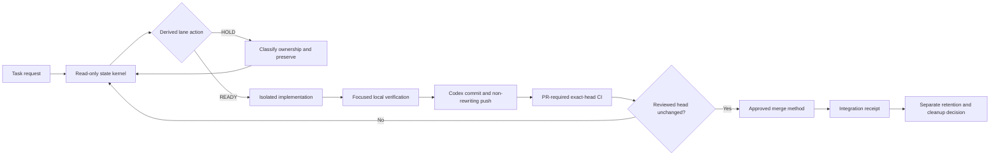

# GIT-001 Phase 4 — Proposed Git Operating Model

## Executive decision

Use a **preservation-first, evidence-separated, Codex-native** operating model:

- one task, one attached worktree, one branch, and one named integration owner;
- one read-only state kernel shared by intake, trust, validation, and handoff;
- no automatic recovery, synchronization, publication, merge, or deletion in
  repository scripts;
- PR-required server enforcement with exact-head checks and no standing bypass;
- deterministic required CI selected by changed outcome surface;
- targeted generated-data writes with a changed-path receipt;
- inspection-only branch disposition followed by separately approved Codex
  deletion and a post-action receipt;
- task and Git retention treated as separate systems joined by explicit project
  evidence, not inferred product behavior.

This specification resolves the Phase 3 gaps as a design. It does not alter the
current canonical workflow, GitHub settings, scripts, branches, worktrees, or CI.

## Design laws

1. **No compressed truth.** Clean, saved, published, current, integrated,
   tested, trusted, and retirement-ready are separate claims.
2. **Unknown is a hold.** Command failure, stale remote evidence, missing
   ownership, or unresolved operation state never falls through to success.
3. **Preserve before changing topology.** Dirty work receives a scoped durable
   checkpoint before synchronization or recovery.
4. **Identity accompanies evidence.** Every result names the worktree, branch,
   head, source/artifact root, upstream/base, and PR/check SHA that it proves.
5. **Scripts inspect; Codex mutates.** Validation and classification are local,
   deterministic, and read-only. Codex performs normal Git/GitHub actions after
   reviewing the evidence and authorization boundary.
6. **One owner for shared surfaces.** Session/task/handoff records, generated
   indexes, manifests, routes, registries, locks, and GitHub settings never have
   concurrent writers.
7. **Required CI proves outcomes, not time.** Wall-clock performance remains a
   scheduled/manual evidence lane.
8. **Deletion is a separate decision.** Merge or patch integration never implies
   immediate branch, worktree, task, artifact, or evidence deletion.

## Control-plane architecture



The four control planes are:

| Plane | Owns | Does not own |
|---|---|---|
| State and intake | Local Git facts, sibling visibility, derived holds, local receipt | Fetch, merge, reset, stash, cleanup, push, PR mutation |
| Publication and server enforcement | Branch publication, PR identity, changed-surface CI, merge method, exact-head receipt | Local content ownership or professional approval |
| Generated data and cleanup | Target preview, owned generated writes, disposition evidence | Automatic branch/worktree deletion or inferred ownership |
| Guidance and handoff | Canonical vocabulary, alias discovery, task-to-Git receipt, maintenance checks | Codex product guarantees not present in official evidence |

## Plane 1 — one read-only state and intake kernel

### Proposed component

Add `scripts/git_state.py` as the sole semantic source for Git state. Existing
shell guards become thin compatibility entrypoints during migration and are
then retired after every consumer and test uses the kernel.

Default execution is local-only, performs no network request, sets
`GIT_OPTIONAL_LOCKS=0`, and never creates, removes, or updates a Git object, ref,
index, worktree, stash, branch, configuration value, or GitHub object.

### Evidence schema

```text
schema_version
observed_at_utc
repository_root
worktree_root
git_dir
git_common_dir
branch: name | DETACHED | UNKNOWN
head_sha
default_base_ref
upstream_ref | NONE | UNKNOWN
ahead_of_default / behind_default
ahead_of_upstream / behind_upstream
index: staged_paths / conflicted_paths
working_tree: modified_paths / untracked_paths
operation: merge / rebase / cherry_pick / revert / bisect / none / unknown
locks: index_lock / shared_ref_lock / none / unknown
siblings: path / branch / head / dirty_count / query_status
remote_freshness: NOT_CHECKED | OBSERVED_AT timestamp
derived_action
hold_reasons[]
```

Paths may be counted in normal human output and included explicitly only in
JSON/detail mode. Secrets, remote tokens, file contents, and stash contents are
never recorded.

### Data sources

- `git status --porcelain=v2 --branch` for current branch/index/tree state;
- `git rev-parse --git-dir`, `--git-common-dir`, and `--git-path` for correct
  linked-worktree administration and operation markers;
- `git rev-list --left-right --count` for directionally named reachability;
- `git worktree list --porcelain` plus bounded optional-lock status queries;
- exact command return codes and timeouts, with failure represented as unknown.

The kernel does not call `git fetch`, `pull`, `merge`, `rebase`, `reset`,
`restore`, `stash`, `clean`, `checkout`, `switch`, `commit`, `push`, worktree
mutation, or a GitHub write API.

### Derived actions

The kernel returns an action, not a recovery command:

| Action | Required state | Meaning |
|---|---|---|
| `READY_LOCAL` | Attached non-main branch, known head, no operation/lock, classified tree | Local implementation may proceed within owned scope |
| `HOLD_MAIN` | Current branch is main/master | Isolate the requested work before editing |
| `HOLD_DETACHED` | Detached HEAD | Establish ownership and a branch without discarding content |
| `HOLD_DIRTY` | Staged, unstaged, untracked, or conflicted paths exist without current-task ownership | Classify and preserve before topology change |
| `HOLD_OPERATION` | Merge/rebase/cherry-pick/revert/bisect active | Inspect exact operation and conflict state |
| `HOLD_LOCKED` | Relevant lock exists | Stop; do not delete or retry with stronger operations |
| `HOLD_BEHIND` | Clean lane is behind intended base/upstream | Refresh evidence and choose an authorized normal integration path |
| `HOLD_DIVERGED` | Both sides contain unique commits | Inspect ownership, PR, patch/tree, and recovery evidence |
| `HOLD_UNKNOWN` | Any required Git query failed or timed out | No mutation until evidence becomes known |

`AHEAD` and `NO_UPSTREAM` are publication facts, not local-safety failures; the
task brief reports them explicitly and the publication plane decides next work.

### Consumers

- `run.sh task brief` formats the kernel plus router/tool results;
- session trust accepts only the kernel's explicit allowed state;
- `run.sh check --quick` consumes the local kernel with no network or large-file
  scan;
- session end embeds the exact JSON identity summary in its durable receipt;
- cleanup/disposition consumes the same identities but cannot mutate them;
- Codex combines local JSON with connected GitHub PR/check facts.

### Performance budget

- current-worktree local JSON: p95 at or below 0.50 seconds;
- six-worktree inventory: p95 at or below 2.0 seconds;
- no network dependency in either budget;
- a timed-out sibling is `UNKNOWN`, never silently clean.

## Lane lifecycle and ownership

### Topology

- Primary `main` is the clean integration anchor, not an implementation lane.
- Each active packet uses one `codex/<task-slug>` branch in one attached
  worktree.
- Default concurrency remains two independent write lanes plus one integration
  owner; zero is preferred when surfaces overlap.
- A branch is owned by one task until integration and retention disposition.
- Shared surfaces have one named writer even when implementation files are
  disjoint.

### Start protocol

1. Observe local state with the kernel.
2. Refresh remote evidence through Codex only when current remote truth matters.
3. Reobserve state and bind the task to exact main/upstream/head objects.
4. Create a fresh branch/worktree when implementation is requested and the
   current lane is main, detached, occupied, stale after squash, or owned by a
   different task.
5. Record intended handwritten, generated, shared, and forbidden paths before
   editing.

### Synchronization protocol

| Observed state | Design response |
|---|---|
| Clean and exact base | Proceed |
| Clean, base advanced, no local commits | Codex may fast-forward/merge normally after exact inspection |
| Clean, local commits and base advanced | Normal non-rewriting merge for an active shared lane; stop on conflicts and classify each surface |
| Dirty | Preserve a scoped checkpoint only after ownership classification; then reobserve |
| Diverged from published upstream | Hold; compare commits, PRs, patch/tree identity, and intended ownership |
| Squash-merged terminal branch | Do not reuse as a new packet base; start fresh from current main |
| Operation/lock/unknown | Hold; no automated recovery |

### Close protocol

Closeout records branch/head/upstream/default-base relations, tree classes,
operation state, intended diff, focused/full gates, pushed remote head, PR, exact
required checks, merge identity, and retained cleanup holds. A task transcript
is never the only copy of that evidence.

## Plane 2 — publication, CI, and server enforcement

### Proposed GitHub ruleset

For `main`:

- require a pull request;
- require strict `PR Gate` at the latest relevant SHA;
- block branch deletion and non-fast-forward updates;
- remove the standing always-bypass actor;
- retain no permanent administrator/check bypass;
- leave emergency recovery as a deliberate ruleset edit with a dated before/
  after receipt, not an invisible routine path.

Required review count remains zero for the sole-owner workflow unless the owner
adds a qualified human reviewer. PR existence and exact-head CI are mandatory;
AI review, software gates, engineering review, and professional approval remain
separate claims.

### Merge-method policy

- **Squash:** default for one-packet ephemeral feature, fix, docs, and
  maintenance branches. After merge, the branch is terminal and not reused.
- **Merge commit:** allowed for named integration, recovery, release, or
  long-lived governance lanes when retaining parent ancestry is part of the
  evidence.
- **Rebase merge:** disable at repository level; it adds rewritten identities
  without the compact single-commit benefit of squash or the ancestry receipt
  of a merge commit.
- Never force-push a published branch to make it match a chosen method.

Every merge rechecks the unchanged reviewed head, required checks, conflicts,
and unresolved blockers. The receipt records method, PR, head SHA, base SHA, and
resulting main SHA.

### Required CI topology

Keep the current fast changed-path design and `PR Gate` aggregator, then add two
outcome routes:

1. `control-plane-validation` for `scripts/**`, `run.sh`, agent/session control
   files, automation maps/registries, Git workflow docs, and their tests;
2. `documentation-validation` for strict MkDocs build at the same PR head.

The control-plane job runs the exact state/intake/session/generator/disposition
regressions affected by those paths. Changing a test file must cause that test
family to run. The documentation job becomes a direct dependency of `PR Gate`
when documentation-build inputs change; a separate globally cancelling PR
workflow no longer supplies non-required evidence.

Target budgets:

- docs-only and policy-only PR Gate: at or below 90 seconds p95;
- control-plane PR Gate: at or below 2 minutes p95;
- component lanes: retain current 8-minute job timeout;
- scheduled performance, artifact, dependency, Docker, and cross-platform work
  remains outside the ordinary PR critical path.

## Plane 3 — generated data and cleanup

### Generated-data contract

Preferred entrypoint becomes:

```text
./run.sh generate indexes <owned-folder> --dry-run
./run.sh generate indexes <owned-folder>
./run.sh generate indexes --all --dry-run
./run.sh generate indexes --all
```

No-argument execution shows help and does not write. `--all` is explicit.
Generation prints a deterministic receipt of requested targets, existing index
owners, changed paths, newly proposed index paths, and skipped/unowned paths.
Creating new index topology requires a separate explicit flag and owner scope.

The integration owner runs parent projections child-first only when the parent
is an owned shared surface. Unexpected diffs stop closeout rather than being
accepted as canonical churn.

### Branch/worktree disposition contract

Replace deletion-capable `cleanup_stale_branches.py` with an inspection-only
classifier. Age is metadata, never authority. Each target receives one of:

- `HOLD_ATTACHED_OR_DIRTY`;
- `HOLD_UNKNOWN_OWNER`;
- `HOLD_OPEN_OR_DEPENDENT_PR`;
- `HOLD_UNIQUE_OR_UNPUBLISHED_WORK`;
- `HOLD_EVIDENCE_RETENTION`;
- `PATCH_EQUIVALENT_REVIEW_REQUIRED`;
- `RETIREMENT_READY_PENDING_APPROVAL`.

The classifier fails closed on fetch/query errors and never runs fetch/prune or
delete itself. Codex refreshes evidence, presents exact targets, obtains explicit
local/remote/worktree approval separately, rechecks every target, performs only
the approved operation, and records the post-action inventory.

## Plane 4 — guidance, discovery, and handoff

### Canonical vocabulary

Extend `check_codex_git_workflow.py` into a semantic contract that scans every
live instruction surface selected by maintained indexes. It rejects:

- retired or nonexistent commands and flags;
- direct-main or history-rewriting guidance;
- repository-script Git/GitHub mutation outside explicitly approved release
  operations;
- invalid branch prefixes;
- “clean/merged/stale/safe” claims that omit required evidence;
- live documents that cite superseded material as current authority.

Archived incident and learning material remains searchable but must carry an
explicit historical boundary and is excluded from executable guidance.

### Handoff receipt

Session closeout embeds a versioned `git_state` JSON summary and these remote
fields when available:

```text
task_id
owned_paths / shared_paths / forbidden_paths
local_state_receipt_hash
remote_branch / remote_head
pull_request / reviewed_head
required_checks[]
merge_method / integrated_main_sha
retention_holds[]
next_permitted_action
```

The per-session store may keep the full machine-readable receipt; the versioned
session/handoff record keeps the identities and hash needed for durable audit.
No claim is made that archiving a Codex task preserves a worktree or ref.

## Recovery matrix

| Trigger | Mandatory evidence | Prohibited shortcut | Exit condition |
|---|---|---|---|
| Dirty unknown lane | Three-tree status, ownership, untracked paths, operations, head/upstream/base | Reset, clean, stash, checkout, deletion | Intended work durably preserved and tree reclassified |
| Diverged upstream | Local/remote-only commits, merge base, PRs, patch/tree identity | Force-push, rebase-skip, automatic reset | Named integration/recovery decision with exact retained refs |
| Conflict | Operation type, conflicted paths, surface ownership, both parents | Whole-side selection for shared/generated files | Every conflict semantically resolved; focused outcomes and final tree proved |
| Wrong-source green test | Interpreter, imported module path, worktree root, head | Accept executable path alone | Repeated test proves current worktree/artifact identity |
| Failed required check | Workflow, job, step, exact head/base, failure classification | Admin merge, rerun until green without cause | Root cause fixed or explicitly held; unchanged-head checks pass |
| Squash-equivalent branch | PR receipt, `git cherry`, tree/patch, retained remote | Ancestry-only cleanup or branch rewrite | Fresh continuation lane plus separate retention disposition |
| Locked or unknown Git state | Exact lock/marker path and command result | Delete lock, retry stronger command | Owning operation/process resolved and state reobserved |

## Controlled implementation packets

| Packet | Scope | Settings/destructive authority | Acceptance |
|---|---|---|---|
| GIT-7B | Read-only state kernel, task brief/trust/quick-gate consumers, focused CI tests | None | Phase 5 state scenarios pass; local budgets met; no Git mutation |
| GIT-7C | Control-plane/docs CI plus main ruleset and merge-method settings | Owner approval immediately before GitHub setting mutation | Test PR proves required exact-head route; before/after settings receipt |
| GIT-7D | Targeted generator command and inspection-only disposition classifier | No deletion; later cleanup remains separately approved | Unexpected generated scope fails; classifier is mutation-free and fail-closed |
| GIT-7E | Semantic instruction drift and durable handoff receipt | None | All live guidance coherent; task-to-Git receipt survives session handoff |

Packets are ordered. GIT-7B must integrate before any later packet relies on
state classification. GitHub settings change only after corresponding workflow
code is green on `main`; deletion is never bundled into these packets.

## Rollout and recovery

- Each packet starts from refreshed exact `main` in a fresh worktree/branch.
- One integration owner controls shared surfaces and GitHub settings.
- Current validators stay available until new consumers and scenarios pass;
  compatibility paths are retired in one reviewed packet, not left divergent.
- Settings changes capture full before JSON, proposed delta, test PR result, and
  after JSON. If the required path cannot run, stop and restore only the exact
  reviewed prior settings—never bypass a failed check to merge the repair.
- No branch/worktree/task deletion occurs during rollout.

## Success measures

| Measure | Target |
|---|---:|
| False `READY_LOCAL` across Phase 5 abnormal-state scenarios | 0 |
| Repository-script Git/GitHub lifecycle mutations outside release scope | 0 |
| Changed control-plane PRs that omit their maintained outcome tests | 0 |
| Required docs changes without exact-head strict build | 0 |
| Unowned generated paths after a targeted command | 0 |
| Cleanup candidates selected by age/ancestry alone | 0 |
| Live workflow instructions using retired commands/flags | 0 |
| Current-worktree state-kernel p95 | <= 0.50 s |
| Six-worktree intake p95 | <= 2.0 s |
| Docs/policy PR Gate p95 | <= 90 s |
| Control-plane PR Gate p95 | <= 2 min |

## Non-goals

- No wrapper that commits, synchronizes, pushes, opens/merges PRs, or recovers
  Git automatically.
- No automatic stashing, cleaning, conflict resolution, branch/worktree/task
  deletion, or history rewriting.
- No mandatory human review count that the sole-owner repository cannot satisfy.
- No performance benchmark in the required correctness gate.
- No inference about Codex snapshot/archive/worktree internals beyond official
  or reproducible observed evidence.
- No release, package publication, or professional/engineering approval change.

## Phase 4 acceptance gate

- All thirteen Phase 3 gaps map to one of four bounded control planes.
- One state model feeds every local consumer and fails closed on unknown state.
- Server, CI, merge-method, generated-data, cleanup, and handoff designs name
  exact ownership and authorization boundaries.
- Four ordered implementation packets have measurable acceptance and rollback
  constraints.
- Existing fast paths and successful controls are preserved.
- Implementation remains explicitly unauthorized in this specification.

Phase 4 is complete as a proposal. Phase 5 must validate the scenarios and
performance assumptions before the owner reviews a Phase 6 canonical-policy
proposal or authorizes any Phase 7 packet.
