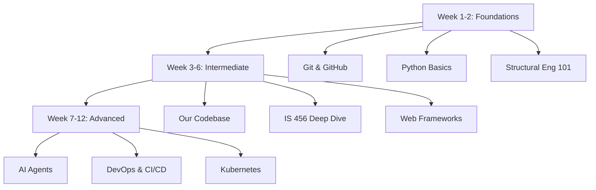

# Background Agent 5 Tasks (EDUCATOR)

**Agent Role:** EDUCATOR / LEARNING SPECIALIST
**Primary Focus:** Create beginner-friendly learning materials with visuals, examples, and progressive knowledge building
**Status:** Active
**Last Updated:** 2026-01-08

---

## Mission

Create comprehensive, beginner-friendly learning materials covering the entire structural engineering library project ecosystem - from git basics to Kubernetes deployment. Materials should be:
- **Easy to understand** (no jargon, or jargon explained)
- **Visual** (flowcharts, diagrams, architecture maps, ASCII art)
- **Fun & engaging** (analogies, real-world examples, exercises)
- **Progressive** (beginner → intermediate → advanced)
- **Practical** (what we did, what we're doing, what we'll do)
- **Organized** (single learning path, searchable, indexed)

---

## Learning Material Structure

```
learning-materials/
├── README.md                          # Master learning path index
├── 00-getting-started/
│   ├── README.md                      # How to use these materials
│   ├── learning-path-visual.md        # Visual roadmap of your learning journey
│   └── progress-tracker.md            # Checklist of completed modules
│
├── 01-foundations/                    # Week 1-2: Absolute basics
│   ├── 01-git-basics/
│   │   ├── what-is-git.md             # Version control explained (analogy: time machine for code)
│   │   ├── basic-commands.md          # add, commit, push, pull (with visuals)
│   │   ├── branches-explained.md      # Parallel universes for code
│   │   ├── exercises.md               # Hands-on practice
│   │   └── visuals/                   # Flowcharts, diagrams
│   │
│   ├── 02-github-basics/
│   │   ├── what-is-github.md          # Git vs GitHub (analogy: Git=Word, GitHub=Google Docs)
│   │   ├── pull-requests.md           # Code review process
│   │   ├── issues-tracking.md         # Bug tracking, feature requests
│   │   └── collaboration.md           # Working with others
│   │
│   ├── 03-python-fundamentals/
│   │   ├── python-101.md              # Variables, functions, data types
│   │   ├── dataclasses-explained.md   # What are dataclasses? (analogy: blueprints)
│   │   ├── type-hints.md              # Why types matter in engineering
│   │   └── testing-basics.md          # pytest 101
│   │
│   └── 04-structural-engineering-101/
│       ├── what-is-structural-design.md   # Big picture: buildings, safety, codes
│       ├── beams-explained.md             # What's a beam? (with visuals)
│       ├── concrete-basics.md             # Materials, strength, properties
│       └── is-456-introduction.md         # Indian Standard code overview
│
├── 02-intermediate/                   # Week 3-6: Project-specific knowledge
│   ├── 05-our-codebase/
│   │   ├── architecture-overview.md       # How our project is organized (visual map)
│   │   ├── modules-explained.md           # What each module does
│   │   ├── api-design-walkthrough.md      # How to use our API (examples)
│   │   └── code-walkthrough-example.md    # Step-by-step: designing a beam
│   │
│   ├── 06-is-456-deep-dive/
│   │   ├── clause-by-clause.md            # Key clauses explained simply
│   │   ├── flexural-design.md             # Bending in beams (visuals)
│   │   ├── shear-design.md                # Cutting forces (visuals)
│   │   ├── detailing-rules.md             # Rebar placement rules
│   │   └── compliance-checking.md         # Automated checks in our library
│   │
│   ├── 07-software-architecture/
│   │   ├── clean-architecture.md          # Layers: data, logic, presentation
│   │   ├── separation-of-concerns.md      # Why modules matter
│   │   ├── dependency-injection.md        # Advanced pattern (with analogy)
│   │   └── our-architecture-map.md        # Visual map of our project
│   │
│   ├── 08-testing-strategies/
│   │   ├── unit-tests.md                  # Testing individual functions
│   │   ├── integration-tests.md           # Testing modules together
│   │   ├── contract-tests.md              # API contract guarantees
│   │   └── benchmarks.md                  # Performance testing
│   │
│   └── 09-web-frameworks/
│       ├── streamlit-basics.md            # Build interactive dashboards
│       ├── streamlit-our-ui.md            # Our SmartDesigner UI walkthrough
│       ├── flask-intro.md                 # Web APIs with Flask
│       └── fastapi-future.md              # Modern API framework (future work)
│
├── 03-advanced/                       # Week 7-12: Pro-level topics
│   ├── 10-ai-agents-collaboration/
│   │   ├── what-are-ai-agents.md          # Claude, Copilot, ChatGPT explained
│   │   ├── background-agents.md           # Multi-agent collaboration
│   │   ├── mcp-servers.md                 # Model Context Protocol
│   │   ├── agent-coordination.md          # How we work in parallel
│   │   └── our-agent-system.md            # 5-agent framework walkthrough
│   │
│   ├── 11-devops-cicd/
│   │   ├── cicd-explained.md              # Continuous Integration/Deployment
│   │   ├── github-actions.md              # Automated testing on push
│   │   ├── docker-basics.md               # Containerization 101
│   │   └── deployment-pipeline.md         # From code to production
│   │
│   ├── 12-kubernetes-deployment/
│   │   ├── kubernetes-101.md              # Orchestrating containers
│   │   ├── why-kubernetes.md              # When to use it (scalability)
│   │   ├── deployment-strategies.md       # Rolling updates, blue-green
│   │   └── future-deployment-plan.md      # Our v1.0 deployment vision
│   │
│   └── 13-professional-engineering/
│       ├── licensing-explained.md         # Professional engineer role
│       ├── liability-concerns.md          # Why disclaimers matter
│       ├── code-compliance.md             # Legal requirements for software
│       └── certification-process.md       # PE certification in software
│
├── 04-practical-guides/               # Hands-on: what we did, are doing, will do
│   ├── project-timeline.md                # Our journey: v0.1 → v0.17
│   ├── release-walkthroughs/
│   │   ├── v0.15-api-improvement.md       # What we did in v0.15
│   │   ├── v0.16-test-stabilization.md    # What we did in v0.16
│   │   └── v0.17-professional-reqs.md     # What we're doing in v0.17
│   │
│   ├── feature-deep-dives/
│   │   ├── smart-designer-explained.md    # How SmartDesigner works
│   │   ├── quick-precheck-explained.md    # Fast validation tool
│   │   └── cost-optimizer-explained.md    # Rebar cost optimization
│   │
│   └── how-we-built-this/
│       ├── api-refactoring-story.md       # TASK-200 series walkthrough
│       ├── hygiene-sweep-story.md         # TASK-280 cleanup process
│       └── agent-setup-story.md           # Multi-agent collaboration setup
│
├── 05-exercises-challenges/           # Practice makes perfect
│   ├── git-exercises.md                   # 10 git challenges (beginner → advanced)
│   ├── python-challenges.md               # 15 Python exercises
│   ├── beam-design-problems.md            # 5 beam design scenarios
│   ├── code-reading-challenges.md         # "Read and understand this module"
│   └── mini-projects.md                   # Build your own features
│
├── 06-reference/                      # Quick lookup
│   ├── glossary.md                        # All terms explained (A-Z)
│   ├── command-cheatsheet.md              # Git, pytest, docker commands
│   ├── code-snippets.md                   # Copy-paste examples
│   └── resources.md                       # External learning links
│
└── 07-visuals/                        # All diagrams, flowcharts, maps
    ├── architecture-diagrams/
    ├── flowcharts/
    ├── learning-path-maps/
    ├── process-flows/
    └── ascii-art/
```

---

## Active Tasks

### LEARN-001: Create Master Learning Path (Priority: 🔴 HIGH)
**Status:** 🟡 TODO
**Estimated Effort:** 4-6 hours

**Objective:** Create the master index and visual learning path

**Deliverables:**
1. **`learning-materials/README.md`** (500-800 lines)
   - Welcome message (motivation, why learn this)
   - Complete learning path (beginner → intermediate → advanced)
   - Estimated time per module (realistic)
   - Prerequisites and dependencies
   - How to use these materials
   - Visual learning roadmap

2. **`learning-materials/00-getting-started/learning-path-visual.md`** (300-500 lines)
   - ASCII art or Mermaid diagram of full learning journey
   - Color-coded by difficulty (🟢 beginner, 🟡 intermediate, 🔴 advanced)
   - Show dependencies (e.g., "Learn Git before GitHub")
   - Estimated weeks per module

3. **`learning-materials/00-getting-started/progress-tracker.md`** (200-400 lines)
   - Checklist format: `[ ] Module completed`
   - Space for notes and questions
   - Completion date tracking

**Format Example:**
```markdown
# Your Structural Engineering Library Learning Journey

## Welcome! 👋

You're about to learn everything from Git basics to Kubernetes deployment. This isn't just theory - you'll understand **what we built**, **how we built it**, and **why we made each decision**.

## Learning Philosophy

We believe in:
- 🎯 **Learning by doing** (exercises, not just reading)
- 🖼️ **Visual learning** (diagrams > walls of text)
- 🌉 **Analogies** (compare new concepts to familiar things)
- 🎢 **Progressive difficulty** (build on what you know)
- 🎉 **Fun!** (learning should be enjoyable)

## Your Learning Path



## Module Breakdown

### 🟢 Foundations (Week 1-2) - Start Here!
| Module | Topic | Time | Prerequisites |
|--------|-------|------|---------------|
| 01 | Git Basics | 4 hours | None - total beginner friendly! |
| 02 | GitHub Basics | 3 hours | Module 01 |
| 03 | Python Fundamentals | 6 hours | Basic programming (or willingness to learn!) |
| 04 | Structural Engineering 101 | 5 hours | Curiosity about buildings |

**Total:** ~20 hours (1-2 weeks at 2 hours/day)

### 🟡 Intermediate (Week 3-6)
[... similar breakdown ...]

### 🔴 Advanced (Week 7-12)
[... similar breakdown ...]
```

**Acceptance Criteria:**
- [ ] Master README with complete learning path
- [ ] Visual roadmap (Mermaid or ASCII art)
- [ ] Progress tracker with checkboxes
- [ ] Time estimates for each module
- [ ] Beginner-friendly welcome message

---

### LEARN-002: Git & GitHub Fundamentals (Priority: 🔴 HIGH)
**Status:** 🟡 TODO
**Estimated Effort:** 6-8 hours

**Objective:** Create comprehensive Git/GitHub learning materials with visuals

**Deliverables:**

1. **`01-foundations/01-git-basics/what-is-git.md`** (400-600 lines)
   - What is version control? (analogy: time machine for code)
   - Why Git? (history, collaboration, backup)
   - Git workflow visual (working dir → staging → commit → remote)
   - Real example: "You change beam.py, commit, push"

2. **`01-foundations/01-git-basics/basic-commands.md`** (600-800 lines)
   - `git init`, `git add`, `git commit` with examples
   - `git status`, `git log` (see history)
   - `git push`, `git pull` (sync with remote)
   - Visual flowcharts for each command
   - Common mistakes and how to fix them

3. **`01-foundations/01-git-basics/branches-explained.md`** (500-700 lines)
   - What's a branch? (analogy: parallel universes)
   - `git branch`, `git checkout`, `git switch`
   - Merging branches (bringing changes together)
   - Visual branch diagrams
   - Our workflow: feature branches, main branch

4. **`01-foundations/01-git-basics/exercises.md`** (300-500 lines)
   - Exercise 1: Create a repo, make 5 commits
   - Exercise 2: Create a branch, switch between branches
   - Exercise 3: Merge a branch (with conflicts!)
   - Exercise 4: Undo a commit (git reset, git revert)
   - Answer key with explanations

5. **`01-foundations/02-github-basics/what-is-github.md`** (400-600 lines)
   - Git vs GitHub (analogy: Git=Microsoft Word, GitHub=Google Docs)
   - Remote repositories (cloud storage for code)
   - GitHub features: Issues, PRs, Actions, Releases
   - Our repository walkthrough

6. **`01-foundations/02-github-basics/pull-requests.md`** (600-800 lines)
   - What's a PR? (code review before merging)
   - Creating a PR (with screenshots/ASCII art)
   - PR review process (commenting, approving, requesting changes)
   - Our PR workflow (how we use PRs in this project)
   - CI checks explained (automated testing)

**Visual Examples to Include:**
```
Git Workflow:

┌──────────────┐     ┌──────────────┐     ┌──────────────┐     ┌──────────────┐
│  Working     │────>│   Staging    │────>│   Local      │────>│   Remote     │
│  Directory   │ add │   Area       │commit│   Repo       │ push│   (GitHub)   │
└──────────────┘     └──────────────┘     └──────────────┘     └──────────────┘

Branch Visualization:

main:     A───B───C───F───G
               \     /
feature:        D───E

A, B, C = commits on main
D, E = commits on feature branch
F = merge commit (D + E merged into main)
G = new commit on main
```

**Acceptance Criteria:**
- [ ] 6 complete modules covering Git & GitHub
- [ ] 10+ visual diagrams/flowcharts
- [ ] Real examples from our project
- [ ] 4 hands-on exercises with answer keys
- [ ] Beginner-friendly language (no unexplained jargon)

---

### LEARN-003: Python & Structural Engineering Basics (Priority: 🔴 HIGH)
**Status:** 🟡 TODO
**Estimated Effort:** 8-10 hours

**Objective:** Teach Python fundamentals and structural engineering concepts together

**Deliverables:**

1. **`01-foundations/03-python-fundamentals/python-101.md`** (800-1000 lines)
   - Variables (analogy: boxes that hold values)
   - Data types: int, float, str, bool, list, dict
   - Functions (analogy: recipes - inputs, process, output)
   - Classes (analogy: blueprints for objects)
   - Examples using structural engineering (beam properties, material data)

2. **`01-foundations/03-python-fundamentals/dataclasses-explained.md`** (500-700 lines)
   - What's a dataclass? (analogy: structured forms)
   - Why we use them (type safety, clarity, validation)
   - Example: `BeamDesign` dataclass walkthrough
   - Before/after: dict vs dataclass (show improvement)

3. **`01-foundations/03-python-fundamentals/type-hints.md`** (600-800 lines)
   - What are type hints? (documentation + safety)
   - Why they matter in engineering (prevent unit mismatches!)
   - Example: `def design_beam(length_mm: float, load_kn: float) -> BeamDesign:`
   - MyPy explained (automatic type checking)

4. **`01-foundations/03-python-fundamentals/testing-basics.md`** (700-900 lines)
   - Why test code? (catch bugs before users do!)
   - pytest basics: `test_*.py` files, assertions
   - Example: Testing a beam design function
   - Running tests: `python -m pytest`
   - Reading test output (green = pass, red = fail)

5. **`01-foundations/04-structural-engineering-101/what-is-structural-design.md`** (600-800 lines)
   - Big picture: Buildings need support (beams, columns, slabs)
   - Safety is paramount (building codes, factors of safety)
   - Design process: Load → Analysis → Check → Detail
   - Our library's role (automate calculations)

6. **`01-foundations/04-structural-engineering-101/beams-explained.md`** (800-1000 lines)
   - What's a beam? (horizontal structural member)
   - Types: Simply supported, cantilever, continuous
   - Forces: Bending moment, shear force
   - Visual diagrams: beam with load, moment diagram, shear diagram
   - Example: 4m beam with 10kN load (hand calculation → our library)

7. **`01-foundations/04-structural-engineering-101/concrete-basics.md`** (600-800 lines)
   - Concrete properties: fck (compressive strength)
   - Rebar (steel reinforcement): why concrete needs it
   - Design philosophy: Concrete takes compression, steel takes tension
   - Visual: reinforced concrete section (concrete + rebar)

8. **`01-foundations/04-structural-engineering-101/is-456-introduction.md`** (700-900 lines)
   - What's IS 456? (Indian Standard for concrete design)
   - Why codes exist (safety, consistency, legal requirements)
   - Key concepts: LSM (Limit State Method), factors of safety
   - Important clauses overview (we'll deep-dive later)

**Visual Examples:**
```
Simply Supported Beam:

    ↓ 10kN (load)
    |
┌───┴───┐
│       │  4m span
▲       ▲
Support Support

Moment Diagram:
    /\
   /  \  (max at center)
  /    \

Reinforced Concrete Section:

┌─────────────────┐
│   Concrete      │  ← Compression zone
│   fck = 20 MPa  │
├─────────────────┤
│                 │
│  ⚫ ⚫ ⚫ ⚫ ⚫   │  ← Rebar (tension zone)
└─────────────────┘
```

**Acceptance Criteria:**
- [ ] 8 complete modules (4 Python + 4 Structural Eng)
- [ ] 15+ code examples with explanations
- [ ] 10+ structural engineering diagrams
- [ ] Real examples from our library code
- [ ] Connects programming to engineering concepts

---

### LEARN-004: Our Codebase Walkthrough (Priority: 🟡 MEDIUM)
**Status:** 🟡 TODO
**Estimated Effort:** 10-12 hours
**Blocked By:** LEARN-003

**Objective:** Deep dive into our project architecture and API

**Deliverables:**

1. **`02-intermediate/05-our-codebase/architecture-overview.md`** (1000-1200 lines)
   - Project structure visual map
   - Module breakdown: `structural_lib/`, `insights/`, `data_types.py`, etc.
   - Dependency graph (what imports what)
   - Design patterns we use (factory, builder, etc.)

2. **`02-intermediate/05-our-codebase/modules-explained.md`** (1200-1500 lines)
   - Each module deep-dive:
     - `beam_design.py` - What it does, key functions
     - `rebar_optimizer.py` - Cost optimization algorithm
     - `compliance.py` - IS 456 automated checks
     - `smart_designer.py` - Unified dashboard
   - For each: Purpose, inputs, outputs, example usage

3. **`02-intermediate/05-our-codebase/api-design-walkthrough.md`** (1500-2000 lines)
   - API evolution story (TASK-200 series)
   - Before/after: Old API → New API (why we changed)
   - How to use our API (step-by-step examples)
   - Best practices (type hints, error handling)

4. **`02-intermediate/05-our-codebase/code-walkthrough-example.md`** (1000-1200 lines)
   - Complete example: "Design a 4m beam for 100kN load"
   - Step 1: Import modules
   - Step 2: Define inputs (BeamDesign dataclass)
   - Step 3: Run design calculations
   - Step 4: Get results (moment capacity, rebar, cost)
   - Step 5: Check compliance (automated IS 456 checks)
   - Full code with line-by-line annotations

**Acceptance Criteria:**
- [ ] Complete architecture map (visual)
- [ ] All modules documented with examples
- [ ] API evolution story explained
- [ ] End-to-end code walkthrough
- [ ] Connects to earlier Python/Structural Eng lessons

---

### LEARN-005: IS 456 Deep Dive (Priority: 🟡 MEDIUM)
**Status:** 🟡 TODO
**Estimated Effort:** 12-15 hours
**Blocked By:** LEARN-003

**Objective:** Comprehensive IS 456 education with our library examples

**Deliverables:**

1. **`02-intermediate/06-is-456-deep-dive/clause-by-clause.md`** (2000-2500 lines)
   - Key clauses explained in simple language:
     - Cl. 26.5.2 (steel percentage limits)
     - Cl. 23.2.1 (effective span)
     - Cl. G-1.1 (flexural strength)
     - Annex G (limit state design)
   - For each clause: What it means, why it exists, example

2. **`02-intermediate/06-is-456-deep-dive/flexural-design.md`** (1500-2000 lines)
   - Bending in beams (moment causes tension + compression)
   - Neutral axis concept (where stress = 0)
   - Lever arm (distance between forces)
   - Calculation walkthrough: Mu, Ast required
   - Our library's implementation

3. **`02-intermediate/06-is-456-deep-dive/shear-design.md`** (1200-1500 lines)
   - Shear force (sliding/cutting action)
   - Shear reinforcement (stirrups)
   - Design shear strength
   - Calculation walkthrough
   - Our library's implementation

4. **`02-intermediate/06-is-456-deep-dive/detailing-rules.md`** (1500-2000 lines)
   - Rebar spacing rules (min/max)
   - Cover requirements (protection from environment)
   - Anchorage and lap lengths
   - Development length
   - Visual diagrams for each rule

5. **`02-intermediate/06-is-456-deep-dive/compliance-checking.md`** (1000-1200 lines)
   - How our library automates checks
   - ComplianceCaseResult dataclass explained
   - Example: Run compliance check, interpret results
   - What to do when checks fail

**Acceptance Criteria:**
- [ ] 20+ IS 456 clauses explained simply
- [ ] Flexural + shear design fully covered
- [ ] 15+ detailing diagrams
- [ ] Connects code clauses to our library implementation
- [ ] Real calculation examples with our library

---

### LEARN-006: AI Agents & Automation (Priority: 🟢 LOW)
**Status:** 🔵 BACKLOG
**Estimated Effort:** 8-10 hours
**Blocked By:** LEARN-004

**Objective:** Explain AI agent collaboration, MCP servers, our 5-agent system

**Deliverables:**

1. **`03-advanced/10-ai-agents-collaboration/what-are-ai-agents.md`** (800-1000 lines)
   - What's an AI agent? (autonomous AI assistant)
   - Types: Claude, Copilot, ChatGPT (strengths/weaknesses)
   - Use cases: Code generation, research, testing, documentation

2. **`03-advanced/10-ai-agents-collaboration/background-agents.md`** (1000-1200 lines)
   - Multi-agent collaboration explained
   - Why parallel work? (speed, specialization)
   - File boundaries (prevent conflicts)
   - Our workflow: Local work → MAIN review → Push

3. **`03-advanced/10-ai-agents-collaboration/mcp-servers.md`** (700-900 lines)
   - What's MCP? (Model Context Protocol)
   - How it works (tools, resources, prompts)
   - Example: File system MCP server
   - Future: Custom MCP servers for structural engineering

4. **`03-advanced/10-ai-agents-collaboration/our-agent-system.md`** (1500-2000 lines)
   - 5-agent framework walkthrough:
     - Agent 1: RESEARCHER/BLOGGER
     - Agent 2: HYGIENE SPECIALIST
     - Agent 3: TESTER
     - Agent 4: DEV
     - Agent 5: EDUCATOR (you!)
   - How we coordinate (task files, handoffs)
   - Success stories (RESEARCH-001, HYGIENE audit)

**Acceptance Criteria:**
- [ ] AI agents explained for absolute beginners
- [ ] MCP protocol demystified
- [ ] Our 5-agent system fully documented
- [ ] Real examples from our project

---

### LEARN-007: Web Frameworks (Streamlit, Flask) (Priority: 🟢 LOW)
**Status:** 🔵 BACKLOG
**Estimated Effort:** 6-8 hours
**Blocked By:** LEARN-004

**Objective:** Teach Streamlit and Flask for web UIs and APIs

**Deliverables:**

1. **`02-intermediate/09-web-frameworks/streamlit-basics.md`** (800-1000 lines)
   - What's Streamlit? (Python scripts → web apps)
   - Basic widgets: text input, sliders, buttons, charts
   - Example: Simple beam calculator UI
   - Running a Streamlit app

2. **`02-intermediate/09-web-frameworks/streamlit-our-ui.md`** (1200-1500 lines)
   - Our SmartDesigner UI walkthrough (TASK-273)
   - Code structure: inputs, calculations, results display
   - Visual: screenshots (or ASCII art mockups)
   - How to run and test locally

3. **`02-intermediate/09-web-frameworks/flask-intro.md`** (700-900 lines)
   - What's Flask? (web API framework)
   - Routes, requests, responses
   - Example: Beam design API endpoint
   - Testing APIs (curl, Postman)

4. **`02-intermediate/09-web-frameworks/fastapi-future.md`** (500-700 lines)
   - What's FastAPI? (modern, async API framework)
   - Why FastAPI? (auto docs, type safety, speed)
   - Future migration plan (v1.0+)

**Acceptance Criteria:**
- [ ] Streamlit explained with examples
- [ ] Our UI code walkthrough
- [ ] Flask basics covered
- [ ] Future roadmap (FastAPI migration)

---

### LEARN-008: DevOps & Deployment (Priority: 🟢 LOW)
**Status:** 🔵 BACKLOG
**Estimated Effort:** 10-12 hours
**Blocked By:** LEARN-006

**Objective:** CI/CD, Docker, Kubernetes for production deployment

**Deliverables:**

1. **`03-advanced/11-devops-cicd/cicd-explained.md`** (800-1000 lines)
   - What's CI/CD? (automated testing + deployment)
   - Benefits: catch bugs early, ship faster
   - Our CI pipeline: GitHub Actions

2. **`03-advanced/11-devops-cicd/github-actions.md`** (1000-1200 lines)
   - Workflow files explained (.github/workflows/)
   - Our workflows: tests, CodeQL, security scans
   - How to read CI logs

3. **`03-advanced/11-devops-cicd/docker-basics.md`** (1200-1500 lines)
   - What's Docker? (package app + dependencies)
   - Dockerfile explained (line by line)
   - Building and running containers
   - Our Docker setup (future)

4. **`03-advanced/12-kubernetes-deployment/kubernetes-101.md`** (1500-2000 lines)
   - What's Kubernetes? (orchestrate containers at scale)
   - Pods, Services, Deployments explained (analogy: apartment building)
   - When to use Kubernetes (v1.0+ when we have users)

**Acceptance Criteria:**
- [ ] CI/CD demystified with our examples
- [ ] Docker explained for beginners
- [ ] Kubernetes concepts clear
- [ ] Connects to our deployment roadmap

---

### LEARN-009: Practical Guides - Our Journey (Priority: 🔴 HIGH)
**Status:** 🟡 TODO
**Estimated Effort:** 10-12 hours

**Objective:** Document what we did, what we're doing, what we'll do

**Deliverables:**

1. **`04-practical-guides/project-timeline.md`** (1500-2000 lines)
   - Complete history: v0.1 → v0.17
   - Major milestones:
     - v0.1: Initial beam design
     - v0.7-v0.12: API evolution
     - v0.15: API improvement (TASK-200 series)
     - v0.16: Test stabilization
     - v0.17: Professional requirements
   - Lessons learned at each stage

2. **`04-practical-guides/release-walkthroughs/v0.15-api-improvement.md`** (1200-1500 lines)
   - TASK-200 to TASK-269 complete breakdown
   - API research (TASK-200-202)
   - Implementation (TASK-203-250)
   - Challenges faced, solutions found
   - Before/after code examples

3. **`04-practical-guides/release-walkthroughs/v0.16-test-stabilization.md`** (800-1000 lines)
   - TASK-270: Fix 8 test failures (what broke, how we fixed)
   - TASK-271: Fix 13 benchmark errors
   - Agent 3 (TESTER) role explained

4. **`04-practical-guides/release-walkthroughs/v0.17-professional-reqs.md`** (1000-1200 lines)
   - TASK-272: Clause database
   - TASK-273: Streamlit UI (SmartDesigner)
   - TASK-274: Security workflows
   - TASK-275: Legal disclaimers
   - Why professional requirements matter

5. **`04-practical-guides/feature-deep-dives/smart-designer-explained.md`** (1500-2000 lines)
   - What's SmartDesigner? (unified dashboard for design analysis)
   - Cost optimization walkthrough
   - Design suggestions explained
   - Sensitivity analysis
   - Code walkthrough with examples

6. **`04-practical-guides/how-we-built-this/agent-setup-story.md`** (1200-1500 lines)
   - Why we needed background agents
   - Setup process (Agent 1-5)
   - Success metrics (research delivered, hygiene improved)
   - Lessons learned (file boundaries, WIP limits)

**Acceptance Criteria:**
- [ ] Complete project timeline (v0.1 → v0.17)
- [ ] 3 release walkthroughs with real examples
- [ ] 3 feature deep-dives with code
- [ ] Real stories from our development process

---

## Backlog

### LEARN-010: Professional Engineering Topics
**Priority:** 🟢 LOW
**Status:** 🔵 BACKLOG
**Objective:** Licensing, liability, certification for engineering software

### LEARN-011: Advanced Python Patterns
**Priority:** 🟢 LOW
**Status:** 🔵 BACKLOG
**Objective:** Decorators, generators, context managers, async/await

### LEARN-012: Database Design
**Priority:** 🟢 LOW
**Status:** 🔵 BACKLOG
**Objective:** SQL basics, ORMs, our clause database (TASK-272)

---

## Guidelines for Agent 5 (EDUCATOR)

### Writing Style

**Always use:**
- ✅ Simple, clear language (no jargon without explanation)
- ✅ Analogies to familiar concepts ("Git is like a time machine for code")
- ✅ Real examples from our project
- ✅ Visual aids (diagrams, flowcharts, ASCII art)
- ✅ Progressive disclosure (simple first, details later)
- ✅ Encouraging tone ("You've got this!", "Great job!")

**Never use:**
- ❌ Unexplained technical terms
- ❌ Walls of text without visuals
- ❌ Academic/dry language
- ❌ Assumptions about prior knowledge

### Visual Guidelines

**For every concept, include:**
1. **Text explanation** (2-3 paragraphs)
2. **Analogy** (compare to something familiar)
3. **Visual** (diagram, flowchart, or ASCII art)
4. **Example** (real code or scenario from our project)
5. **Exercise** (hands-on practice)

**Diagram Types:**
- Flowcharts (process flows, decision trees)
- Architecture diagrams (module relationships)
- Sequence diagrams (how things interact over time)
- Mind maps (concept relationships)
- ASCII art (lightweight, embedded in markdown)
- Mermaid diagrams (for complex flows)

### Example Quality Standard

**Good Example:**
```markdown
## What is a Branch?

### Analogy: Parallel Universes for Code 🌌

Imagine you're writing a book. You have the main story (the **main branch**), but you want to experiment with a different ending without messing up the original. So you create a copy of your book and work on the new ending there (a **feature branch**).

If you like the new ending, you can merge it back into the main book. If not, you just delete the copy and keep the original.

Git branches work the same way!

### Visual

```
main:     A───B───C───────F
               \         /
feature:        D───E───
                New idea!
```

- **A, B, C** = Commits on main branch (stable code)
- **D, E** = Commits on feature branch (experimental code)
- **F** = Merge commit (bring feature into main)

### Real Example from Our Project

When we built the Streamlit UI (TASK-273), we:
1. Created a branch: `feature/TASK-273-streamlit-ui`
2. Worked on the UI code without touching main
3. Tested everything locally
4. Merged back to main when ready

This kept main stable while we experimented!

### Try It Yourself

```bash
# Create a new branch
git branch my-experiment

# Switch to it
git switch my-experiment

# Make some changes, then commit
git add .
git commit -m "trying something new"

# Switch back to main (your experiment is safe on the other branch!)
git switch main
```

### Why This Matters

Branches let you:
- ✅ Experiment without fear (won't break main code)
- ✅ Work on multiple features at once
- ✅ Collaborate (each person works on their own branch)
- ✅ Keep main branch always deployable

Next up: How to merge branches! →
```

**Bad Example (avoid this):**
```markdown
## Branches

Git branches are pointers to commits in a directed acyclic graph (DAG). The HEAD pointer references the current branch. Use `git checkout -b` to create and switch to a new branch atomically.

Merging performs a three-way merge using the common ancestor.
```
(Too technical, no analogy, no visual, no example, no encouragement!)

### File Boundaries

**✅ Safe to Create/Edit:**
- `learning-materials/**/*` (all learning content)
- `docs/planning/agent-5-tasks.md` (this file - update progress)

**✅ Safe to Read (for context):**
- Any project files (to extract examples)
- `docs/TASKS.md` (understand project status)
- `docs/planning/memory.md` (current project state)
- All code, tests, docs (for creating examples)

**❌ Do NOT Edit:**
- Production code (`Python/structural_lib/**/*`)
- Tests (`Python/tests/**/*`)
- Main documentation (`docs/**/*` except `docs/planning/agent-5-tasks.md`)
- `docs/TASKS.md`, `docs/SESSION_LOG.md` (MAIN agent owns these)

### Git Workflow Proposal

**Option 1: Keep in main repo (RECOMMENDED)**
- Learning materials tracked in git (version control, backup)
- Subdirectory: `learning-materials/`
- Commit directly to main (docs-only, no code changes)
- MAIN agent pushes after review

**Option 2: Separate repo**
- Separate git repository: `structural_engineering_lib-learning`
- Linked from main repo README
- Independent versioning

**Option 3: Not in git (.gitignore)**
- `learning-materials/` added to .gitignore
- No version control (risk: accidental deletion)
- Not recommended (lose history, no backup)

**Recommended: Option 1** (main repo, learning-materials/ directory)

---

## Handoff Template for Agent 5

When task complete, notify MAIN agent:

```markdown
## Handoff: EDUCATOR (Agent 5) → MAIN

**Task:** LEARN-XXX
**Branch:** main (or feature/LEARN-XXX if large)
**Status:** ✅ Complete, committed locally

### Summary
Created [module name] learning materials covering [topics]. Total [lines] across [files] files with [visuals] diagrams and [exercises] exercises.

### Deliverables
- `learning-materials/path/file1.md` - [lines] lines, [summary]
- `learning-materials/path/file2.md` - [lines] lines, [summary]

### Key Features
- **Visuals:** [number] diagrams/flowcharts
- **Examples:** [number] real examples from our codebase
- **Exercises:** [number] hands-on challenges
- **Analogies:** [list memorable analogies used]

### Quality Checks
- [ ] Beginner-friendly language (no unexplained jargon)
- [ ] Every concept has text + analogy + visual + example
- [ ] All code examples tested/verified
- [ ] Exercises have answer keys
- [ ] Progress tracker updated

### Learner Impact
- **Estimated Learning Time:** [hours]
- **Prerequisites:** [list]
- **Next Module:** [suggestion]

### Action Required by MAIN
1. Review: `cat learning-materials/path/file.md`
2. Test exercises (if applicable)
3. Push to remote: `git push origin main`
```

---

## Success Metrics

### Per Module
- ✅ Minimum 500 lines (comprehensive coverage)
- ✅ 3+ visual diagrams/flowcharts
- ✅ 5+ real examples from our codebase
- ✅ 2+ hands-on exercises
- ✅ Beginner-friendly language (Flesch reading ease > 60)

### Overall Learning Path
- ✅ Complete progression: beginner → intermediate → advanced
- ✅ 50+ modules covering all topics (Git → Kubernetes)
- ✅ 100+ diagrams/visuals
- ✅ 50+ exercises with answer keys
- ✅ Searchable glossary (500+ terms)

### Learner Experience
- ✅ Clear learning path (no confusion about what to learn next)
- ✅ Motivating (fun, engaging, encouraging)
- ✅ Practical (real examples from our project)
- ✅ Achievable (realistic time estimates, progress tracking)

---

## Next Steps for Agent 5

**Week 1: Foundations**
1. Start with **LEARN-001** (Master Learning Path) - Create the roadmap
2. Then **LEARN-002** (Git & GitHub) - Most foundational skill
3. Then **LEARN-003** (Python & Structural Eng Basics)

**Week 2-3: Intermediate**
4. **LEARN-004** (Our Codebase Walkthrough)
5. **LEARN-005** (IS 456 Deep Dive)
6. **LEARN-009** (Practical Guides - Our Journey)

**Week 4+: Advanced**
7. **LEARN-006** (AI Agents)
8. **LEARN-007** (Web Frameworks)
9. **LEARN-008** (DevOps & Deployment)

**Ongoing:**
- Update materials as project evolves
- Add new modules for new features
- Refine based on learner feedback

---

## Special Note on Tone

Agent 5 is **encouraging, patient, and fun**. Every module should:
- Start with motivation ("Why learn this?")
- Use analogies to make concepts relatable
- Include encouraging phrases ("You've got this!", "Great progress!")
- End with next steps ("Next up: ...")
- Celebrate progress ("Congrats! You've completed Module X!")

Learning should be **enjoyable**, not intimidating!

---

**Version:** 1.0
**Created:** 2026-01-08
**Agent:** EDUCATOR / LEARNING SPECIALIST (Agent 5)
**Status:** Active - Ready to create learning materials!
