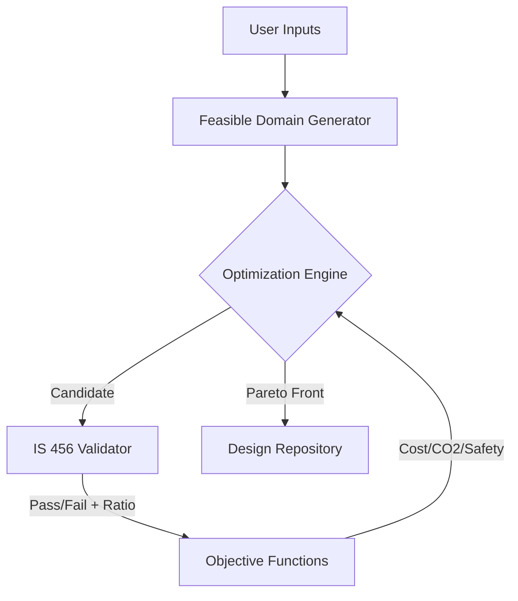

# Implementation Roadmap: Interpretable Structural Optimization
> **Synthesizing Phases 1.1 - 1.4 into a concrete technical plan.**

**Status:** Draft / Proposal
**Based on:** Research Review Jan 2026 (70+ papers)
**Target:** v0.18.0+

---

## 1. The Core Vision
We are not building a "black box" optimizer. We are building a **transparent decision support system** for structural engineers.

**Philosophy:**
1.  **Compliance First:** IS 456 is a hard constraint, not a soft target (Parhi et al., 2026).
2.  **Calibrated Trust:** The user must see *why* a design failed or why it is optimal (Jelinek et al., 2025).
3.  **Multi-Dimensional:** We optimize for Cost, Safety, and Carbon simultaneously (Santos et al., 2023).

---

## 2. Technical Architecture

### 2.1 The Optimization Loop (Backend)
Instead of writing our own GA, we will integrate **pymoo** (Python Multi-Objective Optimization) standard library, wrapped in our IS 456 logic.

*   **Validator (The Bridge):** A strict IS 456 checker that returns `0` (fail) or `1` (pass) + `utilization_ratio`.
*   **Engine:** NSGA-II (standard workhorse) for v1.0. Explore qEHVI for v2.0 if performance drags.

### 2.2 The Visualization Layer (Frontend)
Based on **ParetoLens** (Ma et al., 2025), we will avoid simple tables.

*   **Main View:** Interactive Scatter Plot (Plotly).
    *   X-Axis: Depth (mm) or Carbon (kgCO2)
    *   Y-Axis: Cost (INR)
    *   Color: Utilization Ratio (Safety Buffer)
*   **Detail View (Interaction):** Hovering over a point renders the *physical cross-section* immediately.

### 2.3 The Trust Layer (UX)
Based on **Noti et al. (2025)**, we must explain the constraints.

*   **Feature:** "Constraint Trace"
*   **Action:** When a user clicks a "sub-optimal" point (e.g., a specific depth they prefer), the system highlights *why* it wasn't the top pick (e.g., "Violates Deflection by 4%").

---

## 3. Phased Rollout Plan

### Phase 1: The "Manual" Optimizer (v0.17.x)
*Goal: Visualize the trade-offs in the CURRENT manual design process.*
*   **Feat:** Plot the single user design against a "theoretical minimum" curve.
*   **Tech:** Basic Plotly integration.

### Phase 2: Brute Force Frontier (v0.18.0 - MVP)
*Goal: Generate a static Pareto front for standard beams.*
*   **Feat:** User gives range (e.g., Width 230-600mm). System brute-forces valid designs and plots "Cost vs Depth".
*   **Tech:** Multiprocessing, caching valid designs.
*   **Research Tie-in:** Establishing the "Feasible Domain" (Parhi et al.).

### Phase 3: The "Smart" Optimizer (v0.19.0)
*Goal: True structural optimization for complex layouts.*
*   **Feat:** NSGA-II integration for rebar layouts (bar patterns, spacing).
*   **Tech:** `pymoo` integration.
*   **Research Tie-in:** Hong-Lagrange surrogate models (if calculating >1000 beams).

### Phase 4: Eco-Structural Design (v0.20.0)
*Goal: Carbon as a first-class citizen.*
*   **Feat:** Tri-objective optimization (Cost, CO2, Safety).
*   **Tech:** 3D Scatter plots / Parallel Coordinates (ParetoLens).
*   **Research Tie-in:** Tri-objective logic (Santos et al., 2023).

---

## 4. Immediate Development Tasks (Next Sprint)

1.  **Refactor Validator:** Ensure independent `check_is456()` function returns structured failure data (not just Exceptions).
2.  **Add Visualization Libs:** Add `plotly` and `pandas` to project dependencies.
3.  **Prototype Dashboard:** Simple Streamlit page showing "Cost vs Depth" for a range of beam inputs.

---

## 5. Success Metrics (Calibrated Trust)
*   **Metric:** "Click-through to Calculation."
*   **Target:** Users should verify >20% of AI-suggested designs (indicating healthy skepticism/verification behavior), rather than 0% (blind trust) or 100% (lack of trust).
